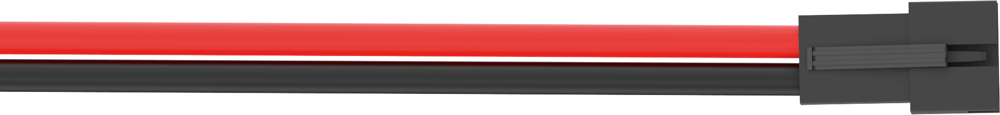
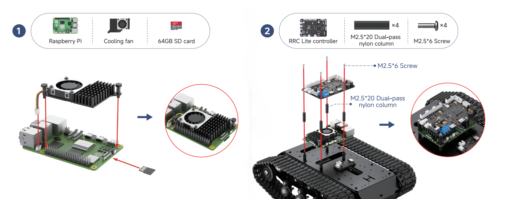
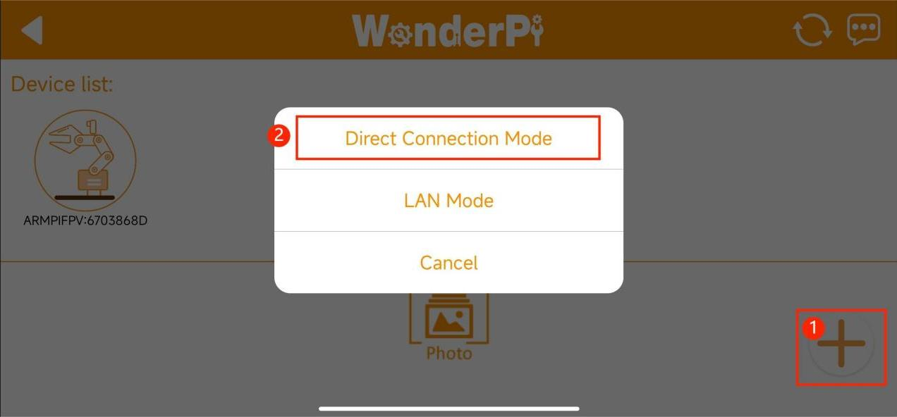
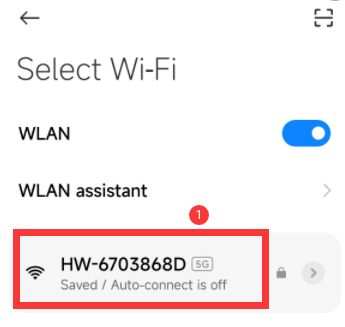
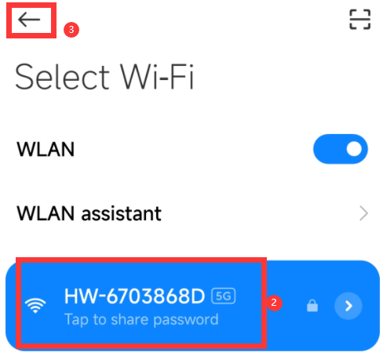
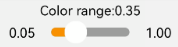

# 1.Getting Ready

## 1.1 Introduction to MentorPi T1

The MentorPi T1 is a ROS2 robot developed based on the Raspberry Pi 5. It features a tank chassis and is equipped with high-performance hardware such as a TOF LiDAR and a 3D depth camera. The system supports intelligent functions including mapping and navigation, path planning, image recognition, visual tracking, and human-machine interaction.

## 1.2 Packing List

(1) MentorPi T1 Packing List (Monocular camera Version)

<table border="1" class="docutils-nobg" style="text-align: center;">
<thead>
<tr>
<th>NO.</th>
<th>Components</th>
<th>Quantity</th>
<th>Picture</th>
</tr>
</thead>
<tbody>
<tr>
<td>1</td>
<td>T1(Track) Chassis (Assembled,Battery included)</td>
<td>1</td>
<td></td>
</tr>
<tr>
<td>2</td>
<td>Controller top cover</td>
<td>1</td>
<td></td>
</tr>
<tr>
<td>3</td>
<td>Front cover</td>
<td>1</td>
<td></td>
</tr>
<tr>
<td>4</td>
<td>Rear Cover</td>
<td>1</td>
<td></td>
</tr>
<tr>
<td>5</td>
<td>Raspberry Pi5(optional)</td>
<td>1</td>
<td></td>
</tr>
<tr>
<td>6</td>
<td>64GB SD Card</td>
<td>1</td>
<td></td>
</tr>
<tr>
<td>7</td>
<td>Cooling fan</td>
<td>1</td>
<td></td>
</tr>
<tr>
<td>8</td>
<td>Rapberry Pi power supply cable</td>
<td>2</td>
<td></td>
</tr>
<tr>
<td>9</td>
<td>RRC Lite controller + RRC data cable</td>
<td>2</td>
<td> </td>
</tr>
<tr>
<td>10</td>
<td>Battery cable</td>
<td>1</td>
<td></td>
</tr>
<tr>
<td>11</td>
<td>Lidar</td>
<td>1</td>
<td></td>
</tr>
<tr>
<td>12</td>
<td>4 PIN Lidar wire</td>
<td>1</td>
<td></td>
</tr>
<tr>
<td>13</td>
<td>Lidar data cable</td>
<td>1</td>
<td></td>
</tr>
<tr>
<td>14</td>
<td>8.4V 2A charger(DC5.5*2.5 male connector)</td>
<td>1</td>
<td></td>
</tr>
<tr>
<td>15</td>
<td>Monocular camara</td>
<td>1</td>
<td></td>
</tr>
<tr>
<td>16</td>
<td>Wireless controller + Controller receiver</td>
<td>1</td>
<td> </td>
</tr>
<tr>
<td>17</td>
<td>EVA ball (40mm)</td>
<td>1</td>
<td></td>
</tr>
<tr>
<td>18</td>
<td>Card reader</td>
<td>1</td>
<td></td>
</tr>
<tr>
<td>19</td>
<td>3PIN wire(100mm)</td>
<td>1</td>
<td></td>
</tr>
<tr>
<td>20</td>
<td>Accessory bag</td>
<td>1</td>
<td></td>
</tr>
<tr>
<td>21</td>
<td>User manual</td>
<td>1</td>
<td></td>
</tr>
</tbody>
</table>

(2) MentorPi T1 Packing List (Depth camera Version)

<table border="1" class="docutils-nobg" style="text-align: center;">
<thead>
<tr>
<th>NO.</th>
<th>Components</th>
<th>Quantity</th>
<th>Picture</th>
</tr>
</thead>
<tbody>
<tr>
<td>1</td>
<td>T1(Track) Chassis (Assembled,Battery included)</td>
<td>1</td>
<td></td>
</tr>
<tr>
<td>2</td>
<td>Bracket set</td>
<td>3</td>
<td>  </td>
</tr>
<tr>
<td>3</td>
<td>Raspberry Pi5(optional)</td>
<td>1</td>
<td></td>
</tr>
<tr>
<td>4</td>
<td>64GB SD Card</td>
<td>1</td>
<td></td>
</tr>
<tr>
<td>5</td>
<td>Cooling fan</td>
<td>1</td>
<td></td>
</tr>
<tr>
<td>6</td>
<td>Rapberry Pi power supply cable</td>
<td>1</td>
<td></td>
</tr>
<tr>
<td>7</td>
<td>RRC Lite controller + RRC data cable</td>
<td>2</td>
<td> </td>
</tr>
<tr>
<td>8</td>
<td>Battery cable</td>
<td>1</td>
<td></td>
</tr>
<tr>
<td>9</td>
<td>Lidar</td>
<td>1</td>
<td></td>
</tr>
<tr>
<td>10</td>
<td>4 PIN Lidar wire</td>
<td>1</td>
<td></td>
</tr>
<tr>
<td>11</td>
<td>Lidar data cable</td>
<td>1</td>
<td></td>
</tr>
<tr>
<td>12</td>
<td>8.4V 2A charger(DC5.5*2.5 male connector)</td>
<td>1</td>
<td></td>
</tr>
<tr>
<td>13</td>
<td>Aurora930 Pro depth camera</td>
<td>1</td>
<td></td>
</tr>
<tr>
<td>14</td>
<td>USB to Type-C data cable</td>
<td>1</td>
<td></td>
</tr>
<tr>
<td>15</td>
<td>Wireless controller + Controller receiver</td>
<td>2</td>
<td> </td>
</tr>
<tr>
<td>16</td>
<td>EVA ball (40mm)</td>
<td>1</td>
<td></td>
</tr>
<tr>
<td>17</td>
<td>Card reader</td>
<td>1</td>
<td></td>
</tr>
<tr>
<td>18</td>
<td>3PIN wire(100mm)</td>
<td>1</td>
<td></td>
</tr>
<tr>
<td>19</td>
<td>Accessory bag</td>
<td>1</td>
<td></td>
</tr>
<tr>
<td>20</td>
<td>User manual</td>
<td>1</td>
<td></td>
</tr>
</tbody>
</table>

(3) MentorPi T1 Advanced Packing List (Depth camera Version)

<table border="1" class="docutils-nobg" style="text-align: center;">
<thead>
<tr>
<th>NO.</th>
<th>Components</th>
<th>Quantity</th>
<th>Picture</th>
</tr>
</thead>
<tbody>
<tr>
<td>1</td>
<td>T1(Track) Chassis (Assembled,Battery included)</td>
<td>1</td>
<td></td>
</tr>
<tr>
<td>2</td>
<td>Bracket set</td>
<td>3</td>
<td>  </td>
</tr>
<tr>
<td>3</td>
<td>Raspberry Pi5(optional)</td>
<td>1</td>
<td></td>
</tr>
<tr>
<td>4</td>
<td>64GB SD Card</td>
<td>1</td>
<td></td>
</tr>
<tr>
<td>5</td>
<td>Cooling fan</td>
<td>1</td>
<td></td>
</tr>
<tr>
<td>6</td>
<td>Rapberry Pi power supply cable</td>
<td>1</td>
<td></td>
</tr>
<tr>
<td>7</td>
<td>RRC Lite controller + RRC data cable</td>
<td>2</td>
<td> </td>
</tr>
<tr>
<td>8</td>
<td>Battery cable</td>
<td>1</td>
<td></td>
</tr>
<tr>
<td>9</td>
<td>Lidar</td>
<td>1</td>
<td></td>
</tr>
<tr>
<td>10</td>
<td>4 PIN Lidar wire</td>
<td>1</td>
<td></td>
</tr>
<tr>
<td>11</td>
<td>Lidar data cable</td>
<td>1</td>
<td></td>
</tr>
<tr>
<td>12</td>
<td>8.4V 2A charger(DC5.5*2.5 male connector)</td>
<td>1</td>
<td></td>
</tr>
<tr>
<td>13</td>
<td>Aurora930 Pro depth camera</td>
<td>1</td>
<td></td>
</tr>
<tr>
<td>14</td>
<td>USB to Type-C data cable</td>
<td>1</td>
<td></td>
</tr>
<tr>
<td>15</td>
<td>Wireless controller + Controller receiver</td>
<td>1</td>
<td> </td>
</tr>
<tr>
<td>16</td>
<td>EVA ball (40mm)</td>
<td>1</td>
<td></td>
</tr>
<tr>
<td>17</td>
<td>Card reader</td>
<td>1</td>
<td></td>
</tr>
<tr>
<td>18</td>
<td>3PIN wire(100mm)</td>
<td>1</td>
<td></td>
</tr>
<tr>
<td>19</td>
<td>WonderEcho Pro AI voice interaction box + Type C cable</td>
<td>2</td>
<td></td>
</tr>
<tr>
<td>20</td>
<td>Accessory bag</td>
<td>1</td>
<td></td>
</tr>
<tr>
<td>21</td>
<td>User manual</td>
<td>1</td>
<td></td>
</tr>
</tbody>
</table>

## 1.3 Battery Charging & Safety Guidelines

**1.3.1 Charging Instructions**

Lithium batteries are not fully charged before shipping due to transport regulations. Please fully charge the battery before using it for the first time.
To charge: first connect the battery to the included power cable, then begin charging. A full charge typically takes about 1 hour.

**1.3.2 Usage Precautions**

(1) Do not connect the battery directly to the controller cable before it is properly installed, as this may cause a short circuit due to reversed polarity.

(2) To ensure stable operation, please recharge the battery when its voltage drops below 6.4V. Always use the charger provided with the kit. Using other chargers may damage the battery or reduce its lifespan.

(3) If you don't plan to use the robot for an extended period, fully charge the battery in advance. Then, switch OFF the expansion board and unplug the battery cable.

(4) The battery should be stored in a cool, dry environment. Avoid placing it in hot or humid conditions, as this may shorten its lifespan or affect performance.

(5) Please handle the battery with care. Do not drop, strike, or step on it.

(6) Also, avoid using or storing the battery near sources of strong static electricity or magnetic fields, as this could damage its internal protection circuit.

Disclaimer: We are not responsible for any product damage, financial loss, or safety incidents resulting from failure to follow these guidelines.

**1.3.3 How to Charge the Battery**

Follow these steps to safely charge the battery:

(1) First, make sure the device is switched off.

(2) Then, connect the battery cables—match red to red and black to black.

(3) Next, locate the DC charging port on the side or bottom of the device, take it out, and plug in the charger to begin charging.

(4) You can check the charging status using the indicator light on the charger: A red light means the battery is still charging. A green light means charging is complete.

Reminder: Once the battery is fully charged, please unplug the charger promptly to avoid overcharging.

**1.3.4 Important Notes for Using the Device**

(1) To avoid damage, do not place the robot near the edge of a table or any high surface where it could fall. It's best to operate the robot on a flat, even floor for stable performance.

(2) If you notice the robot drifting significantly to one side while moving forward and it's unable to go straight, you may need to calibrate it. You can follow the tutorial in [3. Motion Control ->3.2 IMU, Linear Velocity, and Angular Velocity Calibration](3.motion_control_courses.md#imu-linear-velocity-and-angular-velocity-calibration). Keep in mind that calibration helps reduce deviation, but some hardware variance is normal. Just adjust the settings until the movement is reasonably accurate for your needs.

(3) Before turning on the robot, make sure the wireless controller receiver is plugged in. If it's already inserted (as it is by default from the factory), you can skip this step.

(4) Because gamepads can interfere with each other, it's not recommended to use them when multiple robots are operating in the same area—this helps prevent accidental connections or control errors.

(5) When starting SLAM (mapping), try to position the robot facing a flat wall or place it inside a closed cardboard box. This helps the `LiDAR` scan more points and improves map quality.

(6) To build a complete and usable map, make sure the robot's paths allow the `LiDAR` to scan all 360° surroundings. This ensures better coverage of the environment.

(7) In larger spaces, it's a good idea to let the robot complete a full loop of the area first before going back to scan finer details.

## 1.4 Robot Assembly & Wiring

:::{Note}
The assembly Instruction uses the Advanced Kit as an example, but the steps are also applicable to the Standard Kit.
:::

If the camera module included with your MentorPi system is a monocular type, please consult the following installation procedures for implementation.

Interface indication:

## 1.5 Startup Guide & Status Overview

Turn on the expansion board and wait for approximately 1 minute. When LED1 on the expansion board lights up blue and the buzzer emits a **"beep"** sound, it indicates that the ROS configuration is complete and the device has successfully started.

Once the robot has fully powered on, LED2 will blink once every second, and a Wi-Fi hotspot prefixed with **"HW"** will be broadcast.

The default network mode is AP (Access Point) direct connection. When connecting via the mobile app or remote desktop, use the password: hiwonder.

You can now refer to the table below to verify the device status.

| **Module** | **Check Steps** | **Outcome** |
|:-----------|:----------------|:------------|
| Expansion Board LEDs | Observe the status of the `LED`s | Default `AP` (Access Point) mode: `LED1` is steady on; `LED2` blinks once per second. |
| Buzzer | Listen for a beep sound | A single beep indicates that the expansion board's onboard hardware is functioning normally. |
| Lidar | Observe for rotation a few seconds after power-on. | The `LiDAR` begins to rotate, indicating normal startup. |
| Depth Camera / Monocular Camera | (1) Open the mobile app and connect to the robot.   (2) Navigate to the **"Robot Control"** interface to view the live camera feed.   (3) Drag the screen to adjust the camera pan-tilt angle (monocular version only). | The live video feed is displayed, and the pan-tilt mechanism responds to screen gestures (monocular only). |
| Encoder Motors + `STM32` Controller | After powering on, use the wireless controller or the app's **"Robot Control"** function to operate the robot. | After powering on, use the wireless controller or the app's **"Robot Control"** function to operate the robot. |

:::{Note}
* If the buzzer does not emit a beep, the onboard hardware—such as the `IMU` or buzzer—may be malfunctioning. This issue is rare under normal use. If it occurs, please contact our support team at `support@hiwonder.com`.
* If the device's `Wi-Fi` hotspot is not visible, check whether `LED1` on the expansion board is steadily lit and `LED2` is flashing once per second.
:::

## 1.6 App Control

### 1.6.1 App Installation and Connection 

You can control the robot using the mobile app **"WonderPi."** This lesson explains how to download and install the app.

:::{Note}
* Please ensure that all permissions are granted to the app during installation to ensure its proper functionality.
* Before launching the app, make sure that both `GPS` and `Wi-Fi` are enabled on your phone.
:::

* **App Installation**

(1) Method 1:

**For Android users**: Locate the app installation package in [WonderPi](https://play.google.com/store/apps/details?id=com.Wonder.Pi), then transfer it to your smartphone and install it manually.

**For iOS users**: Download [WonderPi](https://apps.apple.com/cn/app/wonderpi/id1477946178) directly from the **App Store**.

(2) Method 2: Scan QR Code for Download

* **Connection Mode**

After installing the app, connect the robot. Here are two network modes for the robot:

**AP direct connection mode:** the controller can turn on the hotspot to connect with the phone, but it cannot connect to an external network.

**STA LAN mode:** the controller can actively connect to a designated hotspot or `Wi-Fi`, enabling communication with external networks.

The robot is the `AP` direct connection mode by default. No matter which mode is selected, you can achieve the same game functions of the MentorPi app.

It is recommended to learn the `AP` direct connection mode to experience the corresponding functions first. The `LAN` mode can be viewed based on your own needs.

(1) Direct Connection Mode (Must Read)

① Open the **WonderPi** app and select **Advanced** → **MentorPi-T1** in sequence.

② Click the **"+"** button at the lower right corner to select direct connection mode.

:::{Note}
If you use the `LAN` mode, please refer to the section [LAN mode connection](#lan_mode_connection).
:::

③ Tap **"Go to connect device hotspots"** to open the settings page, and connect to the Wi-Fi hotspot broadcasted by MentorPi.

④  When prompted, enter the password: **hiwonder**.

:::{Note}
**For iOS users:**
After connecting to the hotspot, wait until the message **"Wi-Fi connected successfully"** appears before returning to the app. If you return too early, the device may not be detected. In that case, tap the **Refresh** button  several times to search for the device again.
:::

⑤ Once connected, return to the app. The phone will automatically establish a connection with the device. When the robotic arm icon appears, it indicates that the connection has been successfully established.

:::{Note}
If a pop-up message appears stating **"Network unavailable. Continue?"**, tap **"Keep Connection"** to proceed.
:::

⑥ If the message **"Whether to switch and enter the searched product interface?"** appears, it means the selected product version in **Step 1** was incorrect. Tap **"OK"** to automatically switch to the correct version selection screen.

⑦ The game mode selection interface will then appear, as shown below.

For detailed instructions on how to operate each game mode, please refer to [1.6.2 App Games Introduction](#anchor_1_6_2).

(2) LAN Mode Connection

:::{Note}
* When MentorPi starts up in `LAN` mode, it will first attempt to automatically connect to a preset network. During this search, `LED2` on the `Raspberry Pi` expansion board will blink rapidly, indicating that it is scanning for the target network. If the network is not found after three search attempts, MentorPi will automatically switch to Direct Connection mode, indicated by `LED2` blinking slowly. At this point, you can connect to MentorPi's built-in hotspot.
* If MentorPi is set to connect to a specific device's hotspot in `LAN` mode, but that device becomes temporarily unavailable, you can use another device instead. Simply configure the new device to use the same hotspot name and password as the original one—MentorPi will be able to connect to it automatically.
* When operating in `LAN` mode, MentorPi does not broadcast its own hotspot.
:::

① Connect your phone to a **5G Wi-Fi network**. For example, connect to **"Hiwonder_5G"**.
If your router supports both 2.4G and 5G bands and they are configured with separate `SSID`s, the `Wi-Fi` names will typically reflect this—for instance, **"Hiwonder"** for 2.4G and **"Hiwonder_5G"** for 5G.

② Open the **WonderPi** app and, select **Advanced** → **MentorPi-T1**.

③ Tap the **"+"** button in the lower-right corner and choose **LAN Mode**.

④ The app will prompt you to enter the `Wi-Fi` password.
Please make sure to enter the correct password—otherwise, the connection will fail. Once entered, tap **"OK"**.

⑤ Tap **"Go to connect device hotspots"**.

⑥ Your phone will automatically open the `Wi-Fi` settings page.
Look for a hotspot beginning with **"HW"**, and connect using the password: `hiwonder`.
Once connected, return to the app.

⑦ The app will then begin **automatic network configuration**.

⑧ After a short while, the main interface will display the MentorPi icon, and the `LED` light on the expansion board will remain steady—indicating a successful connection.

⑨ Long-press the MentorPi icon in the app to view its assigned `IP address` and `device ID`.

⑩ You can use this `IP address` with a remote desktop tool to access the device.

For detailed steps, please refer to [2. Set Up Development Environment](2.remote_tool_installation_and_container_access.md).

⑪ If you need to switch the `LAN` mode back to the direct connection mode, long press the robot icon in the **APP** again, click **"Set to Direct Connection Mode"** in the pop-up window, wait for a while, and the `LED2` on the expansion board will keep flashing, indicating that it has been switched to the direct connection mode. You can search for the hotspot generated by MentorPi again.

###  1.6.2 App Games Introduction

In this section, we'll use the **iOS system** for demonstration purposes. The instructions also apply to **Android devices**.
The app offers **five game modes**: [Robot Control](#robot_control), [Lidar](#lidar), [Object Tracking](#object_tracking), [Line Following](#line_following), and [Gesture Control](#gesture_control).

The following table provides a brief description of each game mode:

| **Icon** | **Game Mode** | **Function** |
|:---:|:---:|:---|
|  | Robot control | Manually control the movement and direction of the robot |
|  | Lidar | Includes three modes: Obstacle Avoidance, `LiDAR` Following, and `LiDAR` Guarding |
|  | Object tracking | Select a target object color; the robot will automatically track the selected object |
|  | Line following | Place a line on the ground and set its color as the recognition target; the robot will follow the line path |
|  | Gesture control | (Available only on the `Mecanum wheel` version) Use hand gestures to control the robot's movement direction based on finger movement tracking. |

* **Robot Control**

Tap **"Robot Control"** on the mode selection screen to enter the game's control interface. Note that the interface may vary slightly between the `Mecanum wheel`, `Ackermann` and tank chassis versions.

(1) The robot control interface for the `Mecanum` and tank chassis version are as below:

① Left Controls:
From top to bottom — toggle gravity sensing, control forward/backward movement, and adjust speed.

② Center Display:

Displays the live camera feed. You can drag the screen to adjust the camera's pan-tilt angle (available only on the 2D pan-tilt version).

③ Right Controls:

Control left and right turns.

④ Top Menu Bar:

Includes icons for taking screenshots , toggling the navigation bar, and switching to fullscreen mode  (commonly used when operating with a wireless controller).

(2) The robot control interface for the `Ackermann wheel` version is as shown:

① Left Controls:

From top to bottom — control forward/backward movement and adjust the speed.

② Center Display:

Displays the live camera feed. You can drag the screen to adjust the camera's pan-tilt angle (this feature is available only on the 2D pan-tilt version).

③ Right Controls:
Control left and right turns.

④ Top Menu Bar:

Includes icons for taking screenshots, toggling the navigation bar, and switching to fullscreen mode  (typically used with a wireless controller).

:::{Note}
For the monocular camera version, when the pan-tilt servo reaches its limit and you continue dragging the screen, vibration feedback will occur. This indicates the servo has reached its mechanical limit. Please avoid forcing further rotation, as the pan-tilt has built-in limit protection.
:::

* **Lidar**

:::{Note}
* Place the robot in a spacious area to ensure it has enough room to move.

* The `Ackermann` chassis version does not support the `LiDAR` Guarding function.
  :::

(1) Interface introduction:

The **"Lidar"** game consists of three modes: avoid obstacle, `LiDAR` following, and `LiDAR` guarding.

The interface is divided into two parts:

① Left side: switch the games;

② Right side: displays the live camera feed.

(2) Function Description

| **Icon** | **Function** |
|:--:|:---|
|  | Turn on/off the avoid obstacle game. |
|  | Turn on/off the `LiDAR` following game. |
|  | Turn on/off the `LiDAR` guarding game. |
|  | Display the live camera feed. |

(3) Operation Steps

① Avoid Obstacle

The robot moves forward and, upon detecting an obstacle, will automatically turn to avoid it.

② Lidar Following

When an obstacle is detected, the robot adjusts its posture to maintain a specified distance from the obstacle.

③ Lidar Guarding

The robot will adjust its orientation to face the obstacle when detected.

* **Object Tracking**

:::{Note}
* For optimal tracking performance, it is recommended to tilt the camera slightly downward and move the target object along the ground. This allows the robot to track and follow the object more effectively.

* Carefully adjust the color detection range—avoid setting it too wide or too narrow. A range that is too wide may include unintended colors, while one that is too narrow might prevent the target from being detected. Additionally, ensure that there are no similarly colored objects within the camera's field of view to avoid interference.
  :::

(1) Interface Introduction

The interface consists of two parts:

① Left side: contains the game switch and color picking area;

② Right side: displays the live camera feed.

(2) Function Description

| **Icon** | **Function** |
|:--:|:---|
|  | Turn the game on or off. |
|  | Adjust the color threshold range (0.05 to 1.00). |
|  | Select a color from the specified area in the live camera feed. |
|  | After clicking **"Pick,"** the button changes to **"OK"** for confirming the selected color. |
|  | Display the selected color. |
|  | Show the live camera feed. |

(3) Operation Steps

① After tapping the **"Pick"** button, drag the red circle on the live camera feed to the target area to select the color.

② Once you've tapped the **"OK"** button, the selected color will appear in the box on the right.

③ Tap the **"Start"** button. The robot will then begin tracking and follow the target object as it moves.

* **Line Following**

:::{Note}
* Apply tape to the ground to create a path for the robot to follow.

* Adjust the color detection range carefully—avoid setting it too wide or too narrow. A range that is too wide may detect unwanted colors, while a range that is too narrow may fail to recognize the target.

* Ensure that no objects with colors similar to the target are present within the camera's field of view, as this may affect recognition accuracy.
  :::

(1) Interface Introduction

The interface consists of two parts:

① Left side: contains the game switch and color picking area;

②  Right side: displays the live camera feed.

(2) Function Description

| **Icon** | **Function** |
|:--:|:---|
|  | Start or stop the game. |
|  | Adjust the color detection threshold (range: 0.05 to 1.00). |
|  | Select a color from a specific area within the live camera feed. |
|  | After tapping **"Pick,"** the button changes to **"OK."** Tap **"OK"** to confirm the selected color. |
|  | Display the currently selected color. |
|  | Show the live camera feed. |

(3) Operation Steps

① Tap to enter the game interface. Take red path as example. Click **"Pick"** button. Drag red circle on live camera feed to the path to pick color, then click **"OK"** button.

② The color you pick will display on the right box.

③ Turn on **"Start"** button, then robot will move along the path.

* **Gesture Control**

:::{Note}
* This mode only works with your right hand.
* For proper recognition, your entire palm must be visible on the screen.
* Move your hand slowly.
:::

(1) Interface Introduction

Click the **"Gesture Control"** on mode selection interface to enter the game interface. The interface consists of two parts:

① Left side: contains the game switch and operation instructions;

② Right side: displays the live camera feed.

(2) Function Description

| **Icon** | **Function** |
|:--:|:---|
|  | Turn the gesture control game on or off. |
|  | Display the real-time camera feed. When the palm is open and facing to the right, a trajectory is drawn. When the fist is clenched, the robot will turn right. Draw a trajectory for forward, backward, left, and right movements, and the robot will move accordingly—forward, backward, left, or right. |

(3) Operation Steps

① Clench your fist and position your hand at the center of the camera's field of view. Open your fingers and begin moving your hand to draw a trajectory once you hear a beep.

② While keeping your hand open, move it in one of the following directions—up, down, left, or right—for a certain distance.

③ Make a fist again. After hearing a beep, the robot will start moving in the direction of the drawn trajectory.

