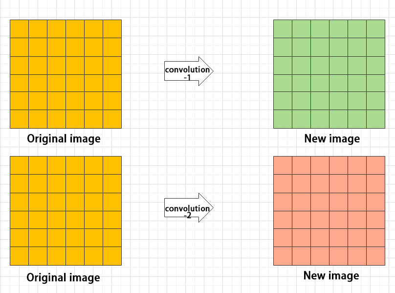
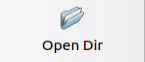
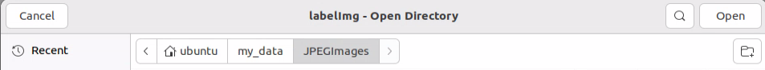
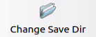
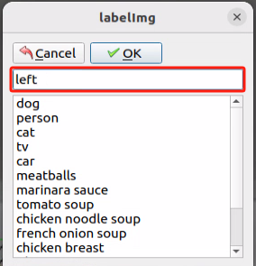
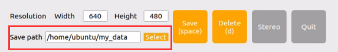
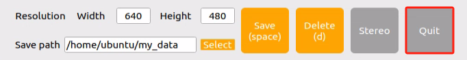

# 10. Machine Learning

## 10.1 Machine Learning Introduction

### 10.1.1 Preface

Artificial Intelligence (AI) is a new interdisciplinary field of science and technology that studies and develops theories, methods, techniques, and application systems for simulating, extending, and expanding human intelligence.  

AI includes machine learning, computer vision, natural language processing, and deep learning. Machine learning is a subfield of AI. Deep learning is a type of machine learning.  

Since its inception, AI has matured in both theory and technology, and its application areas have continued to expand, gradually becoming an independent branch.

### 10.1.2 What "Machine Learning" is

Machine Learning forms the cornerstone of artificial intelligence, serving as the fundamental approach to endow machines with intelligence. It spans multiple interdisciplinary fields such as probability theory, statistics, approximation theory, convex analysis, and algorithm complexity theory.


In essence, machine learning explores how computers can acquire new knowledge or skills by mimicking human learning behaviors and continuously enhancing their performance by reorganizing existing knowledge structures. Practically, it entails utilizing data to train models and leveraging these models for predictions.

For instance, consider AlphaGo, the pioneering artificial intelligence system that triumphed over human professional Go players and even world champions. AlphaGo operates on the principles of deep learning, wherein it discerns the intrinsic laws and representation layers within sample data to extract meaningful insights.

### 10.1.3 Types of Machine Learning

Machine learning can be broadly categorized into two types: supervised learning and unsupervised learning. The key distinction between these two types lies in whether the machine learning algorithm has prior knowledge of the classification and structure of the dataset.

* **Supervised Learning** 

Supervised learning involves providing a labeled dataset to the algorithm, where the correct answers are known. The machine learning algorithm uses this dataset to learn how to compute the correct answers. It is the most commonly used type of machine learning.

For instance, in image recognition, a large dataset of dog pictures can be provided, with each picture labeled as "**dog**". This labeled dataset serves as the "**correct answer**". By learning from this dataset, the machine can develop the ability to recognize dogs in new images.


Model Selection: In supervised learning, selecting the right model to represent the data relationship is crucial. Common supervised learning models encompass linear regression, logistic regression, decision trees, support vector machines (SVM), and deep neural networks. The choice of model hinges on the data's characteristics and the problem's nature.

Feature Engineering: Feature engineering involves preprocessing and transforming raw data to extract valuable features. This encompasses tasks like data cleaning, handling missing values, normalization or standardization, feature selection, and feature transformation. Effective feature engineering can significantly enhance model performance and generalization capabilities.

Training and Optimization: Leveraging labeled training data, we can train the model to capture the data relationship. Training typically involves defining a loss function, selecting an appropriate optimization algorithm, and iteratively adjusting model parameters to minimize the loss function. Common optimization algorithms include gradient descent and stochastic gradient descent.

Model Evaluation: Upon completing training, evaluating the model's performance on new data is essential. Standard evaluation metrics include accuracy, precision, recall, F1 score, and ROC curve. Assessing a model's performance enables us to gauge its suitability for practical applications.

In summary, supervised learning entails utilizing labeled training data to train a model for predicting or classifying new unlabeled data. Key steps encompass selecting an appropriate model, conducting feature engineering, training and optimizing the model, and evaluating its performance. Together, these components constitute the foundational elements of supervised learning.

* **Unsupervised Learning** 

Unsupervised learning involves providing an unlabeled dataset to the algorithm, where the correct answers are unknown. In this type of machine learning, the machine must mine potential structural relationships within the dataset.

For instance, in image classification, a large dataset of cat and dog pictures can be provided without any labels. Through unsupervised learning, the machine can learn to divide the pictures into two categories: cat pictures and dog pictures.


## 10.2 Machine Learning Library Introduction

### 10.2.1 Common Type of Machine Learning Framework

There are a large variety of machine learning frameworks. Among them, PyTorch, Tensorflow, MXNet and paddlepaddle are common.

* **PyTorch** 

PyTorch is a powerful open-source machine learning framework, originally based on the BSD License Torch framework. It supports advanced multidimensional array operations and is widely used in the field of machine learning. PyTorch, built on top of Torch, offers even greater flexibility and functionality. One of its most distinguishing features is its support for dynamic computational graphs and its Python interface.

In contrast to TensorFlow's static computation graph, PyTorch's computation graph is dynamic. This allows for real-time modifications to the graph as computational needs change. Additionally, PyTorch enables developers to accelerate tensor calculations using GPUs, create dynamic computational graphs, and automatically calculate gradients. This makes PyTorch an ideal choice for machine learning tasks that require flexibility, speed, and powerful computing capabilities.


* **TensorflowTensorflow** 

TensorFlow is a powerful open-source machine learning framework that allows users to quickly construct neural networks and train, evaluate, and save them. It provides an easy and efficient way to implement machine learning and deep learning concepts. TensorFlow combines computational algebra with optimization techniques to make the calculation of many mathematical expressions easier.

One of TensorFlow's key strengths is its ability to run on machines of varying sizes and types, including supercomputers, embedded systems, and everything in between. TensorFlow can also utilize both CPU and GPU computing resources, making it an extremely versatile platform. When it comes to industrial deployment, TensorFlow is often the most suitable machine learning framework due to its robustness and reliability. In other words, TensorFlow is an excellent choice for deploying machine learning applications in a production environment.


* **PaddlePaddle** 

PaddlePaddle is a cutting-edge deep learning framework developed by Baidu, which integrates years of research and practical experience in deep learning. PaddlePaddle offers a comprehensive set of features, including training and inference frameworks, model libraries, end-to-end development kits, and a variety of useful tool components. It is the first open-source, industry-level deep learning platform to be developed in China, offering rich and powerful features to developers worldwide.

Deep learning has proven to be a powerful tool in many machine learning applications in recent years. From image recognition and speech recognition to natural language processing, robotics, online advertising, automatic medical diagnosis, and finance, deep learning has revolutionized the way we approach these fields. With PaddlePaddle, developers can harness the power of deep learning to create innovative and cutting-edge applications that meet the needs of users and businesses alike.


* **MXNet** 


MXNet is a top-tier deep learning framework that supports multiple programming languages, including Python, C++, Scala, R, and more. It features a dataflow graph similar to other leading frameworks like TensorFlow and Theano, as well as advanced features such as robust multi-GPU support and high-level model building blocks comparable to Lasagne and Blocks. MXNet can run on virtually any hardware, including mobile phones, making it a versatile choice for developers.

MXNet is specifically designed for efficiency and flexibility, with accelerated libraries that enable developers to leverage the full power of GPUs and cloud computing. It also supports distributed computing across dynamic cloud architectures via distributed parameter servers, achieving near-linear scaling with multiple GPUs/CPUs. Whether you're working on a small-scale project or a large-scale deep learning application, MXNet provides the tools and support you need to succeed.

## 10.3 Yolov5 Introduction

### 10.3.1 Yolo Series Model Introduction

* **YOLO Series** 

YOLO (You Only Look Once) is an one-stage regression algorithm based on deep learning.

R-CNN series algorithm dominates target detection domain before YOLOv1 is released. It has higher detection accuracy, but cannot achieve real-time detection due to its limited detection speed engendered by its two-stage network structure.

To tackle this problem, YOLO is released. Its core idea is to redefine target detection as a regression problem, use the entire image as network input, and directly return position and category of Bounding Box at output layer. Compared with traditional methods for target detection, it distinguishes itself in high detection speed and high average accuracy.

* **YOLOv5** 

YOLOv5 is an optimized version based on previous YOLO models, whose detection speed and accuracy is greatly improved.

In general, a target detection algorithm is divided into 4 modules, namely input end, reference network, Neck network and Head output end. The following analysis of improvements in YOLOv5 rests on these four modules.

(1) Input end: YOLOv5 employs Mosaic data enhancement method to increase model training speed and network accuracy at the stage of model training. Meanwhile, adaptive anchor box calculation and adaptive image scaling methods are proposed.

(2) Reference network: Focus structure and CPS structure are introduced in YOLOv5.

(3) Neck network: same as YOLOv4, Neck network of YOLOv5 adopts FPN+PAN structure, but they differ in implementation details.

(4) Head output layer: YOLOv5 inherits anchor box mechanism of output layer from YOLOv4. The main improvement is that loss function GIOU_Loss, and DIOU_nms for prediction box screening are adopted.

### 10.3.2 YOLOv5 Model Structure

* **Component**  

**(1) Convolution layer: extract features of the image**

Convolution refers to the effect of a phenomenon, action or process that occurs repeatedly over time, impacting the current state of things. Convolution can be divided into two components: "**volume**" and "**accumulation**".

"**Volume**" involves data flipping. "**accumulation**" refers to the accumulation of the influence of past data on current data. Flipping the data helps to establish the relationships between data points, providing a reference for calculating the influence of past data on the current data.

In YOLOv5, the data being processed is typically an image, which is two-dimensional in computer vision. Therefore, the convolution applied is also a two-dimensional convolution, with the aim of extracting features from the image. The convolution kernel is an unit area used for each calculation, typically in pixels. The kernel slides over the image, with the size of the kernel being manually set.

During convolution, the periphery of the image may remain unchanged or be expanded as needed, and the convolution result is then placed back into the corresponding position in the image. For instance, if an image has a resolution of 6×6, it may be first expanded to a 7×7 image, and then substituted into the convolution kernel for calculation. The resulting data is then refilled into a blank image with a resolution of 6×6.


**(2) Pooling layer: enlarge the features of image**

The pooling layer is an essential part of a convolutional neural network and is commonly used for downsampling image features. It is typically used in combination with the convolutional layer. The purpose of the pooling layer is to reduce the spatial dimension of the feature map and extract the most important features.

There are different types of pooling techniques available, including global pooling, average pooling, maximum pooling, and more. Each technique has its unique effect on the features extracted from the image.


Maximum pooling can extract the most distinctive features from an image, while discarding the remaining ones. For example, if we take an image with a resolution of 6×6 pixels, we can use a 2×2 filter to downsample the image and obtain a new image with reduced dimensions.


**(3) Upsampling layer: restore the size of an image**

This process is sometimes referred to as "**anti-pooling**". While upsampling restores the size of the image, it does not fully recover the features that were lost during pooling. Instead, it tries to interpolate the missing information based on the available information.

For example, let's consider an image with a resolution of 6×6 pixels. Before upsampling, use 3X3 filter to calculate the original image so as to get the new image.


**(4) Batch normalization layer: organize data**

It aims to reduce the computational complexity of the model and to ensure that the data is better mapped to the activation function.

Batch normalization works by standardizing the data within each mini-batch, which reduces the loss of information during the calculation process. By retaining more features in each calculation, batch normalization can improve the sensitivity of the model to the data.


**(5) RELU layer: activate function**

The activation function is a crucial component in the process of building a neural network, as it helps to increase the nonlinearity of the model. Without an activation function, each layer of the network would be equivalent to a matrix multiplication, and the output of each layer would be a linear function of the input from the layer above. This would result in a neural network that is unable to learn complex relationships between the input and output.

There are many different types of activation functions. Some of the most common activation functions include the ReLU, Tanh, and Sigmoid. For example, ReLU is a piecewise function that replaces all values less than zero with zero, while leaving positive values unchanged.


**(6) ADD layer: add tensor**

In a typical neural network, the features can be divided into two categories: salient features and inconspicuous features.


**(7) Concat layer: splice tensor**

It is used to splice together tensors of features, allowing for the combination of features that have been extracted in different ways. This can help to increase the richness and complexity of the feature set.



* **Compound Element** 

When building a model, using only the layers mentioned above to construct functions can lead to lengthy, disorganized, and poorly structured code. By assembling basic elements into various units and calling them accordingly, the efficiency of writing the model can be effectively improved.

(1) Convolutional unit:

A convolutional unit consists of a convolutional layer, a batch normalization layer, and an activation function. The convolution is performed first, followed by batch normalization, and finally activated using an activation function.


(2) Focus module

The Focus module for interleaved sampling and concatenation first divides the input image into multiple large regions and then concatenates the small images at the same position within each region to break down the input image into several smaller images. Finally, the images are preliminarily sampled using convolutional units.

As shown in the figure below, taking an image with a resolution of 6×6 as an example, if we set a large region as 2×2, then the image can be divided into 9 large regions, each containing 4 small images.

By concatenating the small images at position 1 in each large region, a 3×3 image can be obtained. The small images at other positions are similarly concatenated, and the original 6×6 image will be broken down into four 3×3 images.


(3) Residual unit

The function of the residual unit is to enable the model to learn small changes in the image. Its structure is relatively simple and is achieved by combining data from two paths.

The first path uses two convolutional units to sample the image, while the second path does not use convolutional units for sampling but directly uses the original image. Finally, the data from the first path is added to the second path.


(4) Composite Convolution Unit

In YOLOv5, the composite convolution unit is characterized by the ability to customize the convolution unit according to requirements. The composite convolution unit is also realized by superimposing data obtained from two paths.

The first path only has one convolutional layer for sampling, while the second path has 2x+1 convolutional units and one convolutional layer for sampling. After sampling and splicing, the data is organized through batch normalization and then activated by an activation function. Finally, a convolutional layer is used for sampling.


**(5) Compound Residual Convolutional Unit**

The compound residual convolutional unit replaces the 2x convolutional layers in the compound convolutional unit with x residual units. In YOLOv5, the feature of the compound residual unit is mainly that the residual units can be customized according to the needs.


(6) Composite Pooling Unit

The output data of the convolutional unit is fed into three max pooling layers and an additional copy is kept without processing. Then, the data from the four paths are concatenated and input into a convolutional unit. Using the composite pooling unit to process the data can significantly enhance the features of the original data.'


* **Structure** 

Composed of three parts, YOLOv5 can output three sizes of data. Data of each size is processed in different way. The below picture is the output structure of YOLOv5.


Below is the output structures of data of three sizes.


### 10.3.3 YOLOv5 Running Procedure 

In this section, we provide an explanation of the model workflow using the anchor boxes, prediction boxes, and prior boxes employed in YOLOv5.

* **Prior Bounding Box** 

When an image is input into model, object detection area requires us to offer, while prior bounding box is that box used to mark the object detection area on image before detection.


* **Prediction Box** 

The prediction box is not required to set manually, which is the output result of the model. When the first batch of training data is input into model, the prediction box will be automatically generated with it. The position in which the object of same type appear more frequently are set as the center of the prediction box.


* **Anchor Box** 

After the prediction box is generated, deviation may occur in its size and position. At this time, the anchor box serves to calibrate the size and position of the prediction box.

The generation position of anchor box is determined by prediction box. In order to influence the position of the next generation of the prediction box, the anchor box is generated at the relative center of the existing prediction box.


* **Realization Process** 

After the data is calibrated, a prior bounding box appears on image. Then, the image data is input to the model, the model generates a prediction box based on the position of the prior bounding box. Having generated the prediction box, an anchor box will appear automatically. Lastly, the weights from this training are updated into model.

Each newly generated prediction will be influenced by the last generated anchor box. Repeating the operations above continuously, the deviation of the size and position of the prediction box will be gradually erased until it coincides with the priori box.


## 10.4 Yolov5 Model Training

<p id="anchor_10_4_1"></p>

### 10.4.1 Image Collecting & Labeling

Given that training the Yolov5 model necessitates a substantial volume of data, our initial step involves collecting and labeling the requisite data in preparation for subsequent model training.

To begin, you can assemble the images that require collection. As an illustration, let's consider the collection of traffic signs.

* **Image Collecting** 

Start the robot, and access the robot system desktop using VNC.

(1) Click-on  to open the command-line terminal.

(2) Execute the command to terminate the app auto-start service.

```bash
~/.stop_ros.sh
```

(3) Run the command to initiate the depth camera service.

```bash
ros2 launch peripherals depth_camera.launch.py
```

(4) Open a new command line terminal. Execute the command to create a directory for storing the data collection.

```bash
ros2 launch peripherals depth_camera.launch.py
```

(5) Execute the command to open the image collecting tool.

```bash
cd ~/software/collect_picture && python3 main.py
```


The "**save number**" displayed in the upper left corner represents the image ID, indicating the order in which images are saved. The term "**existing**" denotes the total number of images already saved.

(6) Click "**Select**". Change the storage path to the created folder directory.


(7) After selecting, click "**Choose**".


(8) Position the target recognition content within the camera's field of view, then either click the "**Save**" button or press the space bar to capture the current image from the camera.


(9) Click-on "**Save(space)**" or press space bar, then JPEGImages folder will be generated to save pictures.

:::{Note}

To enhance model reliability, capture target recognition content from various distances, rotation angles, and tilt angles.

:::

(10) Once you have finished collecting the images, click-on "**Exit**" button to close the software.


(11) In all the open command line terminals, click the "**Ctrl+C**" to exit.At this time, the entire progress of image acquisition is completed. 

(12) Create a folder by inputting the command:

```
touch ~/software/collect_picture/my_data/JPEGImages/classes.txt
```

* **Image Labeling** 

Labeling images is crucial for feature datasets as it enables the trained model to understand the categories of significant elements within the image. This understanding empowers the model to recognize these categories in new, previously unseen images.

:::{Note}

The input command should be case sensitive, and keywords can be complemented using Tab key.

:::

(1) Open the command-line terminal, and execute the command to open the image labeling software.

```bash
python3 ./software/labelImg/labelImg.py
```

The table below outlines the function of each icon:

|                           **Icon**                           | **Shortcut Key** |                       **Function**                        |
| :----------------------------------------------------------: | :--------------: | :-------------------------------------------------------: |
|  |      Ctrl+U      |     Select the directory where the picture is saved.      |
|  |      Ctrl+R      | Select the directory where the calibration data is saved. |
|  |        W         |                   Create annotation box                   |
|  |      Ctrl+S      |                      Save annotation                      |
|  |        A         |               Switch to the previous image                |
|  |        D         |                 Switch to the next image                  |

(2) Click  to open the directory where the captured images are saved. In this section, it is as below:



(3) After clicking , the directory will be opened as shown in the figure.


(4) Click the  on the interface. Select the corresponding storage folder for the calibration data directory. The path is the "**Annotations**" folder in the same path as the image capture.


(5) Click  to return to the image annotation interface.

(6) Press the "**W**" key on the keyboard to initiate the creation of the label box.

(7) Position the mouse cursor appropriately, then press and hold the left mouse button while dragging it to encompass the entire target recognition content within the label box. Release the left mouse button to finalize the selection of the target recognition content.


(8) In the pop-up window, assign a category name to the target recognition content; for instance, "**left**". Once you've named it, either click the "**OK**" button or press the "**Enter**" key to save this category.



(9) Press the shortcut "**Ctrl+S**" to save the labeling data for the current picture.

(10) As shown in the image, the right side of the image annotation is the label recognition box management area. In the red highlighted section, you'll notice multiple recognition boxes placed on the same image. By ticking the checkbox next to a specific label, the corresponding recognition box will appear and become active effect; unticking it will hide the box and deactivate it.


(11) Press the "**d**" key to enter the annotation of the next image. Repeat steps 7 to 9 to complete the annotation of all images. Click in the upper right corner of the software to exit.

(12) Open a new command line. Run the command to view the annotation files.

```bash
cd software/collect_picture/my_data/Annotations && ls
```

<p id="anchor_10_4_2"></p>

### 10.4.2 Data Format Conversion

* **Getting Ready** 

Before proceeding with this section, ensure that image collection and annotation have been completed. For detailed operational steps, please refer to the "**[10.4.1 Image Collecting and Labeling](#anchor_10_4_1)**".

Prior to feeding the data into the YOLOv5 model for training, it is essential to assign categories to the images and convert the annotated data into the required format.

* **Format Conversion**

Please operate the below steps after collecting and labeling the pictures.

:::{Note}

The input command should be case sensitive, and keywords can be complemented using Tab key.

:::

(1) Execute the following command to write the category for the captured images from this training round into a specific text file.

```bash
gedit software/collect_picture/my_data/classes.names
```

(2) Press **"i"** to enter the editing mode, then write the labeled category, "**turn_around**", into the text file (For multiple different categories, press Enter to start a new line for each one). 


(3) After completing the editing, press the "**ESC**" key, type "**:wq**", and press Enter to save and exit.

:::{Note}

The class name added here must match the one used in 'labelImg'.

:::

(4) Return to the command line terminal. Execute the command to convert the data format.

```bash
python3 software/collect_picture/xml2yolo.py --data software/collect_picture/my_data --yaml software/collect_picture/my_data/data.yaml
```

:::{Note}

The path of "**~/software/xml2yolo.py**" and "**my_data**" must be determined according to the actual location of the file.

:::

In the command above, three parameters are involved:

(1) xml2yolo.py: This script converts the calibrated label format into a format compatible with YOLOv5 model conversion. Ensure the path corresponds correctly.

(2) my_data: This parameter specifies the folder you have labeled. Ensure the path corresponds correctly.

(3) data.yaml：This file represents the format conversion of the entire folder after the model segmentation. As indicated in the command, the saved directory is within the my_data folder.

(4) The image below illustrates the generated data.yaml file.


The points after the names represent the label type. 'nc' denotes the number of label types, 'train' signifies the training set (used for data training in deep learning), and the subsequent parameters denote the paths. 'val' represents the validation set, which is used to verify results during the data training process. Ensure that paths are filled in or replaced according to the actual locations.

In subsequent training processes, if you need to enhance training speed by moving the dataset from the vehicle to a local PC or cloud server, ensure to replace the paths corresponding to the current 'train' and 'val' datasets.

Finally, an XML file will be generated under the "**/my_data**" folder to locate the segmented dataset. You can also change the saved path by modifying the last parameter in the 4) command "**/my_data/data.yaml**". Remember the path of this file as it will be used for model training later.

(5) Return to the terminal,then enter the command to edit the yaml file and press "**Enter**".

```
gedit software/collect_picture/my_data/data.yaml
```

(6) Change the relative paths of the train and val files in the configuration file to absolute paths in the yaml file. 

The relative paths for the training set (train) and validation set (val) in this file are relative to the directory where the command in step 4 is executed.

Later, the commands from different directories will be executed to call this configuration file, which in turn will access the train and val files based on the paths defined within it.

If the paths remain relative, the system will interpret them based on the current working directory where the command is executed. This can lead to incorrect file locations and ultimately cause errors when the files cannot be found.


:::{Note}

The command for checking the absolute path of a file (Must be run in the directory where the file is located): pwd

:::

(7) Return to the terminal, enter the command to edit the validation set file (val.txt), and press **"Enter."**

```
gedit software/collect_picture/my_data/ImageSets/val.txt
```

Before modification:


After modification:


During model training, the previously executed program will divide the JPG image data collected during the "Image Collection" stage into the training and validation sets according to a certain ratio. These sets will then be used for subsequent model training and evaluation.

The training and validation set files contain the relative paths to the corresponding image files. To align with Step 6), these relative paths need to be converted to absolute paths.

(8) Similarly, enter the command to edit the **train.txt** file and press Enter.

```
gedit software/collect_picture/my_data/ImageSets/train.txt
```

Before modification:


:::{Note}

If an error similar to the one shown below occurs after executing Step 4) in Section 3.2, please go back to Steps (7) and (8) in [Format Conversation]() to verify whether they were executed correctly.

:::


### 10.4.3 Model Training

Note: the input command should be case sensitive, and the keywords can be complemented using Tab key.

* **Getting Ready** 

After converting the model format, the next step is to proceed with model training. However, before training, ensure that the dataset has been prepared and converted into the required format. For detailed instructions, please refer to "**[10.4.2 Data Format Conversion](#anchor_10_4_2)**".

* **Model Training** 

(1) Start the robot, and access the robot system desktop using VNC.

(2) Click-on  to open the command-line terminal.

(3) Execute the command to navigate to the designated directory and extract the Yolov5 installation package. 

```bash
unzip software/yolov5.zip -d software/
```

(4) Run the command to train model.

```bash
python3 software/yolov5/train.py --img 640 --batch 8 --epochs 300 --data software/collect_picture/my_data/data.yaml --weights software/yolov5/yolov5n.pt 
```

In the command, "**--img**" specifies the image size; "**--batch**" determines the number of single input images per batch; "**--epochs**" indicates the number of training iterations; "**--data**" denotes the path to the dataset; "**--weights**" represents the location of the initial training file.

You can adjust these parameters according to your specific requirements. For instance, to enhance model reliability, one can increase the number of training iterations, though this will also extend the training duration.

If the output shown below appears, it indicates that your current network environment is unstable. Please try switching to a network with access to internet connection before proceeding.


If you experience a delay or the command seems to hang during execution, and the last line of output is as follows:


This indicates that the program has detected an incompatibility between the OpenCV version installed on your Raspberry Pi and the version required by the system, which has caused the program to pause and report the issue in the terminal. However, this issue does not affect the training of the model. You can choose either of the following solutions:

① Simply press **"Ctrl+C"** to ignore the warning. The program will then continue executing.

② Comment out the corresponding code in the script to prevent this message from blocking execution in future runs (file path: software/yolov5/train.py).


If the output shown below appears, it indicates that the training is in progress.


After the model training is complete, the terminal will display the path where the generated files are saved. The results from this training session have been saved in the runs/train/exp directory under the yolov5 folder


:::{Note}

The path to the generated file may vary and can be located in the corresponding folder within runs/train.

:::

### 10.4.4 Traffic Sign Model Training

:::{Note}

Please use the actual product names and reference paths as they appear in the document.

:::

For large datasets, it is not recommended to use the controller on the robot for training due to its slower training speed caused by I/O port speed and memory limitations. It is advisable to use a computer equipped with a dedicated graphics card for faster training. The training process remains the same, and you only need to configure the relevant program running environment.

If the performance of traffic sign recognition in the driverless game is poor and you need to train your own model, you can refer to this section for training the traffic sign model.

The screenshots in the following instructions may display different robot host names (though the environment configurations of different robots are roughly the same). Please input them according to the document content; however, it will not affect the execution.

* **Getting Ready** 

(1) Prepare a laptop, or a PC with wireless network card and mouse.

(2) Access the robot system desktop using VNC.

* **Training Instructions** 

\(1\) Image Collecting

① Start the robot, and access the robot system desktop using VNC.

② Click-on  to open the command-line terminal.

③ Execute the command to terminate the app service.

```bash
~/.stop_ros.sh
```

④ Run the command to initiate the camera service.

```bash
ros2 launch peripherals depth_camera.launch.py
```

⑤ Open a new terminal window. Navigate to the directory where the collection tool is stored, then enter the command to launch the image collection tool.

```bash
cd software/collect_picture && python3 main.py
```


"**save number**" represents the picture ID, indicating which picture has been saved. "**existing**" denotes the total number of saved images.

⑥ Change the storage path to "**/home/ubuntu/my_data**".



⑦ Position the target recognition content within the camera's field of view, then click the "**Save (space)**" button or press the space bar to capture and save the current camera image. Upon saving, both the "**save number**" and "**existing**" counts will increment by 1. These two parameters allow for monitoring of the saved picture names displayed on the current camera screen and the total number of pictures stored in the folder.


Upon selecting the "**Save (space)**" option, a JPEGImages folder will automatically be created within the directory "**/home/ubuntu/my_data**" to store the images.


:::{Note}

* For enhanced model reliability, capture target recognition content from various distances, rotation angles, and tilt angles.

* To guarantee recognition stability, it's advisable to increase the number of training images. It is recommended that each image category comprises at least 200 images for effective model training.

:::

⑧ After image collecting, click-on "**Exit**" to close this software.



(2) Image Labeling

:::{Note}

The input command should be case sensitive, and keywords can be complemented using Tab key.

:::

① Start the robot, and access the robot system desktop using VNC.

② Click-on  to open the command-line terminal.

③ Execute the command to terminate the app service.

```bash
~/.stop_ros.sh
```

④ Create a new terminal to execute the command.

```bash
python3 software/labelImg/labelImg.py
```

⑤ Upon launching the image annotation tool, the table below outlines the key functions

|                           **Icon**                           | **Shortcut Key** |                       **Function**                        |
| :----------------------------------------------------------: | :--------------: | :-------------------------------------------------------: |
|  |      Ctrl+U      |     Select the directory where the picture is saved.      |
|  |      Ctrl+R      | Select the directory where the calibration data is saved. |
|  |        W         |                   Create annotation box                   |
|  |      Ctrl+S      |                      Save annotation                      |
|  |        A         |               Switch to the previous image                |
|  |        D         |                 Switch to the next image                  |

⑥ Clickto open the directory for image acquisition. In this section, the selected path is shown in the figure below:


⑦ Click in the interface, and select the calibration data directory by choosing the corresponding storage folder. The path should be the "**Annotations**" directory located under the same root path as the image collection folder.


⑧ Press the "**W**" key to initiate label box creation.

Position the mouse cursor appropriately, then press and hold the left mouse button while dragging to encompass the entire target recognition content within the label box. Release the left mouse button to finalize the selection of the target recognition content.


⑨ In the pop-up window, assign a name to the category of the target recognition content, such as "**right**". Once the naming is complete, either click the "**OK**" button or press the "**Enter**" key to save this category.


⑩ Use short-cut '**Ctrl+S**' to save the labeled data of the current pictures.

⑪ Label the remaining pictures in the same manner as step 9).

⑫ Click  in the system status bar to open the file manager. Navigate to the directory "**/home/ubuntu/my_data/Annotations/**" to view the picture annotation file.

(3) Generate Related Files

① Click-on  to open the command-line terminal.

② Execute the command to view the file.

```bash
vim software/collect_picture/my_data/classes.names
```

③ Press the "**i**" key to enter the editing mode and input the class name of the target recognition content. If multiple class names are required, enter them one per line.


:::{Note}

The class name entered here must match the naming convention used in the image annotation software "**labelImg**" when applicable.

:::

④ Having finish input, press '**Esc**' key, and input '**:wq**' to save the change and close the file.


⑤ Execute the command to convert the data format.

```bash
python3 software/collect_picture/xml2yolo.py --data software/collect_picture/my_data --yaml software/collect_picture/my_data/data.yaml
```

The xml2yolo.py script converts annotated files into XML format, organizes the dataset into training and validation sets.

If you encounter the following prompt, the conversion is successful.


The output paths may vary on different robots based on their actual storage locations. However, the generated data.yaml file corresponds to the calibrated dataset.

⑥ Next, return to the command-line terminal, enter the command to edit the YAML file, and press Enter. For the modification method, please refer to [10.4.2 Data Format Conversation->Format Conversation](#anchor_10_4_2) above.

```
gedit software/collect_picture/my_data/data.yaml
```

⑦ Next, return to the command-line terminal, enter the command to edit the val.txt file, and press Enter. The modification method is the same as above.

```
gedit software/collect_picture/my_data/ImageSets/val.txt
```

⑧ Similarly, enter the command to edit the train.txt file, and press Enter.

```
gedit software/collect_picture/my_data/ImageSets/train.txt
```

(4) Model Training

① Click-on  to open the command-line terminal.

②  Run the command to train the model.

```bash
python3 software/yolov5/train.py --img 640 --batch 8 --epochs 300 --data software/collect_picture/my_data/data.yaml --weights yolov5n.pt  
```

In the command, "**--img**" specifies the image size, "**--batch**" determines the number of images processed in each iteration, and "**--epochs**" denotes the number of training iterations, which impacts the quality of the final model. For quick testing, we've set the number of training iterations to 8, but for optimal results, this value should be adjusted based on your specific requirements and the capabilities of your computer system.

Furthermore, "**--data**" indicates the path to the calibrated dataset, while "**--weights**" refers to the path of the pretrained model. It's crucial to remember whether you're using "**yolov5n.pt**" or "**yolov5s.pt**" as your pretrained model.

You can customize these parameters according to your specific needs. If model reliability needs to be improved, consider increasing the number of training iterations, keeping in mind that this will also extend the training time.

If the content displayed in the image below appears, it indicates that the training is ongoing.


After the model has been trained successfully, the terminal will print the path containing the file, and you need to record the path which will be required for "**Generate TensorRt Model Engine**".


:::{Note}

If multiple trainings are conducted, the naming of the "**exp5**" folder mentioned here will vary. For instance, it might be changed to "**exp2**", "**exp3**", and so on. The following steps will be associated with the folder naming used in this step.

:::

* **Model Usage** 

(1) Enter the command. Press "**Enter**" to disable the app service.

```bash
~/.stop_ros.sh
```

(2) Execute the command to navigate to the file folder of training result.

```bash
cd third_party_ros2/yolov5/runs/train/exp5/weights
```

(3) Copy the trained model to the ros2 function pack of the yolov5.

```bash
cp -r best.pt ~/ros2_ws/src/yolov5_ros2/config
```

(4) Run the command to open the depth camera node.

```bash
ros2 launch peripherals depth_camera.launch.py
```

(5) Open a new command line terminal. Execute the command to open the yolov5 node. Assign the current model as the copied model "**best**".

```bash
cd ros2_ws/src/yolov5_ros2/launch && gedit yolov5_ros2.launch.py
```

As figure below, edit the parameter **model** in the opened page by changing its value to the model file name **best**:

Before modification: 


After modification: 


(6) Execute the following command in the path specified in Step 5) to launch the yolov5 node.

:::{Note}

This command must be run only in the /home/ubuntu/ros2_ws/src/yolov5_ros2/launch directory.

:::

```
ros2 launch yolov5_ros2.launch.py
```

(7) Open a new terminal and enter the command to launch the rqt interface:

```
rqt
```

(8) In the rqt window, select the image source as "**result_img**". Then, the window will display the real-time images captured by the camera and processed by the specified model. If you place the training materials in view, you will see them being detected and outlined with bounding boxes. Above each bounding box, the program's recognition result and its confidence score will be displayed.


