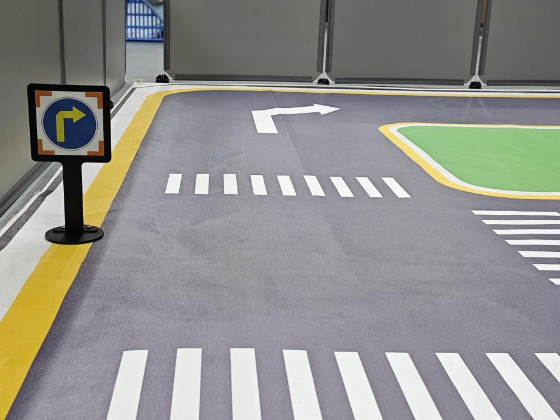
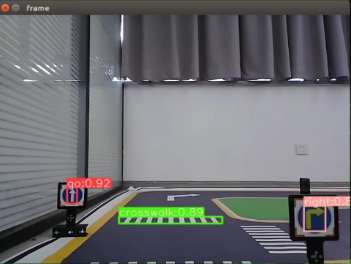
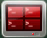

# 11. Autonomous Driving Lesson

<p id="anchor_11_1"></p>

## 11.1 Map Laying and Prop Installation

### Preface:

This document pertains to the autonomous driving capabilities of our company's vehicle. Before engaging the autonomous driving feature, please verify that the hardware components (such as the depth camera and car chassis motors) installed in the vehicle meet the specified requirements and are operating correctly. Additionally, ensure that the battery is adequately charged.

### 11.1.1 Props Setup & Notices

Prior to commencing autonomous driving, please follow the steps below to set up the map.

* **Setup Instructions** 

(1) Map Setup

To begin, ensure that the site is situated on a flat and spacious ground, and verify that there is ample lighting surrounding the area, as illustrated in the image below:


Place the robot at the start point as pictured.


As the robot advances, it will navigate along the yellow line bordering the map, and it can dynamically adjust its posture based on the lane lines in real-time.

(2) Road Signs Setup

In the game of autonomous driving, a total of 4 waypoints need to be placed: 2 for straight driving, 1 for right turn, and 1 for parking. Please refer to the following image for the specific placement positions.

:::{Note}
Ensure accurate placement!!
:::


Go straight: instruct the robot car to go forward.

<p class="common_img" style="text-align:center;">


</p>

**Turn right:** Instruct the robot car to turn right.



**Park:** Command the robot car to park.


The purpose of the road signs is to guide the car during its journey. Once the car recognizes a road sign, it will perform the appropriate actions. Additionally, the car will slow down as it approaches a pedestrian crosswalk.

(3) Traffic Light Setup

In the game of the autonomous driving function, only one traffic light needs to be placed. The exact placement location is illustrated in the figure below:


Traffic light props are utilized to replicate real-world traffic lights on roads. When the car detects the traffic light, it will adhere to the "**stop on red light, go on green light**" rule.

Once all venue props are arranged, refer to the following picture for setting up the venue environment:


* **Notice:**

(1) Ensure that the site has adequate lighting, preferably natural ambient light. Avoid strong direct light sources and colored lights, as they may hinder overall recognition. Pay attention to this aspect when setting up the site.

(2) While laying out and using the equipment, ensure proper care and protection of the props on the site. In case of incomplete maps or signs, or if the traffic light is damaged and cannot function properly, promptly contact our after-sales personnel to purchase replacements to prevent any disruptions to the recognition process.

## 11.2 Lane Keeping

This lesson focuses on controlling the robot to move forward and maintain lane alignment through instructions.

### 11.2.1 Getting Ready

(1) Before starting, ensure the map is laid out flat and free of wrinkles, with smooth roads and no obstacles. For specific map laying instructions, please refer to "**[11.1 Map Laying and Prop Installation](#anchor_11_1)**" in the same directory as this section for guidance. (In this lesson, we are only experiencing the road driving-line patrol function, so there is no need to place props such as traffic lights and signboards.)

(2) When experiencing this game, ensure it is conducted in a well-lit environment, but avoid direct light shining on the camera to prevent misrecognition.

(3) It is essential to adjust the color threshold beforehand and set the color threshold of the yellow line to avoid misidentification during subsequent recognition. For specific color threshold adjustment, please refer to the "**[8. ROS+OpenCV Lesson](8.ros+opencv_lesson.md)**" for reference.

(4) It is recommended to position the robot in the middle of the road for easy identification!

### 11.2.2 Program Logic

Lane keeping can be divided into three parts: obtaining real-time images, image processing, and result comparison.

Firstly, real-time images are obtained by capturing images using the camera.

Next, image processing includes color recognition, converting recognized images into different color spaces, erosion and dilation processing, and binarization processing.

The result comparison part involves processing the images to select the region of interest (ROI), outlining the processed images, and further comparing and calculating.

Finally, based on the comparison results, the direction of advancement is adjusted to keep the robot in the middle of the lane.

### 11.2.3 Operation Steps

:::{Note}

The input command should be case sensitive, and keywords can be complemented using Tab key.

:::

(1) Start the robot, and access the robot system desktop using VNC.

(2) Click-on  to open the command-line terminal.

(3) Execute the command to disable the app auto-start service.

```bash
~/.stop_sh
```

(4) In the command line terminal, enter the command and press "**Enter**".

```bash
ros2 launch examplt self_driving.launch.py onpy_line_follow:=true
```

(5) Open a new command line terminal. Execute the command to open the interface for live camera feed.

```bash
rqt
```

(6) If you need to terminate the game, press 'Ctrl+C'. If the game cannot be terminated, please retry.


(6) Once you've completed the game experience, you can initiate the app service by following the instructions or restarting the robot.

If the app service is not activated, the associated app functions will be disabled. (The app service will automatically start when the robot restarts).

To restart the app service, enter the following command and wait for the buzzer to emit a single beep, indicating that the service startup is complete.

```bash
sudo systemctl restart start_node.service
```

### 11.2.4 Program Outcome

After starting the game, place the robot on the road, and it will automatically detect the yellow line at the edge of the road. The robot will then adjust its position based on the detection results.


### 11.2.5 Program Analysis

The source code of this program is saved in [/home/ubuntu/ros2_ws/src/example/example/self_driving/lane_detect.py](../_static/source_code/self_driving.zip)


**Function:**

image_callback:

{lineno-start=173}

```python
def image_callback(ros_image):
    cv_image = bridge.imgmsg_to_cv2(ros_image, "bgr8")
    bgr_image = np.array(cv_image, dtype=np.uint8)
    if image_queue.full():
        # if the queue is full, remove the oldest image
        image_queue.get()
        # put the image into the queue
    image_queue.put(bgr_image)
```

Image callback function: used to read camera node.

**Class:**

LaneDetector:

{lineno-start=19}

```python
class LaneDetector(object):
    def __init__(self, color):
        # lane color
        self.target_color = color
        # ROI for lane detection
        if os.environ['DEPTH_CAMERA_TYPE'] == 'ascamera':
            self.rois = ((338, 360, 0, 320, 0.7), (292, 315, 0, 320, 0.2), (248, 270, 0, 320, 0.1))
        else:
            self.rois = ((450, 480, 0, 320, 0.7), (390, 480, 0, 320, 0.2), (330, 480, 0, 320, 0.1))
        self.weight_sum = 1.0

    def set_roi(self, roi):
        self.rois = roi
```

Init:

{lineno-start=20}

```python
    def __init__(self, color):
        # lane color
        self.target_color = color
        # ROI for lane detection
        if os.environ['DEPTH_CAMERA_TYPE'] == 'ascamera':
            self.rois = ((338, 360, 0, 320, 0.7), (292, 315, 0, 320, 0.2), (248, 270, 0, 320, 0.1))
        else:
            self.rois = ((450, 480, 0, 320, 0.7), (390, 480, 0, 320, 0.2), (330, 480, 0, 320, 0.1))
        self.weight_sum = 1.0
```

Initialize the required parameters. Set ROI to lock recognition area.

set_roi:

{lineno-start=30}

```python
    def set_roi(self, roi):
        self.rois = roi
```

Used to set recognized ROI.

get_area_max_contour:

{lineno-start=34}

```python
    def get_area_max_contour(contours, threshold=100):
        '''
        obtain the contour corresponding to the maximum area
        :param contours:
        :param threshold:
        :return:
        '''
        contour_area = zip(contours, tuple(map(lambda c: math.fabs(cv2.contourArea(c)), contours)))
        contour_area = tuple(filter(lambda c_a: c_a[1] > threshold, contour_area))
        if len(contour_area) > 0:
            max_c_a = max(contour_area, key=lambda c_a: c_a[1])
            return max_c_a
        return None
```

Get the contour list through OpenCV to obtain the contour with the maximum area.

add_horizontal_line:

{lineno-start=48}

```python
    def add_horizontal_line(self, image):
        #   |____  --->   |————   ---> ——
        h, w = image.shape[:2]
        roi_w_min = int(w/2)
        roi_w_max = w
        roi_h_min = 0
        roi_h_max = h
        roi = image[roi_h_min:roi_h_max, roi_w_min:roi_w_max]  # crop the right half
        flip_binary = cv2.flip(roi, 0)  # flip upside down
        max_y = cv2.minMaxLoc(flip_binary)[-1][1]  # extract the coordinates of the top-left point with a value of 255

        return h - max_y
```

Set the recognition horizontal line based on the width and height of the image and ROI.

add_vertical_line_far:

{lineno-start=95}

```python
    def add_vertical_line_near(self, image):
        # ——|         |——        |
        #   |   --->  |     --->
        h, w = image.shape[:2]
        roi_w_min = 0
        roi_w_max = int(w/2)
        roi_h_min = int(h/2)
        roi_h_max = h
        roi = image[roi_h_min:roi_h_max, roi_w_min:roi_w_max]
        flip_binary = cv2.flip(roi, -1)  # flip the image horizontally and vertically
        #cv2.imshow('1', flip_binary)
        (x_0, y_0) = cv2.minMaxLoc(flip_binary)[-1]  # extract the coordinates of the top-left point with a value of 255
        down_p = (roi_w_max - x_0, roi_h_max - y_0)

        (x_1, y_1) = cv2.minMaxLoc(roi)[-1]
        y_center = int((roi_h_max - roi_h_min - y_1 + y_0)/2)
        roi = flip_binary[y_center:, :] 
        (x, y) = cv2.minMaxLoc(roi)[-1]
        up_p = (roi_w_max - x, roi_h_max - (y + y_center))

        up_point = (0, 0)
        down_point = (0, 0)
        if up_p[1] - down_p[1] != 0 and up_p[0] - down_p[0] != 0:
            up_point = (int(-down_p[1]/((up_p[1] - down_p[1])/(up_p[0] - down_p[0])) + down_p[0]), 0)
            down_point = down_p

        return up_point, down_point, y_center
```

Set the recognition vertical line based on the ROI and the distance from the robot to the farthest part of the image.

get_binary

{lineno-start=123}

```python
    def get_binary(self, image):
        # recognize color through LAB space
        img_lab = cv2.cvtColor(image, cv2.COLOR_RGB2LAB)  # convert RGB to LAB
        img_blur = cv2.GaussianBlur(img_lab, (3, 3), 3)  # Gaussian blur denoising
        mask = cv2.inRange(img_blur, tuple(lab_data['lab']['Stereo'][self.target_color]['min']), tuple(lab_data['lab']['Stereo'][self.target_color]['max']))  # 二值化
        eroded = cv2.erode(mask, cv2.getStructuringElement(cv2.MORPH_RECT, (3, 3)))  # erode
        dilated = cv2.dilate(eroded, cv2.getStructuringElement(cv2.MORPH_RECT, (3, 3)))  # dilate

        return dilated
```

Perform color recognition based on color space, and process a binarized image.

add_vertical_line_near:

{lineno-start=95}

```python
    def add_vertical_line_near(self, image):
        # ——|         |——        |
        #   |   --->  |     --->
        h, w = image.shape[:2]
        roi_w_min = 0
        roi_w_max = int(w/2)
        roi_h_min = int(h/2)
        roi_h_max = h
        roi = image[roi_h_min:roi_h_max, roi_w_min:roi_w_max]
        flip_binary = cv2.flip(roi, -1)  # flip the image horizontally and vertically
        #cv2.imshow('1', flip_binary)
        (x_0, y_0) = cv2.minMaxLoc(flip_binary)[-1]  # extract the coordinates of the top-left point with a value of 255
        down_p = (roi_w_max - x_0, roi_h_max - y_0)

        (x_1, y_1) = cv2.minMaxLoc(roi)[-1]
        y_center = int((roi_h_max - roi_h_min - y_1 + y_0)/2)
        roi = flip_binary[y_center:, :] 
        (x, y) = cv2.minMaxLoc(roi)[-1]
        up_p = (roi_w_max - x, roi_h_max - (y + y_center))

        up_point = (0, 0)
        down_point = (0, 0)
        if up_p[1] - down_p[1] != 0 and up_p[0] - down_p[0] != 0:
            up_point = (int(-down_p[1]/((up_p[1] - down_p[1])/(up_p[0] - down_p[0])) + down_p[0]), 0)
            down_point = down_p

        return up_point, down_point, y_center
```

Set a vertical recognition line that is closer to the robot based on the ROI and image width and height.

\_\_call\_\_:

{lineno-start=133}

```python
    def __call__(self, image, result_image):
        # extract the center point based on the proportion
        centroid_sum = 0
        h, w = image.shape[:2]
        max_center_x = -1
        center_x = []
        for roi in self.rois:
            blob = image[roi[0]:roi[1], roi[2]:roi[3]]  # crop ROI
            contours = cv2.findContours(blob, cv2.RETR_EXTERNAL, cv2.CHAIN_APPROX_TC89_L1)[-2]  # find contours
            max_contour_area = self.get_area_max_contour(contours, 30)  # obtain the contour with the largest area
            if max_contour_area is not None:
                rect = cv2.minAreaRect(max_contour_area[0])  # the minimum bounding rectangle
                box = np.intp(cv2.boxPoints(rect))  # four corners
                for j in range(4):
                    box[j, 1] = box[j, 1] + roi[0]
                cv2.drawContours(result_image, [box], -1, (255, 255, 0), 2)  # draw the rectangle composed of the four points

                # obtain the diagonal points of the rectangle
                pt1_x, pt1_y = box[0, 0], box[0, 1]
                pt3_x, pt3_y = box[2, 0], box[2, 1]
                # the center point of the line
                line_center_x, line_center_y = (pt1_x + pt3_x) / 2, (pt1_y + pt3_y) / 2

                cv2.circle(result_image, (int(line_center_x), int(line_center_y)), 5, (0, 0, 255), -1)  # draw the center point
                center_x.append(line_center_x)
            else:
                center_x.append(-1)
        for i in range(len(center_x)):
            if center_x[i] != -1:
                if center_x[i] > max_center_x:
                    max_center_x = center_x[i]
                centroid_sum += center_x[i] * self.rois[i][-1]
        if centroid_sum == 0:
            return result_image, None, max_center_x
        center_pos = centroid_sum / self.weight_sum  # calculate the center point based on the proportion
        angle = math.degrees(-math.atan((center_pos - (w / 2.0)) / (h / 2.0)))
        
        return result_image, angle, max_center_x
```

The callback function of the entire class: In this function, color recognition is performed. The detected yellow line is drawn using OpenCV. The output includes the image, angle, and pixel coordinates X of the recognized contours in each ROI.

## 11.3 Road Sign Detection

In this lesson, the road sign recognition can be achieved through the commands.

### 11.3.1 Getting Ready

(1) Before starting, ensure the map is laid out flat and free of wrinkles, with smooth roads and no obstacles. For specific map laying instructions, please refer to "[**11.1 Map Laying and Prop Installation**](#anchor_11_1)" in the same directory as this section for guidance.

(2) The roadmap model discussed in this section is trained using YOLOv5. For further information on YOLOv5 and related content, please refer to "**[10. Machine Learning](10.machine_learning.md)**".

(3) When experiencing this game, ensure it is conducted in a well-lit environment, but avoid direct light shining on the camera to prevent misrecognition.

### 11.3.2 Program Logic

Firstly, acquire the real-time image from the camera and apply operations such as erosion and dilation.

Next, invoke the YOLOv5 model and compare it with the target screen image.

Finally, execute the appropriate landmark action based on the comparison results.

You can find the source code for this program at: [/home/ubuntu/ros2_ws/src/example/example/yolov5_detect/yolov5_trt.py](../_static/source_code/yolov5_detect.zip)

### 11.3.3 Operation Steps

:::{Note}
The following steps exclusively activate road sign detection in the live camera feed, without executing associated actions. Seeking direct experience with autonomous driving, you may bypass this lesson and proceed to "**Integrated Application**" within the same file.
:::

When inputting commands, please ensure accurate differentiation between uppercase and lowercase letters as well as spaces. Utilize the "**Tab**" key for keyword completion.

(1) Start the robot, and access the robot system desktop using VNC.

(2) Click-on  to open the command-line terminal.

(3) Execute the command to disable the app auto-start service.

```bash
~/.stop_sh
```

(4) Run the command to navigate to the directory containing programs.

```bash
cd /home/ubuntu/ros2_ws/src/example/example/yolov5_detect
```

(5) Type the command to open the program source code.

```bash
vim yolov5_trt.py
```

(6) Press the "**i**" key to enter insertion mode. Find the code enclosed in the red box and toggle commenting by adding or removing comments as needed. Once done, press the "**ESC**" key, then type "**:wq**" and press Enter to save and exit.


(7) Run the command to open the camera node.

```bash
ros2 launch peripherals depth_camera.launch.py
```

(8) Open a new command line terminal. Enter the command to enable the camera node.

```bash
ros2 launch yolov5_ros2 yolov5_ros2.launch.py model:="traffic_signs_640s_7_0"
```


(9) Run the command to initiate game program.

```bash
ros2 launch peripherals depth_camera.launch.py
```


(10) Open a new command line terminal. Execute the command to open the interface for live camera feed.

```bash
rqt
```


(11) Position the road sign in front of the camera, and the robot will recognize the road sign automatically. If you need to terminate this game, press "**Ctrl+C**". If it fails, please try again.

:::{Note}

In the event that the model struggles to recognize traffic-related signs, it may be necessary to lower the confidence level. Conversely, if the model consistently misidentifies traffic-related signs, raising the confidence level might be advisable.

:::

(12) Run the command to navigate to the directory containing programs.

```bash
cd /home/ubuntu/ros2_ws/src/example/example/self_driving
```

(13) Execute the command to open the game program.

```bash
vim self_driving.launch.py
```

The red box represents the confidence value, which can be adjusted to modify the effectiveness of target detection.


Once you've completed the game experience, you can initiate the app service by following the instructions or restarting the robot.

If the app service is not activated, the associated app functions will be disabled. (The app service will automatically start when the robot restarts).

To restart the app service, enter the following command and wait for the buzzer to emit a single beep, indicating that the service startup is complete.

```bash
sudo systemctl restart start_node.service
```

### 11.3.4 Program Outcome

After initiating the game, place the robot on the road within the map. Once the robot identifies landmarks, it will highlight the detected landmarks and annotate them based on the highest confidence level learned from the model.


## 11.4 Traffic Light Recognition

This game involves using commands to enable the camera to recognize traffic lights.

### 11.4.1 Getting Ready

(1) Before starting, ensure the map is laid out flat and free of wrinkles, with smooth roads and no obstacles. For specific map laying instructions, please refer to "[**11.1 Map Laying and Prop Installation**](#anchor_11_1)" in the same directory as this section for guidance.

(2) The roadmap model discussed in this section is trained using YOLOv5. For further information on YOLOv5 and related content, please refer to "**[10. Machine Learning](11-.machine_learning.md)**".

(3) When experiencing this game, ensure it is conducted in a well-lit environment, but avoid direct light shining on the camera to prevent misrecognition. 

### 11.4.2 Program Logic

Firstly, capture a real-time image from the camera and apply operations such as erosion and dilation.

Next, invoke the YOLOv5 model to compare it with the target screen image.

Finally, execute corresponding landmark actions based on the comparison results.

The source code for this program can be found at:

[/home/ubuntu/ros2_ws/src/example/example/yolov5_detect/yolov5_trt.py](../_static/source_code/yolov5_detect.zip)

### 11.4.3 Operation Steps

:::{Note}

* The following steps exclusively activate road sign detection in the return screen, without executing associated actions. Users seeking direct experience with autonomous driving may bypass this lesson and proceed to "**Integrated Application**" within the same file.

* When inputting commands, please ensure accurate differentiation between uppercase and lowercase letters as well as spaces. Utilize the "**Tab**" key for keyword completion.

:::

(1) Start the robot, and access the robot system desktop using VNC.

(2) Click-on  to open the command-line terminal.

(3) Execute the command to disable the app auto-start service.

```bash
~/.stop_ros.sh
```

(4) Run the command to open the camera node.

```bash
ros2 launch peripherals depth_camera.launch.py
```

(5) Open a new command line terminal. Enter the command to enable the camera node.

```bash
ros2 launch yolov5_ros2 yolov5_ros2.launch.py model:="traffic_signs_640s_7_0"
```

(6) Open a new command line terminal. Execute the command to open the interface for live camera feed.

```bash
rqt
```

(7) Position the road sign in front of the camera, and the robot will recognize the road sign and mark it on the image . If you need to terminate this game, press "**Ctrl+C**". If it fails, please try again.

:::{Note}

In the event that the model struggles to recognize traffic-related signs, it may be necessary to lower the confidence level. Conversely, if the model consistently misidentifies traffic-related signs, raising the confidence level might be advisable.

:::

(8) Run the command to navigate to the directory containing programs.

```bash
cd /home/ubuntu/ros2_ws/src/example/example/self_driving
```

(9) Execute the command to open the game program.

```bash
vim self_driving.launch.py
```

The red box represents the confidence value, which can be adjusted to modify the effectiveness of target detection.


Once you've completed the game experience, you can initiate the app service by following the instructions or restarting the robot.

If the app service is not activated, the associated app functions will be disabled. (The app service will automatically start when the robot restarts).

To restart the app service, enter the following command and wait for the buzzer to emit a single beep, indicating that the service startup is complete.

```bash
sudo systemctl restart start_node.service
```

### 11.4.4 Program Outcome

After initiating the game, position the robot on the road depicted on the map. Upon recognizing the traffic signal, the robot will assess the color of the signal light and identify frames corresponding to red and green signal lights accordingly.


## 11.5 Turning Decision Making

This lesson is about detecting and recognizing turn signs using instructions.

### 11.5.1 Getting Ready

(1) Before starting, ensure the map is laid out flat and free of wrinkles, with smooth roads and no obstacles. For specific map laying instructions, please refer to "[**11.1 Map Laying and Prop Installation**](#anchor_11_1)" in the same directory as this section for guidance.

(2) The roadmap model discussed in this section is trained using YOLOv5. For further information on YOLOv5 and related content, please refer to "**[10. Machine Learning](10.machine_learning.md)**".

(3) When experiencing this game, ensure it is conducted in a well-lit environment, but avoid direct light shining on the camera to prevent misrecognition.

### 11.5.2 Program Logic

Firstly, capture the real-time image from the camera and apply operations such as erosion and dilation.

Next, invoke the YOLOv5 model to compare the obtained image with the target screen image.

Finally, based on the comparison outcomes, recognize the steering sign and direct the robot accordingly.

The source code of this program is saved in: [/home/ubuntu/ros2_ws/src/example/example/yolov5_detect/yolov5_trt.py](../_static/source_code/yolov5_detect.zip)

### 11.5.3 Operation Steps

:::{Note}

The following steps exclusively activate road sign detection in the live camera feed, without executing associated actions. Seeking direct experience with autonomous driving, you may bypass this lesson and proceed to "**Integrated Application**" within the same file.

:::

When inputting commands, please ensure accurate differentiation between uppercase and lowercase letters as well as spaces. Utilize the "**Tab**" key for keyword completion.

(1) Start the robot, and access the robot system desktop using VNC.

(2) Click-on  to open the command-line terminal.

(3) Execute the command to disable the app auto-start service.

```bash
~/.stop_ros.sh
```

(4) Run the command to open the camera node.

```bash
ros2 launch peripherals depth_camera.launch.py
```

(5) Open a new command line terminal. Enter the command to enable the camera node.

```bash
ros2 launch yolov5_ros2 yolov5_ros2.launch.py model:="traffic_signs_640s_7_0"
```

(6) Open a new command line terminal. Execute the command to open the interface for live camera feed.

```bash
rqt
```


(7) Position the road sign in front of the camera, and the robot will recognize the road sign and mark it on the image . If you need to terminate this game, press "**Ctrl+C**". If it fails, please try again.

:::{Note}

In the event that the model struggles to recognize traffic-related signs, it may be necessary to lower the confidence level. Conversely, if the model consistently misidentifies traffic-related signs, raising the confidence level might be advisable.

:::

(8) Run the command to navigate to the directory containing programs.

```bash
cd /home/ubuntu/ros2_ws/src/example/example/self_driving
```

(9) Execute the command to open the game program.

```bash
vim self_driving.launch.py
```

The red box represents the confidence value, which can be adjusted to modify the effectiveness of target detection.


Once you've completed the game experience, you can initiate the app service by following the instructions or restarting the robot.

If the app service is not activated, the associated app functions will be disabled. (The app service will automatically start when the robot restarts).

To restart the app service, enter the following command and wait for the buzzer to emit a single beep, indicating that the service startup is complete.

```bash
sudo systemctl restart start_node.service
```

### 11.5.4 Program Outcome

Once the game begins, position the robot onto the road within the map. As the robot approaches a turning road sign, it will adjust its direction in accordance with the instructions provided by the sign.



## 11.6 Autonomous Parking

In this lesson, let's learn how to detect parking signs using instructions.

### 11.6.1 Getting Ready

(1) Before starting, ensure the map is laid out flat and free of wrinkles, with smooth roads and no obstacles. For specific map laying instructions, please refer to "[**11.1 Map Laying and Prop Installation**](#anchor_11_1)" in the same directory as this section for guidance.

(2) The roadmap model discussed in this section is trained using YOLOv5. For further information on YOLOv5 and related content, please refer to "**[10. Machine Learning](10.machine_learning.md)**".

(3) When experiencing this game, ensure it is conducted in a well-lit environment, but avoid direct light shining on the camera to prevent misrecognition.

### 11.6.2 Program Logic

Begin by capturing the real-time image from the camera and applying operations such as erosion and dilation.

Next, invoke the YOLOv5 model to compare the obtained image with the target screen image.

Finally, based on the comparison results, identify the parking sign and autonomously guide the robot to park in the designated parking space.

The source code of this program is saved in [/home/ubuntu/ros2_ws/src/example/example/yolov5_detect/yolov5_trt.py](../_static/source_code/yolov5_detect.zip)

### 11.6.3 Operation Steps

:::{Note}

The following steps exclusively activate road sign detection in the return screen, without executing associated actions. Users seeking direct experience with autonomous driving may bypass this lesson and proceed to "**Integrated Application**" within the same file.

:::

When inputting commands, please ensure accurate differentiation between uppercase and lowercase letters as well as spaces. Utilize the "**Tab**" key for keyword completion.

(1) Start the robot, and access the robot system desktop using VNC.

(2) Click-on  to open the command-line terminal.

(3) Execute the command to disable the app auto-start service.

```bash
~/.stop_ros.sh
```

(4) Run the command to open the camera node.

```bash
ros2 launch peripherals depth_camera.launch.py
```

(5) Open a new command line terminal. Enter the command to enable the camera node.

```bash
ros2 launch yolov5_ros2 yolov5_ros2.launch.py model:="traffic_signs_640s_7_1"
```

(6) Open a new command line terminal. Execute the command to open the interface for live camera feed.

```bash
rqt
```


(7) Position the road sign in front of the camera, and the robot will recognize the road sign and mark it on the image . If you need to terminate this game, press "**Ctrl+C**". If it fails, please try again.

:::{Note}

In the event that the model struggles to recognize traffic-related signs, it may be necessary to lower the confidence level. Conversely, if the model consistently misidentifies traffic-related signs, raising the confidence level might be advisable.

:::

(8) Run the command to navigate to the directory containing programs.

```bash
cd /home/ubuntu/ros2_ws/src/example/example/self_driving
```

(9) Execute the command to open the game program.

```bash
vim self_driving.launch.py
```

The red box represents the confidence value, which can be adjusted to modify the effectiveness of target detection.


Once you've completed the game experience, you can initiate the app service by following the instructions or restarting the robot.

If the app service is not activated, the associated app functions will be disabled. (The app service will automatically start when the robot restarts).

To restart the app service, enter the following command and wait for the buzzer to emit a single beep, indicating that the service startup is complete.

```bash
sudo systemctl restart start_node.service
```

### 11.6.4 Program Outcome

After initiating the game, position the robot on the road within the map. As the robot progresses towards the parking sign, it will automatically park in the designated parking space based on the instructions provided by the road sign.

### 11.6.5 Parameter Adjustment

If the robot stops upon recognizing the parking sign and the parking position is not optimal, adjustments to the parameters in the program source code can be made.

(1) Click-on  to open the command-line terminal.

(2) Execute the command to navigate to the directory containing game programs.

```bash
cd ros2_ws/src/example/example/self_driving/
```

(3) Run the command to access the source code.

```bash
vim self_driving.py
```

(4) Press the "**i**" key to enter insert mode and locate the code within the red box. Adjusting the parameters within the red box allows you to control the starting position for the robot to initiate the parking operation. Decreasing the parameters will result in the robot stopping closer to the zebra crossing, while increasing them will cause the robot to stop further away. Once adjustments are made, press the "**ESC**" key, type "**:wq**", and press Enter to save and exit.


You can adjust the parking processing function to alter the parking position of the robot. Initially, the parking action sets the linear speed in the negative direction of the Y-axis (right of the robot) to 0.2 meters per second, with a forward movement time of (0.38/2) seconds. To position the robot in the ideal location on the left side of the parking space, modify the speed and time accordingly.


## 11.7 Integrated Application

This lesson provides instructions for implementing comprehensive driverless game on the robot, covering lane keeping, road sign detection, traffic light recognition, steering decision-making, and self-parking.

### 11.7.1 Getting Ready

* **Map Setup** 

To ensure accurate navigation, place the map on a flat, smooth surface, free of wrinkles and obstacles. Position all road signs and traffic lights at designated locations on the map, facing clockwise. The starting point and locations of road signs are indicated below:


* **Color Threshold Adjustment** 

Due to variations in light sources, it's essential to adjust the color thresholds for "**black, white, red, green, blue, and yellow**" based on the guidelines provided in the "[**ROS+OpenCV Lesson**](8.ros+opencv_lesson.md)" prior to starting.

If the robot encounter inaccurate recognition while moving forward, readjust the color threshold specifically in the map area where recognition fails.

### 11.7.2 Program Logic


Actions implemented so far include:

(1) Following the yellow line in the outermost circle of the patrol map.

(2) Slowing down and passing if a zebra crossing is detected.

(3) Making a turn upon detection of a turn sign.

(4) Parking the vehicle and entering the parking lot upon detection of a stop sign.

(5) Halting when a red light is detected.

(6) Slowing down when passing a detected street light.

First, load the model file trained by YOLOv5 and the required library files, obtain real-time camera images, and perform operations such as erosion and dilation on the images.

Next, identify the target color line segment in the image and gather information such as size and center point of the target image. Then, invoke the model through YOLOv5 and compare it with the target screen image.

Finally, adjust the forward direction based on the offset comparison of the target image's center point to keep the robot in the middle of the road. Additionally, perform corresponding actions based on different recognized landmark information during map traversal.

<p id="anchor_11_7_3"></p>

### 11.7.3 Operation Steps

:::{Note}

the input command should be case sensitive, and keywords can be implemented using Tab key.

:::

(1) Start the robot, and access the robot system desktop using VNC.

(2) Click-on  to open the command-line terminal.

(3) Execute the command to disable the app auto-start service.

```bash
~/.stop_ros.sh
```

(4) Type the command in the command line terminal and press "**Enter**".

```bash
ros2 launch example self_driving.launch.py
```

(5) Open a new command line terminal. Execute the command to open the interface for live camera feed.

```bash
rqt
```


(6) If you want to terminate the game, access the relevant terminal window and press "**Ctrl+C**".


Once you've completed the game experience, you can initiate the app service by following the instructions or restarting the robot.

If the app service is not activated, the associated app functions will be disabled. (The app service will automatically start when the robot restarts).

To restart the app service, enter the following command and wait for the buzzer to emit a single beep, indicating that the service startup is complete.

```bash
sudo systemctl restart start_node.service
```

### 11.7.4  Program Outcome

(1) Lane Keeping

Upon initiating the game, the robot will track the line and identify the yellow line at the road's edge. It will execute forward and turning actions based on the straightness or curvature of the yellow line to maintain lane position.

(2) Traffic Light Recognition

When the car encounters a traffic light, it will halt if the light is red and proceed if it's green. Upon approaching a zebra crossing, the car will automatically decelerate and proceed cautiously.

(3) Turn and Parking Signs

Upon detecting traffic signs while moving forward, the car will respond accordingly. If it encounters a right turn sign, it will execute a right turn and continue forward. In the case of a parking sign, it will execute a parking maneuver.

Following these rules, the robot will continuously progress forward within the map.

###  11.7.5  Program  Analysis 

The source code for this program can be found at:[/home/ubuntu/ros2_ws/src/example/example/self_driving/self_driving.py](../_static/source_code/self_driving.zip)


**Function:**

{lineno-start=387}

```python
def main():
    node = SelfDrivingNode('self_driving')
    executor = MultiThreadedExecutor()
    executor.add_node(node)
    executor.spin()
    node.destroy_node()
```

Start the autonomous driving class.

**Class:**

{lineno-start=31}

```python
    def __init__(self, name):
        rclpy.init()
        super().__init__(name, allow_undeclared_parameters=True, automatically_declare_parameters_from_overrides=True)
        self.name = name
        self.is_running = True
        self.pid = pid.PID(0.4, 0.0, 0.05)
        self.param_init()
```

**init:**

{lineno-start=30}

```python
class SelfDrivingNode(Node):
    def __init__(self, name):
        rclpy.init()
        super().__init__(name, allow_undeclared_parameters=True, automatically_declare_parameters_from_overrides=True)
        self.name = name
        self.is_running = True
        self.pid = pid.PID(0.4, 0.0, 0.05)
        self.param_init()

        self.fps = fps.FPS()  
        self.image_queue = queue.Queue(maxsize=2)
        self.classes = ['go', 'right', 'park', 'red', 'green', 'crosswalk']
        self.display = True
        self.bridge = CvBridge()
        self.lock = threading.RLock()
        self.colors = common.Colors()
        # signal.signal(signal.SIGINT, self.shutdown)
        self.machine_type = os.environ.get('MACHINE_TYPE')
        self.lane_detect = lane_detect.LaneDetector("yellow")

        self.mecanum_pub = self.create_publisher(Twist, '/controller/cmd_vel', 1)
        self.servo_state_pub = self.create_publisher(SetPWMServoState, 'ros_robot_controller/pwm_servo/set_state', 1)
        self.result_publisher = self.create_publisher(Image, '~/image_result', 1)

        self.create_service(Trigger, '~/enter', self.enter_srv_callback) # enter the game
        self.create_service(Trigger, '~/exit', self.exit_srv_callback) # exit the game
        self.create_service(SetBool, '~/set_running', self.set_running_srv_callback)
        # self.heart = Heart(self.name + '/heartbeat', 5, lambda _: self.exit_srv_callback(None))
        timer_cb_group = ReentrantCallbackGroup()
        self.client = self.create_client(Trigger, '/yolov5_ros2/init_finish')
        self.client.wait_for_service()
```

Initialize the required parameters to get the current robot type. Set the color for line following to yellow. Start the chassis control, servo control, and image reading. Set up three services for entering, exiting, and starting. Read the YOLOv5 node.

**init_process:**

{lineno-start=68}

```python
    def init_process(self):
        self.timer.cancel()

        self.mecanum_pub.publish(Twist())
        if not self.get_parameter('only_line_follow').value:
            self.send_request(self.start_yolov5_client, Trigger.Request())
        time.sleep(1)
        
        if 1:#self.get_parameter('start').value:
            self.display = True
            self.enter_srv_callback(Trigger.Request(), Trigger.Response())
            request = SetBool.Request()
            request.data = True
            self.set_running_srv_callback(request, SetBool.Response())
```

Initialize the current servo and start the main function.

**param_init:**

{lineno-start=88}

```python
    def param_init(self):
        self.start = False
        self.enter = False
        self.right = True

        self.have_turn_right = False
        self.detect_turn_right = False
        self.detect_far_lane = False
        self.park_x = -1  # obtain the x-pixel coordinate of a parking sign

        self.start_turn_time_stamp = 0
        self.count_turn = 0
        self.start_turn = False  # start to turn
```

Initialize the parameters needed for position recognition or other operations.

**get_node_state:**

{lineno-start=126}

```python
    def get_node_state(self, request, response):
        response.success = True
        return response
```

Get the current node status.

**send_request:**

{lineno-start=130}

```python
    def send_request(self, client, msg):
        future = client.call_async(msg)
        while rclpy.ok():
            if future.done() and future.result():
                return future.result()
```

Used to publish service requests.

**enter_srv_callback:**

{lineno-start=136}

```python
    def enter_srv_callback(self, request, response):
        self.get_logger().info('\033[1;32m%s\033[0m' % "self driving enter")
        with self.lock:
            self.start = False
            camera = 'depth_cam'#self.get_parameter('depth_camera_name').value
            self.create_subscription(Image, '/ascamera/camera_publisher/rgb0/image' , self.image_callback, 1)
            self.create_subscription(ObjectsInfo, '/yolov5_ros2/object_detect', self.get_object_callback, 1)
            self.mecanum_pub.publish(Twist())
            self.enter = True
        response.success = True
        response.message = "enter"
        return response
```

Enter the autonomous driving game service. Start reading images and YOLOv5 recognition content. Initialize the speed.

**exit_srv_callback:**

{lineno-start=149 }

```python
    def exit_srv_callback(self, request, response):
        self.get_logger().info('\033[1;32m%s\033[0m' % "self driving exit")
        with self.lock:
            try:
                if self.image_sub is not None:
                    self.image_sub.unregister()
                if self.object_sub is not None:
                    self.object_sub.unregister()
            except Exception as e:
                self.get_logger().info('\033[1;32m%s\033[0m' % str(e))
            self.mecanum_pub.publish(Twist())
        self.param_init()
        response.success = True
        response.message = "exit"
        return response
```

Exit the autonomous driving game service. It will stop reading images and YOLOv5 recognition content. Initialize the speed, and reset the parameters.

**set_running_srv_callback:**

{lineno-start=165 }

```python
    def set_running_srv_callback(self, request, response):
        self.get_logger().info('\033[1;32m%s\033[0m' % "set_running")
        with self.lock:
            self.start = request.data
            if not self.start:
                self.mecanum_pub.publish(Twist())
        response.success = True
        response.message = "set_running"
        return response
```

Enable the autonomous driving game. Set the "**start**" parameter to True.

**Shutdown:**

{lineno-start=175}

```python
    def shutdown(self, signum, frame):  # press 'ctrl+c' to close the program
        self.is_running = False
```

The callback function after the program is closed is used to stop the current running program.

**image_callback:**

{lineno-start=178}

```python
    def image_callback(self, ros_image):  # callback target checking
        cv_image = self.bridge.imgmsg_to_cv2(ros_image, "rgb8")
        rgb_image = np.array(cv_image, dtype=np.uint8)
        if self.image_queue.full():
            # if the queue is full, remove the oldest image
            self.image_queue.get()
        # put the image into the queue
        self.image_queue.put(rgb_image)
```

Image callback function, which puts the image into the queue and discards expired images.

**park_action:**

{lineno-start=187}

```python
    # parking processing
    def park_action(self):
        if self.machine_type == 'MentorPi_Mecanum': 
            twist = Twist()
            twist.linear.y = -0.2
            self.mecanum_pub.publish(twist)
            time.sleep(0.38/0.2)
        elif self.machine_type == 'MentorPi_Acker':
            twist = Twist()
            twist.linear.x = 0.15
            twist.angular.z = twist.linear.x*math.tan(-0.5061)/0.145
            self.mecanum_pub.publish(twist)
            time.sleep(3)

            twist = Twist()
            twist.linear.x = 0.15
            twist.angular.z = -twist.linear.x*math.tan(-0.5061)/0.145
            self.mecanum_pub.publish(twist)
            time.sleep(2)

            twist = Twist()
            twist.linear.x = -0.15
            twist.angular.z = twist.linear.x*math.tan(-0.5061)/0.145
            self.mecanum_pub.publish(twist)
            time.sleep(1.5)
```

Parking logic, which will run two different parking strategies based on two different chassis types.

**get_object_callback:**

{lineno-start=357}

```python
    # Obtain the target detection result
    def get_object_callback(self, msg):
        self.objects_info = msg.objects
        if self.objects_info == []:  # If it is not recognized, reset the variable
            self.traffic_signs_status = None
            self.crosswalk_distance = 0
        else:
            min_distance = 0
            for i in self.objects_info:
                class_name = i.class_name
                center = (int((i.box[0] + i.box[2])/2), int((i.box[1] + i.box[3])/2))
                
                if class_name == 'crosswalk':  
                    if center[1] > min_distance:  # Obtain recent y-axis pixel coordinate of the crosswalk
                        min_distance = center[1]
                elif class_name == 'right':  # obtain the right turning sign
                    self.count_right += 1
                    self.count_right_miss = 0
                    if self.count_right >= 5:  # If it is detected multiple times, take the right turning sign to true
                        self.turn_right = True
                        self.count_right = 0
                elif class_name == 'park':  # obtain the center coordinate of the parking sign
                    self.park_x = center[0]
                elif class_name == 'red' or class_name == 'green':  # obtain the status of the traffic light
                    self.traffic_signs_status = i
               

            self.get_logger().info('\033[1;32m%s\033[0m' % class_name)
            self.crosswalk_distance = min_distance

```

Callback function for reading YOLOv5, which gets the current recognized category.

**Main:**

{lineno-start=387}

```python
def main():
    node = SelfDrivingNode('self_driving')
    executor = MultiThreadedExecutor()
    executor.add_node(node)
    executor.spin()
    node.destroy_node()
 
if __name__ == "__main__":
    main()

```

The main function inside the class, which will run different line-following strategies based on different chassis types.

###  11.7.6 FAQ

(1) The robot exhibits inconsistent performance during line patrolling, often veering off course.

Adjust the color threshold to better suit the lighting conditions of the actual scene. For precise instructions on color threshold adjustment, please consult "[**ROS+OpenCV Lesson**](8.ros+opencv_lesson.md)" for detailed guidance.

(2) Modify the line patrol processing code

Navigate to the game program path by entering the command.

```bash
cd ~/ros2_ws/src/example/example/self_driving/
```

Execute the command to open the game program.

```bash
vim self_driving.py
```

The red box denotes the lane's center point, which can be adjusted to fine-tune the turning effect. Decreasing the value will result in earlier turns, while increasing it will cause later turns.


(3) The parking location is suboptimal.

You can adjust the parking processing function or modify the starting position of the parking operation.

(4) Inaccurate traffic sign recognition.

Adjust the target detection confidence. For detailed instructions, please refer to "[**11.7.3 Operation Steps**](#anchor_11_7_3)" for comprehensive learning.