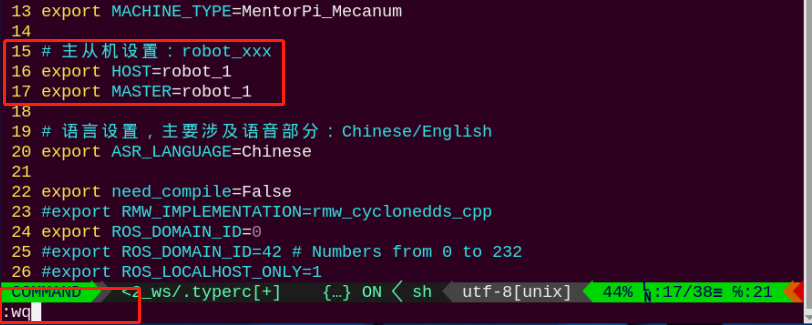
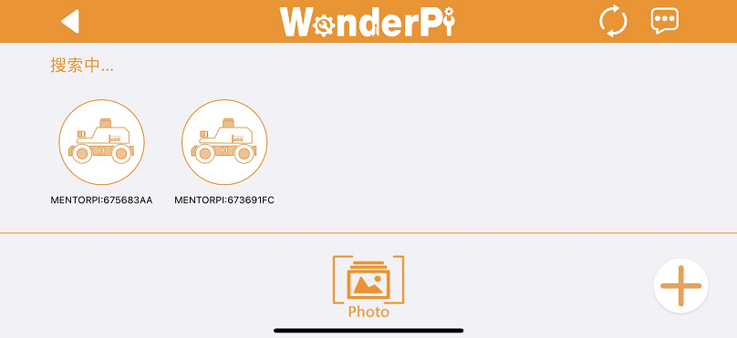
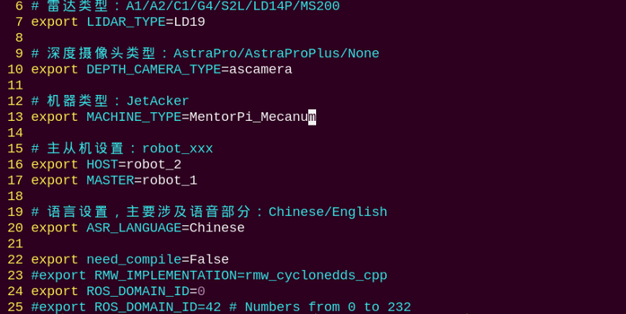
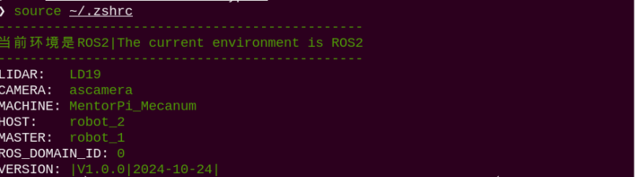

# 12. Master Slave And Group Control

## 12.1 Master-Slave and Environment Variable Configuration

### 12.1.1 Preparation

(1) Prepare at least two devices (this lesson uses two MentorPi units as an example).

(2) Set up the development environment by referring to ["**2. Set Development Enviroment -> 2.1 VNC Installation and Connection**"](3.set_development_environment.md#vnc-installation-and-connection), and download and install the remote access tool **VNC**.

### 12.1.2 Program Logic

By connecting the master and slave devices to the same network and assigning different namespaces, the broadcast program can send velocity commands to the slave devices, enabling coordinated multi-device control. In this example, a hotspot created by a Raspberry Pi is used for the network connection.

<p id="anchor_12_1_3"></p>

### 12.1.3 Network Configuration

* **Configure Host Network**

(1) Power on one MentorPi device and designate it as the master. Once it has booted, remotely access its desktop.

(2) Open a terminal and navigate to the project directory by entering the following command:

```
cd hiwonder-toolbox
```

(3) Open the Wi-Fi configuration file using the Vim editor:

```
sudo vim wifi_conf.py
```

(4) Press the `i` key to enter **edit mode**. Locate the two lines of code related to the hotspot password (as shown in the reference image), and update the password as needed.


(5) After making the changes, press `Esc` to exit **edit mode**, then type `:wq` and press `Enter` to save and exit the file:

```
:wq
```

(6) Reboot the master device by running:

```
sudo reboot
```

(7) Once the device has restarted, connect to the master's Wi-Fi using the updated password. The default password is **"hiwonder"** unless you specified a different one during configuration.

* **Configure Slave Network**

(1) Power on the slave device and remotely access its desktop environment.

(2) Open a terminal and navigate to the project directory with the following command:

```
cd hiwonder-toolbox
```

(3) Use the Vim editor to open the Wi-Fi configuration file:

```
sudo vim wifi_conf.py
```

(4) Press `i` to enter **"edit mode"**. Locate the three lines of code shown in the reference image and modify the Wi-Fi name and password as indicated.

Located the indicated codes.


Set the **network mode to "2"** to enable **"LAN mode"**. Use **"HW-123"** as the Wi-Fi name and **"hiwonder"** as the password—these should match the hotspot settings configured on the master device in [12.1.3 Network Configuration](#anchor_12_1_3).

(5) Once editing is complete, press `Esc` to exit **edit mode**, then type `:wq` and press `Enter` to save and close the file:

```
:wq
```

(6) Reboot the device by entering the following command (this step is **required**):

```
sudo reboot
```

:::{Note}
* When MentorPi starts in **"LAN mode"**, it will first attempt to automatically connect to the predefined network. During this process, `LED2` on the Raspberry Pi expansion board will flash rapidly, indicating that the device is actively searching for the network.

* If the target network cannot be found after **three consecutive search attempts**, MentorPi will automatically switch to **"Direct Connection mode"** (indicated by `LED2` flashing slowly).

* Please note that when MentorPi switches back to **"Direct Connection mode"** due to a failed LAN connection, the settings in the `wifi_conf.py` file **will not be updated automatically**—they will still reflect the LAN configuration. Therefore, unless the file is manually modified, MentorPi will continue to attempt **"LAN mode"** first on the next startup.
:::

<p id="anchor_12_1_4"></p>

### 12.1.4 Configure Environment Variable

* **Configuring Environment Variables on the Master Device**

(1) Select one MentorPi vehicle as the master and power it on. Use VNC to remotely connect to the Raspberry Pi desktop.

(2) Click  in the top-left corner of the desktop to open the Terminator terminal.

(3) Ensure the master device is connected to the USB game controller receiver.

(4) Enter the command to disable automatic startup of the gameplay and press Enter:

```
~/.stop_ros.sh
```

(5) Open the `.typerc` file to configure environment variables for the master device by entering:

```
vim /home/ubuntu/ros2_ws/.typerc
```

(6) Press the `i` key to enter **edit mode**. Enable the master-slave settings by setting the master to `robot_1/`.



(7) After making the changes, press `Esc`, then type `:wq` and press `Enter` to save and exit.

(8) Finally, enter the following command to apply the master configuration:

```
source ~/.zshrc
```

* **Configuring Environment Variables on the Slave Device**

(1) Connect your mobile app to the Wi-Fi network generated by the master device. Perform a search, and you will see two car icons displayed. Long-press the icon representing the slave device to reveal its `IP` address. Use this `IP` to follow the instructions in ["**2. Set Development Environment -> 2.1 VNC Installation and Connection**"](3.set_development_environment.md#vnc-installation-and-connection).




(2) After accessing the device, follow the steps in [12.1.4 Configure Environment Variable-> Configuring Environment Variables on the Master Device](#anchor_12_1_4) First, open the `.typerc` file and set the slave device's environment variable `HOST` to `robot_2`. Then save and exit the file. Finally, run the command `source ~/.zshrc` to refresh the environment variables.





## 12.2 Group Control

### 12.2.1 Time Synchronization

(1) On the master device's terminal, check the current system time by entering the command below:

```
date
```

(2) On the slave device, synchronize its system time with the master's time by entering:

```
sudo date -s "2024-10-29 22:46:31"
```

:::{Note}
* If you experience noticeable desynchronization during joystick control between the master and slave devices, it is likely caused by inconsistent system times. In such cases, please repeat the synchronization process.

* Updating the slave's system time based on the master's reported time takes some time to execute, meaning the master's actual time will have advanced by the time the update is applied. To minimize this discrepancy, start a stopwatch or manually count seconds after retrieving the master's time. Then, add this elapsed time to the master's reported time when setting the slave's time.

* After synchronizing, verify by quickly running the `date` command on both master and slave terminals. If their system times closely match, the synchronization is successful.
:::

### 12.2.2 Program Execution

[Source Code](../_static/source_code/multi.zip)

(1) On the master device, open three terminal windows and run the following programs in each:

* `multi_controller.launch.py`: controls the chassis
* `joystick_control_multi.py`: manages joystick input
* `joy_node`: starts the joystick communication node

```
ros2 launch multi multi_controller.launch.py
```

```
python3 ros2_ws/src/multi/launch/joystick_control_multi.py
```

```
ros2 run joy joy_node
```

(2) On the slave device, enter the following command to run the program.

```
ros2 launch multi multi_controller.launch.py
```

:::{Note}

For every subsequent startup when you want to use multi-device control, you must first disable the auto-start services on both the master and slave devices, and synchronize their system times.
:::

### 12.2.3 Group Control Operation

(1) Turn ON the controller. Both the red and green `LEDs` on the controller will start blinking simultaneously.

(2) Wait a few seconds for the robot and controller to pair automatically. Once paired successfully, the green LED will remain solid while the red `LED` turns off.

(3) When the controller connects to the master device, pressing the Start button will trigger a beep from the buzzers on both vehicles.

:::{Note}

Gently pushing the joystick in any direction will result in slow-speed movement.
:::

| Key | Function | Operation |
| :--: | :--: | :--: |
| START | Stop and reset the robot | Press |
| Left joystick up | Move forward | Push |
| Left joystick down | Move backward | Push |
| Left joystick left | Turn left (mecanum wheel chassis only) | Push |
| Left joystick right | Turn right (mecanum wheel chassis only) | Push |
| Right joystick left | Turn left (Ackermann steering—front wheels only) | Push |
| Right joystick right | Turn right (Ackermann steering—front wheels only) | Push |