# 14. Large AI Model Course

## 14.1 Voice Module Overview and Installation

### 14.1.1 Introduction to WonderEcho Pro

*   **Introduction**

WonderEcho Pro, also known as the AI Voice Interaction Box, is equipped with a high-performance noise-canceling microphone and a high-fidelity speaker. Featuring a USB-to-audio module, it offers plug-and-play functionality without the need for drivers and is compatible with multiple systems for both playback and recording.

This device integrates various speech processing modules and uses advanced noise suppression algorithms to effectively filter out background noise, supporting a seamless process from wake-up to speech recognition and interaction. With its modular design, each functional component—such as wake-up, detection, recognition, and synthesis—can be developed and tested independently.

*   **Features & Parameters**

(1) The device is equipped with an onboard microphone and speaker interface, supporting both audio input and output.

(2) It is driver-free, offering seamless plug-and-play functionality with broad system compatibility, including Windows, macOS, Linux, and Android. The **"listen/speak"** dual function ensures versatility across various platforms.

(3) It uses a standard USB 2.0 interface.

(4) Control Interface: USB

(5) Voice Chip Model: CI1302

(6) Speaker Output: 3.0W per channel (4Ω BTL)

(7) Power Supply Voltage: 5V

*   **Recording and Playback Test**

The following steps demonstrate the process using the Raspberry Pi 5, but the connection and testing procedures are equally applicable to other compatible devices, such as Jetson:

(1) Connection Diagram and Testing


For Raspberry Pi, you can establish a remote connection to the system using VNC by following the [2. Set Development Environment -&gt; 2.1 VNC Installation and Connection](3.set_development_environment.md#vnc-installation-and-connection) guide. Once connected, check the top-right corner of the desktop for the microphone and speaker icons, as shown below. If they are present, the connection has been successfully established.


 For Jetson-based systems, you can use the Nomachine remote connection tool. Once connected, verify the presence of the speaker icon in the top-right corner of the system.


(2) Recording Test

① Next, open a new command-line terminal and enter the following command to check for the use of the `-l`  (lowercase L) option, and verify that the card number (card) is `0`. This is just an example; please ensure to check your actual query results.

```
arecord -l
```


② Then, use the following command to start recording, replacing the highlighted card number (in red) with the one obtained from the previous query:

```
arecord -D hw:0,0 -f S16_LE -r 16000 -c 2 test.wav
```

③ A **"test.wav"** file will be generated in the current folder.

④ You can record for about 5 seconds, then press **"Ctrl+C"** to stop the recording.

(3) Playback Test

① After completing the recording, you can check if the file was successfully recorded by running the following command in the current directory:

```
ls
```


② If **"test.wav"** appears, the recording was successful. To play the recorded file, use the command below, ensuring you replace the card number with the one obtained from your previous query:

```
aplay test.wav
```

### 14.1.2 WonderEcho Pro Installation

:::{Note}

When installing the WonderEcho Pro, make sure the robot's front faces forward and the WonderEchoPro's USB port is oriented to the left—aligned with the Raspberry Pi's USB ports.
:::

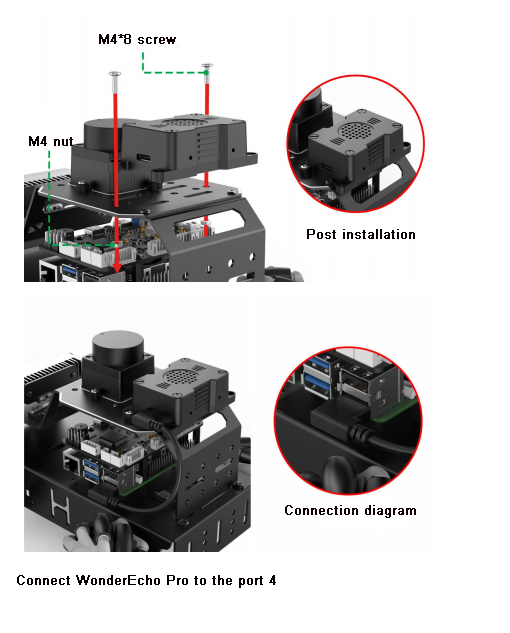

<p id="anchor_14_1_3"></p>

### 14.1.3 Firmware Flashing Method

In this lesson, we will learn how to flash firmware onto the WonderEcho Pro.

*   **Flashing the Firmware**

(1) Begin by connecting the WonderEcho Pro to your computer using a Type-C data cable.


(2) Open the file **"PACK_UPDATE_TOOL.exe"** located in [Appendix->Firmware Flashing Tool](resources_download.md). Select the **"CI1302"** chip and click **"Firmware Upgrade"**.

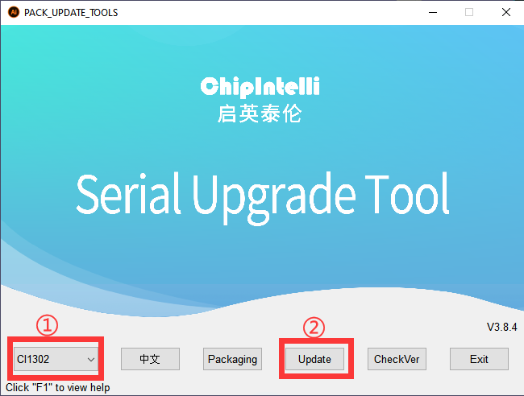

For this example, we will use the **"hello hiwonder firmware"** (Wake word: **"hello hiwonder"**).

(3) Select the firmware by locating the **"hello hiwonder firmware (Wake word: hello hiwonder).bin"** file under the [Appendix](resources_download.md) path.

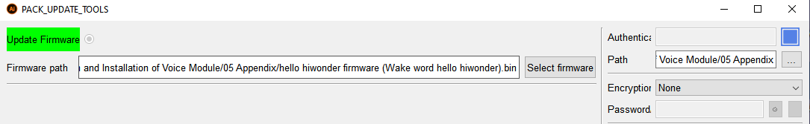

(4) Identify the correct COM port and select it.


(5) Press the RST button on the WonderEcho Pro to initiate the flashing process. Wait for the process to complete successfully.


*   **Testing the Wake Word**

After flashing the firmware, follow the steps in [Appendix->Serial Port Debugging Tool](resources_download.md) to install the serial port debugging tool. Then, follow the steps below to test whether the firmware is functioning correctly.

(1) Connect the WonderEcho Pro to your computer's USB port using a Type-C to USB adapter.


(2) Open the Serial Port Utility, select the connected COM port (including **CH340**), and set the baud rate to `115200`, as shown in the image below.


(3) Say the wake word **"hello hiwonder"** as configured in the firmware settings. The corresponding flag information will appear on the right side (in hexadecimal format), confirming that the wake word was successfully recognized.

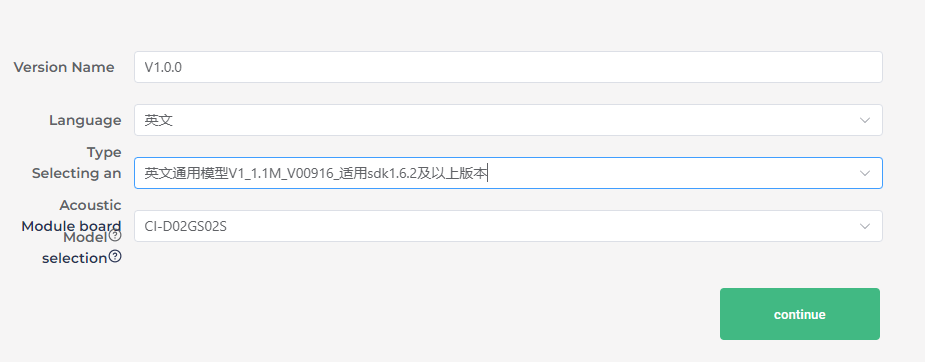


### 14.1.4 WonderEcho Pro Firmware Development

In this lesson, you'll learn how to create and flash firmware for the WonderEcho Pro module.

*   **Firmware Creation and Flashing**

We'll use **"HIWONDER"** as an example to demonstrate the firmware creation process. The same procedure also applies to creating firmware with Chinese wake words. Note: English wake words must be entered in all uppercase letters to function properly.

(1) Open the official firmware creation website: <https://aiplatform.chipintelli.com/home/index.html>; The platform interface is in Chinese. If needed, use your browser's translation feature to switch to English for easier navigation.

(2) First, visit the ChipIntelli Voice AI Platform by clicking on **"Platform Features"** in the top menu, and then select **"In-depth development of Product Firmware & SDK"** under the **Product Development** section.

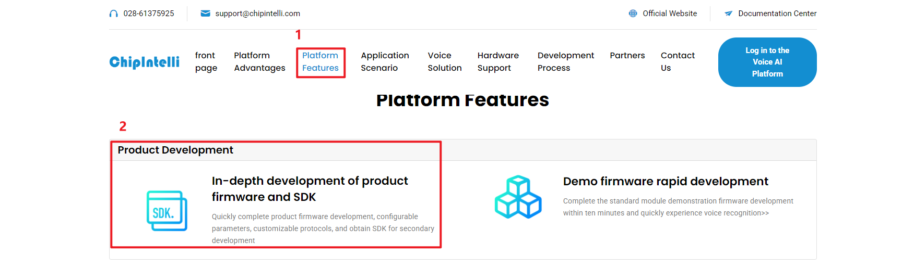

(3) You will be prompted to log in.

:::{Note}
Currently, registration is only available for mainland China mobile numbers. For international users, we provide a shared account:

Username: 18033085495

Password: hiwonder
:::

After successfully logging in, click **"In-depth development of Product Firmware & SDK"** again to access the development section.
    


(4) To create a new product, click the option in the left sidebar. You will be asked to provide a **"Product Name"** and a **"Description"**, both of which can be customized. For the other fields, follow the options shown in the red box. Specifically, choose **Product Type**: **通用** (General) → **智能中控** (Smart Central Control). After completing these steps, click **Create**.


    


    


(5) Next, you will need to set the project language. Since we are configuring for English voice recognition, select English under **Language Type**. If you were configuring for Chinese recognition, you would select Chinese for both **Voice Type** and **Acoustic Model**. Once you've selected the appropriate options, click **Continue** to proceed.


    


(6) In the firmware configuration interface, you will make some important changes to the settings. Start by enabling the **"Echo Cancellation"** feature under **Algorithm Settings**.

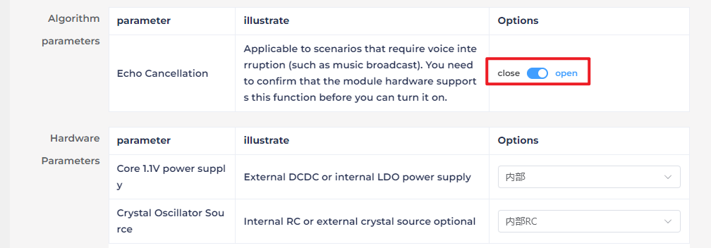

(7) Under **Hardware Settings**, set the oscillator source to **Internal RC** and disable the **Baud Rate Calibration** function.

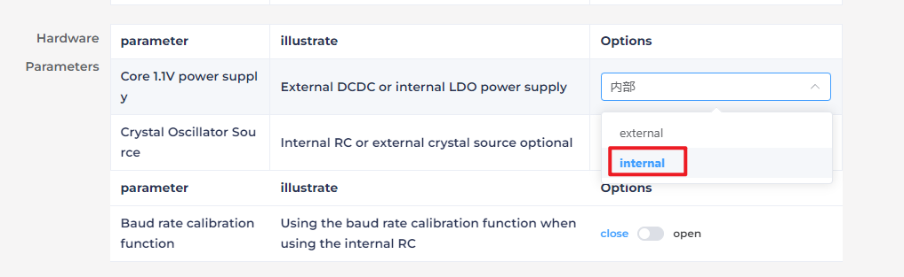


(8) In the **UART Print Settings**, configure UART1 to **Open-Drain Mode**, supporting external 5V pull-up.


(9) For **Communication UART Settings**, set the **Baud Rate** to `115200` and configure UART0 to **Open-Drain Mode**, also supporting external 5V pull-up. After adjusting these settings, click **Continue** to move forward.


(10) The next step involves configuring the command words. You will need to choose a voice output for the wake-up command. For this example, select **"Dane – English Male Voice"** as the output voice. (If you're using Chinese as the language, you may choose the voice option **"Chengcheng – Standard Boy Ver.1"**. The selection between Chinese and English voices is determined by the language settings configured in Step 5.)


    


(11) Next, upload the command word attachment by locating the file named **'(hello hiwonder) Command Word Broadcast Protocol List V3_English Template'** and dragging it directly onto the webpage.

:::{Note}

If you wish to change the wake word, open the spreadsheet and replace the default wake word **HIWONDER** with your preferred word. Keep in mind that the English version of the firmware only supports English wake words, and mixed-language wake words are not allowed. Additionally, English wake words must be written in uppercase letters to function properly.
:::


    


(12) After uploading the file, you will see the command data populated in the table below.

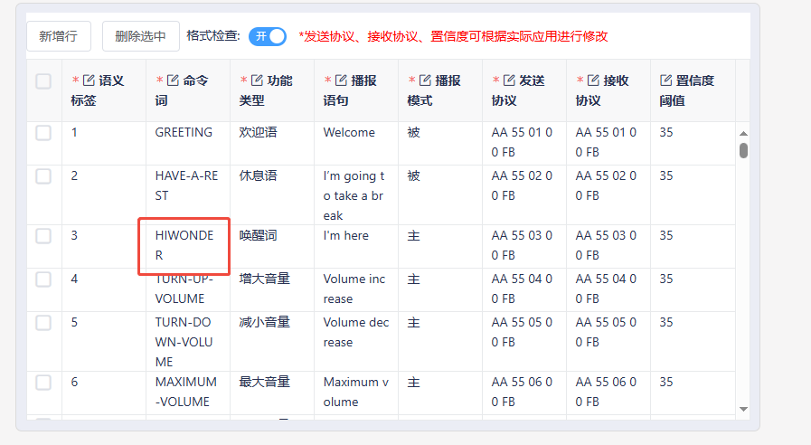

(13) Click **"Submit"** and wait a few minutes for the firmware generation process to complete. Once finished, click **"Download"** to obtain your customized firmware.


    


    


## 14.2 Large Models Basic Courses

### 14.2.1 Large Language Model Courses

* **Overview of Large Language Model**

A Large Language Model (LLM) is an advanced artificial intelligence model developed to comprehend and generate human language.


(1) Basic Concept

A Large Language Model (LLM) is a deep learning model trained on extensive text data, designed to either generate natural language text or comprehend the meaning of language. LLM is capable of performing various natural language tasks, such as text classification, question answering, and dialogue, making them a crucial step toward achieving advanced artificial intelligence. Unlike smaller models, LLM leverages a similar Transformer architecture and pretraining objectives (like Language Modeling), but are distinguished by their larger model size, greater training data, and enhanced computational resources.

(2) Features

**Massive Scale:** LLM are characterized by their vast parameter sizes, often reaching billions or even trillions of parameters. This immense scale allows them to capture a wealth of linguistic knowledge and complex syntactic structures.

**Pretraining and Fine-tuning:** LLM utilize a two-stage learning process: pretraining and fine-tuning. Initially, they are pretrained on large-scale, unlabeled text data, learning general language representations and knowledge. Subsequently, they are fine-tuned using labeled data to specialize in specific tasks, allowing them to excel across a wide range of NLP applications.

**Contextual Awareness:** LLM demonstrate exceptional contextual awareness, with their ability to understand and generate language deeply dependent on preceding text. This enables them to perform exceptionally well in tasks like dialogue, article generation, and contextual comprehension.

**Multilingual Capabilities:** LLM support multiple languages, extending beyond just English. This multilingual proficiency enables them to power cross-lingual and cross-cultural applications, enhancing their versatility and global reach.

**Multimodal Support:** Some LLMs have expanded to handle multimodal data, including text, images, and speech. This capability allows them to understand and generate content across various media types, opening up more diverse application possibilities.

**Emergent Properties:** LLM exhibit remarkable emergent properties, where performance improvements become apparent in large models but are absent in smaller ones. This makes them adept at handling more complex tasks and challenges.

**Cross-domain Applications:** LLM have been widely adopted across numerous fields, including text generation, machine translation, information retrieval, summarization, chatbots, and virtual assistants. Their influence is profound, impacting both daily life and work in significant ways.

**Ethical and Risk Considerations:** While LLM showcase impressive capabilities, they also raise important ethical and risk-related concerns, such as the potential generation of harmful content, privacy violations, and cognitive biases. As such, the development and deployment of LLM must be approached with careful consideration and caution.

(3) Working Principle

Large Language Model (LLM) are built on deep learning principles and are trained using massive datasets and substantial computational resources to develop neural networks with billions of parameters. Through iterative training and parameter optimization, these models learn to perform a wide range of tasks with high accuracy. The "**large**" in LLM reflects their immense scale—encompassing a vast number of parameters, extensive training data, and significant computational demands. This scale enables advanced models to achieve superior generalization capabilities and deliver increasingly accurate results, even in highly specialized domains.

Today, some of the most popular applications revolve around generative AI, such as language generation tools (e.g., ChatGPT) and image generation platforms (e.g., Midjourney). At the core of these applications is the concept of generation—the model's ability to predict and produce coherent content based on a given input.

(4) Application Scenarios

① Text Generation

Large Language Models are capable of generating diverse types of text, including news articles, stories, poems, and more. These capabilities make them well-suited for applications in content creation, creative writing, and automated storytelling.

② Text Classification

Large Language Models can classify text into various categories, such as sentiment analysis and topic identification. These capabilities are especially valuable in scenarios like public opinion analysis, information retrieval, and content moderation.

③  Machine Translation

Large Language Models excel at machine translation, enabling the conversion of text from one language to another. These capabilities are essential for cross-language communication, localization, and global collaboration.

④ Question-Answering Systems

Large Language Models can be used to build question-answering systems that respond to user queries. These applications are particularly valuable in areas such as intelligent customer support, knowledge retrieval, and information lookup.

<p id="anchor_14_2_1_2"></p>

* **Large Language Model Deployment**

:::{Note}

This section outlines the steps to register on the official OpenAI website and obtain the API key for the Large Language Model.

:::

(1) OpenAI Account Registration and Setup

① Copy the following URL: <https://platform.openai.com/docs/overvie>

Open the OpenAI website and click on the "**Sign Up**" button in the top right corner.


② Follow the prompts to register and log in using your Google, Microsoft, or Apple account.


③ Click on the settings icon, then select Billing, followed by Payment Methods, to link your payment method. Recharge your account to purchase tokens.


④ After completing the setup, click on API Keys, then select Create New Secret Key. Follow the prompts to fill in the required information. Once the key is created, make sure to save it for future use.


⑤ With these steps, the large model has been successfully created and deployed. You can now use the API in the upcoming lessons.

(2) OpenRouter Account Registration and Setup

① Copy the following URL: <https://openrouter.ai/>

Open the webpage in your browser and click "**Sign In**". Register using your Google account or another available login option.


② After logging in, click the icon in the top-right corner and select **"Credits"** to link your payment method.


③ To create an API key, go to **"API Keys"**, then click **"Create Key"**. Follow the prompts to complete the process. Once the key is generated, make sure to save it for future use.


④ At this point, the large model is successfully created and deployed. You can now use the API in the upcoming lessons.

<p id="anchor_14_2_1_3"></p>

* **Large Language Model Accessing**

:::{Note}

To proceed with this section, you will need to register on the appropriate website and obtain the API key for the large model (please refer to the file ["**14.2.1 Large Language Model Courses -> Large Language Model Deployment**"](#anchor_14_2_1_2)).

:::

It is important to ensure a stable network connection for the development board. For optimal performance, we also recommend connecting the main controller to a wired network for enhanced stability.


(1) Environment Configuration

:::{Note}

If you have purchased a robot from our company with built-in large model functionality, the environment is already pre-configured in the robot's image. You can directly proceed to Section 3 of this document to configure the API key.

:::

Install Vim and Gedit by running the corresponding commands. Install the necessary software packages and audio libraries required for PyAudio.

```
sudo apt update
```

```
sudo apt install vim
```

```
sudo apt install gedit
```

```
sudo apt install python3 python3-pip python3-all-dev python3-pyaudio portaudio19-dev libsndfile1
```


(2) Importing the Large Model Program Directory

① In this section, locate the '[Appendix -\> Source Code](resources_download.md)' folder within the same directory as this tutorial document.


② Using the MobaXterm remote connection tool (as outlined in the '5.5 Remote Access and File Transfer' tutorial), drag the folder into the root directory of the main controller. The software installation package can be found in the '[Appendix -\> Remote Access and File Transfer](resources_download.md)' directory.


③ Next, execute the command to navigate to the **'speech_pkg' directory**.

```
cd ~/large_models/speech_pkg/
```

④ Execute the following commands to install the necessary third-party libraries.

```
pip3 install -r requirements.txt --break-system-packages
```

```
pip3 install dashscope --break-system-packages
```

```
pip3 install opencv-python --break-system-packages
```

```
pip3 install sympy==1.13.1 --break-system-packages
```

```
pip3 install torch --break-system-packages
```

⑤ Then, use the command in the terminal to navigate to the **'speech'** directory.

```
cd ~/large_models/speech_pkg/speech
```

⑥ Run the command to list the files in the **'speech'** directory.

```
ls
```


⑦ Depending on the type of main controller and Python version you're using, switch to the appropriate folder for packaging and distribution. This tutorial uses the Jetson Orin controller as an example.

| **Type of main controller** | **Python version** |
| --------------------------- | ------------------ |
| jetson_nano                 | 3.6                |
| jetson_orin                 | 3.10               |
| rpi5                        | 3.11               |
| rpi5_docker                 | 3.8                |

⑧ Execute the following command to navigate to the Jetson Orin folder.

```
cd jetson_orin/
```

⑨ Enter the command to copy the 'speech.so' file to the parent directory.

```
cp -r speech.so ..
```

⑩ Enter the command to navigate to the parent directory.

```
cd ../..
```

⑪ Execute the command to package the speech file for the Python environment.

```
pip3 install .
```

⑫ Enter the command to install and update the OpenAI Python library.

```
pip3 install openai -U
```

(3) Key Configuration

① Open the terminal and enter the following command to navigate to the directory for configuring the large model keys:

```
cd ~/large_models
```

② Then, open the configuration file by running:

```
vim config.py
```

③ Once the file is open, configure the OpenAI and OpenRouter keys by filling in the llm_api_key and vllm_api_key parameters, respectively (you can obtain these keys from the '[14.2.1 Large Language Model Courses -> Large Language Model Deployment](#anchor_14_2_1_2)' course).


For instance, copy the key created in Section 1.2 of this chapter and paste it into the appropriate field. To paste the key, place the cursor between the quotation marks, hold the **"Shift"** key, right-click, and select **"Paste"** .

:::{Note}

Do not mix keys from different models, as this may cause the functionality to malfunction

:::


④  After pasting, press the **'Esc'** key, then type the following command and press Enter to save the file:

```
:wq
```

(4) Running the Demo Program

Once the keys are configured, you can run the demo program (openai_llm_demo.py) to experience the text generation capabilities of the large model. For example, the program's prompt might be: 'Write a 50-word article about how technology is changing life.'


① To run the demo, enter the following command in the terminal:

```
python3 openai_llm_demo.py
```

② After running the program, the output will appear as shown in the image below.


* **Semantic Understanding with Large Language Model**

Before starting this section, make sure you have completed the API key configuration outlined in the file [14.2.1 Large Language Model Courses -\> Large Language Model Accessing](#anchor_14_2_1_3).

In this lesson, we'll use a large language model to analyze and summarize short passages of text.

(1) Start by opening a new terminal window, then navigate to the large model project directory:

```
cd large_models/
```

(2) Next, run the demo program with the following command:

```
python3 openai_llm_nlu_demo.py
```

(3) As shown in the output, the model demonstrates strong summarization abilities.


(4) The result matches the prompt defined in the program — where a passage of text is provided to the model, and it generates a concise summary.

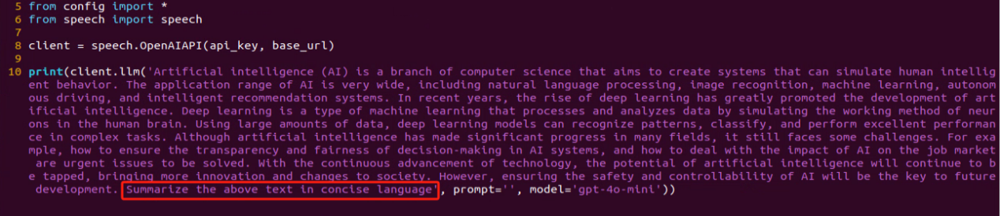

* **Emotional Perception with Large Language Model**

To proceed with this section, ensure that you have completed the API key configuration as described in the file [14.2.1 Language Model Courses -> Large Language Model Accessing](#anchor_14_2_1_3).

In this lesson, we will use a large language model to assess its ability to perceive emotions based on descriptive words. We'll provide the model with emotional expressions and evaluate its response.

(1) Start by opening a new terminal window, then navigate to the large model project directory:

```
cd large_models/
```

(2) Next, run the demo program with the following command:

```
python3 openai_llm_er_demo.py
```

(3) From the output, you will see that the model successfully identifies and understands the emotions conveyed, providing a text-based response accordingly.


(4) In this program, we send two emotional expressions to the model: the first is an expression of sadness, **"So Sad"**. After the model responds, we then send an expression of happiness, "**Ha Ha**", and observe how the model reacts.


### 14.2.2 Large Speech Model Courses

* **Overview of Large Speech Model**

(1) What is a Large Speech Model?

A Speech Large Model (LSM) refers to a machine learning model that uses deep learning techniques to process and understand speech data. These models can be applied in a variety of tasks, such as speech recognition, speech synthesis, speech translation, and emotional analysis of speech. The design and training of these models typically require large amounts of speech data and substantial computational resources, which is why they are referred to as "**large models**".

(2) Why Do We Need Large Speech Model?

With the advancement of artificial intelligence and deep learning, traditional speech processing methods face many limitations. Large models leverage vast amounts of data and deep neural networks to learn and understand the complex features within speech, thereby improving the accuracy and naturalness of speech recognition and generation.

Their advantages include:

① High Accuracy: They maintain a high recognition rate even in noisy environments and with various accents.

② Naturalness: Speech generated by synthesis models is more natural, closely resembling human speech.

③ Versatility: These models support a wide range of languages and tasks, such as multilingual speech recognition, speech-to-text (STT), text-to-speech (TTS), and emotion recognition.

(3) Development of Speech Recognition Technology

Word-Level Speech Recognition: At this stage, speech recognition systems could only recognize individual words

Phrase-Level Speech Recognition: With the expansion of data and advancements in algorithms, speech recognition systems gradually gained the ability to recognize longer phrases, such as "**Please turn on my computer**".

Sentence-Level Speech Recognition: In recent years, with the emergence of AI large models, speech recognition systems have become capable of recognizing entire sentences and understanding their underlying meaning.

(4) Differences Between Large Speech Model and Traditional Speech Processing Technologies

① Processing Methods

Traditional Speech Processing Technologies: These typically rely on manual feature extraction and shallow models, such as Gaussian Mixture Models (GMM) and Hidden Markov Models (HMM), to process speech signals.

Large Speech Model: These use end-to-end learning, directly mapping raw speech waveforms to target outputs (such as text or another speech signal), reducing the reliance on manual feature extraction. They are typically based on deep learning architectures, such as Convolutional Neural Networks (CNN), Recurrent Neural Networks (RNN), and Transformers.

② Model Complexity

Traditional Speech Processing Technologies: These models are relatively simple, with fewer parameters.

Large Speech Model: These models have complex structures and a large number of parameters, enabling them to capture more subtle speech features and contextual information.

③ Recognition Capability

Traditional Speech Processing Technologies: These are highly adaptable to specific scenarios and conditions, but their recognition capability is limited when encountering new, unseen data.

Large Speech Model: Due to their large number of parameters and powerful learning ability, they offer superior recognition capabilities and can adapt to a wider variety of speech data and environments.

④Training Data Requirements

Traditional Speech Processing Technologies: These typically require less data for training, but the data must be highly annotated and of high quality.

Large Speech Model: These require vast amounts of training data to fully learn the complexities of speech, often necessitating large quantities of annotated data or the use of unsupervised/self-supervised learning methods.

(5) Core Technologies of Speech Large Model

① Automatic Speech Recognition (ASR)

ASR is the technology that converts human speech into text. The core steps of a speech recognition system include feature extraction, acoustic modeling, and language modeling.

② Text-to-Speech (TTS)

TTS is the technology that converts text into speech. Common speech synthesis models include the Tacotron series, FastSpeech, and VITS.

③ Speech Enhancement and Noise Reduction

Speech enhancement techniques are used to improve the quality of speech signals, typically for eliminating background noise and echoes. This is crucial for speech recognition applications in noisy environments.

(6) Applications of Speech Large Model

Intelligent Voice Assistants: For instance, Amazon Alexa and Google Home, which engage with users through voice interactions.

Customer Service Chatbots: In the customer service sector, speech large models assist businesses in enhancing service efficiency by swiftly processing customer inquiries through speech recognition technology, enabling 24/7 support.

Healthcare: Helping doctors with medical record-keeping, thus improving work efficiency.

Speech-to-Text: Speech large models excel in converting speech to text, offering accurate recognition and transcription in a variety of contexts. They are widely used in applications such as meeting transcription and subtitle generation.

* **Voice Device Introduction and Testing**

(1) Device Overview

① 6-Microphone Circular Array

Introduction：

The 6-Microphone Circular Array is a high-sensitivity, high signal-to-noise ratio microphone board. It features six analog silicon microphones arranged in a circular pattern. When paired with a main control board, it supports high-performance Acoustic Echo Cancellation (AEC), environmental noise reduction, and factory-level voice pickup from up to 10 meters.


Features and Specifications：

**Operating Voltage:** 3.3V (typical)

**Operating Current:** 0.8mA (typical)

**Operating Temperature:** -20°C (min), 25°C (typical), 70°C (max)

**Operating Humidity:** Up to 95% relative humidity (max)

(1) Recording and Playback Test

The following demonstration uses the Raspberry Pi 5 as an example. The connection and testing steps are also applicable to other compatible devices such as the Jetson series:

① Connection Illustration and Detection


If the main controller is a Raspberry Pi, you can use VNC remote desktop access (refer to the appendix: Remote Access and File Transfer) to log into the Raspberry Pi system. Once connected, check the upper right corner of the desktop for microphone and speaker icons. As shown in the image below, the presence of these icons indicates a successful connection.


If you're using a NVIDIA Jetson device, you can connect via the NoMachine remote access tool. After logging in, check the upper right corner of the system interface for the speaker icon to confirm successful detection.


② Recording Test

Next, open a new terminal window and enter the following command to check the available recording devices. Note that the -l option is a lowercase "**L**". You should see the card number (card) listed—for example, card 0. This is just an example; please refer to your actual query result.

```
arecord -l
```


Then, use the following command to start recording. Replace the red-marked card number (hw:0,0) with the actual number you found in the previous step:

```
arecord -D hw:0,0 -f S16_LE -r 16000 -c 2 test.wav
```

This will create a test.wav audio file in the current directory.

You can record a short 5-second sample, then press Ctrl + C to stop the recording.

③ Playback Test

After the recording is complete, you can check whether the audio file was successfully created by listing the contents of the current directory:

```
ls
```


If test.wav appears in the list, the recording was successful. To play back the recording, use the following command:

```
aplay test.wav
```

* **Voice Wake-Up**

In this lesson, we'll learn how to use a large speech model to activate the voice device by speaking a predefined wake word through a program.

(1) WonderEcho Pro Wake-Up

Device Check：

To proceed, we need to identify the USB device name assigned to the connected WonderEcho Pro or Circular Microphone Array (hereafter referred to as the voice device). Please follow the steps below carefully. 

:::{Note}

Do not connect any other USB devices during this process to avoid confusion.

:::

① First, disconnect the voice device, then open a terminal and run the following command:

```
ll /dev | grep USB
```

② Next, reconnect the voice device to the USB port on your main board and run the same command again:

```
ll /dev | grep USB
```

③ You should now see a newly listed USB port, such as ttyCH341USB1.  

Please take note of this device name—it may vary depending on the main controller being used.


Wake-Up Test：

① To begin, update the port number used in the program by editing the script. You'll also need to uncomment the line for the port you're using and comment out any unused ports.

```
vim wakeup_demo.py
```

Press i to enter edit mode and make the necessary changes as shown below (update the port number accordingly and adjust comments as needed).

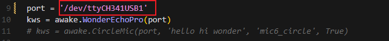

Once the changes are complete, press ESC, then type :wq and press Enter to save and exit the editor.

② Next, return to the system interface and run the wake-up demo using the command below. Speak the wake word **"HELLO HIWONDER"** clearly toward the WonderEcho Pro voice device.  

If the output includes **"keyword detect"**, it indicates that the firmware has been successfully flashed and the wake word is functioning correctly.

```
python3 ~/large_models/wakeup_demo.py
```


(2) 6-Microphone Circular Array

As with the WonderEcho Pro, you can connect the 6-Microphone Circular Array to your main board (Raspberry Pi or NVIDIA Jetson) using a Type-C to USB cable.

Device Check:

For Jetson users, connect to the Jetson system using the NoMachine remote access tool. Once connected, check the desktop interface.  

If the 6-Microphone Circular Array icon appears on the left side of the desktop, it indicates the device has been successfully recognized.

Wake-Up Test:

① Open a new terminal window and run the following command to edit the wakeup_demo.py script:

```
vim ~/large_models/wakeup_demo.py
```

② Press i to enter edit mode.

③ Update the port to match the device port number you previously identified. Comment out the WonderEcho Pro configuration (add \# at the beginning of the corresponding line), and uncomment the line using the circular microphone array on line 11 as the input device (see red box in the referenced image).


④ Press ESC to return to command mode, then type :wq and press Enter to save and exit.


⑤ In the terminal, run the wake-up program with the following command:

```
python3 ~/large_models/wakeup_demo.py
```

⑥ After about 30 seconds of initialization, speak the wake word **"hello hiwonder"** to test the device.


(3) Brief Program Overview

This is a Python-based wake word detection script that utilizes the speech module to process audio input and detect a specific wake word (e.g., "**HELLO_HIWONDER**").

Source Code Path: [/home/ubuntu/large_models/wakeup_demo.py](../_static/source_code/large_models_sdk.zip)

Importing Required Modules

{lineno-start=5}

```
import os
import time
from speech import awake
```

`os`: Used for handling file paths and executing system-level commands.

`time`: Provides delay functions to prevent overly frequent detection attempts.

`speech`: The core module responsible for processing audio input and detecting the wake word.

Initializing the wonderecho Class

{lineno-start=9}

```
port = '/dev/ttyUSB0'
kws = awake.WonderEchoPro(port)
```

Attempts to Turn Off the Cooling Fan on Raspberry Pi 5

{lineno-start=13}

```
try:  # If a fan is present, it's recommended to turn it off before detection to reduce interference(如果有风扇，检测前推荐关掉减少干扰)
    os.system('pinctrl FAN_PWM op dh')
except:
    pass
```

Purpose: Attempts to turn off the cooling fan by executing the system command `pinctrl FAN_PWM op dh`. This helps minimize background noise from the fan that could interfere with wake word detection.

Error Handling: If the command fails (e.g., due to unsupported hardware), the program catches the exception and continues running without interruption.

Main Wake Word Detection Loop

{lineno-start=18}

```
kws.start() # Start detection(开始检测)
print('start...')
```

The program starts the wake word detection thread using kws.start().

It prints start... to indicate that detection has been successfully initiated.

Main Program Logic

{lineno-start=20}

```
while True:
    try:
        if kws.wakeup(): # Wake-up detected(检测到唤醒)
            print('hello hiwonder')
        time.sleep(0.02)
    except KeyboardInterrupt:
        kws.exit() # Cancel processing (关闭处理)
        try:
            os.system('pinctrl FAN_PWM a0')
        except:
            pass
        break
```

During each iteration, the program checks whether the wake word has been detected. If the wake word is detected, it prints keyword detected.

The detection frequency is controlled using time.sleep(0.02) to prevent excessive CPU usage.

Pressing Ctrl+C triggers a KeyboardInterrupt, which gracefully exits the detection loop.

Upon exit, the program calls kws.exit() to stop the wake word detection process.

The fan is then restored to its original state (if applicable).

(4) Extended Functionality

Modifying the Wake-Up Response Text

In this section, you'll learn how to change the message that appears after a successful wake word detection.

① For example, if the wake word "**HELLO_HIWONDER**" is detected, and you'd like the program to print "**hello**" instead of the default message, follow the steps below. Navigate to the large_models directory and open the script with:

```
vim wakeup_demo.py
```

② Press i to enter INSERT mode (you'll see -- INSERT -- at the bottom of the screen). Locate the line '**print('hello hiwonder')**', and modify it to 'print('hello')'

```
i
```


③ Press ESC, then type **:wq** and press Enter to save and exit.

```
:wq
```

④ Finally, run the program with:

```
python3 wakeup_demo.py
```


(5) Creating Custom Firmware for WonderEchoPro

If you'd like to create more advanced or customized wake words and voice commands, please refer to the document titled:  

"[**Appendix →  Firmware Flashing Tool → Creating Firmware for WonderEchoPro**](resources_download.md)".

* **Speech Recognition**

(1) What is Speech Recognition?

Speech Recognition (Speech-to-Text, STT) is a technology that converts human speech signals into text or executable commands. In this course, we will implement speech recognition functionality using Alibaba OpenAI's Speech Recognition API.

(2) How It Works

The wave library is used to extract audio data. The extracted audio is then sent to OpenAI's ASR (Automatic Speech Recognition) model. The recognized text returned by the ASR model is stored in speech_result for use in subsequent processes.

(3) Preparation Before the Experiment

Before proceeding, refer to the course "[**14.1.2 Large Speech Model Courses -> Large Language Models Deployment**](#anchor_14_2_1_2)" to obtain your API key, and make sure to add it into the configuration file (config).

(4) Experiment Steps

① Power on the device and connect to it using MobaXterm.  

(For detailed instructions, please refer to [Appendix ->Remote Connection Tools and Instructions](resources_download.md).)

② Navigate to the program directory by entering the following command:

```
cd large_models/
```

③ Open the configuration file to input your API Key by entering the command below. Press i to enter INSERT mode and enter your API Key. Once finished, press Esc, type :wq, and hit Enter to save and exit.

```
vim config.py
```


④ Run the speech recognition program with:

```
python3 openai_asr_demo.py
```

(5) Function Realization

After the program starts, the microphone will recognize the recorded audio content from the user and print the converted text output.


(6) Brief Program Analysis

This program implements a speech recognition system by calling OpenAI's Speech-to-Text API to convert audio files into text.

The program source code is located at: [/home/ubuntu/large_models/openai_asr_demo.py](../_static/source_code/large_models_sdk.zip)

① Module Import

{lineno-start=6}

```
from speech import speech
```

The speech module encapsulates ASR (Automatic Speech Recognition) functionalities, such as connecting to an external ASR service.

② Define ASR Class

{lineno-start=11}

```
asr = speech.RealTimeOpenAIASR()
```

This line creates a real-time speech recognition object named asr. The RealTimeOpenAIASR class is used to interact with the speech recognition service.

③ Speech Recognition Functionality

{lineno-start=13}

```
asr.update_session(model='whisper-1', language='en', threshold=0.2, prefix_padding_ms=300, silence_duration_ms=800) 
```

An ASR client object is created to prepare for invoking the speech recognition service.

The `asr.asr()` method is called to send the audio file (wav) to the ASR service for recognition.

The recognized result (typically text) is printed to the console.

(7) Function Extension

You can modify the model name to enable speech recognition in various languages, such as Chinese, English, Japanese, and Korean.

① Enter the following command to edit the script:

```
vim openai_asr_demo.py
```

② Press the i key to enter INSERT mode, and update the model setting. For example, modify it to use the gpt-4o-transcribe model.

```
i
```


③ Then, run the program with the command:

```
python3 openai_asr_demo.py
```

④ Record a sample sentence such as "**Hello, can you hear me clearly?**", and the recognized text will be printed on the console.

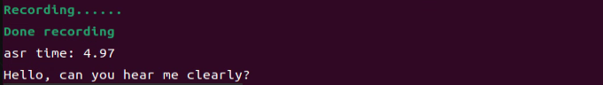

* **Speech Synthesis**

(1) What is Speech Synthesis?

Speech synthesis (SS) is a technology that converts written text into intelligible spoken audio. It enables computers to generate natural, human-like speech for communication or information delivery.

In this course, we will run a program that processes text using a large language model and generates corresponding audio.

(2) How It Works

The program first sends the text to the OpenAI TTS (Text-to-Speech) model. The model returns the generated audio data, which is saved as a file named tts_audio.wav for playback or storage.

(3) Preparation Before the Experiment

Refer to the course "[**14.2.1 Large Language Models Courses -> Large Language Models Deployment**](#anchor_14_2_1_2)" to obtain your API key, and update the configuration file accordingly.

(4) Experiment Steps

① Power on the device and connect to it using MobaXterm "(**refer to the [appendix -> Remote Connection Tools and Instructions](resources_download.md) for detailed guidance**)".

② Navigate to the program directory by entering the following command:

```
cd large_models/
```

③ Open the configuration file to enter your API Key. After editing, press Esc, type :wq, and hit Enter to save and exit:

```
vim config.py
```


④ Finally, run the program with the following command:

```
python3 openai_tts_demo.py
```

(5) Function Realization

Upon running the program, it will play an audio message saying "**Hello, Can I Help You**", and simultaneously save the audio file with the same content to the following directory:  

[/home/ubuntu/large_models/resources/audio/](../_static/source_code/large_models_sdk.zip)

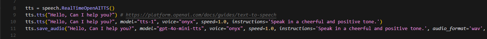

(6) Brief Program Analysis

This program is a speech synthesis system based on OpenAI's Text-to-Speech (TTS) API, capable of converting text into audio files. It supports input text and outputs audio in formats like PCM, WAV, FLAC, AAC, Opus, and MP3. By specifying the desired text, the program sends the request to the API and returns the synthesized audio, which can be played or saved locally.

The source code for this program is located at:  [/home/ubuntu/large_models/openai_tts_demo.py](../_static/source_code/large_models_sdk.zip)

① Module Import

{lineno-start=5}

```
from config import *
from speech import speech  
```

speech: This module encapsulates the TTS functionalities.

② Definition for TTS Class

{lineno-start=8}

```
tts = speech.RealTimeOpenAITTS()
tts.tts("Hello, Can I help you?") # https://platform.openai.com/docs/guides/text-to-speech
tts.tts("Hello, Can I help you?", model="tts-1", voice="onyx", speed=1.0, instructions='Speak in a cheerful and positive tone.')
tts.save_audio("Hello, Can I help you?", model="gpt-4o-mini-tts", voice="onyx", speed=1.0, instructions='Speak in a cheerful and positive tone.', audio_format='wav', save_path="./resources/audio/tts_audio.wav")
```

`speed`: Specifies the playback speed; the default value is 1.

For intelligent real-time applications, it is recommended to use the gpt-4o-mini-tts model. 

Other available models include tts-1 and tts-1-hd. tts-1 offers lower latency but with slightly reduced quality compared to tts-1-hd.

Voice Options: nova, shimmer, echo, onyx, fable, alloy, ash, sage, coral.

For more details, you can refer to the OpenAI documentation:

<https://platform.openai.com/docs/guides/text-to-speech>

③ Function Extension

To change the voice, follow these steps:

Step1 : Open the program by entering the command:

```
vim openai_tts_demo.py
```

Step2 : Press i on your keyboard to enter INSERT mode. Locate the line voice="**onyx**" and modify it to voice="**nova**".

```
i
```


Step3 : Press Esc, then type :wq and hit Enter to save and exit.

```
:wq
```


Step4 : Execute the program with the following command:

```
python3 openai_tts_demo.py
```


Once the program starts, the speaker will play the synthesized audio using the newly selected voice style.

* **Voice Interaction**

(1) What is Voice Interaction?

Voice Interaction (VI) refers to a method of communication between humans and computers or devices through spoken language. It integrates speech recognition and speech synthesis, enabling devices to both understand user commands and respond naturally, creating true two-way voice communication. To achieve natural voice interaction, factors such as semantic understanding and sentiment analysis must also be considered, allowing the system to accurately interpret user intent and provide appropriate responses.

This approach can be used as the foundation for developing our own AI assistant features.

(2) How It Works

First, the wake word detection module listens for a specific wake-up word. Once detected, it initiates audio recording. After recording, Automatic Speech Recognition (ASR) converts the audio into text, which is then sent to a Large Language Model (LLM) to generate an appropriate response. The generated text is subsequently converted into speech through a Text-to-Speech (TTS) module and played back to the user. This entire process enables seamless and natural interaction between the user and the voice assistant.

(3) Experiment Steps

① Power on the device and connect to it via MobaXterm (refer to Appendix "**[Remote Connection Tools and Instructions](resources_download.md)**" for connection guidance).

② To check the microphone's port number, first disconnect the microphone and run the command. Then reconnect the microphone and run the command again to determine the port number (Note: do not connect any other USB devices during this process).

```
ll /dev | grep USB
```

After disconnecting the microphone, no USB device should appear.


Upon reconnecting the microphone, a USB port (e.g., ttyCH341USB1) will be listed (make sure to note this device name). The device name may vary depending on the main controller.

③ Navigate to the program directory:

```
cd large_models/
```

④ Open the configuration file to enter your API Key. After editing, press Esc, then type :wq and hit Enter to save and exit:

```
vim config.py
```


⑤ Enter the port number you obtained and modify the corresponding microphone port settings for either WonderEcho Pro or the six-microphone setup. Uncomment the configuration for the port you intend to use and comment out the settings for any unused ports.

```
vim openai_interaciton_demo.py
```

If you are using the WonderEcho Pro, modify the corresponding section:

If you are using the 6-Microphone Array, modify the relevant section:


⑥ Run the program:

```
python3 openai_interaciton_demo.py
```

⑦ To stop the program at any time, simply press Ctrl+C.

(4) Function Realization

After successful execution, the voice device will announce 'I'm ready.' Then, upon hearing the wake-up word **'HELLO_HIWONDER,'** the device will respond with 'I'm here,' indicating that the assistant has been successfully awakened. You can now ask the AI assistant any questions:

For example: 'What are some fun places to visit in New York?'


(5) Brief Program Analysis

The program integrates voice recognition, speech synthesis, and intelligent response functionalities to create a voice assistant. Interaction is initiated through the wake-up word (HELLO_HIWONDER). Users can converse with the assistant via voice commands, and the assistant will respond using text-to-speech technology. The overall structure is clear, with distinct modules that are easy to expand and maintain.

The source code for this program is located at: [/home/ubuntu/large_models/openai_interaction_demo.py](../_static/source_code/large_models_sdk.zip)

(1) Module Import

{lineno-start=5}

```
import os
import time
from config import *
from speech import awake
from speech import speech
```

time: Used to control the interval between program executions.

speech: The core module, integrating wake-up word detection, speech activity detection, speech recognition, TTS, and LLM.

(2) Definition of Audio File Paths

{lineno-start=11}

```
wakeup_audio_path = './resources/audio/en/wakeup.wav'
start_audio_path = './resources/audio/en/start_audio.wav'
no_voice_audio_path = './resources/audio/en/no_voice.wav'
```

This section configures the audio file paths used by various functional modules, such as wake-up sounds, recording storage paths, and prompt sounds.

The text-to-speech (TTS) module is initialized to convert LLM responses into speech.

(3) Main Functional Logic

{lineno-start=33}

```
def main():
    kws.start()
    while True:
        try:
            if kws.wakeup(): # Wake word detected(检测到唤醒词)
                speech.play_audio(wakeup_audio_path)  # Play wake-up sound(唤醒播放)
                asr_result = asr.asr() # Start voice recognition(开启录音识别)
                print('asr_result:', asr_result)
                if asr_result:
                    # Send the recognition result to the agent for a response(将识别结果传给智能体让他来回答)
                    response = client.llm(asr_result, model='gpt-4o-mini')
                    print('llm response:', response)
                    tts.tts(response)
                else:
                    speech.play_audio(no_voice_audio_path)
            time.sleep(0.02)
        except KeyboardInterrupt:
            kws.exit() 
            try:
                os.system('pinctrl FAN_PWM a0')
            except:
                pass
            break
        except BaseException as e:
            print(e)
```

**Wake-up Detection:** Continuously monitors for the wake-up word. Once detected, it stops the wake-up detection and plays the wake-up prompt sound.

**Voice Processing:** Records and recognizes the user's speech, uses the language model to generate a response, and then converts the response into speech for playback.

**Error Handling:** Catches exit signals and runtime errors to ensure the program exits safely and releases resources.

### 14.2.3 Vision Language Model Courses

* **Overview of Vision Language Model**

Vision Language Model (VLM) integrate visual recognition capabilities into traditional Language Model (LLM), enabling more powerful interactions between vision and language through multimodal inputs.

(1) Basic Concept

Vision Language Model (VLM) are a type of artificial intelligence model that leverages deep learning techniques to learn from and process large-scale visual data. These models often adopt convolutional neural network (CNN) architectures, enabling them to extract rich visual features from images or video streams and perform various tasks such as image classification, object detection, and facial recognition. In theory, VLM possess powerful capabilities in feature extraction and pattern recognition, making them widely applicable in fields like autonomous driving, facial recognition, and medical imaging analysis.

(2) Features

**Multimodal Input and Output**: VLM can process both images and text as input and generate various forms of output, including text, images, charts, and more.

**Powerful Visual-Semantic Understanding**: With extensive knowledge accumulated from large-scale visual datasets, VLMsexcel at tasks such as object detection, classification, and image captioning.

**Visual Question Answering (VQA):** VLM can engage in natural language conversations based on the content of input images, accurately answering vision-related questions.

**Image Generation:** Some advanced VLM are capable of generating simple image content based on given conditions.

**Deep Visual Understanding:** These models can recognize intricate details within images and explain underlying logical and causal relationships.

**Cross-Modal Reasoning:** VLM can leverage visual and linguistic information together, enabling reasoning across modalities, such as inferring from language to vision and vice versa.

**Unified Visual and Language Representation Space:** By applying attention mechanisms, VLM establish deep connections between visual and semantic information, achieving unified multimodal representations.

**Open Knowledge Integration:** VLM can integrate both structured and unstructured knowledge, enhancing their understanding of image content.

(3) How It Works

The working principle of Vision Language Model is primarily based on deep learning techniques, particularly Convolutional Neural Networks (CNNs) and Transformer architectures. Through multiple layers of neurons, these models perform feature extraction and information processing, enabling them to automatically recognize and understand complex patterns within images.

In a VLM, the input image first passes through several convolutional layers, where local features such as edges, textures, and shapes are extracted. Each convolutional layer is typically followed by an activation function (e.g., ReLU) to introduce non-linearity, allowing the model to learn more complex representations. Pooling layers are often used to reduce the dimensionality of the data while preserving important information, helping to optimize computational efficiency.

As the network deepens, it gradually transitions from extracting low-level features (like edges and corners) to higher-level features (such as objects and scenes). For classification tasks, the final feature vector is passed through fully connected layers to predict the probability of different target categories. For tasks like object detection and segmentation, the model outputs bounding boxes or masks to indicate the location and shape of objects within the image.

Transformer-based VLM divide images into small patches, treating them as sequential data, and apply self-attention mechanisms to capture global relationships within the image. This approach is particularly effective at modeling long-range dependencies, enabling VLM to excel at understanding complex visual scenes.

Training VLM typically requires large-scale labeled datasets. Through backpropagation, the model optimizes its parameters to minimize the loss between predictions and ground-truth labels. Pretraining on massive datasets allows the model to acquire general-purpose visual features, while fine-tuning on specific tasks further improves performance for specialized applications.

Thanks to this design, Visual Language Models are able to process and understand visual data effectively, and are widely used in applications like image classification, object detection, and image segmentation, driving rapid progress in the field of computer vision.

(4) Application Scenarios

① Image Captioning

VLM can automatically generate textual descriptions based on input images. This capability is particularly valuable for social media platforms, e-commerce websites, and accessibility technologies, such as providing visual content descriptions for visually impaired users.

② Visual Question Answering

Users can ask questions related to an image, such as "**What is in this picture?**" or "**What color is the car?**" The model analyzes the image content and provides accurate, natural-language responses, making it highly applicable in fields such as education, customer support, and information services.

③ Image Retrieval

In image search engines, users can perform searches using text descriptions, and Vision Language Model (VLM) can understand the descriptions and return relevant images. This capability is especially important on e-commerce platforms, where it allows users to find desired products more intuitively.

④ Augmented Reality (AR)

Vision Language Model (VLM) can provide real-time visual feedback and language-based explanations in augmented reality applications. When users view real-world scenes through a device's camera, the system can overlay relevant information or guidance, enhancing the overall user experience.

⑤ Content Creation and Editing

In design and creative tools, Vision Language Model (VLM) can generate relevant text content or suggestions based on a user's visual input (such as sketches or images), helping users complete creative work more efficiently.

⑥ Social Media Interaction

On social media platforms, VLM can generate appropriate comments or tags based on user-uploaded images, enhancing engagement and interaction.

⑦ Medical Imaging Analysis

In the healthcare field, VLM can be used to analyze medical images (such as X-rays and CT scans) and generate diagnostic reports or recommendations, assisting doctors in making more accurate decisions.

* **Vision Language Model Accessing**

:::{Note}

* This section requires the configuration of the API key in "[**14.2.3 Vision Language Model Accessing -> Vision Language Model Accessing**](#anchor_14_2_1_3)" before proceeding. Additionally, ensure that the images to be used in this section are imported.

* This experiment requires either an Ethernet cable or Wi-Fi connection to ensure the main control device can access the network properly.

  :::

(1) Experiment Steps

Execute the following command to navigate to the directory of Large Model.

```
cd large_models/
```

Run the program:

```
python3 openai_vllm_understand.py
```

(2) Function Realization

After running the program, the output printed matches our request of "**Describe the image**".


* **Vision Language Model: Object Detection**

:::{Note}

* This section requires the configuration of the API key in "[**14.2.3 Vision Language Module Courses -> Vision Language Model Accessing**](#anchor_14_2_1_3)" before proceeding. Additionally, ensure that the images to be used in this section are imported.

* This experiment requires either an Ethernet cable or Wi-Fi connection to ensure the main control device can access the network properly.

* In this course, we will use a program to transmit an image to the large model for recognition, which will then identify and locate the objects within the image by drawing bounding boxes around them.

:::

(1) Experiment Steps

① Execute the following command to navigate to the directory of Large Model.

```
cd large_models/
```

② Run the program:

```
python3 qwen_vllm_detect_demo.py
```

(2) Function Realization

After running the program, the positions of the fruits in the image will be circled.


(3) Function Expansion

We can switch the image and change the large model to experience different functionalities of various models.

Change Pictures:

① Click on the path box to navigate to the following directory: [/home/ubuntu/large_models/resources/pictures/](../_static/source_code/large_models_sdk.zip)

Here, you can drag in other images, for example, in the apples.png format.


② Then, input the command:

```
vim large_models/qwen_vllm_detect_demo.py
```

③ Press the "**i**" key on your keyboard, which will display **"INSERT"** at the bottom.

```
i
```


④ Change the image recognition path from: `./resources/pictures/test_image_understand.jpeg`

To: `image = cv2.imread('./resources/pictures/apples.png')`


⑤ Next, input the following command and execute the program again to see the results

```
python3 qwen_vllm_detect_demo.py
```

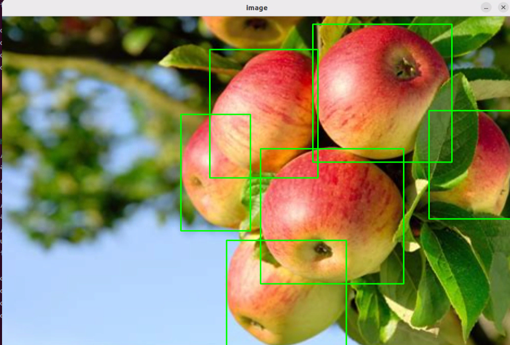

* **Vision Language Model: Scene Understanding**

:::{Note}

* This section requires the configuration of the API key in "[**Vision Language Model Accessing**](#anchor_14_2_1_3)" before proceeding. Additionally, ensure that the images to be used in this section are imported.

* This experiment requires either an Ethernet cable or Wi-Fi connection to ensure the main control device can access the network properly.

* In this course, we will use a program to send an image to the large model for recognition and generate a description of the content within the image.
  :::
  

(1) Experiment Steps

① Execute the following command to navigate to the directory of Large Model.

```
cd large_models/
```

② Run the program:

```
python3 openai_vllm_understand.py
```

(2) Function Realization

After running the program, the output printed matches our request of "**Describe the image**".


(3) Function Expansion

If you need to recognize your own image, you should place the image in the corresponding path and modify the image path in the program.

① First, drag your image directly into the ~/large_models/resources/pictures/ path using MobaXterm, and rename the image to test.png.


② Then, open the scene understanding script by entering the following command in the terminal:

```
vim ~/large_models/vllm_understand.py
```

③ Change the image path in the code to reflect the name of your image (e.g., test.png).


④ Run the program:

```
python3 ~/large_models/openai_vllm_understand.py
```


* **Vision Language Model: Optical Character Recognition** 

:::{Note}

* This section requires the configuration of the API key in "**[Vision Language Model Accessing](#anchor_14_2_1_3)**" before proceeding. Additionally, ensure that the images to be used in this section are imported.

* This experiment requires either an Ethernet cable or Wi-Fi connection to ensure the main control device can access the network properly.

* In this course, we use a program to transmit an image to the large model for recognition, extracting and identifying the text within the image.

:::

(1) Experiment Steps

① Execute the following command to navigate to the directory of Large Model.

```
cd large_models/
```

② Run the program:

```
python3 openai_vllm_ocr.py
```

(2) Function Realization

After running the program, the output printed will be consistent with the content of the image sent.


(3) Function Expansion

We can switch the image and change the large model to experience different functionalities of various models.

Change Pictures：

① Drag the image directly into the `~/large_models/resources/pictures/` path using MobaXterm. Here, we can drag in the image named 'ocr1.png' as an example, and let the program recognize the text 'COME ON'.

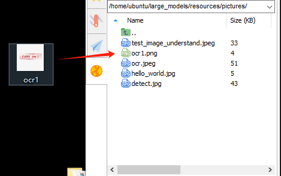


② Then, input the command:

```
vim ~/large_models/openai_vllm_ocr.py
```

③ Press the **"i"** key on your keyboard, which will display **"INSERT"** at the bottom.

```
i
```


④ Change the image recognition path from: ./resources/pictures/ocr.jpeg

To: image = cv2.imread('./resources/pictures/ocr1.png')

```
image = cv2.imread('./resources/pictures/ocr1.png)
```

⑤ Run the program:

```
python3 ~/large_models/openai_vllm_ocr.py
```


### 14.2.4 Multimodal Model Basic Courses

* **Overview of Multimodal Model**

The emergence of Multimodal Model is built upon continuous advancements in the fields of Large Language Model (LLM) and Vision Language Model (VLM).

(1) Basic Concept

As LLM continue to improve in language understanding and reasoning capabilities, techniques such as instruction tuning, in-context learning, and chain-of-thought prompting have become increasingly widespread. However, despite their strong performance on language tasks, LLM still exhibit notable limitations in perceiving and understanding visual information such as images. At the same time, VLM have made significant strides in visual tasks such as image segmentation and object detection, and can now be guided by language instructions to perform these tasks, though their reasoning abilities still require further enhancement.

(2) Features

The core strength of Multimodal Model lies in their ability to understand and manipulate visual content through language instructions. Through pretraining and fine-tuning, these models learn the associations between different modalities—such as how to generate descriptions from images or how to identify and classify objects in visual data. Leveraging self-attention mechanisms from deep learning, Multimodal Model can effectively capture relationships across modalities, allowing them to synthesize information from multiple sources during reasoning and decision-making processes.

**Multimodal Fusion Capability:** Multimodal Model can process and understand multiple types of data simultaneously, including text, images, and audio. This fusion ability enables the models to build connections across modalities, leading to a more comprehensive understanding of information. For instance, a model can generate natural language descriptions based on an image or identify specific objects within an image based on a text query.

**Enhanced Contextual Understanding:** By integrating information from different modalities, Multimodal Model excel at contextual understanding. They can not only recognize content within a single modality but also combine clues from multiple sources to make more accurate judgments and decisions in complex tasks.

**Flexible Interaction Methods:** Users can interact with Multimodal Model through natural language instructions, making communication with the models more intuitive without requiring knowledge of complex programming or operations. For example, users can simply ask about details in an image, and the model can provide relevant answers.

**Scalability:** The architecture and training methods of Multimodal Model allow them to adapt to new modalities and tasks. As technology evolves, additional types of data—such as videos or sensor readings—can be incorporated, expanding their range of applications and capabilities.

**Strong Generative Capabilities:** Similar to large language models, Multimodal Model perform exceptionally well in generating both textual and visual content. They can produce natural language descriptions, summaries, and even create novel visual outputs, meeting a wide variety of application needs.

**Improved Reasoning Abilities:** Although challenges remain, Multimodal Model demonstrate significantly enhanced reasoning capabilities compared to traditional single-modality models. By integrating multimodal information, they can reason effectively in more complex scenarios, supporting advanced tasks such as logical reasoning and sentiment analysis.

**Adaptability and Personalization:** Multimodal Model can be fine-tuned to meet user-specific needs and preferences, enabling highly personalized services. This adaptability offers great potential for applications in fields such as education, entertainment, and customer service.

(3) How It Works

The working principle of Multimodal Model is built upon advanced deep learning and neural network technologies, with a core focus on fusing data from different modalities to understand and tackle complex tasks. At the foundation, Multimodal Model often adopt architectures similar to Transformers, which are highly effective at capturing relationships between different parts of input data. During training, these models are exposed to massive amounts of multimodal data—such as images, text, and audio—and leverage large-scale unsupervised learning for pretraining. Through this process, the models learn the commonalities and differences across modalities, enabling them to grasp the intrinsic connections between various types of information.

In practice, incoming text and visual data are first embedded into a shared representation space. Text inputs are transformed into vectors using word embedding techniques, while images are processed through methods like Convolutional Neural Networks (CNNs) to extract visual features. These vectors are then fed into the model's encoder, where self-attention mechanisms analyze the relationships across modalities, identifying and focusing on the most relevant information.

After encoding, the model generates a multimodal contextual representation that blends both the semantic information of the text and the visual features of the image. When a user provides a natural language instruction, the MLLM parses the input and interprets the intent by leveraging the contextual representation. This process involves reasoning and generation capabilities, allowing the model to produce appropriate responses based on its learned knowledge, or to perform specific actions in visual tasks.

Finally, the Multimodal Model's decoder translates the processed information into outputs that users can easily understand—such as generating textual descriptions or executing targeted visual operations. Throughout this process, the emphasis is on the fusion and interaction of information across different modalities, enabling Multimodal Model to excel at handling complex combinations of natural language and visual content. This integrated working mechanism empowers Multimodal Model with powerful functionality and flexibility across a wide range of application scenarios.

(4) Application Scenarios

① Education

Multimodal Model can be used to create personalized learning experiences. By combining text and visual content, the model can provide students with rich learning materials—for example, explaining scientific concepts through a mix of images and text to enhance understanding. Additionally, in online courses, the model can dynamically adjust content based on the learner's performance, offering customized learning suggestions in real time.

② Healthcare

Multimodal Model can assist doctors in diagnosis and treatment decisions. By analyzing medical images (such as X-rays or MRIs) alongside relevant medical literature, the model helps doctors access information more quickly and provides evidence-based recommendations. This application improves diagnostic accuracy and efficiency.

③ Entertainment

Multimodal Model can be used for content generation, such as automatically creating stories, scripts, or in-game dialogues. By incorporating visual elements, the model can provide rich scene descriptions for game developers, enhancing immersion. Additionally, on social media platforms, Multimodal Model can analyze user-generated images and text to help recommend suitable content.

④ Advertising and Marketing

Multimodal Model can analyze consumer behavior and preferences to generate personalized advertising content. By combining text and images, ads can better capture the attention of target audiences and improve conversion rates.

Finally, Multimodal Model also play a role in scientific research. By processing large volumes of literature and image data, the model can help researchers identify trends, generate hypotheses, or summarize findings, accelerating scientific discovery.

* **Agent Behavior Orchestration**

:::{Note}

* This section requires the configuration of the API key in "[**Vision Language Model Accessing**](#anchor_14_2_1_3)" before proceeding. Additionally, ensure that the images to be used in this section are imported.

* This experiment requires either an Ethernet cable or Wi-Fi connection to ensure the main control device can access the network properly.

* The purpose of this course experiment is to obtain data in a specified format returned by the large model based on the prompt words set in the model. During development, you can use the returned data for further tasks.

:::

(1) Experiment Steps

① To check the microphone's port number, first disconnect the microphone and run the command. Then reconnect the microphone and run the command again to determine the port number (Note: do not connect any other USB devices during this process).

```
ll /dev | grep USB
```

After disconnecting the microphone, no USB device should appear.


Upon reconnecting the microphone, a USB port (e.g., ttyCH341USB1) will be listed (make sure to note this device name). The device name may vary depending on the main controller.

② Execute the following command to navigate to the directory of Large Model.

```
cd large_models/
```

③ Open the configuration file to enter your API Key. After editing, press Esc, then type :wq and hit Enter to save and exit:

```
vim config.py
```


④ Fill in the detected port number and update the corresponding microphone port settings for either the WonderEcho Pro or the Six-channel Microphone.  

Uncomment the port you wish to use and comment out the settings for any unused ports.

```
vim openai_agent_demo.py
```

Modify the settings as follows. For WonderEcho Pro, update the corresponding configuration


For 6-channel Microphone, update the respective settings:


⑤ Run the program:

```
python3 openai_agent_demo.py
```

⑥ The program will print the prompts configured for the large model. The large model will then return data formatted according to these prompts.

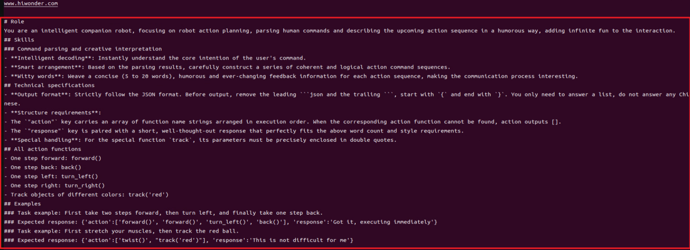

(2) Function Realization

① After running the program, the voice device will announce, **"I'm ready".** At this point, say **"HELLO_HIWONDER"** to the device to activate the agent.  

When the device responds with "**I'm here**", it indicates that the agent has been successfully awakened. To modify the wake word. For the Six-channel Microphone, refer to Section 2.3 Voice Wake-Up – 2. 6-Microphone Circular Array for instructions on customizing the wake word. For WonderEcho Pro, refer to Section "[**Firmware Flashing Tool->WonderEchoPro Firmware Generation**](resources_download.md)".

② After updating the wake word, you can say: **"Take two steps forward, turn left and take one step back"**. The agent will respond according to the format we have defined.


<p id="anchor_14_3"></p>

## 14.3 Multimodal Large Model Applications

### 14.3.1 Obtaining and Configuring the Large Model API Key

* **OpenAI Account Registration and Setup**

(1) Registration

① Visit the following link to access the OpenAI platform : <https://platform.openai.com/docs/overview>


② You can register using your Google, Microsoft, or Apple account as prompted.


③ Once registered, click on the Settings icon, navigate to Billing, and then select Payment Methods to add a payment option. This is required to purchase tokens.


④ After setting up your billing information, go to the API Keys section, click Create New Secret Key, and follow the on-screen instructions. Be sure to save the key for future use.


With these steps completed, you've successfully created and deployed your large model API key, which will be used in the upcoming course sessions.

(2) Deploying the API Key

The configuration file of this program is saved in: [/home/ubuntu/ros2_ws/src/large_models/large_models/large_models/config.py](../_static/source_code/large_models_sdk.zip)

① Use the following command and press Enter to navigate to the directory containing the configuration file:

```
cd /home/ubuntu/ros2_ws/src/large_models/large_models
```

② Enter the following command to open the configuration file and insert the OpenAI key:

```
gedit config.py
```


* **OpenRouter API Configuration**

(1) Visit the following link to access the OpenAI platform: <https://openrouter.ai/>

Click on **"Login"** and use your Google account or another supported account to register or log in.


(2) After logging in, click on the icon in the top-right corner, select **"Credits"** and link your payment method.


(3) To create an API key: Navigate to **"API Keys"** and click **"Create Key".** Then follow the prompts to generate your API key, and make sure to save it for future use.


(4) Use the following command and press Enter to navigate to the directory containing the configuration file:

```
cd /home/ubuntu/ros2_ws/src/large_models/large_models
```

(5) Open the configuration file using the following command, then paste your OpenRouter API key into it:

```
gedit config.py
```

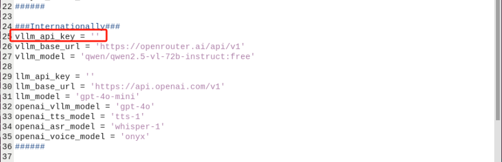

### 14.3.2 Multimodal Large Model: Voice Control

* **Brief Game Instructions**

When the program starts, WonderEcho Pro announces "**I am ready**" and immediately begins monitoring the surrounding environment for sounds.

Say the wake-up word (the wake-up word depends on the firmware flashed, and by default, the wake-up word for our factory firmware is "**Hello, Hiwonder**") to activate WonderEcho Pro. It will respond with "**I am here**".

You can then control the MentorPi car using voice commands—for example, "**Move forward for 2 seconds, then rotate clockwise**". The car converts your spoken commands into text via the large model's API and processes them accordingly. After processing, the large model's response is played back aloud, and the corresponding action is executed.

* **Preparation**

(1) Verifying the WonderEcho Pro Firmware

By default, the wake-up word for the WonderEcho Pro factory firmware is "**Hello, Hiwonder**". If you wish to change the wake-up word to **"MentorPi",** please refer to the tutorial titled "[**14.1.3 Firmware Flashing Method**](#anchor_14_1_3)" for step-by-step instructions.

If you have previously flashed the device with different firmware—such as the version with the wake word "**小幻小幻**" or **"mentorpi"**—you must use the corresponding wake word to activate the device.

For example, if the **"小幻小幻"** firmware was installed, the correct wake word would be "**小幻小幻**"; if the "**mentorpi**" firmware was installed, the wake word would be "**mentorpi**".

In the following tutorial, we will use the default factory wake word **"Hello, HiWonder"** for demonstration purposes.

(2) Obtaining and Configuring the Large Model API Key

By default, the program does not include the configuration of the Large AI Model-related API keys. Before activating features related to the Large AI Model, please refer to the [**14.3.1 Obtaining and Configuring Large Model API Keys**](#anchor_14_3) to configure the necessary keys. This step is mandatory and cannot be skipped, as it is crucial for the proper functioning and experience of the large model features.

(3) Network Configuration

:::{Note}

The large language model used in this lesson is cloud-based. Before starting, please connect the robot to the internet using an Ethernet cable or switch it to local area network (LAN) mode.

:::

The robot must be connected to the internet, either in STA (local network) mode or AP (direct connection) mode via Ethernet. For detailed instructions on network configuration, please refer to the course [**13.Robot Network Configuration>13.1 Network Configuration Instructions**](14.Robot%20Network%20Configuration.md#network-configuration-overview).

* **Starting and Stopping the Game**

:::{Note}

* The input commands must strictly observe case sensitivity and spacing.

* The robot must be connected to the internet, either in STA (local network) mode or AP (direct connection) mode via Ethernet.

:::

(1) Start the robot and follow the instructions in [2. Remote Tool Installation Connection → 2.4 Docker Introduction & Usage](3.set_development_environment.md#vnc-installation-and-connection) to connect via the VNC remote desktop software. Then, switch to the ROS2 environment and select the appropriate language version as needed.

(2) On the Raspberry Pi desktop, double-click  to open the command-line terminal and enter the ROS2 development environment.

(3) Then, input the command to disable the auto-start service:

```
~/.stop_ros.sh
```

(4) Then, input the command to start the game:

```
ros2 launch large_models llm_control_move.launch.py
```

(5) Once the command line outputs the message below and the device announces **"I am ready",** it indicates that the voice device has been initialized. You can now say the wake word, **"hello hi wonder".**


(6) When the following output appears in the command line, WonderEcho Pro will announce **"I am Here",** indicating that WonderEcho Pro has been successfully activated. At this point, the system will begin recording the user's command.

(7) You can freely phrase your commands to control the movement of MentorPi, such as saying, "**Move forward for 2 seconds, then rotate clockwise**".

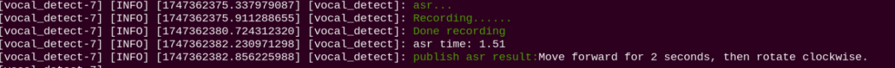

(8) When the command line shows the output below, it indicates that the cloud-based large speech model's speech recognition service has successfully processed the user's command audio. The recognition result will be displayed under **"publish_asr_result".**


(9) When the terminal displays the following output, it means the Raspberry Pi has successfully accessed the cloud-based large language model, processed the user's command, generated a spoken response, and created a corresponding action group based on the command's intent.

At this point, the robot will execute the actions outlined in the **"action"** sequence.

:::{Note}

The response is automatically generated by the large model, ensuring the accuracy of the meaning, though the wording and structure of the reply may vary.

:::

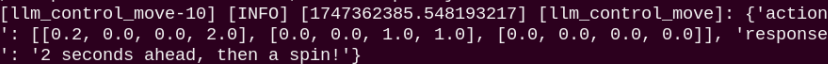

(10) When the following output appears in the terminal, it indicates that the Raspberry Pi has successfully called the cloud-based voice synthesis service. WonderEcho Pro will then play the audio generated from the **"response"** in step 9.

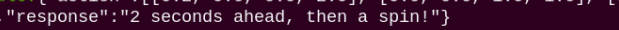

(11) Once this output appears, it means the current round of interaction has concluded. You can then say the wake word again to re-activate WonderEcho Pro and begin a new round of dialogue.

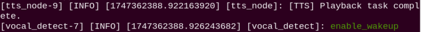

(12) To exit this feature, simply press **"Ctrl+C"** in the terminal. If it doesn't close on the first attempt, you may need to press it multiple times.

* **How It Works**

Once the activity starts, you can freely use voice commands to control the MentorPi car to perform actions such as moving forward or backward, and turning left or right—either individually or in sequence. (For the mecanum wheel version, it can also perform lateral movements as well as clockwise and counterclockwise rotations.)

For the rules governing text responses and action design by the large model, please refer to the prompt settings within the program. Detailed instructions can be found in the PROMPT section of [/home/ubuntu/ros2_ws/src/large_models/large_models/function_call.py](../_static/source_code/large_models_sdk.zip)

The actions available in this mode are predefined within the program library and are limited in number. MentorPi's movements are controlled by calling functions that correspond to action strings designed by the large model. If a command involves an action that is not predefined, the program will be unable to execute it; however, the large model will still recognize the command and provide a response.

* **Brief Program Analysis**

The launch file is saved in: [/home/ubuntu/ros2_ws/src/large_models/launch/llm_control_move.launch.py](../_static/source_code/large_models_sdk.zip)

{lineno-start=10}

```
def launch_setup(context):
    mode = LaunchConfiguration('mode', default=1)
    mode_arg = DeclareLaunchArgument('mode', default_value=mode)


    machine_type = EnvironmentVariable('MACHINE_TYPE', default_value='default_machine')

    log_machine_type = ExecuteProcess(
        cmd=['echo', 'MACHINE_TYPE is set to: ', machine_type],
        shell=True
    )

    controller_package_path = get_package_share_directory('controller')
    large_models_package_path = get_package_share_directory('large_models')

    controller_launch = IncludeLaunchDescription(
        PythonLaunchDescriptionSource(
            os.path.join(controller_package_path, 'launch/controller.launch.py')),
    )

    large_models_launch = IncludeLaunchDescription(
        PythonLaunchDescriptionSource(
            os.path.join(large_models_package_path, 'launch/start.launch.py')),
        launch_arguments={'mode': mode}.items(),
    )
```

**Read the Chassis Type**

Send the corresponding prompt to the large model based on the selected underlying platform.

**Motion Control**

The controller starts the motion control node, which manages the motors, servos, buzzer, and other components on the expansion board.

**Large Model Control Node**

The start command launches the large model control node, enabling functions such as speech detection, semantic understanding, task execution, and response playback.

* **Main Control Program Analysis**

The source code is located at: [/home/ubuntu/ros2_ws/src/large_models/large_models/llm_control_move.py](../_static/source_code/large_models_sdk.zip)

{lineno-start=1}

```
#!/usr/bin/env python3
# encoding: utf-8
# @Author: Aiden
# @Date: 2025/03/06
import time
import rclpy
import threading
import os
import json 
from speech import speech
from rclpy.node import Node
from geometry_msgs.msg import Twist
from std_msgs.msg import String, Bool
from std_srvs.srv import Trigger, SetBool, Empty
from large_models.config import *
from large_models_msgs.srv import SetModel, SetString, SetInt32
from ros_robot_controller_msgs.msg import SetPWMServoState, PWMServoState 

from rclpy.executors import MultiThreadedExecutor
from rclpy.callback_groups import ReentrantCallbackGroup
```

Determine whether the input is in Chinese and if the chassis is a mecanum wheel type.

{lineno-start=22}

```
	if os.environ["ASR_LANGUAGE"] == 'Chinese': 
    if os.environ["MACHINE_TYPE"] == 'MentorPi_Mecanum':
```

(1) Library Files Import

The program imports the following modules and libraries to enable functionalities such as ROS2 node creation, message publishing, service calls, threading, and audio playback:

(2) Creates and initializes the ROS2 node

It initializes the ROS2 environment by calling rclpy.init() and creates a node instance by inheriting from the Node class.

{lineno-start=177}

```
	class LLMControlMove(Node):
    def __init__(self, name):
        rclpy.init()
        super().__init__(name)
```

(3) Initializing Variables

Define the following variables:  

action: list of actions  

llm_result: string containing the response from the large language model  

running: flag indicating the running status  

result: parsed result data

{lineno-start=182}

```
	    self.action = []
        self.llm_result = ''
        self.running = True
        self.interrupt = False
        self.action_finish = False
        self.play_audio_finish = False
```

(4) Publisher and Subscriber Initialization

`tts_text_pub`: This publisher publishes text messages to the tts_node/tts_text topic. Sending text to the speech synthesis module: This allows the robot to provide voice feedback to the user.

`mecanum_pub`： This publisher sends Twist messages to the /controller/cmd_vel topic. The Twist message includes the robot's linear velocities (x, y) and angular velocity (z) to control its movement.

`servo_state_pub`: This publisher sends SetPWMServoState messages to the ros_robot_controller/pwm_servo/set_state topic to control the servo motor states.

`llm_result_callback`: Subscribes to the agent_process/result topic, which contains commands generated by the Large Language Model (LLM).

`play_audio_finish_callback`: Subscribes to the tts_node/play_finish topic, which notifies the program when voice playback is complete.

{lineno-start=189}

```
	    timer_cb_group = ReentrantCallbackGroup()
        self.tts_text_pub = self.create_publisher(String, 'tts_node/tts_text', 1)
        self.create_subscription(String, 'agent_process/result', self.llm_result_callback, 1)
        self.create_subscription(Bool, 'vocal_detect/wakeup', self.wakeup_callback, 1, callback_group=timer_cb_group)
        self.create_subscription(Bool, 'tts_node/play_finish', self.play_audio_finish_callback, 1, callback_group=timer_cb_group)
        self.set_model_client = self.create_client(SetModel, 'agent_process/set_model')
        self.set_model_client.wait_for_service()

        self.awake_client = self.create_client(SetBool, 'vocal_detect/enable_wakeup')
        self.awake_client.wait_for_service()
        self.set_mode_client = self.create_client(SetInt32, 'vocal_detect/set_mode')
        self.set_mode_client.wait_for_service()
        self.set_prompt_client = self.create_client(SetString, 'agent_process/set_prompt')
        self.set_prompt_client.wait_for_service()
        self.mecanum_pub = self.create_publisher(Twist, '/controller/cmd_vel', 1)

        self.timer = self.create_timer(0.0, self.init_process, callback_group=timer_cb_group)
```

(5) Process Action (Process)

Upon receiving a command from the LLM, the script parses the JSON data to identify the action to be performed, such as moving forward or rotating.

{lineno-start=254}

```
	    def process(self):
        machine_type = os.environ.get("MACHINE_TYPE", "")

        while self.running:
            if self.llm_result:
                msg = String()
                if 'action' in self.llm_result:  # f a corresponding action is returned, extract and handle it(如果有对应的行为返回那么就提取处理)
                    result = eval(self.llm_result[self.llm_result.find('{'):self.llm_result.find('}') + 1])
                    self.get_logger().info(str(result))
                    action_list = []
                    if 'action' in result:
                        action_list = result['action']
                    if 'response' in result:
                        response = result['response']
                    msg.data = response
                    self.tts_text_pub.publish(msg)
```

### 14.3.3 Multimodal Large Model: Autonomous Cruise

* **Brief Game Instructions**

Once the program starts running and WonderEcho Pro announces "**I am ready**".

Say the wake-up word (the wake-up word depends on the firmware flashed, and by default, the wake-up word for our factory firmware is "**Hello, HiWonder**") to activate WonderEcho Pro. It will respond with "**I am here**".

You can control MentorPi's line-following function using voice commands, such as "**Go along the black line.**" MentorPi converts the spoken command to text via the large model's ASR API, processes it through the large model, After processing, the large model's TTS system vocalizes the generated response, and the corresponding line-following program is executed.

* **Preparation**

(1) Verifying the WonderEcho Pro Firmware

By default, the wake-up word for the WonderEcho Pro factory firmware is "**Hello, Hiwonder**". If you wish to change the wake-up word to "**MentorPi**", please refer to the tutorial titled "**[Firmware Flashing Method](resources_download.md)**" for step-by-step instructions.

If you have previously flashed the device with different firmware—such as the version with the wake word "**小幻小幻**" or "**mentorpi**"—you must use the corresponding wake word to activate the device.

For example, if the "**小幻小幻**" firmware was installed, the correct wake word would be "**小幻小幻**"; if the "**mentorpi**" firmware was installed, the wake word would be "**mentorpi**".

In the following tutorial, we will use the default factory wake word "**Hello, Hiwonder**" for demonstration purposes.

* **Obtaining and Configuring the Large Model API Key**

By default, the program does not include the configuration of the Large AI Model-related API keys. Before activating features related to the Large AI Model, please refer to the [**14.3.1 Obtaining and Configuring Large Model API Keys**](#anchor_14_3) to configure the necessary keys. This step is mandatory and cannot be skipped, as it is crucial for the proper functioning and experience of the large model features.

* **Network Configuration**

:::{Note}

The large language model used in this lesson is cloud-based. Before starting, please connect the robot to the internet using an Ethernet cable or switch it to local area network (LAN) mode.

:::

The robot must be connected to the internet, either in STA (local network) mode or AP (direct connection) mode via Ethernet. For detailed instructions on network configuration, please refer to the course [**13. Robot Network Configuration->13.1 Network Configuration Instructions**](14.Robot%20Network%20Configuration.md#network-configuration-overview)

* **Starting and Stopping the Game**

:::{Note}

* The input commands must strictly observe case sensitivity and spacing.

* The robot must be connected to the internet, either in STA (local network) mode or AP (direct connection) mode via Ethernet.

:::

(1) Start the robot and follow the instructions in [2. Set Development Environment → 2.4 Docker Introduction & Usage](3.set_development_environment.md#vnc-installation-and-connection) to connect via the VNC remote desktop software. Then, switch to the ROS2 environment and select the appropriate language version as needed.

(2) On the Raspberry Pi desktop, double-click  to open the command-line terminal and enter the ROS2 development environment.

(3) Then, input the command to disable the auto-start service:

```
~/.stop_ros.sh
```

(4) Then, input the command to start the game:

```
ros2 launch large_models llm_visual_patrol.launch.py
```

(5) When the command line shows the output below, initialization is complete. You can then say the wake-up phrase, "**mentorpi**".


(6) When the following output appears in the command line, WonderEcho Pro will announce "**I am Here**", indicating that WonderEcho Pro has been successfully activated. At this point, the system will begin recording the user's command.

(7) You can freely express your commands to control MentorPi's movements—for example, "**Go along the black line**".

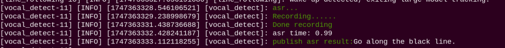

(8) When the command line shows the output below, it indicates that the cloud-based large speech model's speech recognition service has successfully processed the user's command audio. The recognition result will be displayed under "**publish_asr_result**".

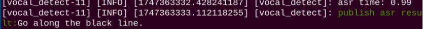

(9) When the command line shows the output below, it indicates that the cloud-based large language model has successfully processed the user's command, thought through the instruction, and provided a verbal response ("**response**"), as well as designed an action that aligns with the user's command meaning.

At this point, the robot sends client requests to the "**Autonomous Cruise**" node to set the color and start the game.

:::{Note}

The response is automatically generated by the large model, ensuring the accuracy of the meaning, though the wording and structure of the reply may vary.

:::

  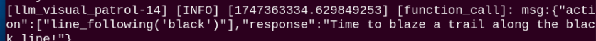

(10) When the following output appears in the terminal, it indicates that the Raspberry Pi has successfully called the cloud-based voice synthesis service. WonderEcho Pro will then play the audio generated from the "**response**" in step 9.

  

:::{Note}

Once the Autonomous Cruise mode is activated, the program will continue running this function. To stop it, press Ctrl+C in the terminal.

:::

(11) When the command line shows the output below, it indicates that one round of interaction has been completed. You can refer to Step 5) to reactivate the voice device using the wake-up word and begin a new round of interaction.

  

(12) To exit this feature, simply press "**Ctrl+C**" in the terminal. If it doesn't close on the first attempt, you may need to press it multiple times.

* **How It Works**

Once the game begins, you can freely give commands like "**Go along the black line**" to control the MentorPi's autonomous line-following. In this mode, the MentorPi will follow the black line. If it fails to detect the black line for more than 5 seconds or if the system is reawakened, the autonomous cruising task will end, and the system will return to the wake-up state.

 For the rules governing text responses and action design by the large model, please refer to the prompt settings within the program. Detailed instructions can be found in the PROMPT section of /home/ubuntu/ros2_ws/src/large_models/large_models/llm_visual_patrol.py

 The actions available in this mode are predefined within the program library and are limited in number. MentorPi's movements are controlled by calling functions that correspond to action strings designed by the large model. If a command involves an action that is not predefined, the program will be unable to execute it; however, the large model will still recognize the command and provide a response.

* **Brief Program Analysis**

  The launch file for this program is located at:

  The launch file is saved in: [/home/ubuntu/ros2_ws/src/large_models/launch/llm_visual_patrol.launch.py](../_static/source_code/large_models_sdk.zip)

  {lineno-start=10}
  
  ```
  def launch_setup(context):
      mode = LaunchConfiguration('mode', default=1)
      mode_arg = DeclareLaunchArgument('mode', default_value=mode)
  
      app_package_path = get_package_share_directory('app')
      large_models_package_path = get_package_share_directory('large_models')
  
      line_following_node_launch = IncludeLaunchDescription(
          PythonLaunchDescriptionSource(
              os.path.join(app_package_path, 'launch/line_following_node.launch.py')),
          launch_arguments={
              'debug': 'true',
          }.items(),
      )
  
      large_models_launch = IncludeLaunchDescription(
          PythonLaunchDescriptionSource(
              os.path.join(large_models_package_path, 'launch/start.launch.py')),
          launch_arguments={'mode': mode}.items(),
      )
  
      llm_visual_patrol_node = Node(
          package='large_models',
          executable='llm_visual_patrol',
          output='screen',
      )
  ```

(1) Line Following Control

The line_following_node launches the line-following module.

(2) Large Model Control Node

The start command launches the large model control node, enabling functions such as speech detection, semantic understanding, task execution, and response playback.

* **Main Control Program Analysis**

  The source code is located at: [/home/ubuntu/ros2_ws/src/large_models/large_models/llm_visual_patrol.py](../_static/source_code/large_models_sdk.zip)

  {lineno-start=6}
  
  ```
  import re
  import time
  import math
  import rclpy
  import ast
  import threading
  from speech import speech
  from rclpy.node import Node
  from large_models.config import *
  from geometry_msgs.msg import Twist
  
  from std_msgs.msg import String, Bool
  from std_srvs.srv import Trigger, SetBool, Empty
  from rclpy.executors import MultiThreadedExecutor
  from rclpy.callback_groups import ReentrantCallbackGroup
  
  from large_models_msgs.srv import SetModel,SetString
  from ros_robot_controller_msgs.msg import RGBState,RGBStates, SetPWMServoState, PWMServoState
  ```

(1) Library Files Import

The program imports the following modules and libraries to enable functionalities such as ROS2 node creation, message publishing, service calls, threading, and audio playback:

(2) Creates and initializes the ROS2 node

It initializes the ROS2 environment by calling rclpy.init() and creates a node instance by inheriting from the Node class.

{lineno-start=77}

```
	class FunctionCall(Node):
    def __init__(self, name):
        rclpy.init()
        super().__init__(name)
```

(3) Initializing Variables

Define the following variables:  

`action`: list of actions  

`llm_result`: string containing the response from the large language model  

`running`: flag indicating the running status  

`result`: parsed result data

{lineno-start=83}

```
	    self.action = []
        self.interrupt = False
        self.llm_result = ''
        self.running = True
        self.result = ''
```

(4) Publisher and Subscriber Initialization

`tts_text_pub`: This publisher publishes text messages to the tts_node/tts_text topic. Sending text to the speech synthesis module: This allows the robot to provide voice feedback to the user.

`mecanum_pub`： This publisher sends Twist messages to the /controller/cmd_vel topic. The Twist message includes the robot's linear velocities (x, y) and angular velocity (z) to control its movement.

`llm_result_callback`: Subscribes to the agent_process/result topic, which contains commands generated by the Large Language Model (LLM).

`play_audio_finish_callback`: Subscribes to the tts_node/play_finish topic, which notifies the program when voice playback is complete.

{lineno-start=92}

```
	    self.mecanum_pub = self.create_publisher(Twist, '/controller/cmd_vel', 1)
        self.sonar_rgb_pub = self.create_publisher(RGBStates, 'sonar_controller/set_rgb', 10)   
        self.rgb_pub = self.create_publisher(RGBStates, 'ros_robot_controller/set_rgb', 10)    
        
        timer_cb_group = ReentrantCallbackGroup()
        self.tts_text_pub = self.create_publisher(String, 'tts_node/tts_text', 1)           
        self.awake_client = self.create_client(SetBool, 'vocal_detect/enable_wakeup')
        self.create_subscription(String, 'agent_process/result', self.llm_result_callback, 1)      
        self.create_subscription(Bool, 'tts_node/play_finish', self.play_audio_finish_callback, 1, callback_group=timer_cb_group)
```

(5) Determine whether the input is in Chinese

{lineno-start=25}

```
	if os.environ["ASR_LANGUAGE"] == 'Chinese':
    PROMPT = '''
```

(6) Send Prompt

The PROMPT variable defines the prompt sent to the LLM. The LLM parses user input and generates JSON-formatted output containing actions and responses.

{lineno-start=55}

```
# Role
You are an intelligent vision Mecanum wheel car that needs to generate corresponding JSON instructions based on input commands.

## Requirements and Constraints
1. Based on the input action description, find the corresponding command in the action function library and output the matching instruction.
2. Craft a concise (10-30 words), witty and varied feedback message for each action sequence to make the interaction more engaging.
3. Output only the JSON result directly - no analysis or extra content.
4. Format: {'action':['xx', "xx"], 'response':'xx'}

## Structure Requirements:
- The `"action"` key contains an array of function name strings in execution order. Output [] when no matching action is found.
- The `"response"` key contains a carefully crafted short reply that perfectly matches the word count and style requirements.


### Task Examples:
Input: Follow the black line forward...
Output: {"action":["line_following('black')"],"response":"Tracking black line, smooth sailing ahead!"}

Input: Follow the red line at your feet, march forward bravely.
Output: {"action":["line_following('red')"], "response":"Red line tracking activated, walking the red carpet like a star!"}
'''
```

(7) init_process Method

① Sets the LLM prompt (PROMPT) and stops the mecanum wheeled robot. Play the Startup Audio. Launches a new thread to run the process method. Creates a ROS 2 service ~/init_finish to signal node initialization completion.

② Iterates through the action list, invoking corresponding ROS 2 services based on each action type.

③ For the **"line_following"** action, extracts color information and calls the related service to start line tracking.

④ After completing all actions, resets the interrupt flag, clears the llm_result variable, and re-enables voice wake-up.

{lineno-start=131}

```
    def init_process(self):
        self.timer.cancel()
        msg = SetString.Request()
        msg.data = PROMPT
        self.set_prompt_client.call_async(msg)
        #self.send_request(self.set_prompt_client, msg)

        self.mecanum_pub.publish(Twist())     
        speech.play_audio(start_audio_path)  
        threading.Thread(target=self.process, daemon=True).start()
        self.create_service(Trigger, '~/init_finish', self.get_node_state)       
        self.get_logger().info('\033[1;32m%s\033[0m' % 'start')  
```

(8) Main Function

Main Function Execution

{lineno-start=237}

```
	def main():
    node = FunctionCall('function_call')
    try:
        rclpy.spin(node)
    except KeyboardInterrupt:
        print('shutdown')
    finally:
        rclpy.shutdown() 

if __name__ == "__main__":
    main()
```

* **Large Model Line-Following Logic Analysis**

(1) Large Model Interaction Logic Analysis

The configuration file of this program is saved in: [/home/ubuntu/ros2_ws/src/app/app/line_following.py](../_static/source_code/app.zip)

Used to receive target color information from the large model. The large model sends the target color name to this node by calling the ~/set_large_model_target_color service.

{lineno-start=291}

```
    def set_target_color_srv_callback(self, request, response):
        self.get_logger().info('\033[1;32m%s\033[0m' % "set_target_color")
        with self.lock:
            x, y = request.data.x, request.data.y
            self.follower = None
            if x == -1 and y == -1:
                self.color_picker = None
            else:
                self.color_picker = ColorPicker(request.data, 5)
                self.mecanum_pub.publish(Twist())
        response.success = True
        response.message = "set_target_color"
        return response

```

(2) Image_callback Callback Function

① Target Loss Detection When deflection_angle is None, it means the target line is not detected. The follower.lost_target_count counter is incremented. If large_model_tracking is True and the lost count exceeds a predefined threshold, the target is considered lost, triggering a timer to stop the robot after a delay.

② Target Reacquisition Detection When deflection_angle is not None, the target line has been reacquired. The follower.lost_target_count counter is reset, and any active target loss timer is canceled.

③ Motion Control Robot movement is adjusted based on the PID controller output only when deflection_angle is valid, is_running is True, and no obstacles are detected.

(3) Automatic Stop Mechanism

① The start_stop_timer method creates a timer that calls the stop_after_lose method after 5 seconds.

② The stop_after_lose method stops the robot's movement and sets the is_running flag to False, thereby stopping the line-following process.

{lineno-start=480}

```
    def start_stop_timer(self):
        """启动5秒停止计时器"""
        if self.target_lost_timer is None:
            self.target_lost_timer = threading.Timer(5.0, self.stop_after_lose)
            self.target_lost_timer.start()
            self.target_lost = True
            self.get_logger().warn("5秒计时器已启动")

    def stop_after_lose(self):
        """Handling after target is lost for more than 5 seconds(目标丢失超过5秒后的处理)s"""
        with self.lock:
            if self.large_model_tracking:
                self.get_logger().warn("目标丢失超过5秒，停止移动")
                self.mecanum_pub.publish(Twist())
                self.is_running = False
                self.target_lost_timer = None
                self.target_lost = False
```

(4) Wake-up Stop

Upon detecting a voice wake-up signal, the robot will stop only if large_model_tracking is set to True. This ensures that the stop command triggered by the voice wake-up signal is executed solely when line-following is active under the large model's control.

{lineno-start=499}

```
    def wakeup_callback(self, msg):
        """Callback function for the /vocal_detect/wakeup topic."""
        if msg.data:
            self.get_logger().info("Wake-up detected, exiting large model tracking.")
            with self.lock:
                if self.large_model_tracking:
                    self.large_model_tracking = False
                    self.is_running = False
                    self.mecanum_pub.publish(Twist())  # Stop the robot
                    if self.target_lost_timer is not None:
                        self.target_lost_timer.cancel()
                        self.target_lost_timer = None
                    self.follower = None  
                    self.get_logger().info("Large model tracking stopped.")
```

### 14.3.4 Multimodal Large Model: Color Tracking

* **Brief Game Instructions**

When the program starts, WonderEcho Pro announces "**I am ready"** and immediately begins monitoring the surrounding environment for sounds.

Say the wake-up word (the wake-up word depends on the firmware flashed, and by default, the wake-up word for our factory firmware is "**Hello, HiWonder**") to activate WonderEcho Pro. It will respond with "**I am here**".

You can control MentorPi's color tracking function using voice commands, such as "**Track the red blocks**". MentorPi converts the spoken command to text via the large model's ASR API, processes it through the large model, After processing, the large model's API system vocalizes the generated response, and the corresponding line-following program is executed.

* **Preparation**

(1) Verifying the WonderEcho Pro Firmware

By default, the wake-up word for the WonderEcho Pro factory firmware is **"Hello, Hiwonder".** If you wish to change the wake-up word to "**MentorPi**", please refer to the tutorial titled **[14.1.3 Firmware Flashing Method](#anchor_14_1_3)** for step-by-step instructions.

If you have previously flashed the device with different firmware—such as the version with the wake word "**小幻小幻**" or **"mentorpi"**—you must use the corresponding wake word to activate the device.

For example, if the **"小幻小幻"** firmware was installed, the correct wake word would be **"小幻小幻"**; if the **"mentorpi"** firmware was installed, the wake word would be "**mentorpi**".

In the following tutorial, we will use the default factory wake word **"Hello, HiWonder"** for demonstration purposes.

(2) Obtaining and Configuring the Large Model API Key

By default, the program does not include the configuration of the Large AI Model-related API keys. Before activating features related to the Large AI Model, please refer to the section [**14.3.1 Obtaining and Configuring Large Model API Keys**](#anchor_14_3) to configure the necessary keys. This step is mandatory and cannot be skipped, as it is crucial for the proper functioning and experience of the large model features.

(3) Network Configuration

:::{Note}

The large language model used in this lesson is cloud-based. Before starting, please connect the robot to the internet using an Ethernet cable or switch it to local area network (LAN) mode.

:::

The robot must be connected to the internet, either in STA (local network) mode or AP (direct connection) mode via Ethernet. For detailed instructions on network configuration, please refer to the course [**13. Robot Network Configuration-> 13.1 Network Configuration Instructions**](14.Robot%20Network%20Configuration.md#network-configuration-overview).

* **Starting and Stopping the Game**

:::{Note}

* The input commands must strictly observe case sensitivity and spacing.

* The robot must be connected to the internet, either in STA (local network) mode or AP (direct connection) mode via Ethernet.

:::

(1) Start the robot and follow the instructions in [**2.Remote Tool Installation Connection → 2.4 Docker Container Introduction and Entry**](3.set_development_environment.md#vnc-installation-and-connection) to connect via the VNC remote desktop software. Then, switch to the ROS2 environment and select the appropriate language version as needed.

(2) Power on the robot and remotely connect to the Raspberry Pi desktop via VNC.

(3) On the Raspberry Pi desktop, double-click  to open the command-line terminal and enter the ROS2 development environment.

(4) Then, input the command to disable the auto-start service:

```
~/.stop_ros.sh
```

(5) Then, input the command to start the game:

```
ros2 launch large_models llm_color_track.launch.py
```

(6) When the command line shows the output below, initialization is complete. You can then say the wake-up phrase, **"mentorpi".**


(7) When the following output appears in the command line, WonderEcho Pro will announce "**I am Here**", indicating that WonderEcho Pro has been successfully activated. At this point, the system will begin recording the user's command.

(8) You can freely phrase your commands to control the movement of MentorPi, such as saying, "**Track the red blocks**".


(9) When the command line shows the output below, it indicates that the cloud-based large speech model's speech recognition service has successfully processed the user's command audio. The recognition result will be displayed under **"publish_asr_result".**


(10) When the command line shows the output below, it indicates that the cloud-based large language model has successfully processed the user's command, thought through the instruction, and provided a verbal response ("**response**"), as well as designed an action that aligns with the user's command meaning.

At this stage, the robot sends a client request to the **"Color Tracking"** node to set the target color and initiate the tracking mode.

:::{Note}

The response is automatically generated by the large model, ensuring the accuracy of the meaning, though the wording and structure of the reply may vary.

:::

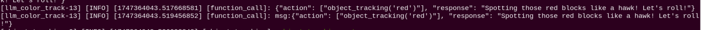

(11) When the following output appears in the terminal, it indicates that the Raspberry Pi has successfully called the cloud-based voice synthesis service. WonderEcho Pro will then play the audio generated from the **"response"** in step 9.


:::{Note}

Once the Color Tracking mode is activated, the program will continue running this function. To stop it, press Ctrl+C in the terminal.

:::

(12) When the command line shows the output below, it indicates that one round of interaction has been completed. You can refer to Step (5) to reactivate the voice device using the wake-up word and begin a new round of interaction.


(13) To exit this feature, simply press **"Ctrl+C"** in the terminal. If it doesn't close on the first attempt, you may need to press it multiple times.

* **How It Works**

After the mode is activated, you can freely give voice commands such as **"Track the red blocks"** to control MentorPi's autonomous tracking. In this mode, MentorPi will follow the red color blocks.  

If the red blocks are not detected for more than 5 seconds or the system is reawakened, the color tracking task will exit and return to the wake-up state.

For the rules governing text responses and action design by the large model, please refer to the prompt settings within the program. Detailed instructions can be found in the PROMPT section of /home/ubuntu/ros2_ws/src/large_models/large_models/function_call.py

The actions available in this mode are predefined within the program library and are limited in number. MentorPi's movements are controlled by calling functions that correspond to action strings designed by the large model. If a command involves an action that is not predefined, the program will be unable to execute it; however, the large model will still recognize the command and provide a response.

* **Brief Program Analysis**

The launch file for this program is located at:

The launch file is saved in: [/home/ubuntu/ros2_ws/src/large_models/launch/llm_color_track.launch.py](../_static/source_code/large_models_sdk.zip)

{lineno-start=10}

```
def launch_setup(context):
    mode = LaunchConfiguration('mode', default=1)
    mode_arg = DeclareLaunchArgument('mode', default_value=mode)

    app_package_path = get_package_share_directory('app')
    large_models_package_path = get_package_share_directory('large_models')

    object_tracking_node_launch = IncludeLaunchDescription(
        PythonLaunchDescriptionSource(
            os.path.join(app_package_path, 'launch/object_tracking_node.launch.py')),
        launch_arguments={
            'debug': 'true',
        }.items(),
    )

    large_models_launch = IncludeLaunchDescription(
        PythonLaunchDescriptionSource(
            os.path.join(large_models_package_path, 'launch/start.launch.py')),
        launch_arguments={'mode': mode}.items(),
    )

    llm_color_track_node = Node(
        package='large_models',
        executable='llm_color_track',
        output='screen',
    )
```

(1) Color Tracking Control

The object_tracking_node is responsible for managing object color tracking.

(2) Large Model Control Node

The start command launches the large model control node, enabling functions such as speech detection, semantic understanding, task execution, and response playback.

Response Playback

* **Main Control Program Analysis**

The source code is located at: [/home/ubuntu/ros2_ws/src/large_models/large_models/llm_color_track.py](../_static/source_code/large_models_sdk.zip)

{lineno-start=6}

```
import re
import time
import math
import rclpy
import ast
import threading
from speech import speech
from rclpy.node import Node
from large_models.config import *
from geometry_msgs.msg import Twist

from std_msgs.msg import String, Bool
from std_srvs.srv import Trigger, SetBool, Empty
from rclpy.executors import MultiThreadedExecutor
from rclpy.callback_groups import ReentrantCallbackGroup

from large_models_msgs.srv import SetModel,SetString
from ros_robot_controller_msgs.msg import RGBState,RGBStates, SetPWMServoState, PWMServoState
```

(1) Library Files Import

The program imports the following modules and libraries to enable functionalities such as ROS2 node creation, message publishing, service calls, threading, and audio playback:

(2) Creates and initializes the ROS2 node

It initializes the ROS2 environment by calling rclpy.init() and creates a node instance by inheriting from the Node class.

{lineno-start=77}

```
	class FunctionCall(Node):
    def __init__(self, name):
        rclpy.init()
        super().__init__(name)
```

(3) Initializing Variables

Define the following variables:  

`action`: list of actions  

`llm_result`: string containing the response from the large language model  

`running`: flag indicating the running status  

`result`: parsed result data

{lineno-start=83}

```
	    self.action = []
        self.interrupt = False
        self.llm_result = ''
        self.running = True
        self.result = ''
```

(4) Publisher and Subscriber Initialization

`tts_text_pub`: This publisher publishes text messages to the tts_node/tts_text topic. Sending text to the speech synthesis module: This allows the robot to provide voice feedback to the user.

`mecanum_pub`： This publisher sends Twist messages to the /controller/cmd_vel topic. The Twist message includes the robot's linear velocities (x, y) and angular velocity (z) to control its movement.

`llm_result_callback`: Subscribes to the agent_process/result topic, which contains commands generated by the Large Language Model (LLM).

`play_audio_finish_callback`: Subscribes to the tts_node/play_finish topic, which notifies the program when voice playback is complete.

{lineno-start=91}

```
	    self.mecanum_pub = self.create_publisher(Twist, '/controller/cmd_vel', 1)
        
        timer_cb_group = ReentrantCallbackGroup()
        self.tts_text_pub = self.create_publisher(String, 'tts_node/tts_text', 1)           
        self.awake_client = self.create_client(SetBool, 'vocal_detect/enable_wakeup')
        self.create_subscription(String, 'agent_process/result', self.llm_result_callback, 1)      
        self.create_subscription(Bool, 'tts_node/play_finish', self.play_audio_finish_callback, 1, callback_group=timer_cb_group)
        
        self.awake_client = self.create_client(SetBool, 'vocal_detect/enable_wakeup')
        self.awake_client.wait_for_service()
        self.create_subscription(Bool, 'vocal_detect/wakeup', self.wakeup_callback, 1)
        self.set_model_client = self.create_client(SetModel, 'agent_process/set_model')
        self.set_model_client.wait_for_service()

        self.set_prompt_client = self.create_client(SetString, 'agent_process/set_prompt')
        self.set_prompt_client.wait_for_service()
```

(5) Determine whether the input is in Chinese

{lineno-start=25}

```
	if os.environ["ASR_LANGUAGE"] == 'Chinese':
    PROMPT = '''
```

(6) Send Prompt

The PROMPT variable defines the prompt sent to the LLM. The LLM parses user input and generates JSON-formatted output containing actions and responses.

{lineno-start=50}

```
	else:
    PROMPT = '''
# Role
You are an intelligent visual omni-directional wheeled robot that needs to generate corresponding JSON commands based on the input content.

## Requirements and Limitations
1. Based on the input action content, find the corresponding command in the action function library and output the corresponding command.
2. Craft a concise (10 to 30 words), witty, and ever-changing feedback message to make the interaction lively and interesting.
3. Directly output the JSON result without analysis or any additional content.
4. Format: {'action': ['xx', 'xx'], 'response': 'xx'}

## Structure Requirements:
- The `"action"` key should contain an array of function name strings in the order of execution. If no corresponding action function is found, the action should output an empty array `[]`.
- The `"response"` key should be paired with a carefully crafted brief reply that fits the above word count and style requirements.

## Action Function Library
- Track a red object: object_tracking('red')

### Task Examples:
Input: Track a red object
Output: {"action": ["object_tracking('red')"], "response": "Locking onto the red target, tracking with ease!"}
Input: Track the color of leaves
Output: {"action": ["object_tracking('green')"], "response": "Locking onto the green target, tracking with ease!"}
Input: Track the color of the ocean
Output: {"action": ["object_tracking('blue')"], "response": "Locking onto the blue target, tracking with ease!"}
```

(7) init_process Method

Sets the LLM prompt (PROMPT) and stops the mecanum wheeled robot. Play the Startup Audio. Launches a new thread to run the process method. Creates a ROS 2 service ~/init_finish to signal node initialization completion.

Iterates through the action list, invoking corresponding ROS 2 services based on each action type.

For the `line_following` action, extracts color information and calls the related service to start line tracking.

After completing all actions, resets the interrupt flag, clears the llm_result variable, and re-enables voice wake-up.

{lineno-start=131}

```
	    def init_process(self):
        self.timer.cancel()
        msg = SetString.Request()
        msg.data = PROMPT
        self.set_prompt_client.call_async(msg)
        #self.send_request(self.set_prompt_client, msg)
        self.mecanum_pub.publish(Twist())     
        speech.play_audio(start_audio_path)  
        
        threading.Thread(target=self.process, daemon=True).start()
        
        self.create_service(Trigger, '~/init_finish', self.get_node_state)       
        self.get_logger().info('\033[1;32m%s\033[0m' % 'start')  
```

* **Main Function**

Main Function Execution

{lineno-start=238}

```
	def main():
    node = FunctionCall('function_call')
    try:
        rclpy.spin(node)
    except KeyboardInterrupt:
        print('shutdown')
    finally:
        rclpy.shutdown() 

if __name__ == "__main__":
    main()
```

* **Large Model object-tracking Logic Analysis**

(1) Large Model Interaction Logic Analysis

The configuration file of this program is saved in: [/home/ubuntu/ros2_ws/src/app/app/object_tracking.py](../_static/source_code/app.zip)

Function: Used to receive target color information from the large model. The large model sends the target color name to this node by calling the ~/set_large_model_target_color service.

{lineno-start=355}

```
    def set_large_model_target_color_srv_callback(self, request, response):
        self.get_logger().info('\033[1;32m%s\033[0m' % "set_large_model_target_color")
        with self.lock:
            color_name = request.data
            self.get_logger().info(f"请求的颜色名称: {color_name}")

            self.tracker = None  # Reset the tracker
            self.large_model_tracking = True  
            self.target_lost = False  
            if self.target_lost_timer is not None:
                self.target_lost_timer.cancel()
                self.target_lost_timer = None

            try:
                # 确定使用哪个相机类型：如果当前相机类型是 'ascamera'，则使用 'Stereo'，否则使用 'Mono'
                camera_type = 'Stereo' if self.camera_type == 'ascamera' else 'Mono'
                # 将相机类型传递给 ObjectTracker 类
                self.tracker = ObjectTracker(None, self, color_name, True)
                try:
                    temp = self.tracker.lab_data['lab'][camera_type][color_name]
                    self.get_logger().info(f"成功读取 颜色配置: self.lab_data['lab'][{camera_type}][{color_name}]")
                except KeyError as e:
                    self.get_logger().error(f"读取 颜色配置失败: {e}")
                    raise
                self.mecanum_pub.publish(Twist())  
                response.success = True
                response.message = "set_large_model_target_color"
            except Exception as e:
                response.success = False
                response.message = str(e)
                self.get_logger().error(f"设置目标颜色时发生错误: {e}")
            return response
```

(2) Image_callback Callback Function

If the tracker exists, its \_\_call\_\_ method is invoked to process the image and publish motion control commands based on the results.

If is_running is True, the motion control commands are published. Otherwise, the output of the PID controller is cleared.

{lineno-start=406}

```
    def image_callback(self, ros_image):
        # 将ros格式(rgb)转为opencv的rgb格式(convert RGB format of ROS to that of OpenCV)
        cv_image = self.bridge.imgmsg_to_cv2(ros_image, "rgb8")
        rgb_image = np.array(cv_image, dtype=np.uint8)
        self.image_height, self.image_width = rgb_image.shape[:2]

        result_image = np.copy(rgb_image)  # 显示结果用的画面(the image used for display the result)
        with self.lock:

            # 颜色拾取器和识别追踪互斥, 如果拾取器存在就开始拾取(color picker and object tracking are mutually exclusive. If the color picker exists, start picking colors)
            if self.color_picker is not None:  # 拾取器存在(color pick exists)
                target_color, result_image = self.color_picker(rgb_image, result_image)
                if target_color is not None:
                    self.color_picker = None
                    self.tracker = ObjectTracker(target_color, self)

                    self.get_logger().info("target color: {}".format(target_color))
            else:
                if self.tracker is not None:
                    try:
                        result_image, twist = self.tracker(rgb_image, result_image, self.threshold)

```

(3) Automatic Stop Mechanism

① The start_stop_timer method creates a timer that calls the stop_after_lose method after 5 seconds.

② The stop_after_lose method stops the robot's movement and sets the is_running flag to False, thereby stopping the line-following process.

{lineno-start=388}

```
    def start_stop_timer(self):
        with self.lock:
            if self.target_lost_timer is None and self.large_model_tracking: 
                self.target_lost_timer = threading.Timer(5.0, self.stop_after_lose)
                self.target_lost_timer.start()
                self.target_lost = True
                self.get_logger().warn("启动停止定时器... (Starting stop timer...)")

    def stop_after_lose(self):
        """Stops the robot after the target is lost for a specified duration."""
        with self.lock:
            if self.large_model_tracking and self.target_lost:  
                self.get_logger().warn("目标丢失超过5秒，停止移动 (Target lost for more than 5 seconds, stopping movement)")
                self.mecanum_pub.publish(Twist())  
                self.is_running = False  
                self.target_lost = False
                self.target_lost_timer = None  
```

(4) Wake-up Stop

Upon detecting a voice wake-up signal, the robot will stop only if large_model_tracking is set to True. This ensures that the stop command triggered by the voice wake-up signal is executed solely when color tracking is active under the large model's control.

{lineno-start=459}

```
    def wakeup_callback(self, msg):
        """Callback function for the /vocal_detect/wakeup topic."""
        if msg.data:
            self.get_logger().info("Wake-up detected, exiting large model tracking.")
            with self.lock:
                if self.large_model_tracking:
                    self.large_model_tracking = False
                    self.is_running = False
                    self.mecanum_pub.publish(Twist())  # Stop the robot
                    if self.target_lost_timer is not None:
                        self.target_lost_timer.cancel()
                        self.target_lost_timer = None
                    self.tracker = None  
                    self.get_logger().info("Large model tracking stopped.")
```

## 14.4 Embodied AI Applications

### 14.4.1 Embodied AI Applications in Real-Time Detection

* **Brief Game Instructions**

In this lesson, we will learn how to leverage a large model to analyze real-world scenes in real time and implement an interactive real-time detection activity.

:::{Note}

The large language model used in this lesson is cloud-based. Before starting, please connect the robot to the internet using an Ethernet cable or switch it to local area network (LAN) mode.

:::

Once the program starts running and WonderEcho Pro announces **"I am ready".**

Say the wake-up word (the wake-up word depends on the firmware flashed, and by default, the wake-up word for our factory firmware is "**Hello, HiWonder**") to activate WonderEcho Pro. It will respond with "**I am here**".

By running this activity, we can freely express commands, allowing MentorPi to recognize the current scene, analyze it, and verbally report the analysis results.

* **Preparation**

(1) Verifying the WonderEcho Pro Firmware

By default, the wake-up word for the WonderEcho Pro factory firmware is "**Hello, Hiwonder**". If you wish to change the wake-up word to "**MentorPi**", please refer to the tutorial titled [**14.1.3 Firmware Flashing Method**](#anchor_14_1_3) for step-by-step instructions.

If you have previously flashed the device with different firmware—such as the version with the wake word "**小幻小幻**" or "**mentorpi**"—you must use the corresponding wake word to activate the device.

For example, if the **"小幻小幻"** firmware was installed, the correct wake word would be **"小幻小幻"**; if the **"mentorpi"** firmware was installed, the wake word would be **"mentorpi".**

In the following tutorial, we will use the default factory wake word "**Hello, HiWonder**" for demonstration purposes.

(2) Obtaining and Configuring the Large Model API Key

By default, the program does not include the configuration of the Large AI Model-related API keys. Before activating features related to the Large AI Model, please refer to the section "**[14.3.1 Obtaining and Configuring Large Model API Keys](#anchor_14_3)**" to configure the necessary keys. This step is mandatory and cannot be skipped, as it is crucial for the proper functioning and experience of the large model features.

(3) Network Configuration

:::{Note}

The large language model used in this lesson is cloud-based. Before starting, please connect the robot to the internet using an Ethernet cable or switch it to local area network (LAN) mode.

:::

The robot must be connected to the internet, either in STA (local network) mode or AP (direct connection) mode via Ethernet. For detailed instructions on network configuration, please refer to the course [**13.Network Configuration Courses->13.1 Network Configuration Instructions**](14.Robot%20Network%20Configuration.md#network-configuration-overview).

* **Turn Off Cooling Fan**

(1) Click  in the top-left corner to open the terminal.

(2) Type the command and press Enter to turn off the Raspberry Pi's cooling fan, minimizing noise interference during recording.

```
pinctrl FAN_PWM op dh
```

* **Starting and Stopping the Game**

:::{Note}

* The input commands must strictly observe case sensitivity and spacing.

* The robot must be connected to the internet, either in STA (local network) mode or AP (direct connection) mode via Ethernet.

:::

(1) Start the robot and follow the instructions in [**2. Set Development Enviroment → 2.4 Docker Introduction & Usage**](3.set_development_environment.md#docker-introduction-usage) to connect via the VNC remote desktop software. Then, switch to the ROS2 environment and select the appropriate language version as needed.

(2) Click the icon in the top-left corner to open the terminal and enter the ROS2 development environment.

(3) Then, input the command to disable the auto-start service:

```
~/.stop_ros.sh
```

(4) Enter the command to launch the corresponding game.

```
ros2 launch large_models vllm_with_camera.launch.py
```

(5) Once the command line outputs the message below and the device announces "**I am ready**", it indicates that the voice device has been initialized. You can now say the wake word, **"hello Hiwonder".**

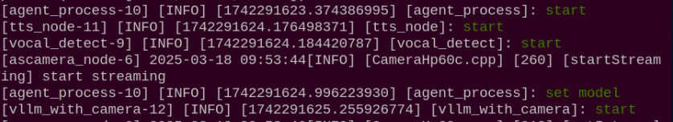

(6) When the following output appears in the command line, MentorPi will announce "**I am Here**", indicating that WonderEcho Pro has been successfully activated. At this point, the system will begin recording the user's command.


(7) You can freely phrase your commands to control the movement of MentorPi, such as saying, "**Describe what you saw**".

(8) When the command line displays the output shown below, it indicates that WonderEcho Pro has printed the recognized speech.


(9) When the command line shows the output below, it indicates that the cloud-based large speech model's speech recognition service has successfully processed the user's command audio. The recognition result will be displayed under "**publish_asr_result**".

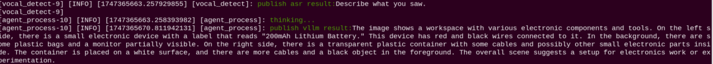

(10) When the command line displays the output shown below, it indicates that the cloud-based large language model has been successfully called to process the user's command and provide a verbal response labeled as "**response**".

The response is automatically generated by the large model, ensuring the accuracy of the meaning, though the wording and structure of the reply may vary.

(11) When the command line shows the output below, it indicates that one round of interaction has been completed. You can refer to Step (4) to reactivate the voice device using the wake-up word and begin a new round of interaction.


(12) To exit this feature, simply press **"Ctrl+C"** in the terminal. If it doesn't close on the first attempt, you may need to press it multiple times.


(13) Click the icon in the top-left corner to open the terminal.

(14) Type the command and press Enter to turn on the Raspberry Pi cooling fan.

```
pinctrl FAN_PWM op dl
```

* **How It Works**

Once the feature is activated, you can freely phrase your commands, such as saying, "**Describe what you saw**" MentorPi will automatically recognize the scene within its field of view and provide a detailed description of the current surroundings.

* **Brief Program Analysis**

(1) Analysis of launch File

The program is saved at:[/home/ubuntu/ros2_ws/src/large_models/launch/vllm_with_camera.launch.py](../_static/source_code/large_models_sdk.zip)

① Library Files Import

{lineno-start=1}

```
import os
from ament_index_python.packages import get_package_share_directory

from launch_ros.actions import Node
from launch.substitutions import LaunchConfiguration
from launch import LaunchDescription, LaunchService
from launch.launch_description_sources import PythonLaunchDescriptionSource
from launch.actions import IncludeLaunchDescription, DeclareLaunchArgument, OpaqueFunction

def launch_setup(context):
    mode = LaunchConfiguration('mode', default=1)
    mode_arg = DeclareLaunchArgument('mode', default_value=mode)

    controller_package_path = get_package_share_directory('controller')
    peripherals_package_path = get_package_share_directory('peripherals')
    large_models_package_path = get_package_share_directory('large_models')

    controller_launch = IncludeLaunchDescription(
        PythonLaunchDescriptionSource(
            os.path.join(controller_package_path, 'launch/controller.launch.py')),
    )
    
    depth_camera_launch = IncludeLaunchDescription(
        PythonLaunchDescriptionSource(
            os.path.join(peripherals_package_path, 'launch/depth_camera.launch.py')),
    )

    large_models_launch = IncludeLaunchDescription(
        PythonLaunchDescriptionSource(
            os.path.join(large_models_package_path, 'launch/start.launch.py')),
        launch_arguments={'mode': mode}.items(),
    )

    vllm_with_camera_node = Node(
        package='large_models',
        executable='vllm_with_camera',
        output='screen',
    )

```

`ament_index_python.packages.get_package_share_directory`: Used to obtain the shared directory path of a ROS2 package.

`launch_ros.actions.Node`: Used to define a ROS2 node

`launch.substitutions.LaunchConfiguration`: Used to retrieve parameter configurations from a Launch file.

`LaunchDescription`, `LaunchService`: Used to define and launch a Launch file.

`launch_description_sources PythonLaunchDescriptionSource`: Used to include other Launch files.

`launch.actions.IncludeLaunchDescription`, `DeclareLaunchArgument`, `OpaqueFunction`: Used to define actions and parameters within a Launch file.

② Define launch_setup Function

{lineno-start=10}

```
def launch_setup(context):
    mode = LaunchConfiguration('mode', default=1)
    mode_arg = DeclareLaunchArgument('mode', default_value=mode)

    controller_package_path = get_package_share_directory('controller')
    peripherals_package_path = get_package_share_directory('peripherals')
    large_models_package_path = get_package_share_directory('large_models')

    controller_launch = IncludeLaunchDescription(
        PythonLaunchDescriptionSource(
            os.path.join(controller_package_path, 'launch/controller.launch.py')),
    )
    
    depth_camera_launch = IncludeLaunchDescription(
        PythonLaunchDescriptionSource(
            os.path.join(peripherals_package_path, 'launch/depth_camera.launch.py')),
    )

    large_models_launch = IncludeLaunchDescription(
        PythonLaunchDescriptionSource(
            os.path.join(large_models_package_path, 'launch/start.launch.py')),
        launch_arguments={'mode': mode}.items(),
    )

    vllm_with_camera_node = Node(
        package='large_models',
        executable='vllm_with_camera',
        output='screen',
    )

    return [controller_launch,
            depth_camera_launch,
            large_models_launch,
            vllm_with_camera_node,
            ]

```

`mode = LaunchConfiguration('mode', default=1)`: Defines a Launch parameter named mode, with a default value of 1.

`sdk_launch`: Uses IncludeLaunchDescription to include the MentorPi_sdk.launch.py launch file from the large_models package, passing the mode parameter.

`large_models_launch`: Uses IncludeLaunchDescription to include the start.launch.py Launch file from the large_models package, passing the mode parameter.

③ Define generate_launch_description function:

{lineno-start=46}

```
def generate_launch_description():
    return LaunchDescription([
        OpaqueFunction(function = launch_setup)
    ])
```

④ Main program entry:

{lineno-start=51}

```
if __name__ == '__main__':
    # Create a LaunchDescription object(创建一个LaunchDescription对象)
    ld = generate_launch_description()

    ls = LaunchService()
    ls.include_launch_description(ld)
    ls.run()
```

`ld = generate_launch_description()`: Generates a Launch description object.

`ls = LaunchService()`: Creates a Launch service object.

`ls.include_launch_description(ld)`: Adds the Launch description to the Launch service.

`ls.run()`: Starts the Launch service, executing all the defined Launch actions.

(2) Analysis of Python Files

The source code is located at:[/home/ubuntu/ros2_ws/src/large_models/large_models/vllm_with_camera.py](../_static/source_code/large_models_sdk.zip)

① Feature Package Import

{lineno-start=5}

```
import os
import cv2
import queue
import rclpy
import threading
import numpy as np
from cv_bridge import CvBridge
from rclpy.node import Node
from sensor_msgs.msg import Image
from std_msgs.msg import String, Bool
from std_srvs.srv import Trigger, SetBool, Empty
from rclpy.executors import MultiThreadedExecutor
from rclpy.callback_groups import ReentrantCallbackGroup

from speech import speech
from large_models.config import *
from large_models_msgs.srv import SetModel, SetString
```

`cv2`: Used for image processing and display with OpenCV.

`json`: Used for handling JSON-formatted data.

`sdk.fps as fps`: Used to calculate and display the frame rate (FPS).

`speech`: Module related to large model voice interaction

`large_models_msgs.srv`: Custom service type for large models.

`large_models.config`: Configuration file for large models.

② VLLMWithCamera Class

{lineno-start=24}

```
class VLLMWithCamera(Node):
    def __init__(self, name):
        rclpy.init()
        super().__init__(name)
        self.image_queue = queue.Queue(maxsize=2)
        self.vllm_result = ''
        self.running = True
        self.bridge = CvBridge()
        timer_cb_group = ReentrantCallbackGroup()
        self.tts_text_pub = self.create_publisher(String, 'tts_node/tts_text', 1)
        self.create_subscription(Image, 'ascamera/camera_publisher/rgb0/image', self.image_callback, 1)
        self.create_subscription(String, 'agent_process/result', self.vllm_result_callback, 1)
        self.create_subscription(Bool, 'tts_node/play_finish', self.play_audio_callback, 1, callback_group=timer_cb_group)
        self.awake_client = self.create_client(SetBool, 'vocal_detect/enable_wakeup')
        self.awake_client.wait_for_service()
        self.set_model_client = self.create_client(SetModel, 'agent_process/set_model')
        self.set_model_client.wait_for_service()
        self.timer = self.create_timer(0.0, self.init_process, callback_group=timer_cb_group)
```

`self.vllm_result`: Stores the result received from the agent_process/result topic.

`self.tts_text_pub`: Creates a publisher to send text to the speech synthesis node.

`self.create_subscription`: Creates subscribers to receive image data, VLLM results, and speech playback completion signals.

`self.awake_client` and `self.set_model_client`: Create clients to call the wake-up and model setting services.

③ get_node_state Method

{lineno-start=43}

```
    def get_node_state(self, request, response):
        return response
```

`return response`: Returns the response object.

④ init_process Method

{lineno-start=46}

```
    def init_process(self):
        self.timer.cancel()
        
        msg = SetModel.Request()
        msg.model = vllm_model
        msg.model_type = 'vllm'
        if os.environ['ASR_LANGUAGE'] == 'Chinese':
            msg.model = stepfun_vllm_model
            msg.api_key = stepfun_api_key
            msg.base_url = stepfun_base_url
        else:
            msg.model = vllm_model
            msg.api_key = vllm_api_key
            msg.base_url = vllm_base_url
        self.send_request(self.set_model_client, msg)
        speech.play_audio(start_audio_path)
        threading.Thread(target=self.process, daemon=True).start()
        self.create_service(Empty, '~/init_finish', self.get_node_state)
        self.get_logger().info('\033[1;32m%s\033[0m' % 'start')
```

`SetModel.Request`: Creates a request message to set the model.

`SetString.Request`: Defines the request message for setting the prompt string.

`set_pose_target`: Sets the robot's initial pose.

`Self.send_request`: Sends a service request.

`speech.play_audio`: Plays an audio clip.

`threading.Thread`: Starts a new thread for image processing and tracking.

⑤ Send_request Method

{lineno-start=66}

```
    def send_request(self, client, msg):
        future = client.call_async(msg)
        while rclpy.ok():
            if future.done() and future.result():
                return future.result()
```

`Client.call_async(msg)`: Asynchronously calls a service.

`future.done()` and `future.result()`: Check if the service call has completed and retrieve the result.

⑥ vllm_result_callback method:

{lineno-start=72}

```
    def vllm_result_callback(self, msg):
        self.vllm_result = msg.data
```

Receives results from the agent_process/result topic and stores them in self.vllm_result.

⑦ process Method

{lineno-start=75}

```
    def process(self):
        cv2.namedWindow('image', cv2.WINDOW_NORMAL)  
        cv2.waitKey(10)
        while self.running:
            image = self.image_queue.get(block=True)
            height, width = image.shape[:2]
            cv2.resizeWindow('image', width, height)

            if self.vllm_result:
                msg = String()
                msg.data = self.vllm_result
                self.tts_text_pub.publish(msg)
                self.vllm_result = ''

            cv2.imshow('image', image)
            cv2.waitKey(1)
        cv2.destroyAllWindows()
```

`self.image_queue.get`: Retrieves image data from the queue.

`self.vllm_result`: If there is a VLLM result, it is published to the speech synthesis node.

`Cv2.imshow`: Displays the image.

⑧ Play_audio_finish_callback Method:

{lineno-start=94}

```
    def play_audio_callback(self, msg):
        if msg.data:
            msg = SetBool.Request()
            msg.data = True
            self.send_request(self.awake_client, msg)
```

When the speech playback is complete, sends a request to enable the wake-up function.

⑨ image_callback method

Converts received ROS image messages into NumPy arrays and stores them in the queue.

⑩ Main Method

{lineno-start=109}

```
def main():
    node = VLLMWithCamera('vllm_with_camera')
    executor = MultiThreadedExecutor()
    executor.add_node(node)
    executor.spin()
    node.destroy_node()
```

Creates an instance of the VLLMWithCamera node.

Uses a multithreaded executor to handle node tasks.

Calls `executor.spin()` to start processing ROS events.

Destroys the node when finished by calling node.destroy_node().

### 14.4.2 Embodied AI Applications in Smart Home Assistant

* **Brief Game Instructions**

:::{Note}

The large language model used in this lesson is cloud-based. Before starting, please connect the robot to the internet using an Ethernet cable or switch it to local area network (LAN) mode.

:::

Say the wake-up word (the wake-up word depends on the firmware flashed, and by default, the wake-up word for our factory firmware is "**Hello, HiWonder**") to activate WonderEcho Pro. It will respond with **"I am here".**

Once activated, you can control MentorPi using voice commands—for example, Go to the zoo to see what animals are there, then come back and tell me. After the command is issued, the terminal will display the recognized speech, while the "**AI Voice Interaction Box**" will verbally respond with the AI-generated answer and execute the corresponding actions simultaneously.

* **Preparation**

(1) Verifying the WonderEcho Pro Firmware

By default, the wake-up word for the WonderEcho Pro factory firmware is "**Hello, Hiwonder**". If you wish to change the wake-up word to **"MentorPi",** please refer to the tutorial titled [**14.1.3 Firmware Flashing Method**](#anchor_14_1_3) for step-by-step instructions.

If you have previously flashed the device with different firmware—such as the version with the wake word "**小幻小幻**" or **"mentorpi"**—you must use the corresponding wake word to activate the device.

For example, if the **"小幻小幻"** firmware was installed, the correct wake word would be **"小幻小幻"**; if the **"mentorpi"** firmware was installed, the wake word would be "**mentorpi**".

In the following tutorial, we will use the default factory wake word **"Hello, Hiwonder"** for demonstration purposes.

(2) Obtaining and Configuring the Large Model API Key

By default, the program does not include the configuration of the Large AI Model-related API keys. Before activating features related to the Large AI Model, please refer to the [**14.3.1 Obtaining and Configuring the Large Model API Key**](#anchor_14_3) to configure the necessary keys. This step is mandatory and cannot be skipped, as it is crucial for the proper functioning and experience of the large model features.

* **Network Configuration**

:::{Note}

The large language model used in this lesson is cloud-based. Before starting, please connect the robot to the internet using an Ethernet cable or switch it to local area network (LAN) mode.

:::

The robot must be connected to the internet, either in STA (local network) mode or AP (direct connection) mode via Ethernet. For detailed instructions on network configuration, please refer to the course [**13. Network Configuration Courses->13.1 Network Configuration Instructions**](14.Robot%20Network%20Configuration.md#network-configuration-overview).

* **Turn Off Cooling Fan**

(1) Click the icon in the top-left corner to open the terminal.

(2) Type the command and press Enter to turn off the Raspberry Pi's cooling fan, minimizing noise interference during recording.

```
pinctrl FAN_PWM op dh
```

Mapping

Refer to [**6. Mapping Lesson -\>6.5 slam_toolbox Mapping Algorithm**](7.mapping_lesson.md#slam_toolbox-mapping-algorithm) to pre-build and save the map in advance.

<p id="anchor_14_4_2_5"></p>

* **Starting and Stopping the Game**

:::{Note}

* The input commands must strictly observe case sensitivity and spacing.

* The robot must be connected to the internet, either in STA (local network) mode or AP (direct connection) mode via Ethernet.

:::

(1) Start the robot and follow the instructions in [**2. Set Development → 2.4 Docker Introduction & Usage**](3.set_development_environment.md#docker-introduction--usage) to connect via the VNC remote desktop software. Then, switch to the ROS2 environment and select the appropriate language version as needed.

(2) Double-click  to launch the command bar. Enter the command and press Enter to disable the auto-start service.

(3) Execute the following command to disable the app auto-start service.

```
~/.stop_ros.sh
```

(4) Type the command and press Enter to launch the voice control mode. The program will then start navigation.

```
ros2 launch large_models vllm_navigation.launch.py
```

(5) When the command line shows the output below, initialization is complete. You can then say the wake-up phrase, **"Hello Hiwonder".**


(6) When the command line shows the output below and the device announces "**I am here**", it means the voice device has been successfully activated. At this point, the system will begin recording the user's command.


(7) When the command line displays the output shown below, it indicates that WonderEcho Pro has printed the recognized speech.

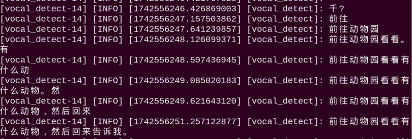

(8) When the command line shows the output below, it indicates that the cloud-based large language model has successfully processed the user's command, thought through the instruction, and provided a verbal response ("**response**"), as well as designed an action that aligns with the user's command meaning.

The response is automatically generated by the large model, ensuring the accuracy of the meaning, though the wording and structure of the reply may vary.

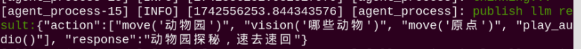

(9) When the command line shows the output below, it indicates that one round of interaction has been completed. You can refer to Step 4) to reactivate the voice device using the wake-up word and begin a new round of interaction.


(10) To exit this feature, simply press **"Ctrl+C"** in the terminal. If it doesn't close on the first attempt, you may need to press it multiple times.

(11) Type the command and press Enter to turn on the Raspberry Pi cooling fan.

```
pinctrl FAN_PWM op dl
```

(12) Enter the command and press the Enter key to start the game:

```
sudo systemctl enable start_node.service
```

* **How It Works**

Once activated, you can freely give commands like: **"Go to the zoo to see what animals are there, then come back and tell me".** The robot will navigate to the designated zoo location, count the animal models present, and return to the starting point to report its findings.

* **Modifying Navigation Positions**

To update the navigation waypoints in the program, edit the following file: [ros2_ws/src/large_models/large_models/vllm_navigation.py](../_static/source_code/large_models_sdk.zip)

(1) First, refer to [Starting and Stopping the Game->Step (4)](#anchor_14_4_2_5) to launch the program and open the RViz map visualization. Use the 2D Goal Pose tool to set the desired navigation target directly on the map.

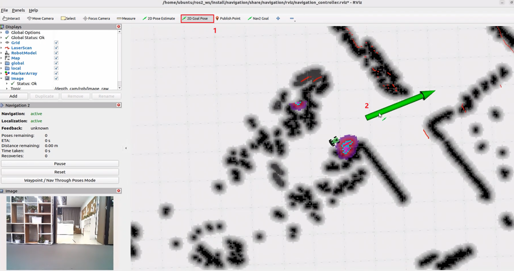

(2) Then, switch back to the terminal to view the published target position parameters. Enter these parameter values into the program accordingly.

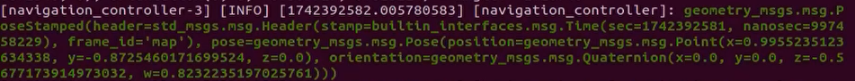


Each set of five numbers corresponds to:  

x coordinate (meters)  

y coordinate (meters)  

roll angle (rotation around the x-axis, in degrees)  

pitch angle (rotation around the y-axis, in degrees)  

yaw angle (rotation around the z-axis, in degrees) Use the map's coordinate system as a reference to fill in the x and y values. Next, convert the quaternion value, for example:  

Quaternion(x=0.0, y=0.0, z=-0.5677, w=0.8232)  to Euler angles (roll, pitch, yaw), which would be approximately:  roll ≈ 0°, pitch ≈ 0°, yaw ≈ -69.3°.

* **Brief Program Analysis**

(1) Analysis of launch File

The program is saved at: [/home/ubuntu/ros2_ws/src/large_models/launch/vllm_with_camera.launch.py](../_static/source_code/large_models_sdk.zip)

① Library Files Import

{lineno-start=1}

```
import os
from ament_index_python.packages import get_package_share_directory

from launch_ros.actions import Node
from launch.substitutions import LaunchConfiguration
from launch import LaunchDescription, LaunchService
from launch.launch_description_sources import PythonLaunchDescriptionSource
from launch.actions import IncludeLaunchDescription, DeclareLaunchArgument, OpaqueFunction
```

`os`: Used for handling file paths and operating system-related functionalities.

`ament_index_python.packages.get_package_share_directory`: Used to obtain the shared directory path of a ROS2 package.

`launch_ros.actions.Node`: Used to define a ROS2 node

`launch.substitutions.LaunchConfiguration`: Used to retrieve parameter configurations from a Launch file.

`LaunchDescription`, `LaunchService`: Used to define and launch a Launch file.

`launch_description_sources PythonLaunchDescriptionSource`: Used to include other Launch files.

`launch.actions.IncludeLaunchDescription`,`DeclareLaunchArgument`, `OpaqueFunction`: Used to define actions and parameters within a Launch file.

② Define launch_setup Function

{lineno-start=10}

```
def launch_setup(context):
    mode = LaunchConfiguration('mode', default=1)
    mode_arg = DeclareLaunchArgument('mode', default_value=mode)

    controller_package_path = get_package_share_directory('controller')
    peripherals_package_path = get_package_share_directory('peripherals')
    large_models_package_path = get_package_share_directory('large_models')

    controller_launch = IncludeLaunchDescription(
        PythonLaunchDescriptionSource(
            os.path.join(controller_package_path, 'launch/controller.launch.py')),
    )
    
    depth_camera_launch = IncludeLaunchDescription(
        PythonLaunchDescriptionSource(
            os.path.join(peripherals_package_path, 'launch/depth_camera.launch.py')),
    )

    large_models_launch = IncludeLaunchDescription(
        PythonLaunchDescriptionSource(
            os.path.join(large_models_package_path, 'launch/start.launch.py')),
        launch_arguments={'mode': mode}.items(),
    )

    vllm_with_camera_node = Node(
        package='large_models',
        executable='vllm_with_camera',
        output='screen',
    )

    return [controller_launch,
            depth_camera_launch,
            large_models_launch,
            vllm_with_camera_node,
            ]
```

`mode = LaunchConfiguration('mode', default=1)`: Defines a Launch parameter named mode, with a default value of 1.

`sdk_launch`: Uses IncludeLaunchDescription to include the MentorPi_sdk.launch.py launch file from the large_models package, passing the mode parameter.

`large_models_launch`: Uses IncludeLaunchDescription to include the start.launch.py Launch file from the large_models package, passing the mode parameter.

③ Define generate_launch_description function:

{lineno-start=46}

```
def generate_launch_description():
    return LaunchDescription([
        OpaqueFunction(function = launch_setup)
    ])
```

④ Main program entry:

{lineno-start=51}

```
if __name__ == '__main__':
    # Create a LaunchDescription object(创建一个LaunchDescription对象)
    ld = generate_launch_description()

    ls = LaunchService()
    ls.include_launch_description(ld)
    ls.run()
```

`ld = generate_launch_description()`: Generates a Launch description object.

`ls = LaunchService()`: Creates a Launch service object.

`ls.include_launch_description(ld)`: Adds the Launch description to the Launch service.

`ls.run()`: Starts the Launch service, executing all the defined Launch actions.

(2) Analysis of Python Files

The program is saved at:[/home/ubuntu/ros2_ws/src/large_models/large_models/vllm_navigation.py](../_static/source_code/large_models_sdk.zip)

① Feature Package Import

{lineno-start=5}

```
import os
import re
import time
import json
import rclpy
import threading
from speech import speech
from rclpy.node import Node
from sensor_msgs.msg import Image
from std_msgs.msg import String, Bool
from std_srvs.srv import Trigger, SetBool, Empty

from large_models.config import *
from large_models_msgs.srv import SetModel, SetContent, SetString, SetInt32

from interfaces.srv import SetPose2D
from rclpy.executors import MultiThreadedExecutor
from rclpy.callback_groups import ReentrantCallbackGroup
```

`cv2`: Used for image processing and display with OpenCV.

`json`: Used for handling JSON-formatted data.

`sdk.fps as fps`: Used to calculate and display the frame rate (FPS).

`speech`: Modules related to large model voice interaction.

`large_models_msgs.srv`: Custom service type for large models.

`large_models.config`: Configuration file for large models.

② Modifying Navigation Positions

{lineno-start=65}

```
	    position_dict = {"kitchen": [3.56647, -2.01839, 0.0, -0.190172, 0.981751], #xyzrpy, m,deg
                     "front desk": [1.93939, 1.06236, 0.0, 0.0, 0.399843],
                     "bedroom": [3.14153, -0.321892, 0.0, 0.0, 0.0733996],
                     "zoo": [1.3, 0.37, 0.0, 0.0, 0.0],
                     "space base": [1.58, -0.74, 0.0, 0.0, -48.0],
                     "football field": [0.32, -0.65, 0.0, 0.0, -90.0],
                     "origin": [0.0, 0.0, 0.0, 0.0, 0.0],
                     "home": [0.1, 0.4, 0.0, 0.0, 0.0]
                     }
```

③ LLM_PROMPT character string

{lineno-start=76}

```
	**Role
You are a smart navigation vehicle equipped with a camera and speaker. You can move to different places, analyze visual input, and respond by playing audio. Based on user input, you need to generate the corresponding JSON command.

**Requirements
- For any user input, look up corresponding functions from the Action Function Library, and generate the proper JSON output.
- For each action sequence, include a concise (5–20 characters) and witty, varied response to make the interaction lively and engaging.
- Output only the JSON result, no analysis or extra text.
- Output format:
{
  "action": ["xx", "xx"],
  "response": "xx"
}

**Special Notes
The "action" field contains an ordered list of function names to be executed in sequence. If no matching function is found, return: "action": [].
The "response" field should contain a carefully crafted, short, humorous, and varied message (5–20 characters).

**Action Function Library
Move to a specified place: move('kitchen')
Return to starting point: move('origin')
Analyze current view: vision('What do you see?')
Play audio response: play_audio()

**Example
Input: Go to the front desk to see if the door is closed, and then come back and tell me
Output:
{
  "action": ["move('front desk')", "vision('Is the door closed?')", "move("origin")", "play_audio()"],
  "response": "On it, reporting soon!"
}
    '''
```

④ VLLM_PROMPT character string

{lineno-start=108}

```
	    VLLM_PROMPT = '''
As my robot butler, you should carefully observe the surrounding situation and give considerate and humane responses to the instructions given. Do not ask questions in return. The number of words should be between 20 and 40.
    '''
```

⑤ VLLMObjectTransport Class

{lineno-start=112}

```
	class VLLMNavigation(Node):
    def __init__(self, name):
        rclpy.init()
        super().__init__(name)
        
        self.action = []
        self.response_text = ''
        self.llm_result = ''
        self.play_audio_finish = False
        #self.llm_result = '{\'action\':[\'move(\"厨房\")\', \'vision(\"大门有没有关\")\', \'move(\"原点\")\', \'play_audio()\'], \'response\':\'马上！\'}'
        self.running = True
        self.play_delay = False
        self.reach_goal = False
        self.interrupt = False
        
        timer_cb_group = ReentrantCallbackGroup()
        self.tts_text_pub = self.create_publisher(String, 'tts_node/tts_text', 1)
        self.create_subscription(String, 'agent_process/result', self.llm_result_callback, 1)
        self.create_subscription(Bool, 'vocal_detect/wakeup', self.wakeup_callback, 1)
        self.create_subscription(Bool, 'tts_node/play_finish', self.play_audio_finish_callback, 1, callback_group=timer_cb_group)
        self.create_subscription(Bool, 'navigation_controller/reach_goal', self.reach_goal_callback, 1)
        self.awake_client = self.create_client(SetBool, 'vocal_detect/enable_wakeup')
        self.awake_client.wait_for_service()
        self.set_mode_client = self.create_client(SetInt32, 'vocal_detect/set_mode')
        self.set_mode_client.wait_for_service()
        self.set_model_client = self.create_client(SetModel, 'agent_process/set_model')
        self.set_model_client.wait_for_service()
        self.set_prompt_client = self.create_client(SetString, 'agent_process/set_prompt')
        self.set_prompt_client.wait_for_service()
        self.set_vllm_content_client = self.create_client(SetContent, 'agent_process/set_vllm_content')
        self.set_vllm_content_client.wait_for_service()
        self.set_pose_client = self.create_client(SetPose2D, 'navigation_controller/set_pose')
        self.set_pose_client.wait_for_service()

        self.timer = self.create_timer(0.0, self.init_process, callback_group=timer_cb_group)
```

`self.llm_result`: Stores the results returned by the LLM (Large Language Model).

`self.running`: control the running status of the program

`self.transport_finished`: Marks whether the transportation task has been completed.

`self.client`: The voice API client, used for interacting with voice services.

`self.tts_text_pub`: ROS topic publisher for sending Text-to-Speech (TTS) text.

`self.tts_text_pub`: ROS topic publisher for sending Automatic Speech Recognition (ASR) results.

`self.create_subscription`: Subscribes to LLM results

⑥ get_node_state Method

{lineno-start=148}

```
	    def get_node_state(self, request, response):
        return response
```

`return response`: Returns the response object.

⑦ init_process Method

{lineno-start=151}

```
	    def init_process(self):
        self.timer.cancel()
        
        msg = SetModel.Request()
        msg.model = llm_model
        msg.model_type = 'llm'
        msg.api_key = api_key 
        msg.base_url = base_url
        self.send_request(self.set_model_client, msg)

        msg = SetString.Request()
        msg.data = LLM_PROMPT
        self.send_request(self.set_prompt_client, msg)
        
        init_finish = self.create_client(Empty, 'navigation_controller/init_finish')
        init_finish.wait_for_service()
        speech.play_audio(start_audio_path)
        threading.Thread(target=self.process, daemon=True).start()
        self.create_service(Empty, '~/init_finish', self.get_node_state)
        self.get_logger().info('\033[1;32m%s\033[0m' % 'start')
```

`SetModel.Request`: Creates a request message to set the model.

`SetString.Request`: Defines the request message for setting the prompt string.

`set_pose_target`: Sets the robot's initial pose.

`Self.send_request`: Sends a service request.

`speech.play_audio`: Plays an audio clip.

`threading.Thread`: Starts a new thread for image processing and tracking.

⑧ Send_request Method 

{lineno-start=173}

```
	    def send_request(self, client, msg):
        future = client.call_async(msg)
        while rclpy.ok():
            if future.done() and future.result():
                return future.result()
```

`Client.call_async(msg)`: Asynchronously calls a service.

`future.done()` and `future.result()`: Check if the service call has completed and retrieve the result.

⑨ llm_result_callback method:

{lineno-start=183}

```
	    def llm_result_callback(self, msg):
        self.llm_result = msg.data
```

Receives results from the agent_process/result topic and stores them in self.vllm_result.

⑩ wakeup_callback method

{lineno-start=179}

```
	    def wakeup_callback(self, msg):
        self.get_logger().info('wakeup interrupt')
        self.interrupt = msg.data
```

Receives and processes wake-up signals from the vocal_detect/wakeup topic. This method is triggered when the user wakes up the system using voice commands.

⑪ def move(self, position): method

{lineno-start=189}

```
	    def move(self, position):
        self.get_logger().info('position: %s' % str(position))
        msg = SetPose2D.Request()
        p = position_dict[position]
        msg.data.x = float(p[0])
        msg.data.y = float(p[1])
        msg.data.roll = p[2]
        msg.data.pitch = p[3]
        msg.data.yaw = p[4]
        self.send_request(self.set_pose_client, msg)
```

`Parameter Reception`: Receives a location name (e.g., "**zoo**", "**supermarket**", etc.)

`Position Lookup`: Retrieves the corresponding coordinates and orientation data from the position_dict dictionary using p = position_dict\[position\].

`Message Construction`: Creates a SetPose2D.Request() message and sets the x and y coordinates, as well as the roll, pitch, and yaw angles.

`Service Call`: Sends the location request to the navigation controller by calling `self.send_request(self.set_pose_client, msg)` through the set_pose_client.

This sequence enables the robot to navigate between predefined locations, forming the core functionality for spatial movement tasks.

⑫ play_audio(self) Method:

{lineno-start=197}

```
	    def play_audio(self):
        msg = String()
        msg.data = self.response_text
        self.get_logger().info(f'{self.response_text}')
        while not self.play_audio_finish:
            time.sleep(0.1)
        self.play_audio_finish = False
        self.tts_text_pub.publish(msg)
        self.response_text = ''
```

Plays the text stored in self.response_text as audio. Sends a wake-up signal once audio playback is completed.

⑬ reach_goal_callback(self, msg) method

`Parameter Reception`: Receives a boolean message indicating whether the target has been reached.

`Status Update`: Assigns the message data to the self.reach_goal variable.

This allows the system to receive feedback from the navigation controller and update the robot's navigation status, enabling it to know when the movement task is complete.

⑭ vision(self, query) Method:

{lineno-start=212}

```
	    def vision(self, query):
        msg = SetContent.Request()
        if os.environ["ASR_LANGUAGE"] == 'Chinese':
            msg.api_key = stepfun_api_key
            msg.base_url = stepfun_base_url
            msg.model = stepfun_vllm_model
        else:
            msg.api_key = vllm_api_key
            msg.base_url = vllm_base_url
            msg.model = vllm_model
        msg.prompt = VLLM_PROMPT
        msg.query = query
        self.get_logger().info('vision: %s' % query)
        res = self.send_request(self.set_vllm_content_client, msg)
        return res.message
```

Processes visual queries using the Vision Language Model (VLLM).

`Parameter Reception`: Accepts a query string, such as "**What do you see?**"

`Service Call`: Sends a request to the VLLM service via set_vllm_content_client.

`Result Return`: Returns the response message from the Vision Language Model.

⑮ play_audio_finish_callback(self, msg) Method:

{lineno-start=228}

```
	    def play_audio_finish_callback(self, msg):
        # msg = SetBool.Request()
        # msg.data = True
        # self.send_request(self.awake_client, msg)
        # msg = SetInt32.Request()
        # msg.data = 1
        # self.send_request(self.set_mode_client, msg)
        self.play_audio_finish = msg.data
```

Handles the callback notification for audio playback completion

⑯ process Method

{lineno-start=237}

```
	    def process(self):
        first = True
        while self.running:
            if self.llm_result:
                self.interrupt = False
                msg = String()
                if 'action' in self.llm_result: # 如果有对应的行为返回那么就提取处理
                    result = json.loads(self.llm_result[self.llm_result.find('{'):self.llm_result.find('}')+1])
                    if 'response' in result:
                        msg.data = result['response']
                        self.tts_text_pub.publish(msg)
                    if 'action' in result:
                        action = result['action']
                        self.get_logger().info(f'vllm action: {action}')
                        for a in action:
                            if 'move' in a:
                                self.reach_goal = False
                                eval(f'self.{a}')
                                while not self.reach_goal:
                                    if self.interrupt:
                                        self.get_logger().info('interrupt')
                                        break
                                    # self.get_logger().info('waiting for reach goal')
                                    time.sleep(0.01)
                            elif 'vision' in a:
                                res = eval(f'self.{a}')
                                self.response_text = res
                                self.get_logger().info(f'vllm response: {res}')
                            elif 'play_audio' in a:
                                eval(f'self.{a}')
                                while not self.play_audio_finish:
                                    time.sleep(1)
                            if self.interrupt:
                                self.get_logger().info('interrupt')
                                break
                else: # 没有对应的行为，只回答
                    msg.data = self.llm_result
                    self.tts_text_pub.publish(msg)
                self.action_finish = True
                self.llm_result = ''
            else:
                time.sleep(0.01)
```

Check LLM result; if self.llm_result: Check whether self.llm_result contains any content. If it is not empty, it indicates there is a new LLM result to process; otherwise, enter a short sleep to wait for new results.

Check whether the result contains an action command:; if 'action' in self.llm_result: If the returned result contains the "**action**" field, it indicates that, in addition to the reply text, there are action commands that need to be executed.

Extract and Parse JSON Data: Locate the start and end positions of the JSON segment within the string using string search methods, then parse it into a dictionary with json.loads. Extract data such as "**response**" and "**action**" from the dictionary.

**Handle Text Replies and Action Execution:**

If "**response**" is present in the parsed result, assign its content to a message and publish it on the tts_text_pub topic to trigger TTS playback.

**Movement Commands**

If the action string contains "**move**", first set self.reach_goal to False, then call the corresponding movement function (executed dynamically using eval).  

Enter a loop to wait until self.reach_goal becomes True (indicating the robot has reached its target).  

During this wait, monitor self.interrupt to support interruption.

**Vision Detection**

If "**vision**" is included, execute the corresponding vision function, assign its return value to self.response_text, and log the result.

**Play the Audio**

If it contains "**play_audio**", directly call the corresponding audio playback function.

Interrupt Check: Continuously monitor the self.interrupt flag throughout the execution of each action. If an interrupt is triggered during waiting or action execution, promptly stop the current action and exit the corresponding loop.

Mark Completion and Switch Mode: After processing the current LLM result—regardless of whether it includes an action—set self.action_finish to True and clear self.llm_result. ater in the loop, once both self.play_audio_finish and self.action_finish are True, reset these flags and send a mode-switch request via set_mode_client to transition to the next state.  

Finally, when self.running is set to False, exit the loop and shut down the ROS system.

⑰ Main Method

{lineno-start=290}

```
	def main():
    node = VLLMNavigation('vllm_navigation')
    executor = MultiThreadedExecutor()
    executor.add_node(node)
    executor.spin()
    node.destroy_node()
```

Create an instance of the `VLLMObjectTransport` ROS 2 node.

Uses a multithreaded executor to handle node tasks.

Calls `executor.spin()` to start processing ROS events.

Destroys the node when finished by calling `node.destroy_node()`.

* **FAQ**

(1) Launching RVIZ on the Virtual Machine

If the game is lagging or performing poorly, you can display RVIZ on the virtual machine as follows. Refer to the instructions in [6. Mapping Lesson -\> 6.5.2 Mapping Operation Steps](7.mapping_lesson.md#mapping-operation-steps) for placing the necessary files in the virtual machine under:

Enter the following command and press Enter to initiate smart home assistant game:

```
ros2 launch large_models vllm_navigation_virtual.launch.py
```

(2) Click  in the top-left corner to open the terminal.

(3) Input the command below to launch the rviz tool to display the navigation process:

```
ros2 launch navigation rviz_navigation.launch.py
```


### 14.4.3 Embodied AI Applications in Vision Tracking

* **Brief Game Instructions**

In this lesson, we will learn how to leverage a large model to analyze real-world scenes in real time and implement an interactive real-time detection activity. Note: The large language model used in this lesson is cloud-based. Before starting, please connect the robot to the internet using an Ethernet cable or switch it to local area network (LAN) mode.

Once the program starts running and WonderEcho Pro announces "I am ready".

Say the wake-up word (the wake-up word depends on the firmware flashed, and by default, the wake-up word for our factory firmware is "Hello, HiWonder") to activate WonderEcho Pro. It will respond with "**I am here**".

After activation, you can interact with MentorPi using voice commands. You can then control MentorPi with your voice. For example, say "**Track the purple ball.**" The terminal will display the recognized voice command, and the voice device will announce the generated response after processing, then execute the corresponding action.

* **Preparation**

(1) Verifying the WonderEcho Pro Firmware

By default, the wake-up word for the WonderEcho Pro factory firmware is **"Hello, Hiwonder".** If you wish to change the wake-up word to **"MentorPi",** please refer to the tutorial titled [**14.1.3 Firmware Flashing Method**](#anchor_14_1_3) for step-by-step instructions.

If you have previously flashed the device with different firmware—such as the version with the wake word "**小幻小幻**" or "**mentorpi**"—you must use the corresponding wake word to activate the device.

For example, if the **"小幻小幻"** firmware was installed, the correct wake word would be **"小幻小幻"**; if the "**mentorpi**" firmware was installed, the wake word would be **"mentorpi".**

In the following tutorial, we will use the default factory wake word **"Hello, Hiwonder"** for demonstration purposes.

(2) Obtaining and Configuring the Large Model API Key

By default, the program does not include the configuration of the Large AI Model-related API keys. Before activating features related to the Large AI Model, please refer to the section "**[14.3.1 Obtaining and Configuring Large Model API Keys](#anchor_14_3)**" to configure the necessary keys. This step is mandatory and cannot be skipped, as it is crucial for the proper functioning and experience of the large model features.

(3) Network Configuration

:::{Note}

The large language model used in this lesson is cloud-based. Before starting, please connect the robot to the internet using an Ethernet cable or switch it to local area network (LAN) mode.

:::

The robot must be connected to the internet, either in STA (local network) mode or AP (direct connection) mode via Ethernet. For detailed instructions on network configuration, please refer to the course [**13. Network Configuration Courses->13.1 Network Configuration Instructions**](14.Robot%20Network%20Configuration.md#network-configuration-overview)

(4) Turn Off Cooling Fan

① Click  in the top-left corner to open the terminal.

② Type the command and press Enter to turn off the Raspberry Pi's cooling fan, minimizing noise interference during recording.

```
pinctrl FAN_PWM op dh
```

* **Starting and Stopping the Game**

:::{Note}

* The input commands must strictly observe case sensitivity and spacing.

* The robot must be connected to the internet, either in STA (local network) mode or AP (direct connection) mode via Ethernet.

:::

(1) Start the robot and follow the instructions in [**2. Set Development Environment → 2.4 Docker Introduction & Usage**](3.set_development_environment.md#docker-introduction-usage) to connect via the VNC remote desktop software. Then, switch to the ROS2 environment and select the appropriate language version as needed.

(2) Double-click to launch the command bar. Enter the command and press Enter to disable the auto-start service.

```
~/.stop_ros.sh
```

(3) Enter the command to launch the corresponding game.

```
ros2 launch large_models vllm_track.launch.py
```

(4) Open a new command-line terminal to execute the following command and access the live camera feed:

```
rqt
```

(5) Choose the corresponding topic.

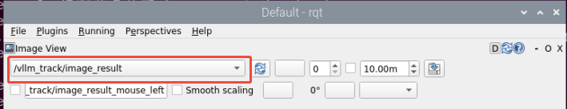

(6) Once the command line outputs the message below and the device announces "**I am ready**", it indicates that the voice device has been initialized. You can now say the wake word, "**Hello Hiwonder**".


(7) When the following output appears in the command line, MentorPi will announce "**I am Here**", indicating that MentorPi has been successfully activated. At this point, the system will begin recording the user's command.


(8) You can freely phrase your commands to control the movement of MentorPi, such as saying, "**Track the purple ball**".


(9) When the command line displays the output shown below, it indicates that MentorPi has printed the recognized speech.


(10) When the command line shows the output below, it indicates that the cloud-based voice large model's speech recognition service has successfully processed the user's command audio. The recognition result will be displayed under "**publish_asr_result**".


(11) When the command line shows the output below, it indicates that the cloud-based large language model has successfully processed the user's command, thought through the instruction, and provided a verbal response ("**response**"), as well as designed an action that aligns with the user's command meaning.

The response is automatically generated by the large model, ensuring the accuracy of the meaning, though the wording and structure of the reply may vary.


(12) When the command line shows the output below, it indicates that one round of interaction has been completed. You can refer to Step 4) to reactivate the voice device using the wake-up word and begin a new round of interaction.


(13) To exit this feature, simply press "**Ctrl+C**" in the terminal. If it doesn't close on the first attempt, you may need to press it multiple times.

(14) Type the command and press Enter to turn on the Raspberry Pi cooling fan.

```
pinctrl FAN_PWM op dl
```

(15) Enter the command and press the Enter key to start the game:

```
sudo systemctl enable start_node.service
```

* **How It Works**

Once the feature is activated, we can freely organize our commands, for example: "**Track the purple ball**". This will control the MentorPi robot car to automatically track the purple ball within its field of view, highlight the ball in the frame, and stop tracking when the ball is positioned at the center of the screen.

* **Brief Program Analysis**

(1) Analysis of launch File

The program is saved at: [/home/ubuntu/ros2_ws/src/large_models/launch/vllm_track.launch.py](../_static/source_code/large_models_sdk.zip)

① Library Files Import

{lineno-start=1}

```
import os
from ament_index_python.packages import get_package_share_directory

from launch_ros.actions import Node
from launch.substitutions import LaunchConfiguration
from launch import LaunchDescription, LaunchService
from launch.launch_description_sources import PythonLaunchDescriptionSource
from launch.actions import IncludeLaunchDescription, DeclareLaunchArgument, OpaqueFunction
```

`ament_index_python.packages.get_package_share_directory`: Used to obtain the shared directory path of a ROS2 package.

`launch_ros.actions.Node`: Used to define a ROS2 node

`launch.substitutions.LaunchConfiguration`: Used to retrieve parameter configurations from a Launch file.

`LaunchDescription`, `LaunchService`: Used to define and launch a Launch file.

`launch_description_sources PythonLaunchDescriptionSource`: Used to include other Launch files.

`launch.actions.IncludeLaunchDescription`, `DeclareLaunchArgument`, `OpaqueFunction`: Used to define actions and parameters within a Launch file.

② Define launch_setup Function

{lineno-start=10}

```
def launch_setup(context):
    mode = LaunchConfiguration('mode', default=1)
    mode_arg = DeclareLaunchArgument('mode', default_value=mode)
    
    slam_package_path = get_package_share_directory('slam')
    large_models_package_path = get_package_share_directory('large_models') 
    
    base_launch = IncludeLaunchDescription(
        PythonLaunchDescriptionSource(
            os.path.join(slam_package_path, 'launch/include/robot.launch.py')),
        launch_arguments={
            'sim': 'false',
            'master_name': os.environ['MASTER'],
            'robot_name': os.environ['HOST']
        }.items(),
    )

    large_models_launch = IncludeLaunchDescription(
        PythonLaunchDescriptionSource(
            os.path.join(large_models_package_path, 'launch/start.launch.py')),
        launch_arguments={'mode': mode}.items(),
    )

    vllm_track_node = Node(
        package='large_models',
        executable='vllm_track',
        name='vllm_track', 
        output='screen',
    )

    # rqt
    calibrate_rqt_reconfigure_node = Node(
        package='rqt_reconfigure',
        executable='rqt_reconfigure',
        name='calibrate_rqt_reconfigure'
    )

```

`mode = LaunchConfiguration('mode', default=1)`: Defines a Launch parameter named mode, with a default value of 1.

`sdk_launch`: Uses IncludeLaunchDescription to include the MentorPi_sdk.launch.py launch file from the large_models package, passing the mode parameter.

`large_models_launch`: Uses IncludeLaunchDescription to include the start.launch.py Launch file from the large_models package, passing the mode parameter.

`vllm_track_node`：Defines a ROS2 node from the large_models package that executes the vllm_track executable, and prints its output to the screen.

Define generate_launch_description function:

{lineno-start=54}

```
def generate_launch_description():
    return LaunchDescription([
        OpaqueFunction(function = launch_setup)
    ])
```

③ Main program entry:

{lineno-start=59}

```
if __name__ == '__main__':
    # Create a LaunchDescription object(创建一个LaunchDescription对象)
    ld = generate_launch_description()

    ls = LaunchService()
    ls.include_launch_description(ld)
    ls.run()
```

`ld = generate_launch_description()`: Generates a Launch description object.

`ls = LaunchService()`: Creates a Launch service object.

`ls.include_launch_description(ld)`: Adds the Launch description to the Launch service.

`ls.run()`: Starts the Launch service, executing all the defined Launch actions.

(2) Analysis of Python Files

The source code is located at:[/home/ubuntu/ros2_ws/src/large_models/large_models/vllm_track.py](../_static/source_code/large_models_sdk.zip)

① Feature Package Import

{lineno-start=6}

```
import os
import cv2
import json
import time
import math
import queue
import rclpy
import threading
import numpy as np
import sdk.fps as fps
import message_filters
from sdk import common
from cv_bridge import CvBridge
from rclpy.node import Node
from sensor_msgs.msg import Image
from geometry_msgs.msg import Twist
from std_msgs.msg import String, Float32, Bool
from std_srvs.srv import Trigger, SetBool, Empty
from rcl_interfaces.msg import SetParametersResult
from rclpy.executors import MultiThreadedExecutor
from rclpy.callback_groups import ReentrantCallbackGroup

from speech import speech
from large_models.config import *
from large_models_msgs.srv import SetString, SetModel
from large_models.track_anything import ObjectTracker
```

`cv2`: Used for image processing and display with OpenCV.

`json`: Used for handling JSON-formatted data.

`sdk.fps as fps`: Used to calculate and display the frame rate (FPS).

`speech`: Modules related to large model voice interaction.

`large_models_msgs.srv`: Custom service type for large models.

`large_models.config`: Configuration file for large models.

② PROMPT Character String

A prompt string (PROMPT) is defined to guide the processing of user commands and image data, specifying the rules and output format for the recognition task.

③ VLLMTrack Class

{lineno-start=79}

```
class VLLMTrack(Node):
    def __init__(self, name):
        rclpy.init()
        super().__init__(name)
        self.machine_type = os.environ['MACHINE_TYPE']
        self.fps = fps.FPS() # 帧率统计器(frame rate counter)
        self.image_queue = queue.Queue(maxsize=2)
        self.vllm_result = ''
        # self.vllm_result = '''json{"object":"红色方块", "xyxy":[521, 508, 637, 683]}'''
        self.running = True
        self.data = []
        self.start_track = False
        self.bridge = CvBridge()
        #cv2.namedWindow('image', 0)
        #cv2.moveWindow('image', 1920 - 640, 0)
        #cv2.waitKey(10)
        #os.system("wmctrl -r image -b add,above")
        
        self.track = ObjectTracker(use_mouse=False, automatic=True, log=self.get_logger())
        timer_cb_group = ReentrantCallbackGroup()
        self.client = speech.OpenAIAPI(api_key, base_url)
        self.mecanum_pub = self.create_publisher(Twist, '/controller/cmd_vel', 1)  # Chassis control(底盘控制)
        self.tts_text_pub = self.create_publisher(String, 'tts_node/tts_text', 1)
        self.create_subscription(Bool, 'tts_node/play_finish', self.play_audio_finish_callback, 1, callback_group=timer_cb_group)
        self.create_subscription(String, 'agent_process/result', self.vllm_result_callback, 1)
        self.create_subscription(Bool, 'vocal_detect/wakeup', self.wakeup_callback, 1)
        
        self.awake_client = self.create_client(SetBool, 'vocal_detect/enable_wakeup')
        self.awake_client.wait_for_service()
        self.set_model_client = self.create_client(SetModel, 'agent_process/set_model')
        self.set_model_client.wait_for_service()
        self.set_prompt_client = self.create_client(SetString, 'agent_process/set_prompt')
        self.set_prompt_client.wait_for_service()

        image_sub = message_filters.Subscriber(self, Image, 'ascamera/camera_publisher/rgb0/image')
        depth_sub = message_filters.Subscriber(self, Image, 'ascamera/camera_publisher/depth0/image_raw')
```

`self.vllm_result` is used to store the processed results. self.running: A boolean variable used to control the program's running state. self.data: An empty list used to store data. self.start_track: A boolean variable used to control the start or stop of target tracking.

`self.track = ObjectTracker()`: Instantiates an object tracker.

`self.tts_text_pub`: Creates a publisher for publishing text to the text-to-speech synthesis node. self.track.update_pid(): Passes the updated PID parameters to the object tracker (self.track) to adjust the tracker's PID controller.

`self.pid_params`: PID controller parameters used in the control logic of the object tracker.

④ On_parameter_update Method

{lineno-start=142}

```
    def on_parameter_update(self, params):
        """Parameter update callback(参数更新回调)"""
        for param in params:
            if param.name in self.pid_params.keys():
                self.pid_params[param.name] = param.value
        # self.get_logger().info(f'PID parameters updated: {self.pid_params}')
        # Update PID parameter (更新 PID 参数)
        self.track.update_pid([self.pid_params['kp1'], self.pid_params['ki1'], self.pid_params['kd1']],
                      [self.pid_params['kp2'], self.pid_params['ki2'], self.pid_params['kd2']])

        return SetParametersResult(successful=True)
```

`self.pid_params`: A dictionary used to store PID parameters.

`self.track.update_pid`: Updates the PID parameters for the target tracking module.

⑤ create_update_callback Method

{lineno-start=154}

```
    def create_update_callback(self, param_name):
        """Generate dynamic update callback(生成动态更新回调)"""
        def update_param(msg):
            new_value = msg.data
            self.pid_params[param_name] = new_value
            self.set_parameters([Parameter(param_name, Parameter.Type.DOUBLE, new_value)])
            self.get_logger().info(f'Updated {param_name}: {new_value}')
            # Update PID parameter (更新 PID 参数)
```

Generates a dynamic update callback function for each PID parameter.

⑥ get_node_state Method

{lineno-start=165}

```
    def get_node_state(self, request, response):
        return response
```

`return response`: Returns the response object.

⑦ init_process Method

{lineno-start=169}

```
    def init_process(self):
        self.timer.cancel()
        
        msg = SetModel.Request()
        msg.model_type = 'vllm'
        if os.environ['ASR_LANGUAGE'] == 'Chinese':
            msg.model = stepfun_vllm_model
            msg.api_key = stepfun_api_key
            msg.base_url = stepfun_base_url
        else:
            msg.model = vllm_model
            msg.api_key = vllm_api_key
            msg.base_url = vllm_base_url
        self.send_request(self.set_model_client, msg)

        msg = SetString.Request()
        msg.data = PROMPT
        self.send_request(self.set_prompt_client, msg)

        self.mecanum_pub.publish(Twist())
        time.sleep(1.8)
        speech.play_audio(start_audio_path)
        threading.Thread(target=self.process, daemon=True).start()
        self.create_service(Empty, '~/init_finish', self.get_node_state)
        self.get_logger().info('\033[1;32m%s\033[0m' % 'start')
```

`SetModel.Request`: Creates a request message to set the model.

`SetString.Request`: Defines the request message for setting the prompt string.

`set_pose_target`: Sets the robot's initial pose.

`Self.send_request`: Sends a service request.

`speech.play_audio`: Plays an audio clip.

`threading.Thread`: Starts a new thread for image processing and tracking.

⑧ Send_request Method

{lineno-start=195}

```
    def send_request(self, client, msg):
        future = client.call_async(msg)
        while rclpy.ok():
            if future.done() and future.result():
                return future.result()
```

`Client.call_async(msg)`: Asynchronously calls a service.

`future.done()` and `future.result()`: Check if the service call has completed and retrieve the result.

⑨ vllm_result_callback method:

{lineno-start=206}

```
    def vllm_result_callback(self, msg):
        self.vllm_result = msg.data
```

Receives results from the agent_process/result topic and stores them in self.vllm_result.

⑩ play_audio_finish_callback method

{lineno-start=209}

```
    def play_audio_finish_callback(self, msg):
        if msg.data:
            msg = SetBool.Request()
            msg.data = True
            self.send_request(self.awake_client, msg)
```

Sends a wake-up signal once audio playback is completed.

⑪ process Method

{lineno-start=215}

```
    def process(self):
        box = ''

        while self.running:
            
            image, depth_image = self.image_queue.get(block=True)
           
            if self.vllm_result:
                try:
                    self.vllm_result = json.loads(self.vllm_result)
                    box = self.vllm_result['xyxy']
                    if box:
                        if os.environ["ASR_LANGUAGE"] == 'Chinese':
                            box = self.client.data_process(box, 640, 480)
                        else:
                            box = [int(box[0] * 640), int(box[1] * 480), int(box[2] * 640), int(box[3] * 480)]
                    box = [box[0], box[1], box[2] - box[0], box[3] - box[1]]
                    self.track.set_track_target(box, image)
                    self.start_track = True
                    speech.play_audio(start_track_audio_path, block=False)
                except (ValueError, TypeError) as e:
                    self.start_track = False
                    msg = String()
                    msg.data = self.vllm_result
                    self.tts_text_pub.publish(msg)
                    speech.play_audio(track_fail_audio_path, block=False)
                    self.get_logger().info(e)
                self.vllm_result = ''
                msg = SetBool.Request()
                msg.data = True
                self.send_request(self.awake_client, msg)           
            if self.start_track:
                self.data = self.track.track(image, depth_image)
                image = self.data[-1]
                twist = Twist()
                twist.linear.x, twist.angular.z = self.data[0], self.data[1]
                # self.get_logger().info('twist.linear.x:{}'.format(twist.linear.x))
                # self.get_logger().info('twist.angular.z:{}'.format(twist.angular.z))                                
               
                if self.machine_type == 'MentorPi_Acker':
                    steering_angle = common.set_range(twist.angular.z, -math.radians(322/2000*180), math.radians(322/2000*180))
                    if steering_angle != 0:
                        R = 0.145/math.tan(steering_angle)
                        twist.angular.z = twist.linear.x/R
```

Image data is retrieved from the image_queue.get queue. The recognition results are then received via the vllm_result subscriber. These results are parsed using json.load and processed accordingly. Finally, the` track.set_track_target` function is called to set the tracking target.

`speech.play_audio(start_track_audio_path, block=False)`: Plays an audio file to indicate that target tracking has started.

`self.send_request(self.awake_client, msg)`: Sends a service request via awake_client to enable voice wake-up functionality.

⑫ Multi_callback Method

Converts received RGB image messages into NumPy arrays and stores them in the queue.

⑬ Main Method

{lineno-start=276}

```
def main():
    node = VLLMTrack('vllm_track')
    executor = MultiThreadedExecutor()
    executor.add_node(node)
    executor.spin()
    node.destroy_node()
```

Creates an instance of the VLLMTrack node. Uses a multithreaded executor to handle node tasks. Calls `executor.spin()` to start processing ROS events. Destroys the node when finished by calling `node.destroy_node()`.