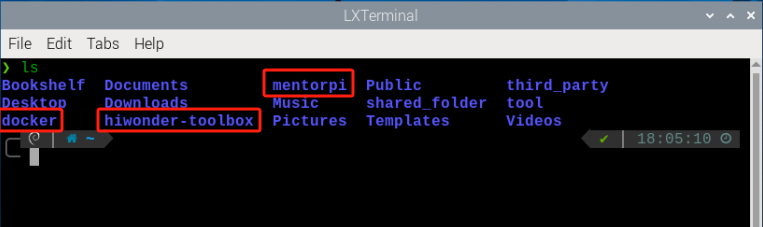
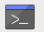

# 2. Remote Tool Installation and Container Access

<p id="anchor_2_1"></p>

## 2.1 VNC Installation and Connection

### 2.1.1 Getting Ready

* **Hardware Preparation**

(1) A laptop is required. If you're using a desktop computer, please ensure you have a wireless network adapter that supports the 5GHz frequency band.

* **VNC Remote Tool Installation**

VNC is a graphical remote control software that allows you to operate your Raspberry Pi directly from your computer via the Wi-Fi hotspot created by the Raspberry Pi.
Follow the steps below to install VNC:

(1) In the **"folder"**, double-click the [VNC-Viewer-6.17.731-Windows](resources_download.md) file. When the dialog box appears, select **"English"** as the installation language and click **"OK"**.


(2) Click **"Next"** to proceed.


(3) In the **"License Agreement"** window, select **"I accept the terms in the License Agreement"**, then click **"Next"**.


(4) Keep the default installation location and click **"Next"**. When you are taken to the next screen, simply click **"Install"**.


(5) Once the installation is complete, click **"Finish"**.


(6) After the installation, double-click the VNC Viewer icon  to open the program and begin connecting.

### 2.1.2 Turn on Device

After connecting the power adapter, please turn on the Raspberry Pi expansion board. The LED1 indicator will light up first, followed by a sound from the buzzer, indicating that the robot has successfully powered on.

### 2.1.3 Device Connection

(1) After turning on, it is the AP direct connection mode by default, and Raspberry Pi will launch a hotspot starting with **"HW"**. Please search for and connect to this hotspot on your computer, as shown below:


(2) Click connection, input the password **"hiwonder"**.


(3) Enter the default IP address of the Raspberry Pi **192.168.149.1** in the opened VNC Viewer, and then press **"Enter"**. If the software warns that the connection is not safe, just click **"Continue"**.


(4) Enter the password **"raspberrypi"** in the pop-up prompt box (if it requires you to enter an account name, use **"pi"**), then check the **"Remember password"** box, and then click **"OK"**. The Raspberry Pi's desktop will now display on your computer's monitor.


(5) After entering the Raspberry Pi interface, a warning dialogue box will pop up (This is normal), click **"OK"** to close it (if a black screen occurs, please restart the Raspberry Pi).


### 2.1.4 Interface Introduction

After successfully connecting to the MentorPi via VNC, the operating interface will appear as shown below:


The following table provides an explanation of commonly used functions:

| **Icon** | **Function** |
|:--:|:--:|
|  | Application menu. Click it to select different applications. |
|  | Browser comes with the system. |
|  | File management. |
|  | `LX Terminal`. Click it to open a command line terminal for entering commands. |
|  | Trash can allows you to recover recently deleted files. |
|  | PC software allows you to adjust the the position of the pan-tilt and color threshold. |
|  | Click it to enable or disable full-screen display of the desktop. |
|  | Exit full-screen mode. |
|  | Power. Click it to shut down, restart, or log out of the system. |

## 2.2 Robot Version Configuration Instruction

MentorPi offers multiple chassis options (Mecanum wheel or Ackermann steering) and different camera versions. If you need to switch between robot configurations or camera types, please follow the steps below:

* **Configuration Steps**

(1) Start the robot and connect it to the VNC. For detailed steps on setting up the connection, please refer to [2.1 VNC Installation and Connection](#anchor_2_1).

(2) In the remote desktop, double-click the robot system configuration tool . Then, click the **"Execute"** button to launch it.


(3) Select the appropriate camera type under the Camera Type dropdown:


① "ascamera" represents the 3D depth camera.

② "usb_cam" represents the 2D monocular camera.

③ aurora: refers to the DEPTRUM depth camera used in the robot.

(4) Choose the correct Lidar type:


<p style="text-align:center">LD19 Lidar</p>


<p style="text-align:center">MS200 Lidar</p>

(5) Click the buttons in the following order: **"Save"** → **"Apply"** → **"Quit"**. This sequence must be followed to successfully apply the new configuration.


(6) Wait for a beep sound from the buzzer, indicating that the chassis type has been successfully updated. Then, open the terminal  or related tool to check the ROS2 system environment.


## 2.3 System Introduction

### 2.3.1 Desktop Overview

After establishing a remote connection via VNC, the Raspberry Pi system desktop will appear as shown in the image below:


| **Icon** | **Function** |
|:----:|:----:|
|  | Version Switching Tool: switch between different versions and configurations of the robot car. |
|  | Color model parameter adjustment tool. |
|  | Command Line Terminal: input commands for operations. |
|  | Recycle bin. |
|  | Raspberry Pi menu bar. |
|  | System file folder. |

### 2.3.2 Programming Instruction

:::{Note}
Commands are case-sensitive and require correct spacing. You can use the **TAB** key to auto-complete keywords.
:::

(1) Click the  or press Ctrl + Alt + T to launch the `LX Terminal`.


(2) Type the following command and press Enter:

```
ls
```



| **Directory** | **Function Description** |
|:--:|:--:|
| MentorPi | Contains debugging tools specific to `MentorPi` |
| hiwonder-toolbox | Wi-Fi management tool. |
| docker | Shared folder between the Raspberry Pi system and the Docker container |

All function games and source code related to MentorPi are stored inside the Docker container. You must enter the container to access them.

(3) Click  on the top left corner of the desktop to open a new terminal.


(4) In the terminal, enter the following command to view active and previously run containers:

```
docker ps -a
```


(5) Use the following command to access the container:

:::{Note}
Replace `<container_id>` with the actual container ID. It can be abbreviated as long as it remains unique.
:::

```
docker exec -it -u ubuntu -w /home/ubuntu adb8 /bin/bash
```


(6) Enter the following command, and press "Enter" to list all current files. Let's focus on these two directories shown below.

```
ls
```


| **Directory** | **Function** |
|:-------------:|:-------------------------------:|
| `app` | Store app game function package |
| `example` | Game case |
| `bringup` | Reference to app function |
| `driver` | Underlying control |
| `interfaces` | Program interface |
| `peripherals` | Hardware driver |
| `navigation` | Navigation |
| `slam` | Mapping |
| `yolov5_ros2` | yolov5 game |
| `simulations` | urdf description |

## 2.4 Docker Introduction & Usage

### 2.4.1 Docker Introduction

Docker is an open-source platform and tool that allows you to package, distribute, and run applications within containers. A container is a lightweight, standalone, and executable package that includes everything needed to run an application: code, runtime, system tools, libraries, and configuration files.

By utilizing Linux's containerization technology, Docker provides efficient isolation between applications, allowing multiple containers to operate independently on the same physical device.

In essence, Docker simplifies application deployment and improves portability across different environments, making it highly convenient for software development and distribution.


<p style="text-align:center">Docker Logo</p>

Docker Official Website: [http://www.docker.com](http://www.docker.com)

Docker Chinese Website: [https://www.docker-cn.com](https://www.docker-cn.com)

Docker Hub (Repository) Official Website: [https://hub.docker.com](https://hub.docker.com)

### 2.4.2 Docker Commands

:::{Note}
All necessary Docker configurations have been pre-installed in the container before shipment.
:::

All of the robot's programs and functional modules run inside a Docker container. The following section introduces some commonly used Docker commands to help you better operate the system.

(1) Turn on the device. Follow the instructions in [2.1 VNC Installation and Connection](#anchor_2_1) to connect to the computer via VNC.


(2) Click  in the upper left corner of the system desktop to open the terminal window.


### 2.4.3 Check Container

Command parameters: `docker ps [OPTIONS]`

Commonly used parameters:

* **-a**: Lists all containers, including those that are currently running and those that have exited
* **-l**: Displays the most recently created container
* **-n=?:** Shows the n most recently created containers
* **-q**: Quiet mode—displays only the container IDs

Enter the following command and press **"Enter"** to display a list of running and previously run containers. The output will show the **"container ID"**, which is the unique identifier for each container, the **"image"**, which indicates the name of the image used, the **"created"** time, which shows when the container was created, and the **"status"**, which indicates the current state of the container.

```
docker ps -a
```


### 2.4.4 Enter Container

Obtain the unique container ID from the output of **"2.4.3 Check Container."** Then, enter the following command to access the container containing the function programs.

```
docker exec -it -u ubuntu -w /home/ubuntu adb8 /bin/bash
```

:::{Note}
The container ID can be abbreviated as long as it remains unique to the container.
:::


### 2.4.5 Exit Container

There are two commands for exiting containers:

* **Method 1:**

(1) Enter the command below and press "Enter". This stops the container and exits it.

```
exit
```


* **Method 2:**

(1) Use "crtl+P+Q". This detaches from the container without stopping it. Then use `docker ps` to verify that it is still running:

```
docker ps
```


## 2.5 MentorPi Servo Deviation Adjustment

### 2.5.1 Preface

If you purchased a monocular camera version, the system includes several PWM servos that serve as the core components for steering control. Due to assembly tolerances, you may encounter slight deviations—such as the vehicle veering slightly to one side—even after the servos are powered on and set to their neutral positions.
This document provides step-by-step guidance to help you manually adjust the servo alignment and correct these deviations.

### 2.5.2 Operation Steps

(1) Start the robot and access the robot system using the remote control software VNC according to the instructions provided in [2.1 VNC Installation and Connection](#anchor_2_1).

(2) Execute the command below to disable the app auto-start service.

```
~/.stop_ros.sh
```

(3) Click-on  and input the following command to run the deviation adjustment script.

```
./Servo.sh
```

(4) After executing the command, a pop-up window will appear as shown below.


Servo 1: Refers to the servo at the **J3** marking on the expansion board

Servo 2: Refers to the servo at the **J4** marking on the expansion board

Servo 3: Refers to the servo at the **J5** marking on the expansion board

Servo 4: Refers to the servo at the **J6** marking on the expansion board

(5) Drag the four sliders shown below to adjust the corresponding servo offsets. The servos will rotate in real time during the adjustment, allowing you to observe their movement and fine-tune the deviation accordingly.


(6) If you're not satisfied with the adjustment results, click the 'Set Center Position' button to reset all servo offsets to their default center positions and readjust as needed.


(7) After adjusting the servos to the desired positions, click the 'Save Offsets' button to save the calibration settings.

Below is the storage path.


The following file will be saved:


After completing this step, the offset values will be stored. In all future applications involving the servos, this offset file will be automatically loaded to compensate for any servo deviations.

(8) You may also enter the following command and press Enter to launch the chassis control node and verify that the offset values have been applied correctly.

```
ros2 launch ros_robot_controller ros_robot_controller.launch.py
```

It can be confirmed that the offset values have been successfully saved to the file and can be correctly loaded in other applications.

