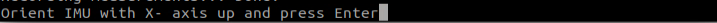
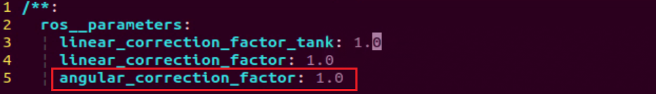

# 3. Motion Control Courses

## 3.1 Motion Analysis of Tank Chassis

### 3.1.1 Hardware Structure

The track is a flexible loop driven by the drive sprocket and runs around the drive sprocket, road wheels, idler wheels, and support rollers.

The track is composed of track plates, track pins, and other components.


### 3.1.2 Physical Characteristic


* **Drive Sprocket**

The drive sprocket is part of the track propulsion system. It transfers power from the motor to the tracks, allowing the tank to move. It’s usually located at the rear of the chassis.

* **Road Wheels**

Road wheels support the weight of the tank and help guide the tracks. They ensure that the track presses evenly against the ground, improving stability and ride smoothness.

* **Idler Wheel**

Positioned based on the location of the drive sprocket—typically at the front—the idler wheel helps guide the track along the correct path. It prevents the track from slipping off or going off-course.

* **Support Rollers**

Support rollers hold up the upper section of the track to prevent it from sagging too much or slipping sideways. They also help reduce vibration while the tank is moving.

* **Chassis**

The chassis is the main base of the tank, and it moves using a continuous track system. As the drive sprocket turns, it pulls the track, which unrolls at the front and lays flat under the road wheels. At the same time, the rear part of the track is pulled back up and looped around again. This continuous motion is what propels the tank forward—almost like it’s moving on a self-laying track.

### 3.1.3 Kinematics Working Principle and Formula

To understand how a tracked robot moves, we can analyze its kinematics — specifically, how the speeds of its wheels relate to the robot’s overall motion. Here are the key concepts and how they work together:


(1) B – Track Width:
The distance between the two drive wheels (usually measured in meters).

(2) R – Turning Radius:
The radius of the curve the robot follows when moving and turning at the same time (in meters).

(3) Vₓ – Forward/Backward Speed:
The target speed at the robot's center point (O), positive when moving forward (in m/s).

(4) Vᵧ – Side-to-Side Speed:
The lateral speed at point O (positive when moving left), in m/s. (Note: usually ignored for two-wheel differential systems.)

(5) V𝜔 – Rotational Speed:
The angular velocity of the robot rotating around its center point O. Positive when rotating counterclockwise (in radians per second).

(6) Vₗ / Vᵣ – Left and Right Wheel Speeds:
The speed of the left and right drive wheels, respectively (positive for forward), in m/s.

(7) Sₗ / Sₒ / Sᵣ – Distance Traveled Over Time (t):
The paths traveled by the left wheel, center point O, and right wheel, over a time duration t.

(8) θ – Rotation Angle:
How much the robot has rotated in time t (in radians).

* **Core Kinematic Formulas**

(1) Let’s now examine the relationships between these parameters and derive the forward and inverse kinematics equations for a tracked robot with differential drive.
According to the principle that distance is the integral of velocity over time, we get:

 

(2) According to the formula: angle (in radians) = arc length ÷ radius, we obtain:


(3) Dividing both sides of the equation by t gives us the result after integrating with respect to time:


(4) Based on the above equations, we can derive the inverse kinematics. Given the robot's target linear and angular velocities ( V<sub>x</sub> and V<sub>ω</sub> ), the corresponding left and right wheel speeds ( V<sub>L</sub> and  V<sub>R</sub>) can be calculated as follows:


(5) From the inverse kinematics equations, we can derive the forward kinematics. Given the current speeds of the left and right drive wheels (V<sub>L</sub>and V<sub>R</sub>), the robot’s real-time linear velocity (V<sub>x</sub>) and angular velocity (V<sub>R</sub>) can be calculated as follows:

 

### 3.1.4 Program Outcome

In this robot series, the kinematic analysis and basic chassis control code are all centralized in the script and configuration files located under the path: `ros2_ws/src/driver/controller/controller`

::: {Note}
In the code snippet shown below, the value of `machine_type` is set to `MentorPi_Tank` for the Ackermann chassis. Other launch and configuration files are generally similar and can be referred to as needed.
:::


## 3.2 IMU, Linear Velocity and Angular Velocity Calibration

::: {Note}
* The robot has been calibrated at the factory and does not require additional calibration. The following information is provided for reference only. If you notice significant deviations during movement—such as the robot drifting to one side when moving forward or being unable to travel straight—you may refer to the tutorial below for calibration instructions.
* Calibration helps reduce deviations, but inherent hardware variations may still occur. Adjust the calibration to a level that meets your specific needs and requirements.
:::

If the robot exhibits deviations during operation, it may require calibration of the IMU, linear velocity, and angular velocity. Once the calibration is complete, the robot can resume normal operation.

### 3.2.1 IMU Calibration

The IMU (Inertial Measurement Unit) is a device used to measure the three-axis attitude angles (angular velocity) and acceleration of an object. The IMU consists of a gyroscope and an accelerometer, providing 6 degrees of freedom to measure angular velocity and acceleration in three-dimensional space.


Upon receiving the first IMU message, the system will prompt you to maintain the IMU in a specific orientation. After this, press Enter to record the measurement values. Once measurements are completed in all 6 directions, the system will calculate the calibration parameters and save them to the specified YAML file. The specific steps are as follows:

::: {Note}
The input commands are case-sensitive, and keywords can be autocompleted by pressing the Tab key.
:::

(1) Start the robot, and access the robot system desktop using VNC.

(2) Click-on  to open the command-line terminal.

(3) Execute the command to disable the app auto-start service.

```
~/.stop_ros.sh
```

(4) Enter the command and hit Enter key to enable the chassis control node:

```
ros2 launch ros_robot_controller ros_robot_controller.launch.py
```

(5) Open a new ROS2 command-line terminal, then input the following command, and hit Enter key to initiate IMU calibration:

```
ros2 run imu_calib do_calib --ros-args -r imu:=/ros_robot_controller/imu_raw --param output_file:=/home/ubuntu/ros2_ws/src/calibration/config/imu_calib.yaml
```

(6) When the following prompt appears, position the robot in the first-person perspective, aligning it to face forward, and then press Enter. The initial direction it faces will be defined as **"forward,"** and all subsequent placements should be based on this reference.


After you have successfully calibrated in each direction, the following prompt will appear.


(7) Align the robot to the rear, then press Enter.




(8) Align the robot to the left, then hit Enter.


(9) Align the robot to the right, then press Enter.


(10) Lift the robot and position it facing upwards, then press Enter. When placing it vertically, ensure stability to avoid any tipping or collisions. Use your hand for support to protect the depth camera and the 2D pan-tilt from potential damage.


(11) Place the robot as pictured, then hit Enter.


(12) If the below prompt shows up, it means the calibration is complete. To exit, use short-cut **“ctrl+c.”**


(13) After calibration, execute the command to verify the calibrated model.

```
ros2 launch peripherals imu_view.launch.py
```

(14) You can move the robot to see if it matches the angle and direction of the model.


(15) To exit the game, press **Ctrl+C** in the terminal.

After exiting, you can re-enable the app service either by entering a command or simply restarting the robot. Without this service running, app-related functions will not work. If the robot is restarted, the app service will start automatically.

To manually start the app service:

Click  and enter the command, and press **Enter**. Wait for the buzzer to beep, indicating the service has started.

::: {Note}
Be sure to run the command in the **system terminal**, not inside the Docker container.
:::

```
sudo systemctl restart start_node.service
```

### 3.2.2 Angular Velocity Calibration

For robots that do need angular velocity calibration, the process involves the robot performing a full, independent rotation. During this test, it’s essential to mark the robot’s starting orientation to accurately observe any drift or deviation throughout the rotation.

The detailed calibration steps are as follows:

::: {Note}
Command input is case-sensitive. You can use the Tab key to auto-complete keywords.
:::

(1) Position the robot on a flat surface, and place a piece of tape or another marker directly in front of its center to serve as a reference point.

(2) Start the robot, and connect it to the robot system desktop using VNC.

(3) Click-on  to open the command-line terminal.

(4) Enter the command and hit Enter to disable the app auto-start service.

```
~/.stop_ros.sh
```

(5) Before calibration, access the directory of calibration configuration files to open the files.

```
cd ~/ros2_ws/src/driver/controller/config && vim calibrate_params.yaml
```

(6) Modify the angular velocity parameter to `1.0`, then proceed with the calibration.



(7) After modifying, press **“ESC.”** Enter **“:wq”** to exit and save.

(8) Enter the command and press enter to start the angular velocity calibration.

```
ros2 launch calibration angular_calib.launch.py
```

Click **"calibrate_angular"** on the left side. The calibration interface will appear as shown below.


① `test_angle`: Specifies the test rotation angle, with a default value of 360°.

② `speed`: Indicates the linear velocity, set by default to 0.15 meters per second.

③ `tolerance`: Represents the allowable error margin. A smaller value leads to more noticeable oscillation when the robot reaches the target position.

④ `odom_angle_scale_correction`: Used to adjust the scale correction for odometry angle measurements.

⑤ `start_test`: A button to initiate the test for odometry angle scale correction.


Ensure the robot is properly aligned, with the marker positioned directly in front of it. Then check the **"start_test"** option to begin the test—this will cause the robot to rotate in place. If the robot does not complete a full rotation, adjust the **"odom_angle_scale_correction"** parameter, which controls the scaling of the motor's rotational output. It is recommended to fine-tune this value in increments of 0.01.


(9) After calibration, enter the command to navigate to the directory containing calibration configuration files. Modify to the calibrated parameter value.

```
cd ~/ros2_ws/src/driver/controller/config && vim calibrate_params.yaml
```

Press **‘I’** key to navigate to the editing mode, and modify the value of **"angular_correctqion_factor"** to the adjusted value of **"odom_angule_scale_correction".**


::: {Note}
The aforementioned operations are conducted on the Mecanum-wheel version.
:::

(10) After modification, press the **"ESC"** key, enter **":wq"** to exit and save the changes.

(11) If you want to exit the game, press **“Ctrl+C”** in the terminal interface.

After finishing the game, you can enable the app service either by entering a command or by restarting the robot. If the app service is not enabled, related app functions will not operate. Restarting the robot will automatically enable the app.

Click  and enter the corresponding command, press Enter to launch the app, and wait for the buzzer to beep as confirmation.

::: {Note}
Be sure to enter the command in the system path, not within the Docker container.
:::

```
sudo systemctl restart start_node.service
```

### 3.2.3 Linear Velocity Calibration

The Ackermann version does not require angular velocity calibration.

::: {Note}
The input command is case-sensitive, and keywords can be completed using the Tab key.
:::

Position the robot on a flat and open surface. Mark the starting point with tape or any other indicator in front of the robot, and position the endpoint tape or another marker 1 meter ahead of the robot.

(1) Start the robot, and access the robot system desktop using VNC.

(2) Click-on  to open the command-line terminal.

(3) Execute the command and hit Enter to disable the app auto-start service.

```
~/.stop_ros.sh
```

(4) Before calibration, navigate to the directory of calibration configuration files to open them.

```
cd ~/ros2_ws/src/driver/controller/config && vim calibrate_params.yaml
```

(5) Modify the linear velocity parameter **“linear_correction_factor”** to `1.0`, then proceed with the calibration.


(6) After modifying, press **“ESC.”** Enter **“:wq”** to exit and save.

(7) Enter the command and press enter to start the linear velocity calibration.

```
ros2 launch calibration linear_calib.launch.py
```

(8) Click **"calibrate_linear"** on the left side. The calibration interface will appear as shown below.


The meanings of parameters on the left side of the interface are as follows:

① The first parameter **"test_distance"** represents the testing distance, with a default value of 1 meter.

② The second parameter **"speed"** represents the linear velocity, with a default value of 0.2 meters per second.

③ The third parameter **"tolerance"** represents the error value. A smaller error value results in greater robot shaking after reaching the target position.

④ The fourth parameter **"odom_linear_scale_correction"** represents the odometer linear scale correction.

⑤ The fifth parameter **"start_test"** is the button to start testing the odometer linear scale correction.


(9) Ensure the robot is properly aligned and positioned at the starting point marker. Check the box for **"start_test"** and the robot will move forward. If there is deviation, adjust the value of **"odom_linear_scale_correction".** This value adjusts the motor's scaling factor for forward movement. It is recommended to adjust this value by increments of 0.01 each time.


(10) After calibration, enter the command to navigate to the directory containing calibration configuration files. Modify to the calibrated parameter value.

```
cd ~/ros2_ws/src/driver/controller/config && vim calibrate_params.yaml
```

(11) Press **‘I’** key to navigate to the editing mode, and modify the value of **"linear_correctqion_factor"** to the adjusted value of **"odom_linear_scale_correction".**


(12) After modification, press the **"ESC"** key, enter **":wq"** to exit and save the changes.

(13) If you want to exit the game, press **“Ctrl+C”** in the terminal interface.

After experiencing the game, you can enable the app service through commands or by restarting the robot. If the app is not enabled, the related app functions will not work. If the robot is restarted, the app will be automatically enabled.

Click  and enter the command. Press enter to start the app, and wait for the buzzer to beep.

::: {Note}
Please enter the command in the system path, not in the Docker container.
:::

```
sudo systemctl restart start_node.service
```

## 3.3 Publish IMU and Odometer Data

In robot navigation, accurately calculating real-time position is essential. Normally, we obtain odometer information using motor encoders and the robot's kinematic model. However, in specific situations, like when the robot's wheels rotate in place or when the robot is lifted, it may move a distance without the wheels actually turning.

To address wheel slip or accumulated errors in such cases, combining IMU and odometer data can yield more precise odometer information. This improves mapping and navigation accuracy in scenarios where wheel slip or cumulative errors may occur.

### 3.3.1 Introduction to IMU and Odometer

The IMU (Inertial Measurement Unit) is a device that measures the three-axis attitude angles (angular velocity) and acceleration of an object. It consists of the gyroscope and accelerometer as its main components, providing a total of 6 degrees of freedom to measure the object's angular velocity and acceleration in three-dimensional space.

An odometer is a method used to estimate changes in an object's position over time using data obtained from motion sensors. This method is widely applied in robotic systems to estimate the distance traveled by the robot relative to its initial position.

There are common methods for odometer positioning, including the wheel odometer, visual odometer, and visual-inertial odometer. In robotics, we specifically use the wheel odometer. To illustrate the principle of the wheel odometer, consider a carriage where you want to determine the distance from point A to point B. By knowing the circumference of the carriage wheels and installing a device to count wheel revolutions, you can calculate the distance based on wheel circumference, time taken, and the number of wheel revolutions.

While the wheel odometer provides basic pose estimation for wheeled robots, it has a significant drawback: accumulated error. In addition to inherent hardware errors, environmental factors such as slippery tires due to weather conditions contribute to increasing odometer errors with the robot's movement distance.

Therefore, both IMU and odometer are essential components in a robot. These two components are utilized to measure the three-axis attitude angles (or angular velocity) and acceleration of the object, as well as to estimate the distance, pose, velocity, and direction of the robot relative to its initial position.

To address these errors, we combine IMU data with odometer data to obtain more accurate information. IMU data is published through the `"/imu"` topic, and odometer data is published through `"/odom"`. After obtaining data from both sources, the data is fused using the **"ekf"** package in ROS, and the fused localization information is then republished.

* **IMU Data Publishing**

(1) Initiate Service

::: {Note}
The input command is case-sensitive, and keywords can be completed using the Tab key.
:::

① Start the robot, and access the robot system desktop using VNC.

② Click-on  to open the command-line terminal.

③ Execute the command, and hit Enter to disable the app auto-start service.

```
~/.stop_ros.sh
```

④ Enter the command and press Enter to enable the chassis control node.

```
ros2 launch ros_robot_controller ros_robot_controller.launch.py
```

⑤ Create a new command line terminal. Enter the command and press Enter to publish the IMU data.

```
ros2 launch peripherals imu_filter.launch.py
```

(2) Data Viewing

① Open a new command line terminal, and execute the command to check the current topic.

```
ros2 topic list
```

② Enter the command to view the type, publisher, and subscribers of the `"/imu"` topic. You can replace `"/imu"` with the topic you want to view. The type of this topic is **"sensor_msgs/msg/Imu".**

```
ros2 topic info /imu
```

③ Use the following command to display the content of the topic message. Feel free to replace `'imu'` with the name of the topic you wish to view.

```
ros2 topic echo /imu
```


The terminal will display the data from the three axes of the IMU.

④ If you want to exit the game, press **“Ctrl+C”** in the terminal interface.

After experiencing the game, you can enable the app service through commands or by restarting the robot. If the app is not enabled, the related app functions will not work. If the robot is restarted, the app will be automatically enabled.

⑤ Click  and enter the command. Press enter to start the app, and wait for the buzzer to beep.

::: {Note}
Please enter the command in the system path, not in the Docker container.
:::

```
sudo systemctl restart start_node.service
```

* **Odometer Data Publishing**

(1) Initiate Service

::: {Note}
The input command is case-sensitive, and keywords can be completed using the Tab key.
:::

① Start the robot, and connect it to the robot system desktop using VNC.

② Click-on  to open the command-line terminal.

③ Enter the command and hit Enter to disable the app auto-start service.

```
~/.stop_ros.sh
```

④ Run the command to publish the odometer data.

```
ros2 launch controller odom_publisher.launch.py
```

(2) Data Viewing

① Open a new command line terminal, and run the command below to check the current topic.

```
ros2 topic list
```

② Enter the command to view the type, publisher, and subscribers of the `"/odom_raw"` topic. You can replace `"/odom_raw"` with the topic you want to view. The type of this topic is **"nav_msgs/msg/Odometry".**

```
ros2 topic info /odom_raw
```

③ Enter the command to print the topic message contents. You can replace the topic you want to view as needed.

```
ros2 topic echo /odom_raw
```


The message content includes acquired pose and velocity data.

④ If you want to exit the game, press **“Ctrl+C”** in the terminal interface.

After experiencing the game, you can enable the app service through commands or by restarting the robot. If the app is not enabled, the related app functions will not work. If the robot is restarted, the app will be automatically enabled.

Click  and enter the command. Press enter to start the app, and wait for the buzzer to beep.

::: {Note}
Please enter the command in the system path, not in the Docker container.
:::

```
sudo systemctl restart start_node.service
```

## 3.4 Tank Chassis Speed Control

In this lesson, you’ll learn how to control the movement and direction of a tracked robot by adjusting its linear and angular velocity parameters.

### 3.4.1 Program Logic

The robot’s movement is controlled by changing the rotation direction and speed of its drive wheels. This allows it to move forward, backward, turn in place, or shift side to side (if supported).

In the program, the robot listens to the `/controller/cmd_vel` topic, which sends commands for linear and angular velocity. Based on these values, the system calculates how the robot should move.

You can find the source code for this functionality in the Docker container at:

[/home/ubuntu/ros2_ws/src/driver/controller/controller/odom_publisher_node.py](../_static/source_code/controller.zip)

{lineno-start=70}

```
class Controller(Node):
    
    def __init__(self, name):
        rclpy.init()
        super().__init__(name)

        self.x = 0.0
        self.y = 0.0
        self.linear_x = 0.0
        self.linear_y = 0.0
        self.angular_z = 0.0
        self.pose_yaw = 0
        self.last_time = None
        self.current_time = None
        signal.signal(signal.SIGINT, self.shutdown)

        self.ackermann = ackermann.AckermannChassis(wheelbase=0.145, track_width=0.133, wheel_diameter=0.067)
        self.mecanum = mecanum.MecanumChassis(wheelbase=0.1368, track_width=0.1446, wheel_diameter=0.065)

        # Declare parameters
        self.declare_parameter('pub_odom_topic', True)
        self.declare_parameter('base_frame_id', 'base_footprint')
        self.declare_parameter('odom_frame_id', 'odom')
        self.declare_parameter('linear_correction_factor', 1.00)
        self.declare_parameter('linear_correction_factor_tank', 0.52)
        self.declare_parameter('angular_correction_factor', 1.00)
        self.declare_parameter('machine_type', os.environ['MACHINE_TYPE'])
        
        self.pub_odom_topic = self.get_parameter('pub_odom_topic').value
        self.base_frame_id = self.get_parameter('base_frame_id').value
        self.odom_frame_id = self.get_parameter('odom_frame_id').value
```

### 3.4.2 Operation Steps

::: {Note}
The input command is case-sensitive, and keywords can be completed using the Tab key.
:::

(1) Start the robot, and access the robot system desktop using VNC.

(2) Click-on  to open the command-line terminal.

(3) Execute the command, and hit Enter to disable the app auto-start service.

```
~/.stop_ros.sh
```

(4) Execute the command below to initiate the motion control service.

```
ros2 launch controller controller.launch.py
```

* **Modify Linear Velocity**

(1) Open a new ROS2 command-line terminal, then enter the following command to enable the linear velocity control.

```
ros2 topic pub /controller/cmd_vel geometry_msgs/Twist "linear:
x: 0.0
y: 0.0
z: 0.0
angular:
x: 0.0
y: 0.0
z: 0.0"
```

The `linear` field is used to set the robot’s linear velocity. From the robot’s first-person perspective, the positive X-axis points forward, and the positive Y-axis points to the left. There is no movement along the Z-axis.
By adjusting the direction and magnitude of the linear velocity, the robot can move forward, backward, or shift left and right.

::: {Note}
* In this scenario, the linear velocity (x) is measured in meters per second, and it is advisable to maintain it within the range of **"-0.6 to 0.6".**

* The z value represents the robot’s angular velocity around the vertical axis — in other words, its yaw rate. It is recommended to keep this value within the range of **-2 to 2.**

  A value of `0` means no rotation.

  A **positive** value indicates counterclockwise rotation.

  A **negative** value indicates clockwise rotation.

  The larger the absolute value, the faster the robot rotates.
  :::

The `angular` parameter defines the robot’s rotational speed.

* A positive Z value makes the robot turn left.
* A negative Z value makes it turn right.
* There is no rotation along the X or Y axes.

You can use the left and right arrow keys on your keyboard to adjust this value.

For example, to move the robot forward, set the linear velocity along the X-axis to `0.1`.


(2) To bring the robot car to a stop, open a new terminal and set the linear velocity to `‘0.0’`.


(3) If you need to terminate this program, use short-cut **‘Ctrl+C’.**

::: {Note}
To bring the robot car to a stop, please create a new terminal and adjust the linear velocity. Using the **‘Ctrl+C’** shortcut alone may not effectively halt the robot car.
:::

* **Change Angular Speed**

(1) Open a new ROS2 command-line terminal, then enter the following command to enable the angular velocity control.

```
ros2 topic pub /controller/cmd_vel geometry_msgs/Twist "linear:
x: 0.0
y: 0.0
z: 0.0
angular:
x: 0.0
y: 0.0
z: 0.0"
```

**"angular"** sets the angular velocity of the robot. A positive value for **"Z"** will make the robot turn left, while a negative value for **"Z"** will make it turn right. There is no motion in the X and Y directions.

::: {Note}
* In this scenario, the linear velocity (x) is measured in meters per second, and it is advisable to maintain it within the range of **"-0.6 to 0.6".**

* The **Z-axis value** controls the robot’s **turning speed**, also known as its **yaw angular velocity**. This determines how quickly the robot rotates in place.

  A value of `0` means no rotation.

  A **positive** value makes the robot turn left (counterclockwise).

  A **negative** value makes it turn right (clockwise).

  The greater the absolute value, the faster the robot turns.
  :::

It’s recommended to keep this value within the range of **-2 to 2** for safe and stable movement.

Use the **left and right arrow keys** on the keyboard to adjust the corresponding parameters.
For example, to make the robot **rotate in place to the left**, set the angular velocity **Z value to** `1.0`, then press **Enter** to execute the command.


(2) To bring the robot car to a stop, open a new terminal and set the angular velocity to `‘0.0’`.


(3) If you want to exit the game, press **“Ctrl+C”** in the terminal interface.

::: {Note}
Create a new terminal to stop the robot, and then close the node to shut down properly. If you directly press **Ctrl+C** to close the terminal, the robot may not stop.
:::

After finishing the interactive experience, you can start the mobile app service either by running a command or simply rebooting the robot.
If the mobile app service is not activated, app-related features will not function properly.
(**Note:** The mobile app service will automatically start when the robot is rebooted.)

To start the service manually:

① Click the **terminal icon**  at the top left corner of the desktop.
(Important: You must enter the command in the **system environment**, not inside the Docker container.)

② In the terminal (system path), type the command and press **Enter**.

③ Wait for a short beep sound — this indicates the app service has started successfully.

```
sudo systemctl restart start_node.service
```

### 3.4.3 Program Analysis
[Source Code]()


The files include **'controller.launch.py'** for launch configuration, **'calibrate_params.yaml'** for parameter configuration, and **'odom_publisher.py'** for program execution.

During startup, the launch file is executed first. It loads the YAML configuration file and passes the parameters to the ROS nodes. Subsequently, the nodes initialize by reading the configuration parameters from the ROS nodes and communicate with other nodes to collaboratively implement functionalities.

* **Launch File**

[Source Code]()


The launch file is located in: [/home/ubuntu/ros2_ws/src/driver/controller/launch/controller.launch.py]()

{lineno-start=1}
```python
import os
from ament_index_python.packages import get_package_share_directory

from launch_ros.actions import Node
from launch.conditions import IfCondition
from nav2_common.launch import ReplaceString
from launch import LaunchDescription, LaunchService
from launch.substitutions import LaunchConfiguration
from launch.launch_description_sources import PythonLaunchDescriptionSource
from launch.actions import DeclareLaunchArgument, IncludeLaunchDescription, GroupAction, TimerAction, OpaqueFunction

def launch_setup(context):
    compiled = os.environ['need_compile']
    namespace = LaunchConfiguration('namespace', default='')
    use_namespace = LaunchConfiguration('use_namespace', default='false').perform(context)
    use_sim_time = LaunchConfiguration('use_sim_time', default='false')
    enable_odom = LaunchConfiguration('enable_odom', default='true')
    map_frame = LaunchConfiguration('map_frame', default='map')
    odom_frame = LaunchConfiguration('odom_frame', default='odom')
    base_frame = LaunchConfiguration('base_frame', default='base_footprint')
    imu_frame = LaunchConfiguration('imu_frame', default='imu_link')
    frame_prefix = LaunchConfiguration('frame_prefix', default='')

    namespace_arg = DeclareLaunchArgument('namespace', default_value=namespace)
    use_namespace_arg = DeclareLaunchArgument('use_namespace', default_value=use_namespace)
    use_sim_time_arg = DeclareLaunchArgument('use_sim_time', default_value=use_sim_time)
    enable_odom_arg = DeclareLaunchArgument('enable_odom', default_value=enable_odom)
    map_frame_arg = DeclareLaunchArgument('map_frame', default_value=map_frame)
    odom_frame_arg = DeclareLaunchArgument('odom_frame', default_value=odom_frame)
    base_frame_arg = DeclareLaunchArgument('base_frame', default_value=base_frame)
    imu_frame_arg = DeclareLaunchArgument('imu_frame', default_value=imu_frame)
    frame_prefix_arg = DeclareLaunchArgument('frame_prefix', default_value=frame_prefix)
```
* **Set the storage path**

Retrieve the paths for the two packages: peripherals and controller.

{lineno-start=34}
```python
    if compiled == 'True':
        peripherals_package_path = get_package_share_directory('peripherals')
        controller_package_path = get_package_share_directory('controller')
    else:
        peripherals_package_path = '/home/ubuntu/ros2_ws/src/peripherals'
        controller_package_path = '/home/ubuntu/ros2_ws/src/driver/controller'
```
* **Initiate other Launch files**

{lineno-start=42}
```python
    odom_publisher_launch = IncludeLaunchDescription(
        PythonLaunchDescriptionSource([os.path.join(controller_package_path, 'launch/odom_publisher.launch.py')
        ]),
        launch_arguments={
            'namespace': namespace,
            'use_namespace': use_namespace,
            'imu_frame': imu_frame,
            'frame_prefix': frame_prefix,
            'base_frame': base_frame,
            'odom_frame': odom_frame
        }.items()
    )

    imu_filter_launch = IncludeLaunchDescription(
        PythonLaunchDescriptionSource([os.path.join(peripherals_package_path, 'launch/imu_filter.launch.py')
        ])
    )
```
(1) `odom_publisher_launch` Odometer launch

(2) `imu_filter_launch` IMU launch

* **Initiate Node**

Launch the EKF fusion node.

{lineno-start=60}
```python
    if use_namespace == 'false':
        ekf_param = ReplaceString(source_file=os.path.join(controller_package_path, 'config/ekf.yaml'), replacements={'namespace/': ''})
    else:
        ekf_param = ReplaceString(source_file=os.path.join(controller_package_path, 'config/ekf.yaml'), replacements={"namespace/": (namespace, '/')})
    
    ekf_filter_node = Node(
        package='robot_localization',
        executable='ekf_node',
        name='ekf_filter_node',
        output='screen',
        parameters=[ekf_param, {'use_sim_time': use_sim_time}],
        remappings=[
            ('/tf', 'tf'),
            ('/tf_static', 'tf_static'),
            ('odometry/filtered', 'odom'),
            ('cmd_vel', 'controller/cmd_vel')
        ],
        condition=IfCondition(enable_odom),
    )
```
* **Python Program**

[Source Code]()


The Python program is saved in: [/home/ubuntu/ros2_ws/src/driver/controller/controller/odom_publisher_node.py]()

* **Import Library**

{lineno-start=3}
```python
import os
import math
import time
import rclpy
import signal
import threading
from rclpy.node import Node
from std_srvs.srv import Trigger
from nav_msgs.msg import Odometry
from controller import ackermann, mecanum
from ros_robot_controller_msgs.msg import MotorsState, SetPWMServoState, PWMServoState
from geometry_msgs.msg import Pose2D, Pose, Twist, PoseWithCovarianceStamped, TransformStamped
```
* **Main Function**

{lineno-start=303}
```python
def main():
    node = Controller('odom_publisher')
    rclpy.spin(node)  
if __name__ == "__main__":
    main()
```
The `controller` class is invoked here, and wait for the node to exit.

* **Global Parameter**

{lineno-start=16}
```python
ODOM_POSE_COVARIANCE = list(map(float, 
                        [1e-3, 0, 0, 0, 0, 0, 
                        0, 1e-3, 0, 0, 0, 0,
                        0, 0, 1e6, 0, 0, 0,
                        0, 0, 0, 1e6, 0, 0,
                        0, 0, 0, 0, 1e6, 0,
                        0, 0, 0, 0, 0, 1e3]))

ODOM_POSE_COVARIANCE_STOP = list(map(float, 
                            [1e-9, 0, 0, 0, 0, 0, 
                             0, 1e-3, 1e-9, 0, 0, 0,
                             0, 0, 1e6, 0, 0, 0,
                             0, 0, 0, 1e6, 0, 0,
                             0, 0, 0, 0, 1e6, 0,
                             0, 0, 0, 0, 0, 1e-9]))

ODOM_TWIST_COVARIANCE = list(map(float, 
                        [1e-3, 0, 0, 0, 0, 0, 
                         0, 1e-3, 0, 0, 0, 0,
                         0, 0, 1e6, 0, 0, 0,
                         0, 0, 0, 1e6, 0, 0,
                         0, 0, 0, 0, 1e6, 0,
                         0, 0, 0, 0, 0, 1e3]))

ODOM_TWIST_COVARIANCE_STOP = list(map(float, 
                            [1e-9, 0, 0, 0, 0, 0, 
                              0, 1e-3, 1e-9, 0, 0, 0,
                              0, 0, 1e6, 0, 0, 0,
                              0, 0, 0, 1e6, 0, 0,
                              0, 0, 0, 0, 1e6, 0,
                              0, 0, 0, 0, 0, 1e-9]))
```


* **Function**

{lineno-start=48}
```python
def rpy2qua(roll, pitch, yaw):
    cy = math.cos(yaw*0.5)
    sy = math.sin(yaw*0.5)
    cp = math.cos(pitch*0.5)
    sp = math.sin(pitch*0.5)
    cr = math.cos(roll * 0.5)
    sr = math.sin(roll * 0.5)
    
    q = Pose()
    q.orientation.w = cy * cp * cr + sy * sp * sr
    q.orientation.x = cy * cp * sr - sy * sp * cr
    q.orientation.y = sy * cp * sr + cy * sp * cr
    q.orientation.z = sy * cp * cr - cy * sp * sr
    return q.orientation

def qua2rpy(x, y, z, w):
    roll = math.atan2(2 * (w * x + y * z), 1 - 2 * (x * x + y * y))
    pitch = math.asin(2 * (w * y - x * z))
    yaw = math.atan2(2 * (w * z + x * y), 1 - 2 * (z * z + y * y))
  
    return roll, pitch, yaw
```
(1) The function `rpy2qua` is used to convert Euler angles to quaternions.

(2) The function `qua2rpy` is used to convert quaternions to Euler angles.

* **Analysis of the Controller Class**

① Invoke kinematics:

{lineno-start=104}
```python
        if self.machine_type == 'JetRover_Tank':
            self.linear_factor = self.get_parameter('linear_correction_factor_tank').value
```
② Retrieve the specific parameter value of `linear_correction_factor_tank` or more naturally:

③ Define ROS parameters:

{lineno-start=89}
```python
        # Declare parameters
        self.declare_parameter('pub_odom_topic', True)
        self.declare_parameter('base_frame_id', 'base_footprint')
        self.declare_parameter('odom_frame_id', 'odom')
        self.declare_parameter('linear_correction_factor', 1.00)
        self.declare_parameter('linear_correction_factor_tank', 0.52)
        self.declare_parameter('angular_correction_factor', 1.00)
        self.declare_parameter('machine_type', os.environ['MACHINE_TYPE'])
        
        self.pub_odom_topic = self.get_parameter('pub_odom_topic').value
        self.base_frame_id = self.get_parameter('base_frame_id').value
        self.odom_frame_id = self.get_parameter('odom_frame_id').value
        
        #self.machine_type = os.environ.get('MACHINE_TYPE', 'MentorPi_Mecanum')
        self.machine_type = self.get_parameter('machine_type').value
```
The function `self.declare_parameter` is used to define a certain parameter.

The function `self.get_parameter` is used to obtain a certain parameter.

`pub_odom_topic`: Whether to publish the odometry node

`base_frame_id`: Robot footprint ID

`odom_frame_id`: Robot odometry ID

`linear_correction_factor`: Linear velocity correction factor

`angular_correction_factor`: Angular velocity correction factor

`machine_type`: Type of robot

④ Publish odometer:

{lineno-start=111}
```python
        if self.pub_odom_topic:
            # self.odom_broadcaster = tf2_ros.TransformBroadcaster(self)            # self.odom_trans = TransformStamped()
            # self.odom_trans.header.frame_id = self.odom_frame_id
            # self.odom_trans.child_frame_id = self.base_frame_id
            
            self.odom = Odometry()
            self.odom.header.frame_id = self.odom_frame_id
            self.odom.child_frame_id = self.base_frame_id
            
            self.odom.pose.covariance = ODOM_POSE_COVARIANCE
            self.odom.twist.covariance = ODOM_TWIST_COVARIANCE
            
            self.odom_pub = self.create_publisher(Odometry, 'odom_raw', 1)
            self.dt = 1.0/50.0

            threading.Thread(target=self.cal_odom_fun, daemon=True).start()
```
Based on the parameter `pub_odom_topic`, determine whether to publish the odometry node. If publishing is required, initialize the node, fill in the corresponding parameters, and publish the odometry using the `self.create_publisher` function. Update the odometry data using the `self.cal_odom_fun` function.

⑤ Topic Publishing:

{lineno-start=128}
```python
        self.motor_pub = self.create_publisher(MotorsState, 'ros_robot_controller/set_motor', 1)
        self.servo_state_pub = self.create_publisher(SetPWMServoState, 'ros_robot_controller/pwm_servo/set_state', 10)
        self.pose_pub = self.create_publisher(PoseWithCovarianceStamped, 'set_pose', 1)
        self.create_subscription(Pose2D, 'set_odom', self.set_odom, 1)
        self.create_subscription(Twist, 'controller/cmd_vel', self.cmd_vel_callback, 1)
        self.create_subscription(Twist, '/app/cmd_vel', self.acker_cmd_vel_callback, 1)
        self.create_subscription(Twist, 'cmd_vel', self.app_cmd_vel_callback, 1)
        self.create_service(Trigger, 'controller/load_calibrate_param', self.load_calibrate_param)
        self.create_service(Trigger, '~/init_finish', self.get_node_state)
        self.get_logger().info('\033[1;32m%s\033[0m' % 'start')
```
The function `self.create_subscription` is used to receive topics.

The function `self.create_service` is used to create services.

`self.motor_pub` publishes the motor control topic `ros_robot_controller/set_motor`, with the message type `MotorsState`.

`self.servo_state_pub` publishes the servo control topic `ros_robot_controller/bus_servo/set_state`, with the message type `SetBusServoState`.

`self.pose_pub` publishes the servo control topic `set_pose`, with the message type `PoseWithCovarianceStamped`.

Publishes the topic `set_odom`, with the message type `Pose2D`, and the callback function `self.set_odom`.

Publishes the topic `controller/cmd_vel`, with the message type `Twist`, and the callback function `self.cmd_vel_callback`.

Publishes the topic `cmd_vel`, with the message type `Twist`, and the callback function `self.set_app_cmd_vel_callback`.

Publishes the service `controller/load_calibrate_param`, with the service type `Trigger`, and the callback function `self.load_calibrate_param`.

Publishes the service `~/init_finish`, with the service type `Trigger`, and the callback function `self.get_node_state`.

⑥ Explanation of Controller Class Functions:


* **FAQ**

Q: The robot continues to move forward even after pressing “Ctrl+C” in the terminal.

(1) In such a situation, you need to open a new terminal and enter the command:

```
rostopic pub /hiwonder_controller/cmd_vel geometry_msgs/Twist “linear:”
```
then press Tab to autocomplete, set the speed to `0`, and press Enter to execute.