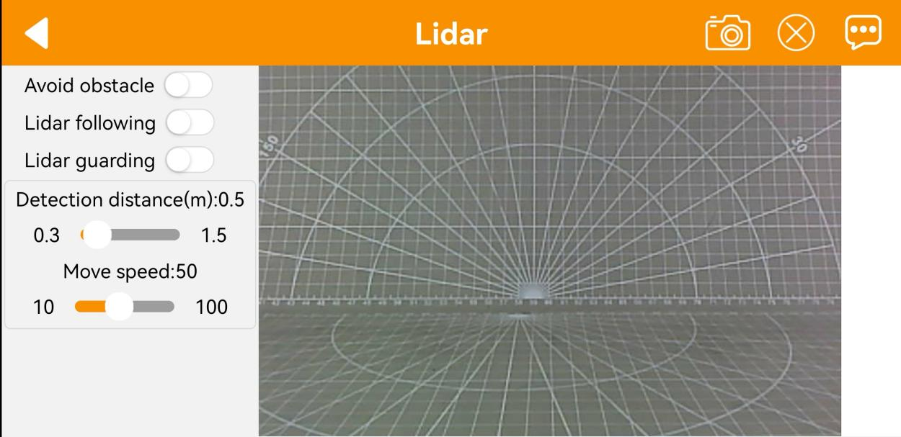

# 4. Lidar Lesson

## 4.1 Introduction to Lidar

### 4.1.1 Product Description

Lidar is a remote sensing technology that uses laser beams to detect target characteristics such as position and velocity. It offers advantages including high measurement resolution, strong penetration ability, robust anti-interference capability, and effective stealth detection.

According to the measurement principle, Lidar can be classified into three types: triangulation Lidar, pulse Lidar, and coherent Lidar. The Lidar equipped on the MentorPi is of the pulse lidar type.


### 4.1.2 Lidar Working Principle

A Lidar system consists of a laser emission system, a scanning system, a laser receiving system, and a signal processing system.

First, the laser emission system sends out a detection signal (laser beam) toward the target. The scanning system scans the plane to gather planar information.

Next, the laser receiving system captures the laser beam reflected from the target object and generates a received signal.

Finally, the signal processing system processes the received signal to extract features such as the target's surface shape and physical properties (e.g., position, height, and velocity), thereby enabling the construction of a 3D model of the object.

### 4.1.3 Lidar Parameter

* **Communication Interface**

The MS200 lidar connects to external systems via a connector for power supply and data transmission. For detailed interface definitions and parameter requirements, refer to the diagram/table below.


| Pin  | Signal | Attribute                     | Description                                 |
| ---- | ------ | ----------------------------- | ------------------------------------------- |
| 1    | Tx     | Serial data transmission      | Tx (Transmitting from this device, 0V~3.3V) |
| 2    | Rx     | Processing Incoming Data      | Rx                                          |
| 3    | GND    | Power supply input (positive) | GND                                         |
| 4    | VCC    | Power supply input (positive) | DC 5V（4.5V~5.5V）                          |


* **Electrical Parameter**

Before use, it is essential to understand the operating conditions of the lidar. Please ensure that the external power supply is properly designed or selected according to the Oradar MS200's input voltage range and peak startup current, to guarantee stable and reliable operation of the device.

| Parameter             | Minimum value | Typical value | Maximum value | Remarks         |
| --------------------- | ------------- | ------------- | ------------- | --------------- |
| Operating power       | 4.5V          | 5.0V          | 5.5V          | Pc power supply |
| Voltage ripple        | -             | -             | 100mV         |                 |
| Startup current       | -             | -             | 400mA         |                 |
| Operating current     | 180mA         | 230mA         | 280mA         |                 |
| Operating temperature | -10℃          | 25℃           | 50℃           |                 |
| Storage temperature   | 20℃           | 25℃           | 70℃           |                 |
| Operating temperature | 0             | 30%           | 80%           | Non-condensing  |

* **Specification Parameter**

| Model                          | MS200:                                                       |
| ------------------------------ | ------------------------------------------------------------ |
| Type                           | Short-range                                                  |
| Distance Measurement Principle | TOF (Time of Flight) ranging, suitable for both indoor and outdoor applications |
| Scanning Angle                 | 360°                                                         |
| Angular Resolution             | 0.8°                                                         |
| Measurement Frequency          | 4500 times per second                                        |
| Scanning Frequency             | 7-15Hz                                                       |
| Dimensions                     | 37.7\*37.5\*33mm                                             |
| Weight                         | 40g                                                          |
| Distance Measurement Accuracy: | 3 m to 12 m: ±20 mm                                          |
| Light Source                   | 905 nm laser                                                 |
| Measurement Range              | White objects: 13.4 m<br> Black objects: 13.4 m              |
| Minimum Measurement Distance   | 0.1m                                                         |
| Ambient Light Resistance       | 30 KLux (illumination intensity)                             |
| Power Supply                   | DC5V±0.5V                                                    |
| Operating Temperature          | Working: -10°C to 50°C<br> Storage: -30°C to 70°C            |
| Drive Method                   | Built-in brushless motor                                     |
| Windows Support                | Provides Windows-based PC software                           |
| ROS Support                    | ROS1/ROS2                                                    |
| Communication port             | Standard asynchronous serial port (UART)                     |

## 4.2 Lidar Working and Ranging Principle

### 4.2.1 Lidar Ranging

Two common methods are employed by Lidar to determine the distance to a target: triangulation and Time of Flight (TOF).

In the case of TOF, as depicted in the diagram, the Lidar initially projects light onto the object. The object reflects the light directly back to the Lidar, which calculates the time it takes for the light to return. The distance between the object and the Lidar is then obtained by multiplying this time by the speed of light.


In triangulation, as illustrated in the diagram, the Lidar undergoes adjustments during manufacturing to ensure that the light does not directly strike the object. Instead, it is projected at a specific angle, a pre-set value that remains constant during operation. The distance from the object to the Lidar can be calculated by incorporating this angle into trigonometric functions.


### 4.2.2 Lidar Working Result

Its working result is as follows. Lidar will emit light and shine it on the object surface. When receiving the light reflected by the object, Lidar will mark the contour of the object at the position where the light is reflected.


## 4.3 Lidar Obstacle Avoidance

For instructions on app connection, please consult the tutorial located in "[**1. Getting Ready->1.6 APP Control**](1.getting_ready.md#app-control)".

### 4.3.1 Enable Game

* **Initiate Lidar Game through App** 

(1) Connect the robot to **"WonderPi"** app.

(2) Click-on Lidar to navigate to the game interface.


(3) Switch on **"Avoid obstacle"** button to start the game.



* **Initiate Lidar Game Using Command** 

(1) Start the robot, and access the robot system desktop using VNC according to the tutorial saved in "[**2. Set Development Environment->2.1 VNC Installation and Connection**](3.set_development_environment.md#vnc-installation-and-connection)".

(2) Click-on  to open the command line terminal.

(3) Execute the command and press Enter to deactivate the automatic start service for the app.

```bash
~/.stop_ros.sh
```

(4) Run the command to enable the local services for app-related game and chassis control services.

```bash
ros2 launch app lidar_node.launch.py debug:=true
```

(5) Open a new terminal, and execute the command. Then, press Enter to start the Lidar game.

```bash
ros2 service call /lidar_app/enter std_srvs/srv/Trigger {}
```


:::{Note}

The robot's performance initiated by the app and command is identical.

:::

(6) Enter the command and hit Enter to launch Lidar obstacle avoidance game.

```bash
ros2 service call /lidar_app/set_running interfaces/srv/SetInt64 "{data: 1}"
```


(7) If you want to exit the game, enter the command and press "Enter".

```bash
ros2 service call /lidar_app/set_running interfaces/srv/SetInt64 "{data: 0}"
```


:::{Note}

The game will continue to run under the current Raspberry Pi power-on state if not exited. To avoid excessive use of the Raspberry Pi's operating memory, please follow the above instructions to close the current game before executing other games.

:::

(8) If you need to terminate the program, press short-cut **"Ctrl+C"** on the terminal opened in steps (4) and (5).

After experiencing the Lidar game, you can activate the app service either by using a command or restarting the robot. If the app service is not activated, related app functions will be disabled. In the case of a robot restart, the app service will start automatically.

Click  and enter the command. Press enter to start the app, and wait for the buzzer to beep. Please enter the command in the system path, not in the Docker container.

```bash
sudo systemctl restart start_node.service
```

### 4.3.2 Program Outcome

Let's use a book as the object to be detected. In the function of Lidar following, the object to be detected needs to be higher than the scanning height of the Lidar. Only in this way the Lidar mounted on the MentorPi can effectively scan its position information. Then, the MentorPi moves forward. When the obstacle is detected, the MentorPi will automatically turn to avoid it.

### 4.3.3 Program Analysis

* Launch File 

The launch file is located in: [/home/ubuntu/ros2_ws/src/app/launch/lidar_node.launch.py](../_static/source_code/app.zip)


(1) Set the storage path

Retrieve the paths for the two packages: peripherals and controller.

{lineno-start=14}

```python
    if compiled == 'True':
        controller_package_path = get_package_share_directory('controller')
        peripherals_package_path = get_package_share_directory('peripherals')
    else:
        controller_package_path = '/home/ubuntu/ros2_ws/src/driver/controller'
        peripherals_package_path = '/home/ubuntu/ros2_ws/src/peripherals'
```

(2) Initiate other Launch files

{lineno-start=21}

```python
    lidar_controller_node = GroupAction([
        IncludeLaunchDescription(
            PythonLaunchDescriptionSource(
                os.path.join(peripherals_package_path, 'launch/lidar.launch.py')),
            condition=IfCondition(debug),
            ),

        IncludeLaunchDescription(
            PythonLaunchDescriptionSource(
                os.path.join(controller_package_path, 'launch/controller.launch.py')),
            condition=IfCondition(debug),
            ),
```

lidar.launch.py Lidar launch

controller.launch.py Motion control launch

(3) Initiate Node

{lineno-start=34}

```python
        Node(
            package='app',
            executable='lidar_controller',
            output='screen',
            ),
    ])
```

Enable Lidar game node.

* Source Code File 

The source code of the program is saved in: [/home/ubuntu/ros2_ws/src/app/app/lidar_controller.py](https://store.hiwonder.com.cn/docs/mentorpi/source_code/lidar_controller.zip)

The process logic of the program based on the implemented effect is shown in the diagram:


(1) Initialization

{lineno-start=25}

```python
class LidarController(Node):
    def __init__(self, name):
        rclpy.init()
        super().__init__(name)

        self.name = name
        self.running_mode = 0
        self.threshold = 0.6  # meters
        self.scan_angle = math.radians(360)  # radians
        self.speed = 0.2
        self.last_act = 0
        self.timestamp = 0
        self.angle_data = []
        # pid参数
        self.pid_yaw = pid.PID(1.6, 0, 0.16)
        self.pid_dist = pid.PID(1.7, 0, 0.16)
        self.lock = threading.RLock()
        self.lidar_sub = None
        self.lidar_type = os.environ.get('LIDAR_TYPE')
        self.machine_type = os.environ.get('MACHINE_TYPE')
```

self.name: stores the incoming name as the property of the object.

Other attributes include parameters for controlling the Lidar, such as operating mode, threshold, scanning angle, and speed.

self.lock: creates a thread lock for safe access in a multi-threaded environment.

(2) Create ROS service

{lineno-start=46}

```python
        self.create_service(Trigger, '~/enter', self.enter_srv_callback)  # 进入玩法(enter the game)
        self.create_service(Trigger, '~/exit', self.exit_srv_callback)  # 退出玩法(exit the game)
        self.create_service(SetInt64, '~/set_running', self.set_running_srv_callback)  # 开启玩法(start the game)
        Heart(self, self.name + '/heartbeat', 5, lambda _: self.exit_srv_callback(request=Trigger.Request(), response=Trigger.Response()))  # 心跳包(heartbeat package)
        self.create_service(SetFloat64List, '~/set_param', self.set_parameters_srv_callback)  # 参数设置(set parameter)
```

Enter game: A ROS service named `/enter` is created with the type Trigger, and the callback function is enter_srv_callback. When this service is called, it will execute the enter_srv_callback function.

Exit game: A ROS service named `/exit` is created with the type Trigger, and the callback function is exit_srv_callback. When this service is called, it will execute the exit_srv_callback function.

Enable game: A ROS service named `/set_running` is created with the type SetInt64, and the callback function is set_running_srv_callback. When this service is called, it will execute the set_running_srv_callback function.

Set parameters: A ROS service named `/set_param` is created with the type SetFloat64List, and the callback function is set_parameters_srv_callback. When this service is called, it will execute the set_parameters_srv_callback function.

(3) Lidar obstacle avoidance

{lineno-start=169}

```python
                if self.running_mode == 1 and self.timestamp <= time.time():
                    left_nonzero = left_range.nonzero()
                    right_nonzero = right_range.nonzero()
                    left_nonan = np.isfinite(left_range[left_nonzero])
                    right_nonan = np.isfinite(right_range[right_nonzero])
                    min_dist_left_ = left_range[left_nonzero][left_nonan]
                    min_dist_right_ = right_range[right_nonzero][right_nonan]
                    # 取左右最近的距离(Take the nearest distance left and right)
                    if len(min_dist_left_) > 1 and len(min_dist_right_) > 1:
                        min_dist_left = min_dist_left_.min()
                        min_dist_right = min_dist_right_.min()
                        if min_dist_left <= self.threshold and min_dist_right > self.threshold:  # 左侧有障碍(there is obstacle at left)
                            twist.linear.x = self.speed / 6  # 转弯时向前速度尽量小(keep the forward velocity as low as possible when turning)
                            max_angle = math.radians(90)  # 转90度(turn 90 degree)
                            w = self.speed * 6.0  # 转弯速度尽量大(keep the turning speed as high as possible)
                            twist.angular.z = -w
                            if self.last_act != 0 and self.last_act != 1:
                                twist.angular.z = w
                            self.last_act = 1
                            self.mecanum_pub.publish(twist)
                            self.timestamp = time.time() + (max_angle / w / 2)
                        elif min_dist_left <= self.threshold and min_dist_right <= self.threshold:  # 两侧都有障碍
                            twist.linear.x = self.speed / 6  # 转弯时向前速度尽量小(keep the forward velocity as low as possible when turning)
                            w = self.speed * 6.0  # 转弯速度尽量大(keep the turning speed as high as possible)
                            twist.angular.z = w
                            self.last_act = 3
                            self.mecanum_pub.publish(twist)
                            # 转180度
                            self.timestamp = time.time() + (math.radians(180) / w / 2)
                        elif min_dist_left > self.threshold and min_dist_right <= self.threshold:  # 右侧有障碍(there is obstacles at right)
                            twist.linear.x = self.speed / 6  # 转弯时向前速度尽量小(keep the forward velocity as low as possible when turning)
                            max_angle = math.radians(90)  # 转90度 turn 90 degrees
                            w = self.speed * 6.0  # 转弯速度尽量大(keep the turning speed as high as possible)
                            twist.angular.z = w
                            if self.last_act != 0 and self.last_act != 2:
                                twist.angular.z = -w
                            self.last_act = 2
                            self.mecanum_pub.publish(twist)
                            self.timestamp = time.time() + (max_angle / w / 2)
                        else:  # 没有障碍(none obstacle)
```

The code detects the minimum distances on the left and right sides of the robot, stored in variables min_dist_left and min_dist_right, respectively. Based on the relationship between the minimum distances and a threshold value self.threshold, the code determines the presence of obstacles on either side. If there is an obstacle on the left side, the robot will turn right by 90 degrees. If there are obstacles on both sides, the robot will turn around by 180 degrees. If there is an obstacle on the right side, the robot will turn left by 90 degrees. If there is no obstacle, the robot will continue moving forward.

To avoid repetitive turns, the code keeps track of the last action performed by the robot in the variable self.last_act.

## 4.4 Lidar Following

For instructions on app connection, please consult the tutorial located in "[**1.Getting Ready->1.6 APP Control**](1.getting_ready.md#app-control)".

### 4.4.1 Enable Game

* **Initiate Lidar Game through App** 

(1) Connect the robot to **"WonderPi"** app.

(2) Click-on Lidar to navigate to the game interface.


(3) Switch on **"Lidar following"** button to start the game.


* **Initiate Lidar Game Using Command**

(1) Start the robot, and access the robot system desktop using VNC according to the tutorial saved in "[**2. Set Development Environment->2.1 VNC Installation and Connection**](3.set_development_environment.md#vnc-installation-and-connection)".

(2) Click-on  to open the command line terminal.

(3) Execute the command and press Enter to deactivate the automatic start service for the app.

```bash
~/.stop_ros.sh
```

(4) Run the command to enable the local services for app-related game and chassis control services.

```bash
ros2 launch app lidar_node.launch.py debug:=true
```

(5) Open a new terminal, and execute the command. Then, press Enter to start the Lidar game.

```bash
ros2 service call /lidar_app/enter std_srvs/srv/Trigger {}
```


:::{Note}

The robot's performance initiated by the app and command is identical.

:::

(6) Enter the command and hit Enter to launch Lidar following game.

```bash
ros2 service call /lidar_app/set_running interfaces/srv/SetInt64 "{data: 2}"
```


(7) If you want to exit the game, enter the command and press "**Enter**".

```bash
ros2 service call /lidar_app/set_running interfaces/srv/SetInt64 "{data: 0}"
```


:::{Note}

The game will continue to run under the current Raspberry Pi power-on state if not exited. To avoid excessive use of the Raspberry Pi's operating memory, please follow the above instructions to close the current game before executing other games.

:::

(8) If you need to terminate the program, press short-cut **"Ctrl+C"** on the terminal opened in steps (4) and (5).

After experiencing the Lidar game, you can activate the app service either by using a command or restarting the robot. If the app service is not activated, related app functions will be disabled. In the case of a robot restart, the app service will start automatically.

Click and enter the command. Press enter to start the app, and wait for the buzzer to beep. Please enter the command in the system path, not in the Docker container.

```bash
sudo systemctl restart start_node.service
```

### 4.4.2 Program Outcome

Let's use a book as the object to be detected. When using the Lidar following function, it's important to ensure that the object to be detected is higher than the scanning height of the Lidar mounted on the MentorPi. This will enable the Lidar to effectively scan the position information of the object. Once the position information is obtained, the MentorPi will adjust its position to maintain a distance of around 0.35m between itself and the obstacle.

### 4.4.3 Program Analysis

* **Launch File** 

The launch file is located in: [/home/ubuntu/ros2_ws/src/app/launch/lidar_node.launch.py](https://store.hiwonder.com.cn/docs/mentorpi/source_code/lidar_node.launch.zip)


(1) Set the storage path

Retrieve the paths for the two packages: peripherals and controller.

{lineno-start=14}

```python
    if compiled == 'True':
        controller_package_path = get_package_share_directory('controller')
        peripherals_package_path = get_package_share_directory('peripherals')
    else:
        controller_package_path = '/home/ubuntu/ros2_ws/src/driver/controller'
        peripherals_package_path = '/home/ubuntu/ros2_ws/src/peripherals'
```

(2) Initiate other Launch files

{lineno-start=21}

```python
    lidar_controller_node = GroupAction([
        IncludeLaunchDescription(
            PythonLaunchDescriptionSource(
                os.path.join(peripherals_package_path, 'launch/lidar.launch.py')),
            condition=IfCondition(debug),
            ),

        IncludeLaunchDescription(
            PythonLaunchDescriptionSource(
                os.path.join(controller_package_path, 'launch/controller.launch.py')),
            condition=IfCondition(debug),
            ),
```

lidar.launch.py Lidar launch

controller.launch.py Motion control launch

(3) Initiate Node

{lineno-start=34}

```python
        Node(
            package='app',
            executable='lidar_controller',
            output='screen',
            ),
    ])
```

Enable Lidar game node.

* **Source Code File**

The source code of the program is saved in: [/home/ubuntu/ros2_ws/src/app/app/lidar_controller.py](https://store.hiwonder.com.cn/docs/mentorpi/source_code/lidar_node.launch.zip)

The process logic of the program based on the implemented effect is shown in the diagram:


(1) Initialization

{lineno-start=25}

```python
class LidarController(Node):
    def __init__(self, name):
        rclpy.init()
        super().__init__(name)

        self.name = name
        self.running_mode = 0
        self.threshold = 0.6  # meters
        self.scan_angle = math.radians(360)  # radians
        self.speed = 0.2
        self.last_act = 0
        self.timestamp = 0
        self.angle_data = []
        # pid参数
        self.pid_yaw = pid.PID(1.6, 0, 0.16)
        self.pid_dist = pid.PID(1.7, 0, 0.16)
        self.lock = threading.RLock()
        self.lidar_sub = None
        self.lidar_type = os.environ.get('LIDAR_TYPE')
        self.machine_type = os.environ.get('MACHINE_TYPE')
```

self.name: stores the incoming name as the property of the object.

Other attributes include parameters for controlling the Lidar, such as operating mode, threshold, scanning angle, and speed.

self.lock: creates a thread lock for safe access in a multi-threaded environment.

(2)  Create ROS service

{lineno-start=25}

```python
        self.create_service(Trigger, '~/enter', self.enter_srv_callback)  # 进入玩法(enter the game)
        self.create_service(Trigger, '~/exit', self.exit_srv_callback)  # 退出玩法(exit the game)
        self.create_service(SetInt64, '~/set_running', self.set_running_srv_callback)  # 开启玩法(start the game)
        Heart(self, self.name + '/heartbeat', 5, lambda _: self.exit_srv_callback(request=Trigger.Request(), response=Trigger.Response()))  # 心跳包(heartbeat package)
```

Enter game: A ROS service named `/enter` is created with the type Trigger, and the callback function is enter_srv_callback. When this service is called, it will execute the enter_srv_callback function.

Exit game: A ROS service named  `/exit` is created with the type Trigger, and the callback function is exit_srv_callback. When this service is called, it will execute the exit_srv_callback function.

Enable game: A ROS service named  `/set_running` is created with the type SetInt64, and the callback function is set_running_srv_callback. When this service is called, it will execute the set_running_srv_callback function.

Set parameters: A ROS service named  `/set_param` is created with the type SetFloat64List, and the callback function is set_parameters_srv_callback. When this service is called, it will execute the set_parameters_srv_callback function.

(3) Lidar following

{lineno-start=213}

```python
                    # 拼合距离数据, 从右半侧逆时针到左半侧(the merged distance data from right half counterclockwise to the left half)
                    ranges = np.append(right_range[::-1], left_range)
                    self.get_logger().info(str(ranges))
                    nonzero = ranges.nonzero()
                    nonan = np.isfinite(ranges[nonzero])
                    dist_ = ranges[nonzero][nonan]
                    if len(dist_) > 0:
                        dist = dist_.min()
                        min_index = list(ranges).index(dist)
                        angle = -angle + lidar_data.angle_increment * min_index  # 计算最小值对应的角度(calculate the angle corresponding to the minimum value)
                        # self.get_logger().info(str(dist_))
                        # self.get_logger().info(str([dist, angle]))
                        if dist < self.threshold and abs(math.degrees(angle)) > 5:  # 控制左右(control the left and right)
                            if self.lidar_type != 'G4':
                                self.pid_yaw.update(-angle)
                                twist.angular.z = common.set_range(self.pid_yaw.output, -self.speed * 6.0, self.speed * 6.0) 
                            elif self.lidar_type == 'G4':
                                self.pid_yaw.update(angle)
                                twist.angular.z = -common.set_range(self.pid_yaw.output, -self.speed * 6.0, self.speed * 6.0) 
                        else:
                            self.pid_yaw.clear()

                        if dist < self.threshold and abs(0.2 - dist) > 0.02:  # 控制前后(control the front and back)
                            self.pid_dist.update(self.threshold / 2 - dist)
                            twist.linear.x = common.set_range(self.pid_dist.output, -self.speed, self.speed)
                        else:
                            self.pid_dist.clear()
                        if abs(twist.angular.z) < 0.008:
                            twist.angular.z = 0.0
                        if abs(twist.linear.x) < 0.05:
                            twist.linear.x = 0.0
                        self.mecanum_pub.publish(twist)
```

The code concatenates the distance data from the left and right sides of the robot, obtained from the Lidar, into an array `ranges` to form a circular scan. It then calculates the minimum distance value "**dist**" and its corresponding angle `angle` from the `ranges`.

The `dist` is checked if it is less than a threshold value. If it is and the angle deviates from the forward direction by more than 5 degrees, the robot will rotate to avoid the obstacle. The angular velocity is controlled using a PID controller. If `dist` is less than the threshold and the robot is close to a distance of 0.2m in the forward direction, the robot will stop or move forward using a PID controller for the linear velocity. The control commands are published as a Twist message to the robot to execute the desired actions.

## 4.5 Lidar Guarding

For instructions on app connection, please consult the tutorial located in "[1. Getting Ready->1.6  APP Control](1.getting_ready.md#app-control)".

### 4.5.1 Enable Game

:::{Note}

The MentorPi of Ackerman version does not support Lidar guarding function.

:::

* **Initiate Lidar Game through App** 

(1) Connect the robot to **"WondePi"** app.

(2) Click-on Lidar to navigate to the game interface.


(3) Switch on **"Lidar guarding"** button to start the game.


* **Initiate Lidar Game Using Command**

(1) Start the robot, and access the robot system desktop using VNC according to the tutorial saved in "[**2. Set Development Environment->2.1 VNC Installation and Connection**](3.set_development_environment.md#vnc-installation-and-connection)".

(2) Click-on  to open the command line terminal.

(3) Execute the command and press Enter to deactivate the automatic start service for the app.

```bash
~/.stop_ros.sh
```

(4) Run the command to enable the local services for app-related game and chassis control services.

```bash
ros2 launch app lidar_node.launch.py debug:=true
```

(5) Open a new terminal, and execute the command. Then, press Enter to start the Lidar game.

```bash
ros2 service call /lidar_app/enter std_srvs/srv/Trigger {}
```


:::{Note}

The robot's performance initiated by the app and command is identical.

:::

(6) Enter the command and hit Enter to launch Lidar guarding game.

```bash
ros2 service call /lidar_app/set_running interfaces/srv/SetInt64 "{data: 3}"
```


(7) If you want to exit the game, enter the command and press "**Enter**".

```bash
ros2 service call /lidar_app/set_running interfaces/srv/SetInt64 "{data: 0}"
```


:::{Note} 

The game will continue to run under the current Raspberry Pi power-on state if not exited. To avoid excessive use of the Raspberry Pi's operating memory, please follow the above instructions to close the current game before executing other games.

:::

(8) If you need to terminate the program, press short-cut **"Ctrl+C"** on the terminal opened in steps (4) and (5).

After experiencing the Lidar game, you can activate the app service either by using a command or restarting the robot. If the app service is not activated, related app functions will be disabled. In the case of a robot restart, the app service will start automatically.

Click  and enter the command. Press enter to start the app, and wait for the buzzer to beep. Please enter the command in the system path, not in the Docker container.

```bash
sudo systemctl restart start_node.service
```

### 4.5.2 Program Outcome

Let's use a book as the object to be detected. When using the Lidar following function, it's important to ensure that the object to be detected is higher than the scanning height of the Lidar mounted on the MentorPi. This will enable the Lidar to effectively scan the position information of the object. Once the position information is obtained, the MentorPi will adjust its orientation to face towards the obstacle. It means that the camera will face directly towards the obstacle.

### 4.5.3 Program Analysis

* **Launch File** 

The launch file is located in: [/home/ubuntu/ros2_ws/src/app/launch/lidar_node.launch.py](https://store.hiwonder.com.cn/docs/mentorpi/source_code/lidar_node.launch.zip)


(1) Set the storage path

Retrieve the paths for the two packages: peripherals and controller.

{lineno-start=14}

```python
    if compiled == 'True':
        controller_package_path = get_package_share_directory('controller')
        peripherals_package_path = get_package_share_directory('peripherals')
    else:
        controller_package_path = '/home/ubuntu/ros2_ws/src/driver/controller'
        peripherals_package_path = '/home/ubuntu/ros2_ws/src/peripherals'
```

(2) Initiate other Launch files

{lineno-start=21}

```python
    lidar_controller_node = GroupAction([
        IncludeLaunchDescription(
            PythonLaunchDescriptionSource(
                os.path.join(peripherals_package_path, 'launch/lidar.launch.py')),
            condition=IfCondition(debug),
            ),

        IncludeLaunchDescription(
            PythonLaunchDescriptionSource(
                os.path.join(controller_package_path, 'launch/controller.launch.py')),
            condition=IfCondition(debug),
            ),
```

lidar.launch.py Lidar launch

controller.launch.py Motion control launch

(3) Initiate Node

{lineno-start=34}

```python
        Node(
            package='app',
            executable='lidar_controller',
            output='screen',
            ),
    ])
```

Enable Lidar game node.

* **Source Code File** 

The source code of the program is saved in:[/home/ubuntu/ros2_ws/src/app/app/lidar_controller.py](https://store.hiwonder.com.cn/docs/mentorpi/source_code/lidar_controller.zip)

The process logic of the program based on the implemented effect is shown in the diagram:


(1) Initialization

{lineno-start=25}

```py
class LidarController(Node):
    def __init__(self, name):
        rclpy.init()
        super().__init__(name)

        self.name = name
        self.running_mode = 0
        self.threshold = 0.6  # meters
        self.scan_angle = math.radians(360)  # radians
        self.speed = 0.2
        self.last_act = 0
        self.timestamp = 0
        self.angle_data = []
        # pid参数
        self.pid_yaw = pid.PID(1.6, 0, 0.16)
        self.pid_dist = pid.PID(1.7, 0, 0.16)
        self.lock = threading.RLock()
        self.lidar_sub = None
        self.lidar_type = os.environ.get('LIDAR_TYPE')
        self.machine_type = os.environ.get('MACHINE_TYPE')
```

`self.name`: stores the incoming name as the property of the object.

Other attributes include parameters for controlling the Lidar, such as operating mode, threshold, scanning angle, and speed.

`self.lock`: creates a thread lock for safe access in a multi-threaded environment.

(2) Create ROS service

{lineno-start=46}

```python
        self.create_service(Trigger, '~/enter', self.enter_srv_callback)  # 进入玩法(enter the game)
        self.create_service(Trigger, '~/exit', self.exit_srv_callback)  # 退出玩法(exit the game)
        self.create_service(SetInt64, '~/set_running', self.set_running_srv_callback)  # 开启玩法(start the game)
        Heart(self, self.name + '/heartbeat', 5, lambda _: self.exit_srv_callback(request=Trigger.Request(), response=Trigger.Response()))  # 心跳包(heartbeat package)
        self.create_service(SetFloat64List, '~/set_param', self.set_parameters_srv_callback)  # 参数设置(set parameter)
```

Enter game: A ROS service named `/enter` is created with the type Trigger, and the callback function is enter_srv_callback. When this service is called, it will execute the enter_srv_callback function.

Exit game: A ROS service named `/exit` is created with the type Trigger, and the callback function is exit_srv_callback. When this service is called, it will execute the exit_srv_callback function.

Enable game: A ROS service named `/set_running` is created with the type SetInt64, and the callback function is set_running_srv_callback. When this service is called, it will execute the set_running_srv_callback function.

Set parameters: A ROS service named `/set_param` is created with the type SetFloat64List, and the callback function is set_parameters_srv_callback. When this service is called, it will execute the set_parameters_srv_callback function.

(3) Lidar guarding

{lineno-start=245}

```python
                elif self.running_mode == 3:
                    # 拼合距离数据, 从右半侧逆时针到左半侧(the merged distance data from right half counterclockwise to the left half)
                    ranges = np.append(right_range[::-1], left_range)
                    nonzero = ranges.nonzero()
                    nonan = np.isfinite(ranges[nonzero])
                    dist_ = ranges[nonzero][nonan]
                    if len(dist_) > 1:
                        dist = dist_.min()
                        min_index = list(ranges).index(dist)
                        
                        angle = -angle + lidar_data.angle_increment * min_index  # 计算最小值对应的角度(calculate the angle corresponding to the minimum value)
                        if dist < self.threshold and abs(math.degrees(angle)) > 5:  # 控制左右(control the left and right)
                            if self.lidar_type != 'G4':
                                self.pid_yaw.update(-angle)
                                twist.angular.z = common.set_range(self.pid_yaw.output, -self.speed * 6.0, self.speed * 6.0)
                            elif self.lidar_type == 'G4':
                                self.pid_yaw.update(angle)
                                twist.angular.z = -common.set_range(self.pid_yaw.output, -self.speed * 6.0, self.speed * 6.0) 
                        else:
                            self.pid_yaw.clear()
                        if abs(twist.angular.z) < 0.008:
                            twist.angular.z = 0.0
                        self.mecanum_pub.publish(twist)
```

The code concatenates the distance data from the left and right sides of the robot, obtained from the Lidar, into an array ranges to form a circular scan. It then calculates the minimum distance value dist and its corresponding angle angle from the ranges array.

If dist is less than a threshold value and the angle deviates from the forward direction by more than 5 degrees, the Yaw axis PID controller will be activated. Based on the output of the PID controller, the code calculates the turning angular velocity twist.angular.z. The control commands are published as a Twist message to the robot to execute the desired actions.