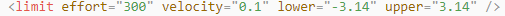
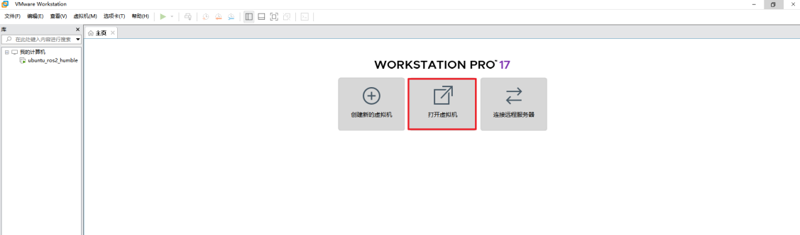
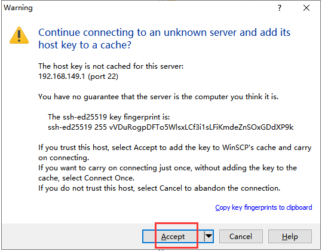
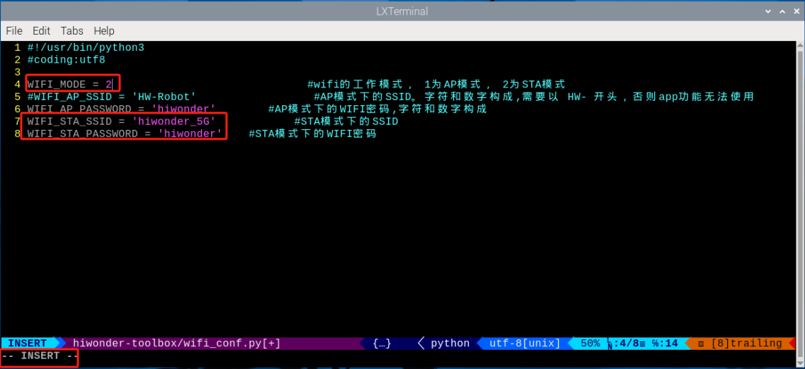
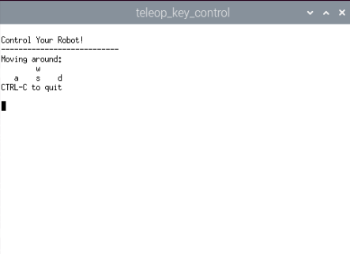
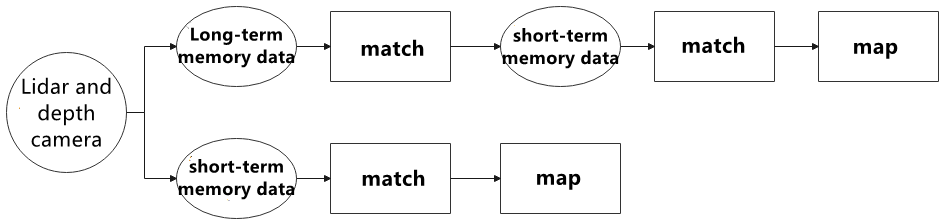
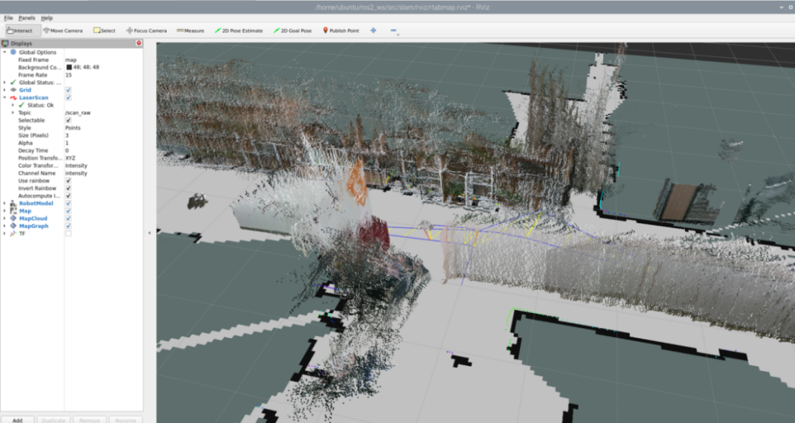

# 6. Mapping Courses

## 6.1 URDF Model Introduction

### 6.1.1 URDF Model Introduction

The Unified Robot Description Format (URDF) is an XML file format widely used in ROS (`Robot Operating System`) to comprehensively describe all components of a robot.

Robots are typically composed of multiple `links` and `joints`. A `link` is defined as a rigid object with certain physical properties, while a `joint` connects two `links` and constrains their relative motion.

By connecting `links` with `joints` and imposing motion restrictions, a kinematic model is formed. The `URDF` file specifies the relationships between `joints` and `links`, their inertial properties, geometric characteristics, and collision models.

### 6.1.2 Comparison between Xacro and URDF Models

The `URDF` model serves as a description file for simple robot models, offering a clear and easily understandable structure. However, when it comes to describing complex robot structures, using `URDF` alone can result in lengthy and unclear descriptions.

To address this limitation, the `xacro` model extends the capabilities of `URDF` while maintaining its core features. The `xacro` format provides a more advanced approach to describe robot structures. It greatly improves code reusability and helps avoid excessive description length.

For instance, when describing the two legs of a humanoid robot, the `URDF` model would require separate descriptions for each leg. On the other hand, the `xacro` model allows for describing a single leg and reusing that description for the other leg, resulting in a more concise and efficient representation.

<p id="anchor_6_1_3"></p>

### 6.1.3 Basic Syntax of URDF Model

* **XML Basic Syntax**

The `URDF` model is written using `XML` standard.

(1) Elements:

An `element` can be defined as desired using the following formula:

```xml
<element>
</element>
```

(2) Properties:

`Properties` are included within `elements` to define characteristics and parameters. Please refer to the following formula to define an `element` with `properties`:

```xml
<element property_1="property value1" property_2="property value2">
</element>
```

(3) Comments:

`Comments` have no impact on the definition of other `properties` and `elements`. Please use the following formula to define a comment:

```xml
<!-- comment content -->
```

* **Link**

The `Link` element describes the visual and physical properties of the robot's rigid component. The following tags are commonly used to define the motion of a `link`:


(1) `<visual>`: Describe the appearance of the `link`, such as size, color and shape.

(2) `<inertial>`: Describe the inertia parameters of the `link`, which will used in `dynamics` calculation.

(3) `<collision>`: Describe the collision inertia property of the `link`.

Each tag contains the corresponding child tag. The functions of the tags are listed below.

| **Tag** | **Function** |
|:---:|:---:|
| origin | Describe the pose of the `link`. It contains two parameters, including `xyz` and `rpy`. `Xyz` describes the pose of the `link` in the simulated map. `Rpy` describes the pose of the `link` in the simulated map. |
| mess | Describe the mess of the `link`. |
| inertia | Describe the `inertia` of the `link`. As the `inertia` matrix is symmetrical, these six parameters need to be input, `ixx`, `ixy`, `ixz`, `iyy`, `iyz` and `izz`, as `properties`. These parameters can be calculated. |
| geometry | Describe the shape of the `link`. It uses `mesh parameter` to load texture file, and employs `filename parameters` to load the path for texture file. It has three child tags, namely `box`, `cylinder` and `sphere`. |
| material | Describe the `material` of the `link`. The parameter `name` is the required filed. The tag `color` can be used to change the color and transparency of the `link`. |

* **Joint**

The `"Joint"` tag describes the kinematic and dynamic `properties` of the robot's `joints`, including the `joint's` range of motion, target positions, and speed limitations. In terms of motion style, `joints` can be categorized into six types.


The following tags will be used to write `joint` motion.


(1) `<parent_link>`: Parent `link`.

(2) `<child_link>`: Child `link`.

(3) `<calibration>`: Calibrate the `joint` angle.

(4) `<dynamics>`: Describes some physical `properties` of motion.

(5) `<limit>`: Describes some limitations of the motion.

The function of each tag is listed below. Each tag involves one or several child tags.

| **Tag** | **Function** |
|:---:|:---:|
| `origin` | Describe the pose of the parent `link`. It involves two parameters, including `xyz` and `rpy`. Both `xyz` and `rpy` describe the pose of the `link` in simulated map. |
| `axis` | Control the child `link` to rotate around any axis of the parent `link`. |
| `limit` | The motion of the child `link` is constrained using the `lower` and `upper properties`, which define the limits of rotation for the child `link`. The `effort properties` restrict the allowable force range applied during rotation (values: positive and negative; units: N). The `velocity properties` confine the rotational speed, measured in meters per second (m/s). |
| `mimic` | Describe the relationship between `joints`. |
| `safety_controller` | Describes the parameters of the safety controller used for protecting the `joint` motion of the robot. |

* **Robot Tag**

The complete top tags of a robot, including the `<link>` and `<joint>` tags, must be enclosed within the `<robot>` tag. The format is as follows:


* **gazebo Tag**

This tag is used in conjunction with the `Gazebo` simulator. Within this tag, you can define simulation parameters and import `Gazebo plugins`, as well as specify `Gazebo's` physical `properties`, and more.


* **Write Simple URDF Model**

(1) Name the model of the robot

To start writing the `URDF` model, we need to set the `name` of the robot following this format: `"<robot name="robot model name">"`. Lastly, input `"</robot>"` at the end to represent that the model is written successfully.


(2) Set links

① To write the first `link` and use indentation to indicate that it is part of the currently set model. Set the `name` of the `link` using the following format: `"<link name="link name">"`. Finally, conclude with `"</link>"` to indicate the successful completion of the `link` definition.


② Write the `link` description and use indentation to indicate that it is part of the currently set `link`, and conclude with `"</visual>"`.


③ The `"<geometry>"` tag is employed to define the shape of a `link`. Once the description is complete, include `"</geometry>"`. Within the `"<geometry>"` tag, indentation is used to specify the detailed description of the `link's` shape. The following example demonstrates a `link` with a cylindrical shape: `"<cylinder length="0.01" radius="0.2"/>"`. In this instance, `"length="0.01""` signifies a length of 0.01 meters for the `link`, while `"radius="0.2""` denotes a radius of 0.2 meters, resulting in a cylindrical shape.


④ The `"<origin>"` tag is utilized to specify the position of a `link`, with indentation used to indicate the detailed description of the `link's` position. The following example demonstrates the position of a `link`: `"<origin rpy="0 0 0" xyz="0 0 0" />"`. In this example, `"rpy"` represents the `roll`, `pitch`, and `yaw` angles of the `link`, while `"xyz"` represents the coordinates of the `link's` position. This particular example indicates that the `link` is positioned at the origin of the coordinate system.


⑤ The `"<material>"` tag is used to define the visual appearance of a `link`, with indentation used to specify the detailed description of the `link's` color. To start describing the color, include `"<material>"`, and end with `"</material>"` when the description is complete. The following example demonstrates setting a `link` color to yellow: `"<color rgba="1 1 0 1" />"`. In this example, `"rgba="1 1 0 1""` represents the color threshold for achieving a yellow color.


(3) Set joint

① To write the first `joint`, use indentation to indicate that the `joint` belongs to the current model being set. Then, specify the `name` and `type` of the `joint` as follows: `"<joint name="joint name" type="joint type">"`. Finally, include `"</joint>"` to indicate the completion of the `joint` definition.

:::{Note}
To learn about the type of the `joint`, please refer to `6.1.2 Joint`.
:::


② Write the description section for the connection between the `link` and the `joint`. Use indentation to indicate that it is part of the currently defined `joint`. The `parent parameter` and `child parameter` should be set using the following format: `"<parent link="parent link"/>"`, and `"<child link="child link" />"`. With the `parent link` serving as the pivot, the `joint` rotates the `child link`.


③ `"<origin>"` describes the position of the `joint` using indention. This example describes the position of the `joint`: `"<origin xyz="0 0 0.1" />"`. `xyz` is the coordinate of the `joint`.


④ `"<axis>"` describes the position of the `joint` adopting indention. `"<axis xyz="0 0 1" />"` describes one posture of a `joint`. `xyz` specifies the pose of the `joint`.


⑤ `"<limit>"` imposes restrictions on the `joint` using indention. The `"<limit>"` tag is used to restrict the motion of a `joint`, with indentation indicating the specific description of the `joint` angle limitations. The following example describes a `joint` with a maximum force limit of 300 Newtons, an upper limit of 3.14 radians, and a lower limit of -3.14 radians. The settings are defined as follows: `"effort="joint force (N)", velocity="joint motion speed", lower="lower limit in radians", upper="upper limit in radians"`.



⑥ `"<dynamics>"` describes the `dynamics` of the `joint` using indention. `"<dynamics damping="50" friction="1" />"` describes `dynamics parameters` of a `joint`.


The complete codes are as below.


## 6.2 ROS Robot URDF Model Instruction

### 6.2.1 Getting Ready

To grasp the `URDF` model, check out [6.1.3 Basic Syntax of URDF Model](#anchor_6_1_3) for the key syntax. This part quickly breaks down the robot model code and its components.

### 6.2.2 Check Code of Robot Model

(1) Start the robot, and access the robot system desktop using `VNC`.

(2) Click-on  to create a command-line terminal.

(3) Run the command and hit Enter to disable the app auto-start service.

```bash
~/.stop_ros.sh
```

(4) Execute the command and hit Enter key to navigate to the folder containing startup programs.

```bash
colcon_cd mentorpi_description
```

(5) Execute the command to navigate to the robot simulation model folder.

```bash
cd urdf
```

(6) Execute the command to access the robot simulation model folder.

```bash
vim mentorpi.xacro
```

(7) Locate the code below:


Determine the current form of the robot by reading the machine variable to load the corresponding `URDF` model.

Multiple `URDF` models are called to compose a complete robot.

| **File Name** | **Device** |
|:---:|:---:|
| `inertial_matrix` | Inertia matrix |
| `tank` | Tank chassis `urdf` model |

After experiencing the `Lidar` game, you can activate the app service either by using a command or restarting the robot. If the app service is not activated, related app functions will be disabled. In the case of a robot restart, the app service will start automatically.

Click  and enter the command. Press enter to start the app, and wait for the buzzer to beep.

:::{Note}
Please enter the command in the system path, not in the `Docker` container.
:::

```bash
sudo systemctl restart start_node.service
```

### 6.2.3 Brief Analysis of Robot's Main Body Model
Open a new command terminal. Enter the command to access the robot model file, which contains the description of each part of the robot model.

```bash
vim tank.xacro
```

```xml
<?xml version="1.0" ?>
<robot name="tank" xmlns:xacro="http://ros.org/wiki/xacro">
```
This is the beginning of the `URDF` file. It specifies the `XML` version and encoding, and defines a robot model named `"tank"`. The `xmlns:xacro` namespace is utilized here to generate `URDF` using `Xacro macro definitions`.

The following line of code defines a `Xacro property` named `"black"`, which means the black material.

```xml
<material name="black">
<color rgba="0 0 0 1"/>
</material>
```
A `joint` called `"imu_link"` is defined with a `type` of `"fixed"`, indicating it's a stationary `joint`. It connects the `parent link` `"base_link"` with the `child link` `"imu_link"`.

Then, the values of the `joint's origin` and `axis` are defined.

```xml
<link name="imu_link"/>
<joint name="imu_joint" type="fixed">
<parent link="base_link"/>
<child link="imu_link"/>
<origin xyz="0 0 0" rpy="0 0 -1.57"/>
</joint>
```
The `link` named `"base_footprint"` is defined as the robot's chassis.

```xml
<link name="base_footprint"/>
<joint name="base_footprint_to_base_link" type="fixed">
<parent link="base_footprint"/>
<child link="base_link"/>
<origin xyz="0 0 0.07" rpy="0 0 0"/>
</joint>
```
The following code defines a `link` named `"base_chaais"`, including its `inertial`, `visual`, and `collision properties`.

The `<inertial>` section specifies the `link's inertial properties`, like `mass` and `inertia`. It includes the `<origin>` tag, indicating the position and orientation of the `inertial coordinate system` relative to the `link's coordinate system`. The `<mass>` tag denotes the `link's mass`, and the `<inertia>` tag defines its `moment of inertia` about its `principal axis`.

The `<visual>` section determines the `visual representation` of the `link`. It includes the `<origin>` tag for the `visualization coordinate system's position` and `orientation` relative to the `link`. The `<geometry>` tag defines the `visual shape`, here a grid, while the `<mesh>` tag specifies the `file name` of the `mesh` representing the `link's visual appearance`. Lastly, the `<material>` tag specifies the `color` or `texture`. The `"base_link.STL"` defines the `material`.

The `<collision>` section specifies the `link's collision properties`. It resembles the `<visual>` section but is for `collision detection`, not `visualization`. It includes the `<origin>` and `<geometry>` tags for defining position, direction, and shape of the `collision representation`.

In summary, this code defines a `link` in the robot model, detailing its `inertial`, `visual`, and `collision properties`. In simulations or visualizations, the `mesh files` specified in the `<visual>` and `<collision>` sections are utilized for `visual representation` and `collision detection` with other `links`.

```xml
<link name="base_chaais">
<inertial>
<origin
xyz="-0.0131821297878258 -1.36852279579539E-07 -0.0366815986537572"
rpy="0 0 0" />
<mass
value="0.42014" />
<inertia
ixx="0.0020486"
ixy="5.24229998516904E-10"
ixz="-6.9016E-05"
iyy="0.0028608"
iyz="-9.0138999294091E-10"
izz="0.0042771" />
</inertial>
<visual>
<origin
xyz="-3.51297878255043E-05 -0.00013591685227955 -0.0916865986537571"
rpy="-4.87500874761256E-15 1.09213517986817E-29 1.5707963267949" />
<geometry>
<mesh
filename="package://mentorpi_description/meshes/tank/base_chaais.STL" />
</geometry>
<material
name="">
<color
rgba="1 1 1 1" />
</material>
</visual>
<collision>
<origin
xyz="-3.51297878255043E-05 -0.00013591685227955 -0.0916865986537571"
rpy="-4.87500874761256E-15 1.09213517986817E-29 1.5707963267949" />
<geometry>
<mesh
filename="package://mentorpi_description/meshes/tank/base_chaais.STL" />
</geometry>
</collision>
</link>
```
The following is the description of the `joint`:

```xml
<joint name="base_chaais_to_base_link" type="fixed">
<parent link="base_link"/>
<child link="base_chaais"/>
<origin xyz="0 0 -0.01" rpy="0 0 0"/>
</joint>
```
The tag `<joint name="base_chaais_to_base_link" type="fixed">` defines a `joint` named `base_chaais_to_base_link` with the `type` set to `fixed`, meaning the two linked components are rigidly connected and cannot move relative to each other.

(1) `<parent link="base_link"/>` specifies the **parent link** as `base_link`, indicating it is the upper-level structure in the connection.

(2) `<child link="base_chaais"/>` specifies the **child link** as `base_chaais`, meaning it is attached to the `parent link`.

(3) `<origin xyz="0 0 -0.01" rpy="0 0 0"/>` defines the **position and orientation** of the `child link` relative to the `parent`:

① `xyz="0 0 -0.01"`: The child is positioned 0.01 meters (1 cm) **below** the parent along the `Z-axis`.

② `rpy="0 0 0"`: No rotation is applied — all `Roll`, `Pitch`, and `Yaw` angles are zero.

## 6.3 SLAM Mapping Principle

### 6.3.1 SLAM Introduction

`SLAM` stands for `Simultaneous Localization and Mapping`.

`Localization` involves determining the pose of a robot in a coordinate system. The origin of orientation of the coordinate system can be obtained from the first `keyframe`, existing `global maps`, `landmarks` or `GPS data`.

`Mapping` involves creating a map of the surrounding environment perceived by the robot. The basic geometric elements of the map are points. The main purpose of the map is for `localization` and `navigation`. `Navigation` can be divided into `guidance` and `control`. `Guidance` includes `global planning` and `local planning`, while `control` involves controlling the robot's motion after the planning is done.

### 6.3.2 SLAM Mapping Principle

(1) `Preprocessing`: Optimizing the raw data from the `radar point cloud`, filtering out problematic data or performing filtering. Using `laser` as a signal source, pulses of `laser` emitted by the `laser` are directed at surrounding obstacles, causing scattering.


Some of the light waves will reflect back to the receiver of the `lidar`, and then, according to the principle of `laser ranging`, the distance from the `lidar` to the target point can be obtained.

Regarding `point clouds`: In simple terms, the surrounding environment information obtained by `lidar` is called a `point cloud`. It reflects a portion of what the **'eyes'** of the robot can see in the environment where it is located. The object information collected presents a series of scattered, accurate angle, and distance information.

(2) `Matching`: Matching the `point cloud data` of the current local environment with the established map to find the corresponding position.

(3) `Map Fusion`: Integrating new round data from the `lidar` into the original map, ultimately completing the map update.

### 6.3.3 Notes

(1) Begin the `mapping process` by positioning the robot in front of a straight wall or within an enclosed box. This enhances the `Lidar's` capacity to capture a higher density of scanning points.

(2) Initiate a 360-degree scan of the environment using the `Lidar` to ensure a comprehensive survey of the surroundings. This step is crucial to guarantee the accuracy and completeness of the resulting map.

(3) For larger areas, it's recommended to complete a full `mapping loop` before focusing on scanning smaller environmental details. This approach enhances the overall efficiency and precision of the `mapping process`.

### 6.3.4 Judge Mapping Result

Finally, assess the robot's `navigation process` against the following criteria once the `mapping` is complete:

(1) Ensure that the edges of obstacles within the map are distinctly defined.

(2) Check for any disparities between the map and the actual environment, such as the presence of `closed loops` or `inconsistencies`.

(3) Verify the absence of `gray areas` within the robot's motion area, indicating areas that haven't been adequately scanned.

(4) Confirm that the map doesn't incorporate obstacles that won't exist during subsequent `localization`.

(5) Validate the `map's coverage` of the entire extent of the robot's motion area.

## 6.4 slam_toolbox Mapping Algorithm

### 6.4.1 Algorithm Definition

`Slam Toolbox` software package combines information from `laser rangefinders` in the form of `LaserScan messages` and performs `TF transformation` from `odom`-> `base link` to create a `two-dimensional map` of space. This software package allows for fully serialized reloadable data and `pose graphs` of `SLAM maps`, used for `continuous mapping`, `localization`, `merging`, or other operations. It allows `Slam Toolbox` to operate in synchronous (i.e., processing all valid sensor measurements regardless of delay) and asynchronous (i.e., processing valid sensor measurements whenever possible) modes.

`ROS` replaces functionalities like `gmapping`, `cartographer`, `karto`, and `hector`, providing comprehensive `SLAM functionality` built upon the powerful `scan matcher` at the core of `Karto`, widely used and accelerated for this package. It also introduces a new `optimization plugin` based on `Google Ceres`. Additionally, it introduces a new `localization method` called `'elastic pose-graph localization,'` which takes measured `sliding windows` and adds them to the graph for `optimization` and `refinement`. This allows for tracking changes in `local features` of the environment instead of considering them as `biases`, and removes these redundant `nodes` when leaving an area without affecting the `long-term map`.

`Slam Toolbox` is a suite of tools for `2D Slam`, including:

(1) `Mapping`, saving map `pgm files`.

(2) `Map refinement`, `remapping`, or continuing `mapping` on saved maps.

(3) `Long-term mapping`: loading saved maps to continue `mapping` while removing irrelevant information from new `laser point clouds`.

(4) `Optimizing positioning mode` on existing maps. `Localization mode` can also be run without `mapping` using the `'laser odometry' mode`.

(5) `Synchronous`, `asynchronous mapping`.

(6) `Dynamic map merging`.

(7) `Plugin-based optimization solver`, with a new `optimization plugin` based on `Google Ceres`.

(8) `Interactive RVIZ plugin`.

(9) `RVIZ graphical manipulation tools` for manipulating `nodes` and `connections` during `mapping`.

(10) `Map serialization` and `lossless data storage`.

 **KARTO:**

`Karto_SLAM` is a `graph-based SLAM algorithm` that uses highly optimized and non-iterative `Cholesky decomposition` to solve sparse systems. It represents the map using a `graph structure`, where each `node` corresponds to a robot `pose` along its trajectory along with associated `sensor data`. Every time a new `node` is added, the system recalculates and updates the `graph`.

The `ROS version` of `Karto_SLAM` includes components such as `Sparse Pose Adjustment` (`SPA`) for `scan matching` and `loop closure detection`.

The more `landmarks` present, the greater the `memory usage`. However, compared to other methods, `graph-based optimization` performs better in `large-scale environments` because it focuses solely on the `pose graph` (i.e., robot positions). Once the `poses` are optimized, the map is then generated based on those `poses`.

The `algorithm framework` for `Karto_SLAM` is illustrated in the diagram below:


From the above diagram, it can be seen that the process is relatively straightforward. The traditional `soft real-time operation mechanism` of `slam` involves processing each frame of data upon entry and then returning.

Relevant source code and `WIKI` links for `KartoSLAM`:

*   **KartoSLAM ROS Wiki:** <http://wiki.ros.org/slam_karto>

*   **slam_karto software package:** <https://github.com/ros-perception/slam_karto>

*   **open_karto open-source algorithm:** <https://github.com/ros-perception/open_karto>

### 6.4.2 Mapping Operation Steps

`ROS2 mapping` and `navigation` utilize `virtual machine connectivity` to enable `mapping` and `navigation` with the robot on the same `local network`.

* **Install Virtual Machine Software and Import the Virtual Machine**

(1) Unzip the provided installation files, then click on the installation file to proceed with the installation.


(2) Click on  to open the virtual machine.

(3) Enter the  `virtual machine interface` and click on `"Open Virtual Machine"`.



(4) Select the image file provided in this path  [Virtual Host->Virtual Machine Image Preconfigured with ROS Environment->HiWonder_ros2_humble (for Mapping and Navigation)](resources_download.md).

For detailed steps on the import operation, please refer to [5. Depth Camera Basics Course: Configuring and Testing with ROS2 on Linux](https://docs.hiwonder.com/projects/Aurora930-Pro/en/latest/docs/2.Configuration_and_Usage_in_ROS.html#depth-camera-configuration-usage-in-ros2).

(5) After the import is completed, follow the prompts to complete the installation process.

* **Copy Robot Files to the Virtual Machine**

(1) Export files from the robot

① Start the robot, and access the robot system desktop using `VNC`.

② Click-on  to open the `ROS2 command-line terminal`.

③ Execute the command to disable the app auto-start service.

```bash
~/.stop_ros.sh
```

④ Enter the command to navigate to the `ros2_ws/src/` directory:

```bash
cd ros2_ws/src/
```

⑤ Enter the command to package the three files `'navigation'`, `'slam'`, and `'simulations'` into a compressed file:

```bash
zip -r src.zip navigation slam simulations
```

⑥ Enter the command to move the compressed file to the shared directory:

```bash
mv src.zip /home/ubuntu/shared
```

⑦ Run the command and return to `ros2_ws` directory:

```bash
cd ..
```

⑧ Enter the command to view the `.typerc` file in this directory:

```bash
ls -a
```

⑨ Enter the command to move the `.typerc` file to the shared directory:

```bash
cp .typerc /home/ubuntu/shared
```

⑩ Click-on  to open the file directory, then navigate to the `home/pi/docker/tmp` directory:


⑪ Use the shortcut `'Ctrl + H'` to show the hidden `.typerc` file:


⑫ Refer to the instruction in [6.6 Install WinSCP](#anchor_6_6) to install and open the `WinSCP` tool.


⑬ Enter the `IP address` of `Raspberry Pi` `"192.168.149.1"`, `username` `"pi"`, and `password` `"raspberrypi"`. Then click `"Login"`.


⑭ Click `"Accept"` on the pop-up window that appears.



⑮ The left side shows the directory of your computer, and the right side shows the `root directory` of `Raspberry Pi`.


⑯ Select the folder `"docker->tmp"` and open the `shared folder` with `Docker`.


⑰ In the bottom right corner of `WinSCP`, there is a number indicating the number of hidden files. Double-click on it to display hidden files.


⑱ Select the `"src"` folder and right-click to choose `"Download"`.


⑲ Select the path where you want to save the file and click `"OK"`.


⑳ Follow step ⑱ to save the `.typerc` file.

(2) Import files into the virtual machine

① Click-on  to navigate to the home directory.


② Drag and drop the `.typerc` and `src.zip` files from the computer desktop into the `virtual machine`:


* **Create and Compile the Workspace** 

(1) Click-on  to start the virtual machine command-line terminal.

(2) Enter the command to create the `ros2_ws/src` directory:

```bash
mkdir -p ros2_ws/src
```

(3) Extract the file [src.zip](resources_download.md)  to the directory `"home/ubuntu"`.

```bash
unzip src.zip
```

(4) Move the `simulations`, `slam`, and `navigation` files to the `ros2_ws/src` directory:

```bash
mv simulations slam navigation /home/ubuntu/ros2_ws/src/
```

(5) Move the `.typerc` file to the `ros2_ws` directory:

```bash
mv .typerc ros2_ws/
```

(6) Navigate to the `ros2_ws` directory:

```bash
cd ros2_ws/
```

(7) Enter the command to check if `.typerc` has been moved to the `ros2_ws` directory:

```bash
ls -a
```

(8) Input the following command to compile the workspace:

```bash
colcon build
```

(9) Change the `.bashrc` file, and input the following command:

```bash
gedit ~/.bashrc
```

(10) Copy the following content to the `.bashrc` file:

```bash
source /home/ubuntu/ros2_ws/.typerc
source /home/ubuntu/ros2_ws/install/setup.bash
```


(11) After finishing writing, use the shortcut `Ctrl + S` or click the `Save` button in the upper right corner to save and exit.


(12) Run the command below to refresh the environment configuration.

```bash
source ~/.bashrc
```

* **Set the Robot to LAN Mode**

:::{Note}
*   When `MentorPi` starts in `LAN mode`, it will first try to connect to a pre-configured network. During this process, the `LED2` on the `Raspberry Pi expansion board` will blink rapidly, indicating that it is searching for the target network. If it fails to find the network after three attempts, `MentorPi` will automatically switch to `Direct Connection mode` (`LED2` blinks slowly), allowing you to connect to the built-in hotspot.
*   If you've set `MentorPi` to connect to a specific device's hotspot in `LAN mode`, but that device becomes temporarily unavailable, you can use another device instead. Just make sure the new device uses the same hotspot name and password—`MentorPi` will then be able to connect to it automatically.
*   In `LAN mode`, `MentorPi` does not create its own hotspot.
:::

(1) Click-on  to open the command line terminal.

(2) Enter the command to open the `WiFi configuration file`.

```bash
vim hiwonder-toolbox/wifi_conf.py
```


(3) Press `"i"` key to enter the `editing mode`. Change the `WiFi configuration file` to `LAN mode`, and modify your own `WiFi name` and `password`.



:::{Note}
When `MentorPi` fails to find the target network in `LAN mode` and automatically switches to `Direct Connection mode`, the configuration in `wifi_conf.py` will not be updated. It will still contain the `LAN mode settings`. If you don't manually update this file, `MentorPi` will continue to boot in `LAN mode` by default the next time it starts.
:::

(4) After finishing writing, press `"Esc"` and enter the command to save and exit.

```bash
:wq
```

(5) Enter the command to restart the network, or reboot the system. It is recommended to reboot the system.

```bash
sudo systemctl restart wifi.service
```

(6) Refer to [1. Getting Ready->1.6 App Control](1.getting_ready.md#app-control) to obtain the robot's `LAN IP address` through the app connection.


(7) It is important to note that the `virtual machine` and the robot are connected to the same `LAN`, and their `IP addresses` should be within the same `subnet`:

① `Virtual Machine`:


② `Robot`:


(8) After rebooting, click on  to open the robot's `ROS2 command line terminal`. You will notice that the `ROS_DOMAIN_ID` is `0`, which is the same as on the `virtual machine`.

① `Robot`:


② `Virtual Machine`:


### 6.4.3 slam Mapping Instructions

* **Robot operations**

(1) Click-on  to open the command-line terminal.

(2) Execute the following command to disable the app auto-start service.

```bash
~/.stop_ros.sh
```

(3) Run the command to initiate mapping:

```bash
ros2 launch slam slam.launch.py
```

* **Virtual Machine instructions**

(1) Click-on  to open the command line terminal of the `virtual machine system`.

(2) Enter the command to open the `RViz` tool and display the `mapping results`.

```bash
ros2 launch slam rviz_slam.launch.py
```


* **Enable keyboard control**

(1) Click-on  to open the command-line terminal.

(2) Enter the command to start the `keyboard control node`, and press `"Enter"`.

```bash
ros2 launch peripherals teleop_key_control.launch.py
```

If you see the prompt as shown in the following image, it means the `keyboard control service` has been successfully started.



(3) Control the robot to move in the current space to build a more complete map. The table below lists the keyboard keys available for controlling robot movement and their corresponding functions:

| **Key** | **Robot Action** |
|:---:|:---:|
| W | Short press to switch to forward state and continuously move forward |
| S | Short press to switch to backward state and continuously move backward |
| A | Long press to interrupt the forward or backward state and turn left |
| D | Long press to interrupt the forward or backward state and turn right |

(4) When controlling the robot's movement with the keyboard to map, it's advisable to reduce the robot's `movement speed` appropriately. The slower the robot's speed, the smaller the `odometry relative error`, leading to better `mapping results`. As the robot moves, the map displayed in `RVIZ` will continuously expand until the entire `environment scene's map construction` is completed.

### 6.4.4 Save Map

(1) Click-on  to open the command-line terminal.

(2) Run the following command to save the map.

```bash
cd ~/ros2_ws/src/slam/maps && ros2 run nav2_map_server map_saver_cli -f "map_01" --ros-args -p map_subscribe_transient_local:=true
```

(3) If you want to exit the game, press `"Ctrl+C"` in the `terminal interface`.

After experiencing the game, you can enable the app service through commands or by restarting the robot. If the app is not enabled, the related app functions will not work. If the robot is restarted, the app will be automatically enabled.

Click  and enter the command. Press enter to start the app, and wait for the buzzer to beep.

:::{Note}
Please enter the command in the system path, not in the `Docker container`.
:::

```bash
sudo systemctl restart start_node.service
```

### 6.4.5 Effect Optimization

If you desire a more precise `mapping outcome`, optimizing the `odometry` can be beneficial. `Mapping` with the robot requires the use of `odometry`, which in turn relies on the `IMU`.

The robot itself comes with `pre-calibrated IMU data` loaded, enabling it to perform `mapping` and `navigation functions` effectively. However, calibrating the `IMU` can still enhance accuracy further. The `calibration method` and steps for the `IMU` can be found in the [3. Motion Control Courses->3.2 IMU, Linear Velocity and Angular Velocity Calibration](3.motion_control_courses.md#imu-linear-velocity-and-angular-velocity-calibration) section.

### 6.4.6 Parameter Explanation

The parameter file can be found in the `ros2_ws\src\slam\config\slam.yaml` directory.

For more detailed information about the parameters, please refer to the official documentation: <https://wiki.ros.org/slam_toolbox>

### 6.4.7 Launch File Analysis


The `launch file` is located at:

[/home/ubuntu/ros2_ws/src/slam/launch/slam.launch.py](../_static/source_code/slam.zip)

* **Import Library**

The `launch library` can be explored in detail in the official `ROS` documentation:

<https://docs.ros.org/en/humble/How-To-Guides/Launching-composable-nodes.html>

{lineno-start=1}
```python
import os
from ament_index_python.packages import get_package_share_directory

from launch_ros.actions import PushRosNamespace
from launch import LaunchDescription, LaunchService
from launch.substitutions import LaunchConfiguration
from launch.launch_description_sources import PythonLaunchDescriptionSource
from launch.actions import DeclareLaunchArgument, IncludeLaunchDescription, GroupAction, OpaqueFunction, TimerAction
```
* **Set the Storage Path**

Use the `"get_package_share_directory"` function to obtain the path of the `slam package`.

{lineno-start=30}
```python
    if compiled == 'True':
        slam_package_path = get_package_share_directory('slam')
    else:
        slam_package_path = '/home/ubuntu/ros2_ws/src/slam'
```
* **Initiate Other Launch File**

{lineno-start=35}
```python
    base_launch = IncludeLaunchDescription(
        PythonLaunchDescriptionSource(
            os.path.join(slam_package_path, 'launch/include/robot.launch.py')),
        launch_arguments={
            'sim': sim,
            'master_name': master_name,
            'robot_name': robot_name
        }.items(),
    )

    slam_launch = IncludeLaunchDescription(
        PythonLaunchDescriptionSource(
            os.path.join(slam_package_path, 'launch/include/slam_base.launch.py')),
        launch_arguments={
            'use_sim_time': use_sim_time,
            'map_frame': map_frame,
            'odom_frame': odom_frame,
            'base_frame': base_frame,
            'scan_topic': f'{frame_prefix}scan_raw',  # Using scan_raw topic
            'enable_save': enable_save
        }.items(),
    )

    if slam_method == 'slam_toolbox':
        bringup_launch = GroupAction(
            actions=[
                PushRosNamespace(robot_name),
                base_launch,
                TimerAction(
                    period=10.0,
                    actions=[slam_launch],
                ),
            ]
        )
```
(1) `base_launch`: Launch for `hardware initialization`.

(2) `slam_launch`: Launch for `basic mapping`.

(3) `bringup_launch`: Launch for `initial pose setup`.

## 6.5 RTAB-VSLAM 3D Mapping

### 6.5.1 RTAB-VSLAM Description

`RTAB-VSLAM` is an `appearance-based real-time 3D mapping system`, it's an `open-source library` that achieves `loop closure detection` through `memory management methods`. It limits the size of the map to ensure that `loop closure detection` is always processed within a `fixed time limit`, thus meeting the requirements for `long-term` and `large-scale environment online mapping`.

### 6.5.2 RTAB-VSLAM Working Principle

`RTAB-VSLAM 3D mapping` employs `feature mapping`, offering the advantage of `rich feature points` in general scenes, `good scene adaptability`, and the ability to use `feature points` for `localization`. However, it has drawbacks, such as a `time-consuming feature point calculation method`, limited `information usage` leading to `loss of image details`, diminished effectiveness in `weak-texture areas`, and susceptibility to `feature point matching errors`, impacting results significantly.

After extracting `features` from images, the algorithm proceeds to `match features` at different `timestamps`, leading to `loop detection`. Upon completion of `matching`, data is categorized into `long-term memory` and `short-term memory`. `Long-term memory` data is utilized for `matching future data`, while `short-term memory` data is employed for `matching current time-continuous data`.

During the operation of the `RTAB-VSLAM algorithm`, it initially uses `short-term memory data` to update `positioning points` and build maps. As data from a specific `future timestamp` matches `long-term memory` data, the corresponding `long-term memory` data is integrated into `short-term memory` data for updating `positioning` and `map construction`.



`RTAB-VSLAM` software package link: <https://github.com/introlab/rtabmap>

### 6.5.3 RTAB-VSLAM 3D Mapping Instructions

* **Robot Operations**

(1) Click on  on the system desktop to open the command-line terminal.

(2) Run the command to disable the app auto-start service:

```bash
~/.stop_ros.sh
```

(3) Execute the command to start mapping:

```bash
ros2 launch slam rtabmap_slam.launch.py
```

* **Virtual Machine Operation**

(1) Click-on  to open the command-line terminal.

(2) Enter the command to open the `RViz` tool and display the `mapping effect`:

```bash
ros2 launch slam rviz_rtabmap.launch.py
```



* **Enable Keyboard Control**

(1) Click-on  to open the command-line terminal.

(2) Enter the command to start the `keyboard control node`, and press `"Enter"`.

```bash
ros2 launch peripherals teleop_key_control.launch.py
```

If you encounter the prompt as shown in the figure below, it means that the `keyboard control service` has been successfully activated.


(3) Control the robot to move in the current space to build a more complete map. The table below shows the keyboard keys available for controlling robot movement and their corresponding functions:

| **Key** | **Robot Action** |
|:---:|:---:|
| `W` | Short press to switch to the forward state and continuously move forward |
| `S` | Short press to switch to the backward state and continuously move backward |
| `A` | Long press to interrupt the forward or backward state and turn left |
| `D` | Long press to interrupt the forward or backward state and turn right |

When controlling the robot's movement for `mapping` using the keyboard, it's advisable to appropriately reduce the robot's `movement speed`. The smaller the robot's `running speed`, the smaller the `relative error` of the `odometry`, resulting in a better `mapping effect`. As the robot moves, the map displayed in `RVIZ` will continuously expand until the entire `environmental scene's map construction` is completed.

* **Map Saving**

After `mapping` is completed, you can use the shortcut `"Ctrl+C"` in each `command-line terminal window` to close the currently running program.

After experiencing the game, you can enable the app service through commands or by restarting the robot. If the app is not enabled, the related app functions will not work. If the robot is restarted, the app will be automatically enabled.

Click  and enter the command. Press enter to start the app, and wait for the buzzer to beep.

:::{Note}
Please enter the command in the system path, not in the `Docker container`.
:::

```bash
sudo systemctl restart start_node.service
```

:::{Note}
For `3D mapping`, there's no need to manually save the map. When you use `"Ctrl+C"` to close the `mapping command`, the map will be automatically saved.
:::

* **Launch File Analysis**

[Source Code](../_static/source_code/slam.zip)


The `launch file` is located at:

[/home/ubuntu/ros2_ws/src/slam/launch/rtabmap_slam.launch.py](../_static/source_code/slam.zip)

(1) Import Library:

You can refer to the `ROS official documentation` for detailed analysis of the `launch library`:

<https://docs.ros.org/en/humble/How-To-Guides/Launching-composable-nodes.html>

{lineno-start=2}
```python
import os
from ament_index_python.packages import get_package_share_directory
from launch_ros.actions import PushRosNamespace
from launch import LaunchDescription
from launch.substitutions import LaunchConfiguration
from launch.launch_description_sources import PythonLaunchDescriptionSource
from launch.actions import DeclareLaunchArgument, IncludeLaunchDescription, GroupAction, OpaqueFunction, TimerAction
```
(2) Set the Storage Path

Use `"get_package_share_directory"` to obtain the path of the `slam package`.

{lineno-start=32}
```python
    if compiled == 'True':
        slam_package_path = get_package_share_directory('slam')
    else:
        slam_package_path = '/home/ubuntu/ros2_ws/src/slam'
```
(3) Initiate Other Launch File

{lineno-start=37}
```python
    base_launch = IncludeLaunchDescription(
        PythonLaunchDescriptionSource(
            os.path.join(slam_package_path, 'launch/include/robot.launch.py')),
        launch_arguments={
            'sim': sim,
            'master_name': master_name,
            'robot_name': robot_name,
            'action_name': 'horizontal',
        }.items(),
    )
    
    slam_launch = IncludeLaunchDescription(
        PythonLaunchDescriptionSource(
            os.path.join(slam_package_path, 'launch/include/slam_base.launch.py')),
        launch_arguments={
            'use_sim_time': use_sim_time,
            'map_frame': map_frame,
            'odom_frame': odom_frame,
            'base_frame': base_frame,
            'scan_topic': scan_topic,  
        }.items(),
    )

    rtabmap_launch = IncludeLaunchDescription(
        PythonLaunchDescriptionSource(
            os.path.join(slam_package_path, 'launch/include/rtabmap.launch.py')),
        launch_arguments={
            'use_sim_time': use_sim_time,
        }.items(),
    )
```
① `base_launch`: Launch for `hardware initialization`.

② `slam_launch`: `Basic mapping launch`.

③ `rtabmap_launch`: `RTAB mapping launch`.

④ `bringup_launch`: `Initial pose launch`.

<p id="anchor_6_6"></p>

## 6.6 Install WinSCP

### 6.6.1 Install WinSCP Tool

`WinSCP` is an `open-source graphical SFTP client` for `Windows` that supports the `SSH` and `SCP protocols`. It can securely copy files between `local` and `remote computers`. The tool can also directly edit files.

The installation steps for `WinSCP` are as follows:

(1) Double-click the [WinSCP-5.15.3-Setup.exe](resources_download.md) installation pack in the directory of this section. Click **"Accept"** to start installing.


(2) Click `"Next"`.


(3) Click `"Next"`.


(4) Keep the default installation location and click `"Install"`.


(5) After waiting for a moment, a prompt window will appear indicating that the installation is complete. Click `"Finish"`.


(6) After the installation is completed, click  to open it.