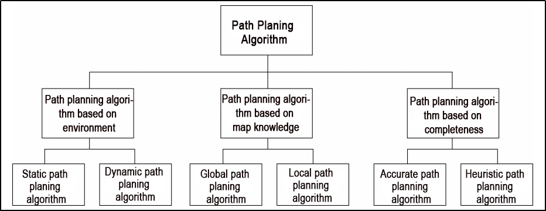
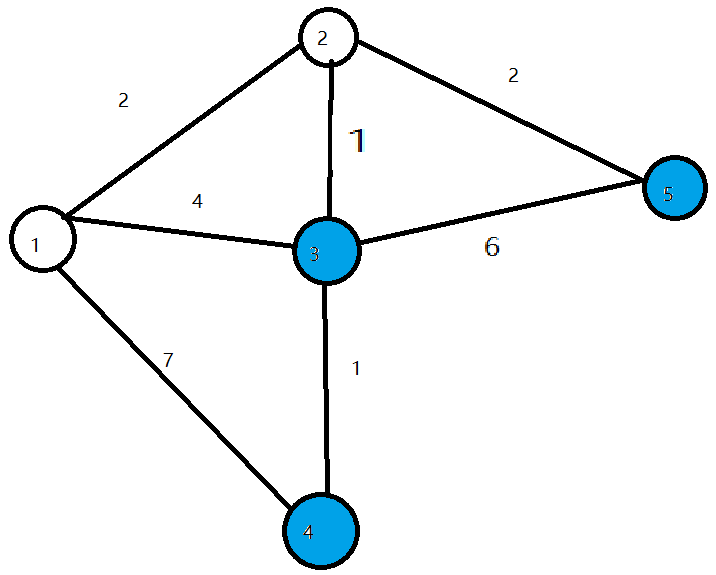
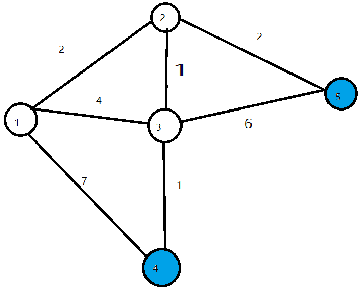
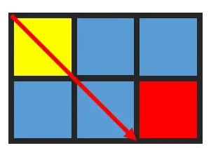
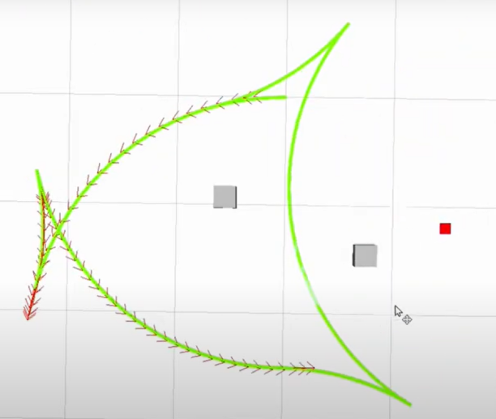

# 7. Navigation Lesson

## 7.1 ROS Robot Autonomous Navigation

### 7.1.1 Description

Autonomous navigation involves guiding a device along a predefined route from one point to another. It finds application in various domains:

Land Applications: Including autonomous vehicle navigation, vehicle tracking and monitoring, intelligent vehicle information systems, Internet of Vehicles applications, railway operation monitoring, etc.

Navigation Applications: Encompassing ocean transportation, inland waterway shipping, ship berthing and docking, etc.

Aviation Applications: Such as route navigation, airport surface monitoring, precision approach, etc.


ROS (Robot Operating System) follows the principle of leveraging existing solutions and provides a comprehensive set of navigation-related function packages. These packages offer universal implementations for robot navigation, sparing developers from dealing with complex low-level tasks like navigation algorithms and hardware interactions. Managed and maintained by professional R&D personnel, these implementations allow developers to focus on higher-level functions. To utilize the navigation function, developers simply need to configure relevant parameters for their robots in the provided configuration files. Custom requirements can also be accommodated through secondary development of existing packages, enhancing research and development efficiency and expediting product deployment.

In summary, ROS's navigation function package set offers several advantages for developers. Developed and maintained by a professional team, these packages provide stable and comprehensive functionality, allowing developers to concentrate on upper-layer functions, thus streamlining development processes.

### 7.1.2 Package Explanation

This section will provide a detailed analysis and explanation of the navigation function package, including the usage of parameters.

* **Principle Structure Framework Explanation** 

The Nav2 project inherits and promotes the spirit of the ROS Navigation Stack. The project strives to safely navigate mobile robots from point A to point B. Nav2 can also be applied to other applications, including robot navigation tasks such as dynamic point tracking, which involves dynamic path planning, velocity calculation, obstacle avoidance, and recovery behaviors.

Nav2 utilizes behavior trees to invoke modular servers to accomplish an action. These actions can involve path computation, control forces, recovery, or any other navigation-related operation. These are achieved through independent nodes communicating with ROS Action servers and the behavior tree (BT). You can refer to the diagram below for a preliminary understanding of Nav2's architecture:


The architecture diagram above can be further explained as one major component and three minor components, totaling four services.

**Major:**

BT Navigator Server: This service organizes and invokes the following three minor services.

**Minor:**

Planner Server: Responsible for path planning, the planner server computes paths based on selected naming conventions and algorithms. These paths are essentially routes calculated on the map.

Controller Server: Also known as the local planner in ROS 1, this server provides the method for the robot to follow the globally computed path or complete local tasks. In simple terms, it controls the robot's movement based on the planned route.

Recovery Server: The backbone of the fault-tolerant system, the recovery server handles unknown or faulty conditions autonomously. Its goal is to manage unexpected situations the robot may encounter and recover autonomously. For example, if the robot falls into a hole while moving, the recovery server finds a way to get it out.

By continuously switching between planning paths, controlling the robot along the path, and autonomously recovering from issues, the robot achieves autonomous navigation.

During robot navigation, relying solely on the original map generated by SLAM is insufficient. The robot may encounter new obstacles during movement, or it may find that obstacles in certain areas of the original map have disappeared. Therefore, the maintained map during robot navigation is dynamic. Depending on the update frequency and purpose, it can be categorized into the following two types:

**Global Costmap:**

The global costmap is mainly used for global path planners. As seen in the structure diagram above, it is located within the Planner Server.

It typically includes the following layers:

Static Map Layer: This layer consists of the static map usually created by SLAM.

Obstacle Map Layer: This layer is used to dynamically record obstacle information perceived by sensors.

Inflation Layer: This layer inflates (expands outward) the maps from the previous two layers to prevent the robot's shell from colliding with obstacles.

**Local Costmap:**

The local costmap is primarily used for the local path planner, as seen in the Controller Server in the architecture diagram above. It typically consists of the following layers:

Obstacle Map Layer: This layer records dynamically sensed obstacle information from sensors.

Inflation Layer: This layer inflates (expands outward) on top of the obstacle map layer to prevent the robot's shell from colliding with obstacles.

* **Install Navigation Package** 

Note: The navigation package is pre-installed on the robot. You do not need to install it again. This section is for learning only.

The navigation system takes navigation targets, localization information, and map information as inputs and outputs the actual control quantities that manipulate the robot. You need to know where the robot is and where the robot needs to go.  

There are two ways to install the navigation package:

(1) Install it directly into the system using apt-get, with the commands:

```bash
sudo apt install ros-yoursystem-navigation2
```

"**yoursystem**" is your ROS version. The ROS system installed on MentorPi is the Humble version.

```bash
sudo apt install ros-yoursystem-nav2-bringup
```

"**yoursystem**" is your ROS version. The ROS system installed on MentorPi is the Humble version.

:::{Note}

"**yoursystem**" represents your ROS2 version, which can be viewed by entering "**echo \$ROS_DISTRO**" in the terminal.

:::


(2) Download the source code of the package and manually compile and install it. If you only need to use the navigation package for learning, install it in binary form for convenience. If you need to modify the code in the package to improve the algorithm, manually install it through the source code.

Navigation package wiki link: [https://wiki.ros.org/Robots/Nav2](https://wiki.ros.org/Robots/Nav2)

## 7.2 AMCL Adaptive Monte Carlo Positioning

### 7.2.1 AMCL Positioning

Positioning involves determining the robot's position in the global map. While SLAM also includes positioning algorithm implementation, SLAM's positioning is utilized for building the global map and occurs before navigation begins. Current positioning, on the other hand, is employed during navigation, where the robot needs to move according to the designated route. Through positioning, it can be assessed whether the robot's actual trajectory aligns with expectations.

The AMCL (Adaptive Monte Carlo Localization) system, provided in the ROS navigation function package ros-navigation, facilitates robot positioning during navigation. AMCL utilizes the adaptive Monte Carlo positioning method and employs particle filters to compute the robot's position based on existing maps.

Positioning addresses the association between the robot and obstacles, as path planning fundamentally involves decision-making based on surrounding obstacles. While theoretically, completing the navigation task only requires knowledge of the robot's global positioning and real-time obstacle avoidance using laser radar and other sensors, the real-time performance and accuracy of global positioning are typically limited. Local positioning from odometry, IMUs, etc., ensures the real-time performance and accuracy of the robot's motion trajectory. The amcl node in the navigation function package provides global positioning by publishing map_odom. However, users can substitute amcl global positioning with other methods that provide map_odom, such as SLAM, UWB, QR code positioning, etc.

Global positioning and local positioning establish a dynamic set of tf coordinates map_odombase_footprint, with static tf coordinates between various sensors in the robot provided through the robot URDF type. This TF relationship resolves the association problem between the robot and obstacles. For instance, if the lidar detects an obstacle 3m ahead, the tf coordinates between the lidar and the robot chassis, base_link to laser_link, are utilized. Through standard transformation, the relationship between the obstacle and the robot chassis can be determined.

### 7.2.2 Particle Filter

The Monte Carlo positioning process simulates particle updates for a one-dimensional robot. Initially, a group of particles is randomly generated, with each particle representing a potential position, direction, or state variable that requires estimation. Each particle is assigned a weight indicating its similarity to the actual system state. Next, the state of each particle at the next time step is predicted, and particles are moved based on the anticipated behavior of the real system. The weights of the particles are then updated based on measurements. Particles that closely match the measured value receive higher weights and are resampled, while highly unlikely particles are discarded and replaced with more probable ones. Finally, the weighted average and covariance of the particle set are calculated to derive the state estimate.


Monte Carlo methods generally follow a specific pattern:

(1) Define possible input fields.

(2) Randomly generate inputs from a probability distribution over the domain.

(3) Perform deterministic calculations on inputs.

(4) Summarize results.

Two important considerations are:

(1) If the points are not uniformly distributed, the approximation effect will be poor.

(2) This process requires many points. The approximation is usually poor if only a few points are randomly placed throughout the square. On average, the accuracy of the approximation improves as more points are placed.

The Monte Carlo particle filter algorithm finds applications in various fields, including physical science, engineering, climatology, and computational biology.

### 7.2.3 Adaptive Monte Carlo Positioning

AMCL can be viewed as an enhanced iteration of the Monte Carlo positioning algorithm, designed to boost real-time performance by employing a reduced number of samples compared to the traditional method, thereby minimizing execution time. It implements an adaptive or KLD sampling Monte Carlo localization method, utilizing particle filtering to track a robot's pose against an existing map.

The Adaptive Monte Carlo positioning nodes primarily utilize laser scanning and lidar maps to exchange messages and perform pose estimation calculations. The implementation process entails initializing the adaptive Monte Carlo positioning algorithm's particle filter for each parameter provided by the ROS system during initialization. In instances where the initial pose is not specified, the algorithm assumes that the robot commences its journey from the origin of the coordinate system, resulting in a more intricate calculation process.

Hence, it is advisable to set the initial pose using the "**2D Pose Estimate**" button in rviz. For further information on Adaptive Monte Carlo positioning, you can also refer to the wiki address link: [https://github.com/ros-planning/navigation](https://github.com/ros-planning/navigation)

AMCL can be viewed as an enhanced iteration of the Monte Carlo positioning algorithm, designed to boost real-time performance by employing a reduced number of samples compared to the traditional method, thereby minimizing execution time. It implements an adaptive or KLD sampling Monte Carlo localization method, utilizing particle filtering to track a robot's pose against an existing map.

The Adaptive Monte Carlo positioning nodes primarily utilize laser scanning and lidar maps to exchange messages and perform pose estimation calculations. The implementation process entails initializing the adaptive Monte Carlo positioning algorithm's particle filter for each parameter provided by the ROS system during initialization. In instances where the initial pose is not specified, the algorithm assumes that the robot commences its journey from the origin of the coordinate system, resulting in a more intricate calculation process.

Hence, it is advisable to set the initial pose using the "**2D Pose Estimate**" button in rviz. For further information on Adaptive Monte Carlo positioning, you can also refer to the wiki address link: [https://github.com/ros-planning/navigation](https://github.com/ros-planning/navigation)

### 7.2.4 Cost Map

Regardless of whether it's a 2D or 3D SLAM map generated by LiDAR or a depth camera, it cannot be directly employed for actual navigation. Instead, it needs to be converted into a costmap. In ROS, the costmap typically adopts a grid format, where each grid cell in the raster map occupies 1 byte (8 bits). This allows for data storage ranging from 0 to 255, representing different cell costs.

The costmap only requires consideration of three scenarios: occupied (barrier), free area (barrier-free), and unknown space.

Before delving into costmap_2d, it's important to introduce the Bresenham algorithm. This algorithm is utilized to draw a straight line between two points by calculating the closest point of a line segment on an n-dimensional raster. It relies solely on relatively fast integer operations such as addition, subtraction, and bit shifting, making it a fundamental algorithm in computer graphics.


To construct a set of virtual grid lines, we begin by passing them through the pixel centers of each row and column. The intersection points of these straight lines with each vertical grid line are calculated sequentially, starting from the line's origin and moving towards its endpoint. Subsequently, the pixel closest to each intersection point within the pixel column is determined based on the sign of the error term.

The core concept of the algorithm relies on the assumption that k=dy/dx, where k represents the slope. Since the straight line originates from the center of a pixel, the initial error term d is set to d0＝0. With each increment in the subscript X, d increases by the slope value k, i.e., d=d+k. When d≥1, 1 is subtracted from it to ensure that d remains between 0 and 1. If d≥0.5, the pixel closest to the upper-right of the current pixel is considered (i.e., (x+1,y+1)); otherwise, it's closer to the pixel on the right (i.e.,(x+1,y)). For ease of calculation, let e=d−0.5; initially, e is set to -0.5, and it increments by k. When e≥0, the upper-right pixel of the current pixel (xi, yi) is selected, and when e\<0, the pixel closer to the right (x+1,y) is chosen instead. Integers are preferred to avoid division. Since the algorithm only uses the sign of the error term, it can be replaced as follows: e1 = 2\*e\*dx.


The Costmap2D class is responsible for managing the cost value of each raster. Meanwhile, the Layer class serves as a virtual base class, standardizing the interfaces of costmap layers for each plugin. Key interface functions include:

The initialize function, which invokes the onInitialize function to initialize each costmap layer individually.

The matchSize function, found in the StaticLayer and ObstacleLayer classes, ensures consistency across costmap layers by calling the matchSize function of the CostmapLayer class. This initialization process sets the size, resolution, origin, and default cost value of each layer. In the inflationLayer class, a cost table is computed based on the expansion radius, enabling subsequent cost value queries based on distance. Additionally, the seen\_ array is defined to mark traversed rasters. For the VoxelLayer class, initialization involves setting the size of the voxel grid.

The updateBounds function adjusts the size range of the current costmap layer requiring updates. For the StaticLayer class, the update range is determined by the size of the static map (typically used in global costmaps). Conversely, the ObstacleLayer class determines obstacle boundaries by traversing sensor data in clearing_observations.

The initialize and matchSize functions are executed only once each, while updateBounds and updateCosts are performed periodically, their frequency determined by map_update_frequency.

The CostmapLayer class inherits from both the Layer class and the Costmap2D class, providing various methods for updating cost values. The StaticLayer and ObstacleLayer classes, needing to retain cost values of instantiated layers, also inherit from CostmapLayer. The StaticLayer updates its costmap using static raster map data, whereas the ObstacleLayer employs sensor data for updates. In contrast, the VoxelLayer class considers z-axis data more extensively, particularly in obstacle clearance. This distinction primarily affects obstacle removal, with two-dimensional clearance in one case and three-dimensional clearance in the other.


Costmap measurement barriers offer remarkable flexibility. You can tailor a specific layer to your requirements, thereby managing pertinent barrier information effectively. For instance, if your robot is equipped solely with LiDAR, you'll need to establish an Obstacles layer to handle obstacle data scanned by the LiDAR. In case ultrasonic sensors are integrated into the robot, creating a new Sonar layer becomes necessary to manage obstacle information from the sonic sensor. Each layer can define its own rules for obstacle updates, encompassing tasks such as obstacle addition, deletion, and confidence level updates. This approach significantly enhances the scalability of the navigation system.

### 7.2.5 Global Path Planning

Preface: Based on the mobile robot's perception of the environment, the characteristics of the environment, and the algorithms employed, path planning can be categorized into environment-based, map knowledge-based, and completeness-based path planning algorithms.


Commonly used path planning algorithms in robot autonomous navigation encompass Diikstra, A\*, D\*, PRM, RRT, genetic algorithms, ant colony algorithms, fuzzy algorithms, and others.

Dijkstra and A\* are graph-based path search algorithms commonly utilized in robotic applications. The navigation function package integrates navfn, global planner, and carrot planner as global route planning plug-ins. Users have the option to select one of these plug-ins to load into move_base for utilization. Alternatively, they can opt for a third-party global path planning plug-in, such as SBPL_Lattice_Planner or srl_global_planner, or develop a custom global path planning plug-in adhering to the interface specification of nav_core.



Mobile robot navigation facilitates reaching a target point through path planning. The navigation planning layer comprises several components:

**(1) Global path planning layer:** This layer generates a global weight map based on the provided goal and accepts weight map information. It then plans a global path from the starting point to the target location, serving as a reference for local path planning.

**(2) Local path planning layer:** This component, constituting the local planning aspect of the navigation system, operates on the local weight map information derived from the weight map. It conducts local path planning considering nearby obstacle information.

**(3) Behavior execution layer:** This layer integrates instructions and path planning data from the higher layers to determine the current behavior of the mobile robot.

Path planning algorithms for mobile robots are a crucial area of research, significantly impacting the efficiency of robotic operations.

* **Dijkstra Algorithm** 

Dijkstra's algorithm is a classic shortest path algorithm known for its efficiency in finding the shortest path from a single source to all other vertices in a graph. It operates by expanding outward in layers from the starting point, employing a breadth-first search approach while considering edge weights. This makes it one of the most widely used algorithms in global path planning.

Here is a diagram illustrating the process of Dijkstra's algorithm:

(1) Initially, we set the distance from the starting point (start) to itself as 0, and all other points' distances are initialized to infinity.


(2) During the first iteration, we identify the point (let's call it Point 1) with the smallest distance value, mark it as processed, and update the distances of all adjacent points (previously unprocessed) connected to Point 1. For instance, if Point 1 is connected to Points 2, 3, and 4, we update their distances as follows: dis\[2\]=2, dis\[3\]=4, and dis\[4\]=7.


(3) In the subsequent iterations, we repeat the process: find the point with the smallest distance value (e.g., Point 2 in the second iteration), mark it as processed, and update the distances of its adjacent points (if necessary). For example, if Point 2 is connected to Points 3 and 5, we update their distances as dis\[3\]=3 and dis\[5\]=4.



(4) This procedure continues until all points have been processed. At each iteration, we select the unprocessed point with the smallest distance and update distances of its adjacent points accordingly.



(5) Once all points have been processed, the algorithm terminates, and the shortest path distances from the starting point to all other points are determined.

To access the introduction and usage details of the Dijkstra algorithm, please log in to the wiki using the following link:

<http://wiki.ros.org/navfn>

* **A Star Algorithm** 

A-star is an enhancement of Dijkstra's algorithm tailored for single destination optimization. While Dijkstra's algorithm determines paths to all locations, A-star focuses on finding the path to a specific location or the nearest location among several options. It prioritizes paths that seem to be closer to the goal.

The formula for the A-star algorithm is: F=G+H, where G represents the movement cost from the starting point to the designated square, and H denotes the estimated cost from the designated square to the endpoint. There are two methods for calculating the H value:

(1) Calculate the distance of horizontal and vertical movement; diagonal calculation is not applicable (Manhattan distance).


(2) Calculate the distance of horizontal and vertical movement; diagonal calculation is applicable (diagonal distance).



For an introduction to and usage of the A\* algorithm, please consult the video tutorial or visit the following links:

ROS Wiki: [http://wiki.ros.org/global%20planner](http://wiki.ros.org/global%20planner)

Red Blob Games website: <https://www.redblobgames.com/pathfinding/a-star/introduction.html#graphs>

## 7.3 DWA Path Planning

### 7.3.1 DWA Algorithm

* **Description** 

The Dynamic Window Approach (DWA), a classic algorithm for path planning and motion control of mobile robots, ensures safe navigation on a known map. By exploring the speed and angular velocity state space, DWA identifies the optimal combination for safe navigation. Below, you'll find a basic description along with some key formulas of the DWA algorithm.


The core concept of the DWA algorithm involves the robot assessing its current state and sensor data to generate a series of potential motion trajectories (referred to as dynamic windows) in the speed and angular velocity state space. These trajectories are then evaluated based on criteria such as obstacle avoidance, maximizing forward speed, and minimizing angular velocity to select the optimal trajectory. Through iterative iterations of this process, the robot dynamically plans its trajectory in real-time to adapt to changing environments and obstacles.

* **Formula** 

(1) Robot status: current position (x, y) and orientation (θ)

(2) Motion control parameters: linear velocity (V) and angular velocity (ω).

(3) Range of velocity and angular velocity sampling: minimum (Vmin, ωmin) and maximum (Vmax, ωmax).

(4) Time step: Δt

The formula is as below:

**① Velocity Sampling:** In the DWA algorithm, the initial step involves sampling the state space of velocity and angular velocity to create a set of potential velocity-angular velocity pairs, known as dynamic windows.

V<sub>samples</sub> = \[v<sub>min</sub>, v<sub>max</sub>\]

ω<sub>samples</sub> = \[-ω<sub>max</sub>, ω<sub>max</sub>\]

(V<sub>samples</sub>) denotes the speed sampling range, while (ω<sub>samples</sub>) indicates the angular speed sampling range.

**② Motion Simulation:** The DWA algorithm conducts a motion simulation for each speed-angular velocity pair, determining the trajectory of the robot based on these combinations in its current state.

x(t+1) = x(t) + v \* cos(θ(t)) \*Δt

y(t+1) = y(t) + v \* sin(θ(t)) \*Δt

θ(t+1) = θ(t) + ω \* Δt

Here, x(t) and y(t) denote the robot's position, θ(t) represents its orientation, v stands for linear velocity, ω for angular velocity, and Δt represents the time step.

**③ Trajectory Evaluation:** The DWA algorithm assesses each generated trajectory using evaluation functions, including obstacle avoidance, maximum speed, and minimum angular velocity.

**④ Obstacle Avoidance Evaluation:** Detects if the trajectory intersects with obstacles.

**⑤ Maximum Speed Evaluation:** Verifies if the maximum linear speed on the trajectory falls within the permissible range.

**⑥ Minimum Angular Velocity Evaluation:** Ensures that the minimum angular velocity on the trajectory remains within the allowed range.

These evaluation functions can be defined and adjusted as per task requirements.

**⑦ Select optimal trajectory**: The DWA algorithm chooses the trajectory with the highest evaluation score as the next move for the robot.


* **Expansion** 

Extensions and resources for learning about the DWA algorithm:

The DWA algorithm serves as a fundamental method in mobile robotics, with numerous extended and enhanced versions designed to boost performance and efficiency in path planning. Some notable variations include:

(1) DWA Algorithm Extension: <https://arxiv.org/abs/1703.08862>

(2) Enhanced DWA (e-DWA) Algorithm: <https://arxiv.org/abs/1612.07470>)

(3)  DP-DWA Algorithm (DP-based Dynamic Window Approach): <https://arxiv.org/abs/1909.05305>

(4) ROS Wiki: [http://wiki.ros.org/dwa_local_planner](http://wiki.ros.org/dwa_local_planner)

These resources provide in-depth insights and further exploration into the DWA algorithm and its various extensions.

### 7.3.2 TEB Algorithm

* **Description** 

The TEB (Timed Elastic Band) algorithm is utilized for both path planning and motion planning, particularly in domains like robotics and autonomous vehicles. At its core, the TEB algorithm treats path planning as an optimization challenge, aiming to generate the best trajectory within a specified timeframe while accommodating dynamic constraints and obstacle avoidance needs for the robot or vehicle. Key characteristics of the TEB algorithm encompass:

**(1) Time Layered Representation:** The TEB algorithm employs time layering, dividing the trajectory into discrete time steps, each corresponding to a position of the robot or vehicle. This aids in setting timing constraints and preventing collisions.

**(2) Trajectory Parameterization:** TEB parameterizes the trajectory into displacements and velocities, facilitating optimization. Each time step is associated with displacement and velocity parameters.

**(3) Constrained Optimization:** TEB considers dynamic constraints, obstacle avoidance, and trajectory smoothness, integrating them into the objective function of the optimization problem.

**(4) Optimization Solution:** TEB utilizes techniques like linear quadratic programming (QP) or nonlinear programming (NLP) to determine optimal trajectory parameters that fulfill the constraints.




* **Formula** 

The figure below illustrates the optimization objective function in the TEB algorithm:


In the following expression:

J(x) denotes the objective function, where x represents the trajectory parameter.

wsmooth and wobstacle represent weights assigned to smoothness and obstacle avoidance, respectively.

H signifies the smoothness penalty matrix.

f(xi, oj) represents the obstacle cost function between trajectory point xi and obstacle oj.

(1) Status Definition:

Firstly, we define the state of the robot (or vehicle) in the path planning problem as follows:

Position: P = \[X, Y\], indicating the coordinates of the robot on the two-dimensional plane.

Velocity: V = \[Vx, Vy\], representing the robot's velocity along the X and Y axes.

Time: t, denoting the current time.

Control Input: u = \[ux, uy\], representing the control input of the robot, which can be speed or acceleration.

Robot Trajectory: x(t) = \[p(t), v(t)\], indicating the state of the robot at time t.

(2) Target Function:

The essence of the TEB algorithm lies in solving an optimization problem. The objective is to minimize a composite function comprising various components:


Jsmooth(x): Smoothness objective function, ensuring trajectory smoothness.

Jobstacle(x): Obstacle avoidance objective function, preventing collisions with obstacles.

Jdynamic(x): Dynamic objective function, ensuring compliance with the robot's dynamic constraints.

(3) Smoothness objective function Jsmooth(x):

Smoothness objective functions typically involve the curvature of trajectories to ensure the generated trajectories are smooth. It can be represented as:


Where k(t) is the curvature.

(4) Obstacle avoidance objective function Jobstacle(x):

The obstacle avoidance objective function calculates the distance between trajectory points and obstacles. It penalizes trajectory points that are in close proximity to obstacles. The specific obstacle cost function, denoted as f(x,o), can be adjusted according to specific requirements or needs.

$$J_{obstacle}(x)\  = \ \sum_{o \in obstacles}^{}{\int_{}^{}(x,o)}\ $$

(5) Dynamic objective function Jdynamic(x):

The dynamics objective function ensures that the generated trajectory adheres to the robot's dynamic constraints, which are determined by its kinematics and dynamics model. This typically includes limitations on velocity and acceleration.

(6) Optimization:

In the end, the Trajectory Optimization with Ellipsoidal Bounds (TEB) algorithm addresses the stated objective function by framing it as a constrained optimization problem. This problem incorporates optimization variables for trajectory parameters, time allocation, and control inputs. Typically, this optimization problem falls under the category of nonlinear programming (NLP) problems.

* **Expansion** 


Additional resources and learning materials for the TEB algorithm:

The TEB algorithm is a significant technology within the realm of path planning, boasting numerous extended and enhanced versions. Below are some learning links and extension topics aimed at facilitating a more comprehensive understanding of the TEB algorithm and its associated concepts:

(1) Original TEB Paper: "**Trajectory modification considering dynamic constraints of autonomous robots**" by M. Rösmann et al.

(2) TEB implementation in ROS: The TEB algorithm is commonly implemented as a ROS package (Robot Operating System Package), making it readily available for robot path planning tasks.

ROS TEB Local Planner Package:

<https://github.com/rst-tu-dortmund/teb_local_planner>

Wiki website:

<http://wiki.ros.org/teb_local_planner>

These links provide valuable resources for users seeking to explore the TEB algorithm and its associated topics in greater detail.

## 7.4 Point-to-Point and Multi-Point Navigation and Obstacle Avoidance

Before initiating navigation, it's essential to enable the robot to map. You can find detailed guidance on this process in "**[6. Mapping Lesson/ 6.5 slam_toolbox Mapping Algorithm](6.mapping_courses.md#rtab-vslam-3d-mapping)**".

### 7.4.1 Robot Operations

(1) Click-on  to open the command line terminal.

(2) Execute the command to disable the app auto-start service:

```bash
~/.stop_ros.sh
```

(3) Enter the following command to start the navigation service and press Enter:

```bash
ros2 launch navigation navigation.launch.py map:=map_01
```

The "**map_01**" at the end of the command is the map name. You can modify this parameter according to your needs. The map is stored at "/home/ubuntu/ros2_ws/src/slam/maps".

### 7.4.2 Virtual Machine Operations

(1) Click-on  to open the command-line terminal on the virtual machine.

(2) Enter the following command to start the RViz tool for navigation display:

```bash
ros2 launch navigation rviz_navigation.launch.py
```


* **Point-to-Point Navigation** 

In the software menu bar, **"2D Pose Estimate"** is used to set the initial position of the JetRover robot; "**2D Nav Goal**" is used to set a single target point for the robot; "**Publish Point**" is used to set multiple target points for the robot.


(1) Click  to set the initial position of the robot. On the map interface, choose a position, click, and drag the mouse to select the robot's pose.


(2) After setting the initial position of the robot, the effect is as shown in the figure below:


(3) Click  and select a location on the map interface as the target point. Click the mouse once at that point. After selection, the robot will automatically generate a route and move to the target point.


(4) After confirming the target point, the map will display two paths: the green line represents the direct path between the robot and the target point, and the dark blue line represents the planned path of the robot.


(5) When encountering obstacles, the robot will bypass them and continuously adjust its posture and travel route.


* **Multi-Point Navigation** 

(1) Click the "**waypoint**" button to start multi-point navigation:


(2) Set each navigation point using  as shown in the figure below:


(3) Finally, click "**Start Nav Through Poses**" or "**Start Waypoint Following**" to start navigation. "**Start Nav Through Poses**" will control the robot's pose at each navigation point; "**Start Waypoint Following**" will not focus on the robot's pose at each navigation point.


(4) The effect during multi-point navigation is shown in the figure below, with the robot reaching the target points in sequence:


(5) The effect after completing multi-point navigation is shown in the figure below:


(6) If you want to exit the game, press "**Ctrl+C**" in the terminal interface.

After experiencing the game, you can enable the app service through commands or by restarting the robot. If the app is not enabled, the related app functions will not work. If the robot is restarted, the app will be automatically enabled.

Click  and enter the command. Press enter to start the app, and wait for the buzzer to beep. Please enter the command in the system path, not in the Docker container.

```bash
sudo systemctl restart start_node.service
```

### 7.4.3 Launch Description


The path to the launch file is located at:[/home/ubuntu/ros2_ws/src/navigation/launch/navigation.launch.py](../_static/source_code/navigation.zip)

(1) Set Paths

Obtain the paths for the "**slam**" and "**navigation**" packages.

{lineno-start=12}

```python
    if compiled == 'True':
        slam_package_path = get_package_share_directory('slam')
        navigation_package_path = get_package_share_directory('navigation')
    else:
        slam_package_path = '/home/ubuntu/ros2_ws/src/slam'
        navigation_package_path = '/home/ubuntu/ros2_ws/src/navigation'
```

(2) Enable Other Launch Files

`base_launch` for various hardware

`navigation_launch` to start the navigation algorithm

`bringup_launch` to initialize actions

{lineno-start=34}

```python
    base_launch = IncludeLaunchDescription(
        PythonLaunchDescriptionSource(os.path.join(slam_package_path, 'launch/include/robot.launch.py')),
        launch_arguments={
            'sim': sim,
            'master_name': master_name,
            'robot_name': robot_name
        }.items(),
    )
    
    navigation_launch = IncludeLaunchDescription(
        PythonLaunchDescriptionSource(os.path.join(navigation_package_path, 'launch/include/bringup.launch.py')),
        launch_arguments={
            'use_sim_time': use_sim_time,
            'map': os.path.join(slam_package_path, 'maps', map_name + '.yaml'),
            'params_file': os.path.join(navigation_package_path, 'config', 'nav2_params.yaml'),
            'namespace': robot_name,
            'use_namespace': use_namespace,
            'autostart': 'true',
            'use_teb': use_teb,
        }.items(),
    )

    bringup_launch = GroupAction(
     actions=[
         PushRosNamespace(robot_name),
         base_launch,
         TimerAction(
             period=10.0,  # 延时等待其它节点启动好(delay for enabling other nodes)
             actions=[navigation_launch],
         ),
      ]
    )
```

### 7.4.4 Feature Pack Description

The path to the navigation package is: /home/ubuntu/ros2_ws/src/navigation/


config: Contains configuration parameters related to navigation, as shown below:


launch: Contains launch files related to navigation, including localization, map loading, navigation modes, and simulation model launch files, as shown below:


rviz: Contains parameter loading for the RViz visualization tool, including RViz configuration files for robots using different navigation algorithms and navigation configuration files, as shown below:


Package.xml: Configuration information file for the current package.

## 7.5 RTAB-VSLAM 3D Navigation

### 7.5.1 Algorithm Introduction & Principle

For an introduction to the RTAB-VSLAM algorithm and its principles, refer to "[**6. Mapping Lesson/ 6.5 RTAB-VSLAM 3D Mapping**](6.mapping_courses.md#rtab-vslam-3d-mapping)" for study and reference.

### 7.5.2 Robot Operations

(1) Start the robot, and access the robot system desktop using VNC.

(2) Click-on  to open the command line terminal.

(3) Execute the command to disable the app auto-start service:

```bash
~/.stop_ros.sh
```

(3) Enter the following command to start the navigation service and press Enter:

```bash
ros2 launch navigation rtabmap_navigation.launch.py
```


### 7.5.3 Virtual Machine Operations

(1) Click-on  to open the command-line terminal on the virtual machine.

(2) Enter the following command to start the RViz tool for navigation display:

```bash
ros2 launch navigation rviz_rtabmap_navigation.launch.py
```

In the software menu bar, "**2D Nav Goal**" is used to set a single target point for the robot, and "**Publish Point**" is used to set multiple target points for the robot.


(3) Click , and on the map interface, select a location as the target point by clicking the mouse once at that point. After the selection is made, the robot will automatically generate a route and move to the target point.


(4) After confirming the target point, the map will display two paths: a line composed of blue squares representing the straight-line path between the robot and the target point, while the dark blue line represents the planned path of the robot.


(5) After encountering obstacles, the car will navigate around them and continuously adjust its posture and trajectory.

(6) If you want to exit the game, press "**Ctrl+C**" in the terminal interface.

After experiencing the game, you can enable the app service through commands or by restarting the robot. If the app is not enabled, the related app functions will not work. If the robot is restarted, the app will be automatically enabled.

Click  and enter the command. Press enter to start the app, and wait for the buzzer to beep. Please enter the command in the system path, not in the Docker container.

```bash
sudo systemctl restart start_node.service
```

### 7.5.4 Launch Description


The launch file is saved in: **[/home/ubuntu/ros2_ws/src/navigation/launch/navigation.launch.py](../_static/source_code/navigation.zip)**

**(1) Set Paths**

Obtain the paths for the "**slam**" and "**navigation**" packages.

{lineno-start=12}

```python
    if compiled == 'True':
        slam_package_path = get_package_share_directory('slam')
        navigation_package_path = get_package_share_directory('navigation')
    else:
        slam_package_path = '/home/ubuntu/ros2_ws/src/slam'
        navigation_package_path = '/home/ubuntu/ros2_ws/src/navigation'
```

**(2) Enable Other Launch Files**

`rtabmap_launch` to start 3D navigation algorithm

`navigation_launch` to start 2D navigation algorithm

`bringup_launch` to initialize actions

{lineno-start=34}

```python
    base_launch = IncludeLaunchDescription(
        PythonLaunchDescriptionSource(os.path.join(slam_package_path, 'launch/include/robot.launch.py')),
        launch_arguments={
            'sim': sim,
            'master_name': master_name,
            'robot_name': robot_name
        }.items(),
    )
    
    navigation_launch = IncludeLaunchDescription(
        PythonLaunchDescriptionSource(os.path.join(navigation_package_path, 'launch/include/bringup.launch.py')),
        launch_arguments={
            'use_sim_time': use_sim_time,
            'map': os.path.join(slam_package_path, 'maps', map_name + '.yaml'),
            'params_file': os.path.join(navigation_package_path, 'config', 'nav2_params.yaml'),
            'namespace': robot_name,
            'use_namespace': use_namespace,
            'autostart': 'true',
            'use_teb': use_teb,
        }.items(),
    )

    bringup_launch = GroupAction(
     actions=[
         PushRosNamespace(robot_name),
         base_launch,
         TimerAction(
             period=10.0,  # 延时等待其它节点启动好(delay for enabling other nodes)
             actions=[navigation_launch],
         ),
      ]
    )
```