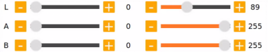
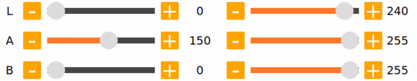

# 8. ROS+OpenCV Lesson

## 8.1 Install Depth Camera


If the camera module included with your MentorPi system is a monocular type, please consult the following installation procedures for implementation.


Interface indication:


## 8.2 Color Threshold Adjustment

The color of an object can change with the light sources, which can affect the functionality involved color recognition. To tackle this issue, this lesson will introduce you how to use LAB Tool to adjust the color threshold.

### 8.2.1 Enable LAB_Tool

(1) Open the VNC software. Locate and open the "**LAB_Tool**" on the main interface.


(2) The "**Execute File**" dialog box will appear. Click "**Execute**" to proceed.


(3) After entering the software, you can see the interface of LAB_Tool, as shown in the figure below:


:::{Note}

If the live feed camera does not appear in the pop-up interface, it means that the camera is not connected successfully. Please check if the camera connection cable is properly connected.

:::

The interface of LAB tool software is divided into two parts: image display area and recognition adjustment area.


(4) Image display area: the left displays the processed image and the right is the raw image.

:::{Note}

If the transmitted image does not display normally, it's the issue of camera connection. In this case, you need to examine if the wiring is connected properly or reconnect it.

:::

(5) Recognition adjustment area: adjust the color threshold. The function of each button refer to the following table:

<table class="docutils" border="1">
<colgroup>
<col  />
<col  />
</colgroup>
<tbody>
<tr>
<td ><strong>Icon</strong></td>
<td ><strong>Function instruction</strong></td>
</tr>
<tr>
<td ></td>
<td ><p>The sliders L, A and B are used respectively to adjust the values of the corresponding L, A and B components of the image.</p>
<p>The sliders on the left are the "<strong>min</strong>" value for each component while the slider on the right are the "<strong>max</strong>" value for each component.</p></td>
</tr>
<tr>
<td ></td>
<td >Choose color to adjust the threshold.</td>
</tr>
<tr>
<td ></td>
<td >Delete the currently selected color.</td>
</tr>
<tr>
<td ></td>
<td >Add recognizable color.</td>
</tr>
<tr>
<td ></td>
<td >Save the adjustment result of the color threshold.</td>
</tr>
<tr>
<td ></td>
<td >Click this button to switch between Chinese and English.</td>
</tr>
<tr>
<td ></td>
<td >Click on this button to swap Depth camera/monocular camera.</td>
</tr>
<tr>
<td ></td>
<td >Close LAB TOOL.</td>
</tr>
</tbody>
</table>


<p id="anchor_8_2_2"></p>

### 8.2.2 Adjust Color Threshold

(1) Open LAN tool. Choose the color in the color drop-down list of color recognition area. Take a color "**red**" as example.


(2) Adjust the "**min**" values of L, A and B components to "**0**", and the "**max**" values to "**225**".


(3) Place the target within the camera's field of view. Adjust the values of L, A and B component towards the interval representing the target recognition color according to the LAB color space distribution chart.


Red color is close to "**+a**", which indicates that A component needs to be increased. Therefore, keep the "**max**" value of the A component unchanged and increase its "**min**" value until the object on the left turns white while other areas turn black.


(4) Adjust the L and B components according to your surroundings. If the red color is light, increase the "**min**" value of the L component; if it is dark, decrease the "**max**" value of the component. If the red color tends to be warm, increase the "**min**" value of the B component; if it tends to be cool, decrease the "**max**" value of the B component.



The following table shows the parameter information of LAB threshold adjustment:

| **Color component** | **Value Range** | **Corresponding Color Intervals** |
| :-----------------: | :-------------: | :-------------------------------: |
|          L          |      0~255      |        Black-white (-L~+L)        |
|          A          |      0~255      |       green-red（-a ~ +a）        |
|          B          |      0~255      |      Blue-yellow（-b ~ +b）       |

(5) Click "**Save**" button in adjustment area to save the adjustment parameters.


### 8.2.3 Add New Color

In addition to the built-in colors, users can add other recognition colors. Take an example of adding "**yellow**".

(1) Open LAB tool and click on "**Add**" button.


(2) Fill in the "**name**" column with the color name, and click the "**OK**" button.


(3) Choose the added color in the color drop-down menu.


(4) Place the target within the camera's field of view, and adjust the threshold by dragging the L, A, and B component sliders until the area of the colored object within the left screen turns white, while the other areas turn black.


:::{Note}
the adjustment method of color threshold refers to "[**8.2.2 Adjust Color Threshold**](#anchor_8_2_2)".
:::

(5) Click "**Save**" button in recognition adjustment area to save the adjustment parameters of color threshold.


## 8.3 Color Recognition

This session will use OpenCV to perform red, green, blue recognition and display the recognition result through transmitted image.

Before operations, please prepare one object for each color: red, green, and blue.

### 8.3.1 Recognition Process

Firstly, obtain the RGB image from the camera. Scale and apply Gaussian blur to the image. Convert the image from RGB to Lab. (For detailed explanations regarding the Lab color space, you can refer to OpenCV Basic Lesson.)

Next, identify the object color in the circle by using color thresholds, followed by masking of the image portion. (Masking is used to hide certain part of the processed image).

After performing opening and closing operations on the object image, the object with the largest contour is circled.

Open operations: erosion followed by dilation. Remove small objects, smooth the contours of object and keep its area unchanged. It can eliminate small noise and break thin connection between objects.

Erosion: it can be used to remove small objects or features from an image, break thin connections between objects, and generally reduce the size of objects.

Dilation: it is useful for filling in gaps between objects, joining nearby objects, and generally increasing the size of objects.

Finally, the recognition results are displayed on the live camera feed.

### 8.3.2 Operation Steps

:::{Note}
the entered command should be case sensitive and "**Tab**" key can be used to complement the key words.
:::

(1) Start MentorPi and connect it to VNC.

(2) Click on  to open the command line terminal.

(3) Input the command and press Enter to disable the app auto-start service.

```bash
~/.stop_sh
```

(4) Run the following command to enable the camera node:

```bash
ros2 launch peripherals depth_camera.launch.py
```

(5) Open a new command line terminal. Enter the following command to navigate to the program directory.

```bash
cd /home/ubuntu/ros2_ws/src/example/example/color_detect
```

(6) Enter the command. Press "**Enter**" to execute the program.

```bash
python3 color_detect_demo.py
```

(7) If you want to exit the game, press "**Ctrl+C**" in the terminal interface.

After experiencing the game, you can enable the app service through commands or by restarting the robot. If the app is not enabled, the related app functions will not work. If the robot is restarted, the app will be automatically enabled.

Click  and enter the command. Press enter to start the app, and wait for the buzzer to beep. Please enter the command in the system path, not in the Docker container.

```bash
sudo systemctl restart start_node.service
```

### 8.3.3 Program Outcome

:::{Note}
After the game starts, please ensure that there are no other objects containing recognized colors within the field of view of the camera to avoid affecting the implementation effect.
:::

After the game starts, place the target object within the field of view of the camera. When the target object is recognized, it will be circled up in the same color and the color name will be printed in the lower-left corner of the screen. The program supports red, blue and green object recognition.


### 8.3.4 Program Analysis

The source code of the program is located in: [/home/ubuntu/ros2_ws/src/example/example/color_detect/color_detect_demo.py](../_static/source_code/color_detect.zip).


* **Basic Configuration**

(1) Read color threshold configuration file

Call the `get_yaml_ data` function to obtain the color threshold configuration file.

{lineno-start=37}

```python
lab_data = get_yaml_data("/home/ubuntu/software/lab_tool/lab_config.yaml")
```

(2) Obtain live camera feed

Create a subscription object to read the live camera feed

through the code `/ascamera/camera_publisher/rgb0/image', image_callback, 1)`.

{lineno-start=160}

```python
node.create_subscription(Image, '/ascamera/camera_publisher/rgb0/image', image_callback, 1)
```

* **Image Processing**

The "**run**" function is called for image processing.

{lineno-start=60}

```python
def run(img):
    global draw_color
    global color_list
    global detect_color
    
    img_copy = img.copy()
    img_h, img_w = img.shape[:2]

    frame_resize = cv2.resize(img_copy, size, interpolation=cv2.INTER_NEAREST)
    frame_gb = cv2.GaussianBlur(frame_resize, (3, 3), 3)      
    frame_lab = cv2.cvtColor(frame_gb, cv2.COLOR_BGR2LAB)  # 将图像转换到LAB空间(convert image to LAB space)

    max_area = 0
    color_area_max = None    
    areaMaxContour_max = 0
    
    for i in ['red', 'green', 'blue']:
        frame_mask = cv2.inRange(frame_lab, tuple(lab_data['lab']['Stereo'][i]['min']), tuple(lab_data['lab']['Stereo'][i]['max']))  #对原图像和掩模进行位运算(perform bitwise operation on the original image and the mask)
        eroded = cv2.erode(frame_mask, cv2.getStructuringElement(cv2.MORPH_RECT, (3, 3)))  #腐蚀(erode)
        dilated = cv2.dilate(eroded, cv2.getStructuringElement(cv2.MORPH_RECT, (3, 3))) #膨胀(dilate)
        contours = cv2.findContours(dilated, cv2.RETR_EXTERNAL, cv2.CHAIN_APPROX_NONE)[-2]  #找出轮廓(find contours)
        areaMaxContour, area_max = getAreaMaxContour(contours)  #找出最大轮廓(find the largest contour)
        if areaMaxContour is not None:
            if area_max > max_area:#找最大面积(find the maximum area)
                max_area = area_max
                color_area_max = i
                areaMaxContour_max = areaMaxContour
    if max_area > 200:  # 有找到最大面积(the maximum area is found)
        ((centerX, centerY), radius) = cv2.minEnclosingCircle(areaMaxContour_max)  # 获取最小外接圆(obtain the minimum circumscribed circle)
        centerX = int(common.val_map(centerX, 0, size[0], 0, img_w))
        centerY = int(common.val_map(centerY, 0, size[1], 0, img_h))
        radius = int(common.val_map(radius, 0, size[0], 0, img_w))            
        cv2.circle(img, (centerX, centerY), radius, range_rgb[color_area_max], 2)#画圆(draw circle)
```

(1) Gaussian blur

Use the `cv2.GaussianBlur()` function from the cv2 library to apply Gaussian filtering to the image to remove noise.

{lineno-start=69}

```python
frame_gb = cv2.GaussianBlur(frame_resize, (3, 3), 3)
```

The first parameter `frame_resize` is the input image.

The second parameter `(3, 3)` is the size of the Gaussian convolution kernel. The height and width of the kernel must be positive and odd numbers.

The third parameter `3` is the standard deviation of the Gaussian kernel in the horizontal direction.

① Color space conversion

Convert the image from BGR to LAB color space.

{lineno-start=70}

```python
frame_lab = cv2.cvtColor(frame_gb, cv2.COLOR_BGR2LAB)  # 将图像转换到LAB空间(convert image to LAB space)
```

② Color detection, erosion and dilation

Perform erosion and dilation operations on the binary image to smooth the contour edges in the image and facilitate the subsequent search for target contours.

{lineno-start=77}

```python
        frame_mask = cv2.inRange(frame_lab, tuple(lab_data['lab']['Stereo'][i]['min']), tuple(lab_data['lab']['Stereo'][i]['max']))  #对原图像和掩模进行位运算(perform bitwise operation on the original image and the mask)
        eroded = cv2.erode(frame_mask, cv2.getStructuringElement(cv2.MORPH_RECT, (3, 3)))  #腐蚀(erode)
        dilated = cv2.dilate(eroded, cv2.getStructuringElement(cv2.MORPH_RECT, (3, 3))) #膨胀(dilate)
```

`frame_mask`: the input binary image mask.

`cv2.getStructuringElement(cv2.MORPH_RECT, (3, 3))`: generates a 3x3 rectangular structural element (kernel) that specifies the shape and size of the erosion operation. `cv2.MORPH_RECT` specifies the rectangular shape. "**eroded**": The binary image mask after erosion.

`cv2.getStructuringElement(cv2.MORPH_RECT, (3, 3))`: uses the same structural element as erosion for the dilation operation.

③ Get contour with the maximum area

Call the `cv2.findContours()` function from the cv2 library to find the maximum contour of the target color in the image.

{lineno-start=81}

```python
        areaMaxContour, area_max = getAreaMaxContour(contours)  #找出最大轮廓(find the largest contour)
        if areaMaxContour is not None:
            if area_max > max_area:#找最大面积(find the maximum area)
                max_area = area_max
                color_area_max = i
                areaMaxContour_max = areaMaxContour
```

Initialization: `contour_area_temp` and `contour_area_max` store the current contour area and the maximum contour area. `area_max_contour` stores the maximum contour.

Traverse Contours: Traverse each contour c in the contours list.

Calculate Area: Calculate the area of the contour c using `cv2.contourArea(c)`.

Determine Maximum Area: If the current contour area is greater than the known maximum area and greater than the threshold of 50, update the maximum area and maximum contour.

Return Value: The function returns the contour with the maximum area `area_max_contour` and its corresponding maximum area `contour_area_max`.

* **Feedback Action**

(1) Circle the target object

Call the `drawContours()` function to draw a bounding box around the target object in the live camera feed.

{lineno-start=124}

```python
    cv2.putText(img, "Color: " + detect_color, (10, img.shape[0] - 10), cv2.FONT_HERSHEY_SIMPLEX, 0.65, draw_color, 2)
```

The meaning of the parameters in the function parentheses is as follows:

`img`: The target image on which to draw the text.

`"Color: " + detect_color`: The text string to be drawn, displaying the detected color.

`(10, img.shape[0] - 10)`: The starting position of the text, in pixels, representing the coordinate of the lower left corner.

`10` is the x-coordinate of the text, starting from the left edge.

`img.shape[0] - 10` is the y-coordinate of the text, indicating the position above the bottom of the image.

`cv2.FONT_HERSHEY_SIMPLEX`: The font type.

`0.65`: The size of the text.

`draw_color`: The color of the text, represented by a BGR format tuple, such as (255, 0, 0) for blue.

The thickness of the text line, representing the pixel width of the border.

## 8.4 Generate & Recognize QR Code

This lesson is divided into two parts. The first part will introduce you how to learn to create a QR cod. The second part focuses on recognizing the created QR code and then decoding the QR code information through the terminal.

### 8.4.1 Generate QR Code

* **Process** 

First, create an instance object of the QR code tool and set its detailed parameters.

Next, obtain the user's data and fill it into the QR code.

Finally, generate a QR code image based on the data and display it in a window, and save it in the corresponding path.

* **Operation Steps** 

:::{Note}

the entered command should be case sensitive and the "**Tab**" key can be used to fill in key words.

:::

(1) Start MentorPi and connect it to VNC.

(2) Click on  to open the command line terminal.

(3) Input the command and press Enter to disable the app auto-start service.

```bash
~/.stop_sh
```

(4) Input the command to enable the camera service.

```bash
ros2 launch peripherals depth_camera.launch.py
```

(5) Open a new command line terminal. Enter the following command to navigate to the program directory.

```bash
cd ros2_ws/src/example/example/qrcode
```

(6) Enter the command. Press "**Enter**" to execute the program.

```bash
python3 qrcode_creater.py
```

(7) If you want to exit the game, press "**Ctrl+C**" in the terminal interface.

After experiencing the game, you can enable the app service through commands or by restarting the robot. If the app is not enabled, the related app functions will not work. If the robot is restarted, the app will be automatically enabled.

Click  and enter the command. Press enter to start the app, and wait for the buzzer to beep.

```bash
sudo systemctl restart start_node.service
```

* **Program Outcome** 

(1) After start the program, it's necessary to enter characters in the terminal to generate the QR code. Take the input of "**hiwonder**" as example.

```
hiwonder
```


(2) Press "**Enter**" to display a QR code image containing the input data.


(3) If need to close the program, press **"Ctrl+C"** in the terminal. If this fails, please try multiple times.

(4) After closing the window, the saved content and its path are printed.


* **Program Analysis** 

The source code of the program is located in: [/home/ubuntu/ros2_ws/src/example/example/qrcode/qrcode_creater.py](../_static/source_code/qrcode.zip)

(1) Creating QR Code Utility Object

Using the qrcode module to create the necessary object and setting various parameters for the QR code.

{lineno-start=19}

```python
    qr = qrcode.QRCode(
        version=1,
        error_correction=qrcode.constants.ERROR_CORRECT_H,
        box_size=5,
        border=4)
```

The parameters of the above function are as follows:

The first parameter `version` is an integer ranging from 1 to 40, used to control the size of the QR code. If you want the program to automatically determine the size, set this value to None and use the "**fit**" parameter.

The second parameter `error_correction` controls the error correction capability of the QR code, with the following options:

① `ERROR_CORRECT_L`: can correct approximately 7% or fewer errors.

② `ERROR_CORRECT_M`: default value, can correct approximately 15% or fewer errors.

③ `ERROR_CORRECT_H`: can correct approximately 30% or fewer errors.

The third parameter `box_size` controls the number of pixels contained in each small box of the QR code.

The fourth parameter `border` controls the number of boxes included in the border (distance between the QR code and the image boundary), with a default value of 4, which is the minimum value specified by relevant standards.

(2) Generating QR Code

Using the `add_data` and `make` functions to retrieve and fill data, and then using the `make_image` function to generate the image.

{lineno-start=24}

```python
    # 添加数据(add data)
    qr.add_data(data)
    # 填充数据(fill data)
    qr.make(fit=True)
    # 生成图片(generate image)
    img = qr.make_image(fill_color=(0, 0, 0), back_color=(255, 255, 255))
```

The parameters of the `make_image` function are as follows:

The first parameter `fill_color=(0, 0, 0)` is the fill color of the image, which is black in this case.

The second parameter `back_color=(255, 255, 255)` is the background color of the image, which is white in this case.

(3) Displaying Image

Converting the color space of the image using the `cvtColor` function, and then displaying it on the window using the `imshow` function.

{lineno-start=30}

```python
    opencv_img = cv2.cvtColor(np.asarray(img), cv2.COLOR_RGB2BGR)
    while True:
        cv2.imshow('img', opencv_img)
        k = cv2.waitKey(1)
```

(3) Saving Image

Using the `imwrite` function to store the generated QR code image and print relevant information.

{lineno-start=36}

```python
    cv2.imwrite(file_name, opencv_img)
    print('save', data, file_name)
```

The parameters of the `imwrite` function are as follows:

The first parameter `file_name` is the storage path of the image.

The second parameter `opencv_img` is the image to be stored.

### 8.4.2 QR Code Recognition

In the previous section, we created a QR code. In this section, we'll perform content recognition on the QR code.

* **Recognition Process** 

Firstly, create an instance object for QR code detection. Then, subscribe to an image topic "**/ascamera/camera_publisher/rgb0/image**" in the node and process the received image message. Use the pyzbar library to decode the QR code in the image, and draw the QR code boundary and decoded data using OpenCV. Display the processed image using OpenCV. Next, you can exit the display window by pressing the key.

* **Operation Steps** 

:::{Note}

When entering commands, it is necessary to strictly distinguish between uppercase and lowercase letters, and you can use the "**Tab**" key to complete keywords.

:::

(1) Start MentorPi and connect it to VNC.

(2) Input the command and press Enter to disable the app auto-start service.

```bash
~/.stop_sh
```

(3) Run the following command to enable the camera node:

```bash
ros2 launch peripherals depth_camera.launch.py
```

(4) Open a new command line terminal. Enter the following command to navigate to the program directory.

```bash
cd ros2_ws/src/example/example/qrcode
```

(5) Enter the command. Press "**Enter**" to open the image.

```bash
display myQRcode.jpg
```


(6) Open a new terminal and enter the command. Press "**Enter**" to execute the program.

```bash
python3 /home/ubuntu/ros2_ws/src/example/example/qrcode/qrcode_detecter.py
```

(7) If you want to exit the game, press "**Ctrl+C**" in the terminal interface.

After experiencing the game, you can enable the app service through commands or by restarting the robot. If the app is not enabled, the related app functions will not work. If the robot is restarted, the app will be automatically enabled.

Click and enter the command. Press enter to start the app, and wait for the buzzer to beep. Please enter the command in the system path, not in the Docker container.

```bash
sudo systemctl restart start_node.service
```

### 8.4.3 Program Outcome

After starting the game, it will recognize the QR code images appearing in the live camera feed, mark them with a green box, and print out the content of the QR code.


### 8.4.4 Program Analysis

The source code of the program is located in [/home/ubuntu/ros2_ws/src/example/qrcode/qrcode_detecter.py](../_static/source_code/qrcode.zip)

(1) Create QR code detection object

Use the pyzbar library to decode the QR code in the image, and draw the QR code boundary and decoded data using OpenCV.

{lineno-start=41}

```python
            decoded_objects = pyzbar.decode(image)
            for obj in decoded_objects:
                points = obj.polygon
                if len(points) > 4:
                    hull = cv2.convexHull(np.array([point for point in points], dtype=np.float32))
                    points = hull.reshape(-1, 2)
                for j in range(len(points)):
                    cv2.line(image, tuple(points[j]), tuple(points[(j+1) % len(points)]), (0, 255, 0), 3)
                x = obj.rect.left
                y = obj.rect.top
                barcode_data = obj.data.decode("utf-8")
                print(barcode_data)
                cv2.putText(image, barcode_data, (x, y - 10), cv2.FONT_HERSHEY_SIMPLEX, 0.5, (0, 255, 0), 2)

            cv2.imshow('image', image)
            key = cv2.waitKey(1)
            if key == ord('q') or key == 27:
                break
```

① `decoded_objects` is a list of QR code objects obtained by decoding the image using pyzbar.decode(image). Each `obj` represents a detected QR code.

② Use `cv2.line` to draw the boundary of the QR code. Connect every two consecutive vertices with a line:

* `image`: the image to draw on.

* `tuple(points[j])`: the coordinates of the current point.

* `tuple(points[(j+1) % len(points)])`: the coordinates of the next point, using (j+1) % len(points) to ensure connection to the first point.

* `(0, 255, 0)`: line color, green (BGR format).

* 3: line width.

(2) Get and print the decoded data of the QR code.

{lineno-start=49}

```python
                x = obj.rect.left
                y = obj.rect.top
                barcode_data = obj.data.decode("utf-8")
                print(barcode_data)
                cv2.putText(image, barcode_data, (x, y - 10), cv2.FONT_HERSHEY_SIMPLEX, 0.5, (0, 255, 0), 2)
```

Use `cv2.putText` to draw the decoded data on the image:

* `image`: the image to draw on.

* `barcode_data`: the text to draw.

* `(x, y - 10)`: the coordinates of the bottom-left corner of the text. Subtract 10 pixels to display the text above the QR code.

* `cv2.FONT_HERSHEY_SIMPLEX`: font type.

* 0.5: font size scale factor.

* (0, 255, 0): text color, green (BGR format).

* 2: text line width.

## 8.5 Autonomous Line Following

This game involves using the camera to detect the specified color, and making the robot follow the pre-laid line.

### 8.5.1 Recognition Procedure

Subscribe to the camera node's topic to get the RGB image.

Find the line to be followed in the image and select it. Pick color to get its color threshold and extract its features. Calculate the robot's offset from the line's position in the field of view, and control the robot to move along the line. Keep the line in the center of the field of view by continuously correct the robot's position. Use the lidar to detect the obstacle, enabling the obstacle avoidance.

### 8.5.2 Operation Steps

(1) Start MentorPi and connect it to VNC.

(2) Input the command and press Enter to disable the app auto-start service.

```bash
~/.stop_sh
```

(3) Input the command to enable the line following.

```bash
ros2 launch app line_following_node.launch.py debug:=true
```

(4) Open a new command line terminal. Run the following command to open the camera and select the target line.

```bash
ros2 service call /line_following/enter std_srvs/srv/Trigger {}
```

(5) Open a new command line terminal again and enter the command. Press "**Enter**" to execute the line following.

```bash
ros2 service call /line_following/set_running std_srvs/srv/SetBool "{data: True}"
```

(6) If you want to exit the game, press "**Ctrl+C**" in the terminal interface.

After experiencing the game, you can enable the app service through commands or by restarting the robot. If the app is not enabled, the related app functions will not work. If the robot is restarted, the app will be automatically enabled.

Click  and enter the command. Press enter to start the app, and wait for the buzzer to beep. Please enter the command in the system path, not in the Docker container.

```bash
sudo systemctl restart start_node.service
```

### 8.5.3 Program Outcome

After picking the color of the line to be followed, the robot starts to move along the line.

### 8.5.4 Program Analysis

The source code of the program is located in [/home/ubuntu/ros2_ws/src/app/app/line_following.py](../_static/source_code/app.zip)

:::{Note}

it's necessary to back up the original program file before making any modification to the program. You're forbidden to modify the original source code file to avoid causing robot malfunctions that may be irreparable due to incorrect parameter modifications!

:::

According to the game's effect, the process logic of this game is summarized as shown in the following diagram:


Subscribe to the topic messages published by the camera node to obtain RGB images. From the image, identify and select the target line. Determine the color threshold by picking the color of the line. Based on the line's color information, extract the features of the line for line following. Calculate the robot's offset relative to the line's position in the field of view. Control the robot to move along the line segment, continuously correcting its position to keep the line at the center of the field of view and use lidar to detect obstacles and avoid them.


First, some preset parameters such as color threshold ratio, stop threshold, and angle swing range are defined through the initialization function. These parameters can affect the final recognition effect. Then, the color picker object is defined and the additional lidar obstacle avoidance function is set. Next, the LineFollower class is implemented, which mainly includes the image preprocessing function and the logic judgment of line following.

* **Set related parameters of the initialization function "init\_\_(self, name)"**

The `LineFollowingNode` class is used as the starting point of the program, and some basic parameters are defined in the initialization function. The color threshold ratio, stop threshold, and angle swing range need to be noted. All the relevant parameters and definitions are in the "**LineFollowingNode**" class, as shown in the figure below:

{lineno-start=93 emphasize-lines="10,16"}

```python
class LineFollowingNode(Node):
    def __init__(self, name):
        rclpy.init()
        super().__init__(name, allow_undeclared_parameters=True, automatically_declare_parameters_from_overrides=True)
        
        self.name = name
        self.set_callback = False
        self.is_running = False
        self.color_picker = None
        self.follower = None
        self.scan_angle = math.radians(45)
        self.pid = pid.PID(0.005, 0.001, 0.0)
        self.empty = 0
        self.count = 0
        self.stop = False
        self.threshold = 0.5
        self.stop_threshold = 0.4
        self.lock = threading.RLock()
        self.image_sub = None
        self.lidar_sub = None
        self.image_height = None
        self.image_width = None
        self.bridge = CvBridge()
        self.image_queue = queue.Queue(2)
        #self.camera_type = os.environ['DEPTH_CAMERA_TYPE']
```

* **Set threshold ratio parameter "self.threshold":**

{lineno-start=108}

```python
self.threshold = 0.5
```

The `self.threshold` parameter sets the weight ratio of color processing to binary image during the color picking. It is called through the initialization function of the `LineFollower` class, as shown in the figure below:


The above initialization function calls the `self.threshold` parameter, which sets the minimum and maximum color ranges of the `target_color` for subsequent binary processing. To achieve better recognition and processing results, the parameters can be kept at default.

* **Set stop threshold "self.stop_threshold":**

{lineno-start=108}

```python
self.threshold = 0.5
```

The `self.stop_threshold` judges when the robot should stop. As shown in the figure below:

{lineno-start=298}

```python
            if min_dist_left < self.stop_threshold or min_dist_right < self.stop_threshold:
                self.stop = True
```

The above code determines when the car should stop. `min_dist_left` and `min_dist_right` calculate the distances from the robot to the left and right sides. When these two distances are less than the set stop threshold parameter, `self.stop` is set to True to stop the robot.

* **Set angle swing range "self.scan_angle":**

{lineno-start=108}

```python
self.scan_angle = math.radians(45)
```

The `self.scan_angle` is the swing angle of the robot during line following, with a range within 45 degrees. This angle parameter can achieve better line following effects while having a good scanning range. Increasing this parameter will increase the swing amplitude of the robot. Decreasing this parameter will decrease the swing amplitude of the robot. However, the recognition effect may not be optimal.

* **Define color picker "set_target_color_srv_callback":**

The color picker is the tool for color picking in the app. It is defined using the `set_target_color_srv_callback` function, as shown in the figure below:

{lineno-start=204}

```python
    def exit_srv_callback(self, request, response):
        self.get_logger().info('\033[1;32m%s\033[0m' % "line following exit")
        try:
            if self.image_sub is not None:
                self.destroy_subscription(self.image_sub)
                self.image_sub = None
            if self.lidar_sub is not None:
                self.destroy_subscription(self.lidar_sub)
                self.lidar_sub = None
        except Exception as e:
            self.get_logger().error(str(e))
        with self.lock:
            self.is_running = False
            self.color_picker = None
            self.pid = pid.PID(0.00, 0.001, 0.0)
            self.follower = None
            self.threshold = 0.5
            self.mecanum_pub.publish(Twist())
        response.success = True
        response.message = "exit"
        return response
```

The `self.color_picker` is the definition of the picker. In the `ColorPicker` function, `req.data` is the position of the picked point. `20` is the length of the sent data frame. The function returns the feedback information of the set point.

* **Radar obstacle avoidance function "lidar_callback":**

In the process of autonomous line following, there is also a lidar obstacle avoidance function. It is implemented in the "**lidar_callback**" function, as shown in the figure below:

{lineno-start=270}

```python
    def lidar_callback(self, lidar_data):
        # 数据大小 = 扫描角度/每扫描一次增加的角度(data size= scanning angle/ the increased angle per scan)
        if self.lidar_type != 'G4':
            min_index = int(math.radians(MAX_SCAN_ANGLE / 2.0) / lidar_data.angle_increment)
            max_index = int(math.radians(MAX_SCAN_ANGLE / 2.0) / lidar_data.angle_increment)
            left_ranges = lidar_data.ranges[:max_index]  # 左半边数据(left data)
            right_ranges = lidar_data.ranges[::-1][:max_index]  # 右半边数据(right data)
        elif self.lidar_type == 'G4':
            min_index = int(math.radians((360 - MAX_SCAN_ANGLE) / 2.0) / lidar_data.angle_increment)
            max_index = int(math.radians(180) / lidar_data.angle_increment)
            left_ranges = lidar_data.ranges[min_index:max_index][::-1]  # 左半边数据 (the left data)
            right_ranges = lidar_data.ranges[::-1][min_index:max_index][::-1]  # 右半边数据 (the right data)
```

This is the setting of the radar scanning range. The scanning range should be set according to different lidar types. The parameters can be kept at default.

{lineno-start=283}

```python
        # 根据设定取数据(Get data according to settings)
        angle = self.scan_angle / 2
        angle_index = int(angle / lidar_data.angle_increment + 0.50)
        left_range, right_range = np.array(left_ranges[:angle_index]), np.array(right_ranges[:angle_index])
```

The left and right point cloud data range processing: `angle` is the boundary line of the scanning range; `angle_index` is the point cloud data coordinate processing; `angle_increment` is the point cloud angle increment of the lidar scanning; `left_range` and `right_range` are the point cloud data of the left and right parts. The parameters can be kept at default.

{lineno-start=292}

```python
        # 取左右最近的距离(Take the nearest distance left and right)
        min_dist_left_ = left_range[left_nonzero][left_nonan]
        min_dist_right_ = right_range[right_nonzero][right_nonan]
        if len(min_dist_left_) > 1 and len(min_dist_right_) > 1:
            min_dist_left = min_dist_left_.min()
            min_dist_right = min_dist_right_.min()
            if min_dist_left < self.stop_threshold or min_dist_right < self.stop_threshold:
                self.stop = True
            else:
                self.count += 1
                if self.count > 5:
                    self.count = 0
                    self.stop = False
```

This part judges the distance between the scanned point cloud data and obstacles. When the distance is less than the stop threshold, "**self.stop**" is set to True to stop the robot. Otherwise, the logic judgment is performed every 5 frames of data "**self.cout \> 5**".

* **LineFollower class:**

"**LineFollower**" is a class that contains the visual line following results and mainly focuses on the image preprocessing function and the logic judgment of line following.

* **LineFollower initialization function:**

In the program file, find the `LineFollower` class, whose initialization function includes the image preprocessing: color space conversion, Gaussian blur noise reduction, binarization, erosion and dilation, as shown in the figure below.

{lineno-start=64}

```python
            img_lab = cv2.cvtColor(blob, cv2.COLOR_RGB2LAB)  # rgb转lab(convert rgb into lab)
            img_blur = cv2.GaussianBlur(img_lab, (3, 3), 3)  # 高斯模糊去噪(perform Gaussian filtering to reduce noise)
            mask = cv2.inRange(img_blur, tuple(target_color[1]), tuple(target_color[2]))  # 二值化(image binarization)
            eroded = cv2.erode(mask, cv2.getStructuringElement(cv2.MORPH_RECT, (3, 3)))  # 腐蚀(corrode)
            dilated = cv2.dilate(eroded, cv2.getStructuringElement(cv2.MORPH_RECT, (3, 3)))  # 膨胀(dilate)
```

The `cvtColor` color space conversion converts the RGB image to the LAB image to reduce the interference of light. Gaussian blur noise reduction reduces the noise on the image.

`(3,3)` is the size of the noise convolution kernel, which can be kept at default. `cv2.inRange` is the binarization of the image, which presents the line following trajectory in black and white image. The erosion and dilation eliminate the spots of the selected image to obtain a clearer line following trajectory. If the recognition result is not ideal, the parameters of erosion and convolution can be appropriately increased. For specific parameter modification range, please refer to the relevant OpenCV lesson.

* **Change the style of the center point drawing:**

{lineno-start=126}

```
                cv2.circle(result_image, (int(line_center_x), int(line_center_y)), 5, (0, 0, 255),
                           -1)  # 画出中心点(draw the center point)
                centroid_sum += line_center_x * roi[-1]
```

`line_center_x` and `line_center_y` are the coordinates of the calculated center point.  
`cv2.circle` is the circle drawing function of OpenCV. The parameter `5` is the radius of the circle. Increasing this value will increase the radius of the circle. `(0, 0, 255)` represents the BGR ratio, representing the color of the drawn line, which is green. If it is changed to "**(255, 0, 0)**", the color of the drawn line will be changed to red. `-1` represents a solid center point.

* **Line following logic judgment:**

The initialization function of `LineFollower` returns the line angle calculated, as shown in the figure below:

{lineno-start=136}

```
        center_pos = centroid_sum / self.weight_sum  # 按比重计算中心点(calculate the center point according to the ratio)
        deflection_angle = -math.atan((center_pos - (w / 2.0)) / (h / 2.0))  # 计算线角度(calculate the line angle)
        return result_image, deflection_angle
```

The `defection_angle` is the calculated line following angle. `math.atan` is the arctangent function; `center_pos` is the position of the specified line's center point; `(w/2.0)/(h/2.0)` represents the center point of the image.

## 8.6 Color Tracking

In this lesson, let's use OpenCV to track a red color block with the pan-tilt and display the recognition results through the live camera feed.

Before starting the game, please prepare a red block.

### 8.6.1 Recognition Procedure

First, subscribe to the topic messages published by the color recognition node to obtain color information. Obtain the RGB image from the camera and resize it. Apply Gaussian blur to the image and convert the color space from RGB to Lab.

Then, perform color recognition on the objects in the circle using color thresholding. Apply masking to parts of the image. Masking is used to globally or locally mask the processed image using selected images, graphics, or objects.

Afterward, perform opening and closing operations on the object images. Next, outline the largest object with a circle.

Opening operation: erode the image and then dilate it. It is used to eliminate small objects, smooth the shape boundary, and not change its area. It can remove small grain noise and break the adhesion between objects.

Erosion: Eliminate the boundary points of the object, causing the boundary to shrink inward, and can remove objects smaller than the structural element.

Dilation: Expand the boundary points of the object, merge all background points in contact with the object into the object, and expand the boundary outward. Then, feedback the recognition results on the feedback screen.

After matching the target color, the center position of the target image is obtained.

Finally, by publishing a corresponding topic message, the servo is controlled to rotate, so that the pan-tile servo can follow the target movement.

### 8.6.2 Operation Steps

:::{Note}

* The input command should be case sensitive, and keywords can be complemented using Tab key.

* This game is only applicable to 2D pan-tilt monocular camera version.

:::

(1) Start the robot and connect it to the remote control software VNC.

(2) Click on  on the system desktop to open the command line terminal.

(3) Run the command to stop the automatic startup service of the app.

```bash
~/.stop_sh
```

(4) Enter the command to start the game.

```bash
ros2 launch example color_track_node.launch.py
```

(5) If you want to exit the game, press "**Ctrl+C**" in the terminal interface.

After experiencing the game, you can enable the app service through commands or by restarting the robot. If the app is not enabled, the related app functions will not work. If the robot is restarted, the app will be automatically enabled.

Click and enter the command. Press enter to start the app, and wait for the buzzer to beep. Please enter the command in the system path, not in the Docker container.

```bash
sudo systemctl restart start_node.service
```

### 8.6.3 Program Outcome

Note: After starting the game, please ensure that there are no other objects containing the recognized color in the field of view of the camera, as this may affect the affect the program outcome.

After starting the program, place the target object within the camera's field of view. Once the target object is recognized, it will be highlighted with a circle and the pan-tilt will track it.

### 8.6.4 Program Analysis

The source code of the program is located at: [/home/ubuntu/ros2_ws/src/example/example/color_track/color_track_node.py](../_static/source_code/color_track.zip)


* **Main function** 

{lineno-start=165}

```python
def main():
    node = ColorTrackNode('color_track')
    executor = MultiThreadedExecutor()
    executor.add_node(node)
    executor.spin()
    node.destroy_node()
 
if __name__ == "__main__":
    main()
```

* **pwm_controller** 

{lineno-start=50}

```python
    def pwm_controller(self,position_data):
        pwm_list = []
        msg = SetPWMServoState()
        msg.duration = 0.2
        for i in range(len(position_data)):
            pos = PWMServoState()
            pos.id = [i+1]
            pos.position = [int(position_data[i])]
            pwm_list.append(pos)
        msg.state = pwm_list
        self.pwm_pub.publish(msg)
```

Construct a PWM signal based on the position data received, and publish it to the robot controller.

* **Set color threshold** 

{lineno-start=92}

```python
    def set_color_srv_callback(self, request, response):
        self.get_logger().info('\033[1;32m%s\033[0m' % "set_color")
        msg = SetColorDetectParam.Request()
        msg_red = ColorDetect()
        msg_red.color_name = request.data
        msg_red.detect_type = 'circle'
        msg.data = [msg_red]
        res = self.send_request(self.set_color_client, msg)
        if res.success:
            self.get_logger().info('\033[1;32m%s\033[0m' % 'start_track_%s'%msg_red.color_name)
        else:
            self.get_logger().info('\033[1;32m%s\033[0m' % 'track_fail')
        response.success = True
        response.message = "set_color"
        return response
```

Set the color threshold. Set the color detection parameters based on the request and publish them.

* **Adjust the position of servo** 

{lineno-start=136}

```python
    def main(self):
        while self.running:
            if self.center is not None and self.start:
                t1 = time.time()
                self.pid_y.SetPoint = self.center.width / 2
                self.pid_y.update(self.center.width - self.center.x)
                self.y_dis -= self.pid_y.output
                if self.y_dis < 800:
                    self.y_dis = 800
                if self.y_dis > 1900:
                    self.y_dis = 1900
                self.pid_z.SetPoint = self.center.height / 2
                self.pid_z.update(self.center.y)
                self.z_dis -= self.pid_z.output
                if self.z_dis > 1900:
                    self.z_dis = 1900
                if self.z_dis < 800:
                    self.z_dis = 800
                self.pwm_controller([self.z_dis, self.y_dis])
                t2 = time.time()
                t = t2 - t1
```

Check if the color has been detected. If detected, set it to True and record the current time (t1) to control the frequency of the loop execution.

PID control: two PID controllers, `pid_y` and `pid_z`, are used to adjust the position of the pan-tilt in the horizontal (y-axis) and vertical (z-axis) directions.

Position limitation: Limit the adjusted position values `self.y_dis` and `self.z_dis`. Send the adjusted position values to the pan-tilt to control it to move to the new position.

## 8.7 Chassis Tracking

In this lesson, OpenCV is used to recognize a target-colored block and control the robot chassis to track it.  

Before starting this activity, please prepare a color block of any color.

### 8.7.1 Program Introduction

The program first subscribes to the ROS2 image node image_raw to receive the video feed. By clicking on the image, the user selects the target area, allowing the system to capture and record the color range for target identification. Once the target color is identified, OpenCV calculates the coordinates of its center. The system then determines the offset between this point and the center of the image frame. This offset is passed to a PID controller, which uses predefined parameters to calculate the appropriate movement speed for the chassis. Finally, the control data is published through the chassis control node topic, enabling the robot to track and follow the target accurately.

### 8.7.2 Operation Steps

:::{Note}

Commands are case-sensitive, so please enter them exactly as required. You may use the **Tab** key to auto-complete keywords for convenience.

:::

(1) Start the robot, and access the robot system using the VNC remote control software by referring the instructions in [2. Remote Tool Installation and Container Access-> 2.1 VNC Installation and Connection](2.remote_tool_installation_and_container_access.md#vnc-installation-and-connection)

(2) Click-on  to launch the command-line terminal.

(3) Run the following command to disable the app auto-start service.

```
~/.stop_ros.sh
```

(4) Enter the command below to initiate the game.

```
ros2 launch app object_tracking_node.launch.py debug:=true
```


(5) Click  to open a new terminal, then enter the following command to launch the camera. Once the live camera feed appears, click on the target area to select and capture its color.

```
ros2 service call /object_tracking/enter std_srvs/srv/Trigger {}
```

(6) Enter the following command to start tracking.

```
ros2 service call /object_tracking/set_running std_srvs/srv/SetBool data:\\ true
```

(7) To exit this mode, press Ctrl+C in the terminal. If it doesn't close successfully, please try again multiple times.

After finishing this activity, you can start the mobile app service either by entering a command or by restarting the robot. If the mobile app service is not activated, app-related features will not function properly. (Note: The mobile app service will start automatically after a robot reboot.)

(8) Click and enter the command. Press enter to start the app, and wait for the buzzer to beep. Please enter the command in the system path, not in the Docker container.

```
sudo systemctl restart start_node.service
```

### 8.7.3 Program Outcome

:::{Note}

After starting the game, please ensure that no other objects containing the target color are within the camera's field of view, as this may interfere with proper recognition and tracking.

:::

Once the game starts, place the target object within the camera's view. When the object is detected, it will be marked with a circle, and the robot will begin tracking it accordingly.


### 8.7.4 Program Analysis

Based on the observed behavior, review and organize the program's logical flow as shown in the diagram below.

The source code for this program is located inside the Docker container at: [/home/ubuntu/ros2_ws/src/app/app/object_tracking.py](../_static/source_code/app.zip)

(1) The main function is responsible for displaying the image, handling mouse events, and publishing chassis movement commands.

{lineno-start=236}

```
    def main(self):
        while True:
            try:
                image = self.image_queue.get(block=True, timeout=1)
            except queue.Empty:
                continue

            result = cv2.cvtColor(image, cv2.COLOR_RGB2BGR)
            cv2.imshow("result", result)
            if self.debug and not self.set_callback:
                self.set_callback = True
                # 设置鼠标点击事件的回调函数(Set a callback function for mouse click event)
                cv2.setMouseCallback("result", self.mouse_callback)
            k = cv2.waitKey(1)
            if k != -1:
                break
        self.mecanum_pub.publish(Twist())
        rclpy.shutdown()
```

(2) Pid calculates the data of the chassis motion

{lineno-start=137}

```
        if circle is not None:
            self.lost_target_count = 0  # 重置丢失计数器，因为找到了目标
            (x, y), r = circle
            x = x / self.pro_size[0] * w
            y = y / self.pro_size[1] * h
            r = r / self.pro_size[0] * w

            cv2.circle(result_image, (self.x_stop, self.y_stop), 5, (255, 255, 0), -1)

            if self.set_status == False:
                result_image = cv2.circle(result_image, (int(x), int(y)), int(r), (self.target_rgb[0],
                                                                                   self.target_rgb[1],
                                                                                   self.target_rgb[2]), 2)
            else:
                result_image = cv2.circle(result_image, (int(x), int(y)), int(r), self.range_rgb[self.set_color], 2)

            vx = 0
            vw = 0
            if abs(y - self.y_stop) > 20:
                self.pid_dist.update(y - self.y_stop)
                twist.linear.x = common.set_range(self.pid_dist.output, -0.45, 0.45)
            else:
                self.pid_dist.clear()
            if abs(x - self.x_stop) > 20:
                self.pid_yaw.update(x - self.x_stop)
                if self.machine_type == 'MentorPi_Acker':
                    steering_angle = common.set_range(-self.pid_yaw.output, -math.radians(40),
                                                       math.radians(40))
                    if steering_angle != 0:
                        R = 0.145 / math.tan(steering_angle)
                        twist.angular.z = -twist.linear.x / R
                else:
                    twist.angular.z = common.set_range(self.pid_yaw.output, -2, 2)
            else:
                self.pid_yaw.clear()
            return result_image, twist  # Target Found return twist
```

The received position data is used to calculate the offset from the target. A PID controller then computes the appropriate linear and angular velocities for the chassis, which are continuously published in a loop within the main function.