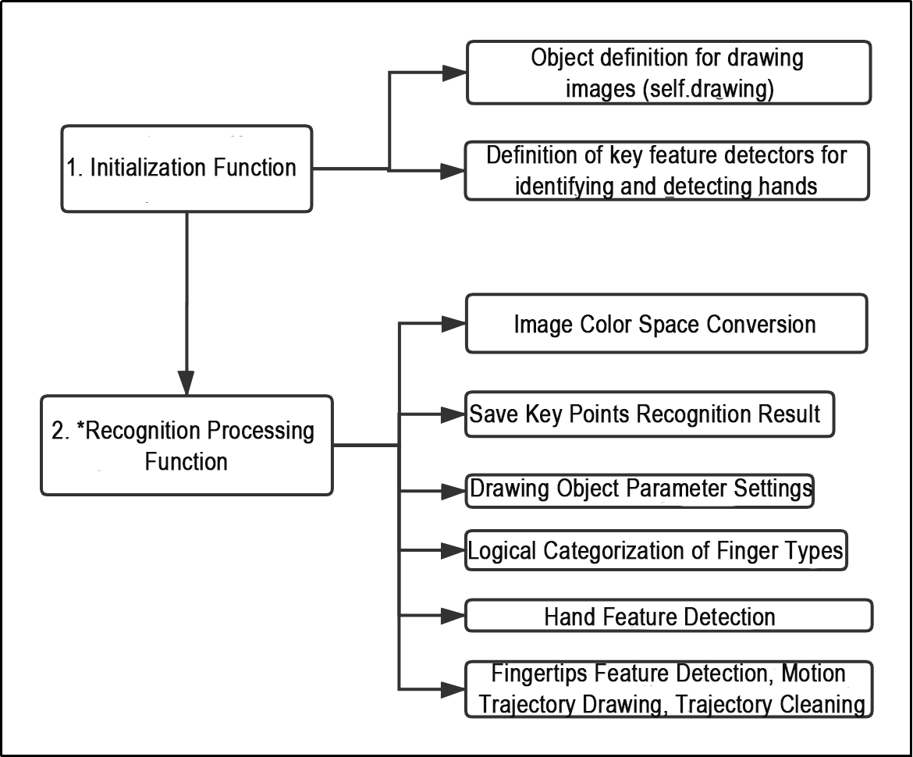
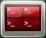
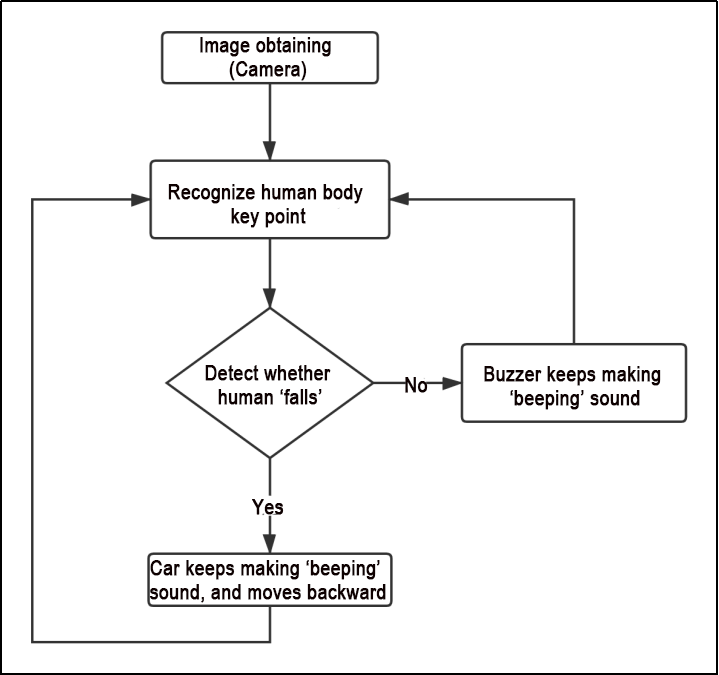

# 9. MediaPipe Human-robot Interaction

## 9.1 MediaPipe Introduction

### 9.1.1 MediaPipe Description

MediaPipe is an open-source framework of multi-media machine learning models. Cross-platform MediaPipe can run on mobile devices, workspace and servers, as well as support mobile GPU acceleration. It is also compatible with TensorFlow and TF Lite Inference Engine, and all kinds of TensorFlow and TF Lite models can be applied on it. Besides, MediaPipe supports GPU acceleration of mobile and embedded platform.


### 9.1.2 MediaPipe Pros and Cons

* **MediaPipe Pros** 

(1) MediaPipe supports various platforms and languages, including iOS, Android, C++, Python, JAVAScript, Coral, etc.

(2) Swift running. Models can run in real-time.

(3) Models and codes are with high reuse rate.

* **MediaPipe Cons** 

(1) For mobile devices, MediaPipe will occupy 10M or above.

(2) As it greatly depends on Tensorflow, you need to alter large amount of codes if you want to change it to other machine learning frameworks, which is not friendly to machine learning developer.

(3) It adopts static image which can improve efficiency, but make it difficult to find out the errors.

### 9.1.3 How to use MediaPipe

The figure below shows how to use MediaPipe. The solid line represents the part to be coded, and the dotted line indicates the part not to be coded. MediaPipe can offer the result and the function realization framework quickly.


* **Dependency** 

MediaPipe utilizes OpenCV to process video, and uses [FFMPEG](https://www.ffmpeg.org/) to process audio data. Furthermore, it incorporates other essential dependencies, including OpenGL/Metal, Tensorflow, and Eigen.

For seamless usage of MediaPipe, we suggest gaining a basic understanding of OpenCV.

* **MediaPipe Solutions** 

Solutions is based on the open-source pre-constructed sample of TensorFlow or TFLite. MediaPipe Solutions is built upon a framework, which provides 16 Solutions, including face detection, Face Mesh, iris, hand, posture, human body and so on.

### 9.1.4 MediaPipe Learning Resources

MediaPipe website：<https://developers.google.com/mediapipe>

MediaPipe Wiki：<http://i.bnu.edu.cn/wiki/index.php?title=Mediapipe>

MediaPipe github：<https://github.com/google/mediapipe>

Dlib website: <http://dlib.net/>

dlib github: <https://github.com/davisking/dlib>

## 9.2 Fingertip Trajectory Recognition

Identify hand joints using MediaPipe's hand detection model. Once a specific gesture is recognized, the robot will initiate fingertip locking on the screen, track the fingertips, and generate their movement trajectory.

### 9.2.1 Program Logic

First, invoke the MediaPipe hand detection model to capture the camera image. Next, flip and process the image to extract hand information. Utilizing the connection lines between key points of the hand calculates the finger angles to determine the gesture.

Upon recognition of a specific gesture, the robot will proceed to identify and lock the fingertips on the screen, simultaneously tracing the movement trajectory of the fingertips on the display.

### 9.2.2 Operation Steps

:::{Note}

The input command should be case sensitive, and the keyword can be complemented by "**Tab**" key.

:::

(1) Start the robot, and enter the robot system desktop using VNC.

(2) Click-on  to open the command-line terminal.

(3) Run the command to disable app auto-start app service.

```bash
~/.stop_ros.sh
```

(4) Enter the command to enable the depth camera service.

```bash
ros2 launch peripherals depth_camera.launch.py
```

(5) Open a new terminal. Enter the command to navigate to the directory of the game.

```bash
cd ros2_ws/src/example/example/mediapipe_example
```

(6) Type the command. Press "**Enter**" to run the program.

```bash
python3 hand_gesture.py
```

(7) If you want to exit the game, press "**Ctrl+C**" in the terminal interface.

After experiencing the game, you can enable the app service through commands or by restarting the robot. If the app is not enabled, the related app functions will not work. If the robot is restarted, the app will be automatically enabled.

Click  and enter the command. Press "**Enter**" to start the app, and wait for the buzzer to beep.

```bash
sudo systemctl restart start_node.service
```

### 9.2.3 Program Outcome

Once the game is enabled, position your hand within the camera's field of view. When your hand is recognized, the hand key points will be highlighted on the live camera feed.

If the robot detects the "**1**" gesture, the trajectory of your fingertip motion will begin to be recorded on the live camera feed. If it detects the "**5**" gesture, the recorded fingertip trajectory will be cleared.


### 9.2.4 Program Analysis

The program file is saved in:[/home/ubuntu/ros2_ws/src/example/example/mediapipe_example/hand_gesture.py](../_static/source_code/mediapipe_example.zip)

:::{Note}

Prior to making any alterations to the program, ensure to create a backup of the original factory program. Modify it only after creating the backup. Directly editing the source code file is prohibited to prevent inadvertent parameter modifications that could render the robot dysfunctional and irreparable!

:::

Based on the game's impact, the process logic of this game is organized as depicted in the figure below:


As depicted in the image above, the purpose of this game is to capture an image using the camera. Preprocess it by converting its color space for easier identification. Extract feature points corresponding to hand gestures from the converted image. Determine different gestures (based on angles) through logical analysis of key feature points. Next, the trajectory of the recognized gesture is drawn on the live camera feed.

The program's logic flowchart extracted from the program files is illustrated in the figure below.



From the above diagram, it can be seen that the program's logical flow is mainly divided into initialization functions and recognition processing functions. The following document content will be written according to the program logic flow chart mentioned above.

(1) Initialization function (init\_\_(self, name))

The program starts with the initialization function of the `HandTrajectoryNode` class, which defines some basic parameters. The important ones include the drawing object for drawing the hand landmarks and the hand detector for detecting the hand landmarks.

(2) Define image drawing (self.drawing)

{lineno-start=121}

```bash
        self.drawing = mp.solutions.drawing_utils
```

`self.drawing` is the drawing tool for the joint key points. It is used to connect the detected key points and visualize the hand trajectory. "**mp**" represents the mediapipe recognition module, which extracts the hand features. The "**drawing_utils**" package from mediapipe is used for drawing the hand landmarks.

**(3) Define detector for recognizing hand feature (self.hand_detector)**

{lineno-start=123}

```python
        self.hand_detector = mp.solutions.hands.Hands(
            static_image_mode=False,
            max_num_hands=1,
            min_tracking_confidence=0.05,
            min_detection_confidence=0.6
        )
```

`self.hand_detector` is the hand feature detector. `mp` represents the mediapipe recognition module. `hands.Hands` is the hand feature extraction module. The following parameters are important:

<table class="docutils" border="1">
<colgroup>
<col style="width: 50%" />
<col style="width: 50%" />
</colgroup>
<tbody>
<tr>
<td>static_image_mode</td>
<td><p>When the parameter is set to False, it will locate the maximum number of</p>
<p>hands based on the value set by "<strong>max_num_hands</strong>". By default, this parameter</p>
<p>is set to False.</p></td>
</tr>
<tr>
<td>max_num_hands</td>
<td><p>Set the maximum number of hands to</p>
<p>be detected, which is 1 by default.</p></td>
</tr>
<tr>
<td>min_detection_confidence</td>
<td><p>The minimum confidence threshold for</p>
<p>the hand detection model ranges</p>
<p>between 0 and 1. Only hands with</p>
<p>confidence scores higher than this</p>
<p>threshold will be detected. If the</p>
<p>recognition performance is not optimal,</p>
<p>you can adjust the threshold by ±0.1.</p>
<p>However, it should not be set lower</p>
<p>than 0.</p></td>
</tr>
<tr>
<td>min_tracking_confidence</td>
<td><p>This parameter is used for hand tracking and localization. It sets the minimum</p>
<p>confidence threshold for the hand</p>
<p>detection model to recognize and track a hand. If the confidence level of a</p>
<p>detected hand falls below this threshold, it will be considered  stationary and not tracked. If the recognition performance</p>
<p>is not optimal, you can adjust the</p>
<p>threshold by ±0.1. It should not be set lower than 0.</p></td>
</tr>
</tbody>
</table>

(4) Recognition processing function (image_proc(self))

After defining the basic tool parameters, the logical recognition process can be initiated. The following points include the main code analysis from the initial image preprocessing (color space conversion) to the final drawing of fingertip trajectories.

(5) Image color space conversion

{lineno-start=158}

```python
            image_flip = cv2.cvtColor(cv2.flip(image, 1), cv2.COLOR_BGR2RGB)
```

The input image needs to be converted from the BGR color space to the RGB color space to achieve accurate hand detection. The `cv2.cvtColor()` function is used for this purpose. `cv2.COLOR_RGB2BGR` is the color space conversion method. `bgr_image` is the output image. Keep the parameters as default.

(6) Store keypoints recognition result

{lineno-start=161}

```python
                results = self.hand_detector.process(image_flip)
```

The `process` function in `self.hand_detector` is responsible for extracting the key points of the hand. The results, which include the positions of the key points in the image, are stored in the `results` variable. It is used for subsequent logical processing. 

(7) Set drawing object parameter

{lineno-start=161}

```python
                        self.drawing.draw_landmarks(
                            result_image,
                            hand_landmarks,
                            mp.solutions.hands.HAND_CONNECTIONS)
```

Once the key feature points are detected, the drawing tool needs to be defined for drawing the hand landmarks and connections. The `bgr_image` parameter represents the input image; `hand_landmarks` represents the detected hand landmarks; `HAND_CONNECTIONS` defines the connections between the landmarks, based on the standard hand gesture feature point numbering.

(8) Logical classification of finger types

{lineno-start=30}

```python
def hand_angle(landmarks):
    """
    计算各个手指的弯曲角度(calculate the bending angle of each finger)
    :param landmarks: 手部关键点(the key points of the hand)
    :return: 各个手指的角度(each finger's angle)
    """
    angle_list = []
    # thumb 大拇指
    angle_ = vector_2d_angle(landmarks[3] - landmarks[4], landmarks[0] - landmarks[2])
    angle_list.append(angle_)
    # index 食指
    angle_ = vector_2d_angle(landmarks[0] - landmarks[6], landmarks[7] - landmarks[8])
    angle_list.append(angle_)
    # middle 中指
    angle_ = vector_2d_angle(landmarks[0] - landmarks[10], landmarks[11] - landmarks[12])
    angle_list.append(angle_)
    # ring 无名指
    angle_ = vector_2d_angle(landmarks[0] - landmarks[14], landmarks[15] - landmarks[16])
    angle_list.append(angle_)
    # pink 小拇指
    angle_ = vector_2d_angle(landmarks[0] - landmarks[18], landmarks[19] - landmarks[20])
    angle_list.append(angle_)
    angle_list = [abs(a) for a in angle_list]
    return angle_list
```

After extracting the hand points into the "**results**" variable, logical processing is required to identify the specific type of finger (e.g. thumb or index finger) by determining the angle relationships between the feature points. The `hand_angle` function is the input feature point set `landmarks(results)`. The `vector_2d_angle` function is used to calculate the angles between the corresponding feature points. The feature points corresponding to the elements in the `landmarks` set are shown in the following figure:


(9) Detect gesture feature

{lineno-start=55}

```python
def h_gesture(angle_list):
    """
    通过二维特征确定手指所摆出的手势(Determine the gesture made by the fingers based on the two-dimensional features)
    :param angle_list: 各个手指弯曲的角度(the angles of each finger's bending)
    :return : 手势名称字符串(gesture name string)
    """
    thr_angle = 65.
    thr_angle_thumb = 53.
    thr_angle_s = 49.
    gesture_str = "none"
    if (angle_list[0] > thr_angle_thumb) and (angle_list[1] > thr_angle) and (angle_list[2] > thr_angle) and (
            angle_list[3] > thr_angle) and (angle_list[4] > thr_angle):
        gesture_str = "fist"
    elif (angle_list[0] < thr_angle_s) and (angle_list[1] < thr_angle_s) and (angle_list[2] > thr_angle) and (
            angle_list[3] > thr_angle) and (angle_list[4] > thr_angle):
        gesture_str = "hand_heart"
    elif (angle_list[0] < thr_angle_s) and (angle_list[1] < thr_angle_s) and (angle_list[2] > thr_angle) and (
            angle_list[3] > thr_angle) and (angle_list[4] < thr_angle_s):
        gesture_str = "nico-nico-ni"
    elif (angle_list[0] < thr_angle_s) and (angle_list[1] > thr_angle) and (angle_list[2] > thr_angle) and (
            angle_list[3] > thr_angle) and (angle_list[4] > thr_angle):
        gesture_str = "hand_heart"
    elif (angle_list[0] > 5) and (angle_list[1] < thr_angle_s) and (angle_list[2] > thr_angle) and (
            angle_list[3] > thr_angle) and (angle_list[4] > thr_angle):
        gesture_str = "one"
    elif (angle_list[0] > thr_angle_thumb) and (angle_list[1] < thr_angle_s) and (angle_list[2] < thr_angle_s) and (
            angle_list[3] > thr_angle) and (angle_list[4] > thr_angle):
        gesture_str = "two"
    elif (angle_list[0] > thr_angle_thumb) and (angle_list[1] < thr_angle_s) and (angle_list[2] < thr_angle_s) and (
            angle_list[3] < thr_angle_s) and (angle_list[4] > thr_angle):
        gesture_str = "three"
    elif (angle_list[0] > thr_angle_thumb) and (angle_list[1] > thr_angle) and (angle_list[2] < thr_angle_s) and (
            angle_list[3] < thr_angle_s) and (angle_list[4] < thr_angle_s):
        gesture_str = "OK"
    elif (angle_list[0] > thr_angle_thumb) and (angle_list[1] < thr_angle_s) and (angle_list[2] < thr_angle_s) and (
            angle_list[3] < thr_angle_s) and (angle_list[4] < thr_angle_s):
        gesture_str = "four"
    elif (angle_list[0] < thr_angle_s) and (angle_list[1] < thr_angle_s) and (angle_list[2] < thr_angle_s) and (
            angle_list[3] < thr_angle_s) and (angle_list[4] < thr_angle_s):
        gesture_str = "five"
    elif (angle_list[0] < thr_angle_s) and (angle_list[1] > thr_angle) and (angle_list[2] > thr_angle) and (
            angle_list[3] > thr_angle) and (angle_list[4] < thr_angle_s):
        gesture_str = "six"
```

After identifying the different finger types of the hand and determining their positions on the image, logical recognition processing of various gestures can be performed by implementing the `h_gesture` function.

In the `h_gesture` function depicted above, the parameters `thr_angle=65`, `thr_angle_thenum=53`, and `thr_angle_s=49` represent the angle threshold values for corresponding gesture logic points. These values have been empirically tested to ensure stable recognition effects. It is not recommended to alter them unless the logic processing effect is unsatisfactory, in which case adjustments within a range of ±5 values are sufficient. The `angle_list[0,1,2,3,4]` corresponds to the five finger types associated with the palm.

Here's an example using the gesture "**one**":

{lineno-start=77}

```python
    elif (angle_list[0] > 5) and (angle_list[1] < thr_angle_s) and (angle_list[2] > thr_angle) and (
            angle_list[3] > thr_angle) and (angle_list[4] > thr_angle):
        gesture_str = "one"
```

The code presented represents the logical angle evaluation of the fingers for the "**one**" gesture. `angle_list[0]>5` checks whether the angle value of the thumb joint feature point in the image is greater than 5. `angle_list[1]<thr_angle_s` checks if the angle feature of the index finger joint feature point is less than the predetermined value `thr_angle_s`. Similarly, `angle_list[2]<thr_angle` verifies if the angle feature of the middle finger feature point is less than the predetermined value `thr_angle`. The logical processing for the other two fingers, `angle_list[3]` and `angle_list[4]`, follows a similar method. When the above conditions are met, the current gesture feature is recognized as "one", and the same principle applies to recognizing other gesture features.

Different gesture recognition involves distinct logical processing, but the overall logical framework remains similar. For recognizing other gesture features, refer to the previous paragraph.

(10) Detect fingertip feature, draw motion trajectory, and clear trajectory

The fingertip feature detection is shown below:

{lineno-start=174}

```python
                    if self.state != State.TRACKING:
                        if gesture == "one":  # 检测食指手势， 开始指尖追踪(detect index finger gesture and start fingertip tracking)
                            self.count += 1
                            if self.count > 5:
                                self.count = 0
                                self.state = State.TRACKING
                                self.points = []
                        else:
                            self.count = 0
```

The code above shows the logic judgement for when the gesture "**one**" is detected. The `self.count` is used for counting the number of frames that the current hand gesture has been held. If `self.count` is greater than 5, the gesture is confirmed as "**one**". The duration of the gesture can be adjusted to get different recognition accuracies, usually set to around 5 to 7 frames. Once the gesture is confirmed as "**one**", the current gesture state is set to "**TRACKING**", indicating that you can move your hand. `self.points` and `points_list` are initialized to keep track of the position of the hand's adjacent points and the collection of feature points used to draw the trajectory line, respectively.

The motion trajectory drawing is as below:

{lineno-start=184}

```python
                    elif self.state == State.TRACKING:
                        if gesture != "two":
                            if len(self.points) > 0:
                                last_point = self.points[-1]
                                if distance(last_point, index_finger_tip) < 5:
                                    self.count += 1
                                else:
                                    self.count = 0
                                    self.points.append(index_finger_tip)
                            else:
                                self.points.append(index_finger_tip)
                        draw_points(result_image, self.points)
```

During the sliding process, the custom function `distance` calculates the distance between the previous and current points. A logical judgment is then made using `distance(last_point, index_finger_tip) < 5`. `5` is the distance in pixels between the two points. If you need to detect faster movements while maintaining accurate recognition, increase this value appropriately. It is recommended not to exceed 10. The movement feature points of the fingertip are stored, and `pixels` is an object used to store the fingertip information (x, y) for pixelization and drawing of the image.

The trajectory clearing process is shown below:

{lineno-start=196}

```python
                    if gesture == "five":
                        self.state = State.NULL
                        self.points = []
                        draw_points(result_image, self.points)
```

When the gesture is recognized as "**five**", the gesture recognition state is set to NULL (empty). The collection of current points, which is the position information of the trajectory points, will be cleared.

## 9.3 Hand following

### 9.3.1 Program Instruction

What are the applications of hand following?

Virtual reality: In virtual reality games, it allows players to control game characters' movements, attacks, and other actions through gestures.

Medical field: It can be used in rehabilitation training to help patients recover hand function.

Education field: It allows students to interactively learn through gestures.

Smart homes: It allows users to control home devices' switches, adjustments, and other operations through gestures.

Industrial production: It allows workers to control robots' operations through gestures, improving production efficiency.

The hand feature detection algorithm library used in this robot is MediaPipe. MediaPipe is an open-source framework of multi-media machine learning models. Cross-platform MediaPipe can run on mobile devices, workspace and servers, as well as support mobile GPU acceleration. It is also compatible with TensorFlow and TF Lite Inference Engine, and all kinds of TensorFlow and TF Lite models can be applied on it. Besides, MediaPipe supports GPU acceleration of mobile and embedded platform.

First, a hand recognition model needs to be built, and the topic messages published by the camera node need to be subscribed to obtain the image. Then, the image is processed by flipping and other methods to detect the hand information in the image. Next, the position of the hand center point is obtained based on the connection of the hand key points. Finally, the monocular camera pan-tilt is controlled to follow the center point of the recognized hand to move up and down.

### 9.3.2 Operation Steps

:::{Note}

The input command should be case sensitive, and keywords can be complemented using Tab key.

This game is only applicable to 2D pan-tilt monocular camera version.

:::

(1) Start the robot and connect it to the remote control software VNC.

(2) Click on  on the system desktop to open the command line terminal.

(3) Run the command to stop the automatic startup service of the app.

```bash
~/.stop_ros.sh
```

(4) Enter the command to start the game.

```bash
ros2 launch example hand_track_node.launch.py
```

(5) If you want to exit the game, press "**Ctrl+C**" in the terminal interface.

After experiencing the game, you can enable the app service through commands or by restarting the robot. If the app is not enabled, the related app functions will not work. If the robot is restarted, the app will be automatically enabled.

Click  and enter the command. Press enter to start the app, and wait for the buzzer to beep.

```bash
sudo systemctl restart start_node.service
```

### 9.3.3 Program Outcome

After starting the game, the 2D pan-tilt will return to its initial position. Place your hand in front of the camera of the 2D pan-tilt, and move your hand up and down. The 2D pan-tilt will follow your hand to move up and down.

Note: Displaying the live camera feed in this game may cause the program to get stuck. Therefore, it is not recommended to display the feedback image during the game. If you need to view the live camera feed, open a new command line terminal and enter the command "**rqt_image_view**".

### 9.3.4 Program Analysis

The source code of the program is located at: [/home/ubuntu/ros2_ws/src/example/example/hand_track/hand_track_node.py](../_static/source_code/hand_track.zip)

(1) Subscribe and publish node

A publisher message `/ros_robot_controller/pwm_servo/set_state` is published to control the rotation of the pan-tilt servo.

A topic message of the hand detection `/hand_detect/center` is subscribed to obtain the center point of the hand.

{lineno-start=35}

```python
        self.pwm_pub = self.create_publisher(SetPWMServoState,'ros_robot_controller/pwm_servo/set_state',10)
        self.mecanum_pub = self.create_publisher(Twist, '/controller/cmd_vel', 1)

        self.image_sub = self.create_subscription(Point2D, '/hand_detect/center', self.get_hand_callback, 1)
```

(2) Update PID data

The PID algorithm is used to update the coordinates of the X and Z axes.

{lineno-start=81}

```python
    def get_hand_callback(self, msg):
        if msg.width != 0:
            self.center = msg
        else:
            self.center = None

    def main(self):
        while self.running:
            if self.center is not None:
                t1 = time.time()
                self.pid_y.SetPoint = self.center.width / 2
                self.pid_y.update(self.center.width - self.center.x)
                self.y_dis += self.pid_y.output
                if self.y_dis < 800:
                    self.y_dis = 800
```

The center position coordinate of the image is obtained by dividing the height or width of the image by 2. Compare the result with the center point coordinate of the hand to obtain the deviation for updating the PID data. The output result of the PID algorithm updates the coordinates of the X and Z axes.

(3) Publish pan-tilt servo angle

Call custom servo message type to publish the position information of the pan-tilt servo.

{lineno-start=45}

```python
        msg = SetPWMServoState()
        msg.duration = 0.2
        for i in range(len(position_data)):
            pos = PWMServoState()
            pos.id = [i+1]
            pos.position = [int(position_data[i])]
            pwm_list.append(pos)
        msg.state = pwm_list
        self.pwm_pub.publish(msg)
```

## 9.4 Posture Control

Through the human pose estimation model in the MediaPipe machine learning framework, the human body can be detected on the live camera feed. The joint-related positions of the human body can be marked. Then, various actions can be recognized in sequence, thereby achieving direct control of the robot through human body.

From the perspective of the robot, when you raise your left arm, the robot will move to the right; when you raise your right arm, the robot will move to the left; when your left leg is raised, the robot will move forward; and when your right leg is raised, the robot will move backward.

### 9.4.1 Program Logic

First, import the human pose estimation model from MediaPipe and subscribe to topic messages to obtain real-time footage from the camera.

Then, process the image, such as flipping, to detect human body information in the image. Based on the lines connecting the key points of the human body, calculate the limb height to determine the body movement.

Finally, if you make specified actions, the robot will perform the corresponding actions.

### 9.4.2 Operation Steps

:::{Note}

the input command should be case sensitive, and keywords can be complemented using Tab key.

:::

(1) Start the robot, and enter the robot system desktop using VNC.

(2) Click-on  to open the command line terminal.

(3) Run the command to disable app auto-start app service.

```bash
~/.stop_ros.sh
```

(4) Run the following command and hit Enter key to initiate the game.

```bash
ros2 launch example body_control.launch.py
```

If you want to exit the game, press "**Ctrl+C**" in the terminal interface.

After experiencing the game, you can enable the app service through commands or by restarting the robot. If the app is not enabled, the related app functions will not work. If the robot is restarted, the app will be automatically enabled.

Click  and enter the command. Press enter to start the app, and wait for the buzzer to beep.

```bash
sudo systemctl restart start_node.service
```

### 9.4.3 Program Outcome

Once the game starts, ensure the human body remains as fully within the camera's field of view as possible. Upon recognizing the human body, the key points will be highlighted in the returned image.

From the perspective of the robot, when you raises you left arm, the robot will turn left; when your right arm is raised, the robot will turn right; when your left leg is raised, the robot will move forward; and when your right leg is raised, the robot will move backward.

### 9.4.4 Program Analysis

The program file is saved in: [ros2_ws/src/example/example/body_control/include/body_control.py](../_static/source_code/body_control.zip)


:::{Note}

Prior to making any alterations to the program, ensure to create a backup of the original factory program. Modify it only after creating the backup. Directly editing the source code file is prohibited to prevent inadvertent parameter modifications that could render the robot dysfunctional and irreparable!

:::

Based on the game's effectiveness, the procedural logic is delineated as follows:


Obtaining the image through the camera, the robot will execute corresponding action after you make a pose. Taking the perspective of the robot, when you raise your left arm, the robot will turn left; when your right arm is raised, it will turn right; when your left leg is raised, it will move forward; and when your right leg is raised, it will move backward.

The program logic flow chart obtained from the program files is depicted in the figure below.


Define relevant parameters through the initialization function "**init(self.name)**", including the image tool "**self.drawing**" object used to draw the recognized feature points, and the the body detection object "**self.body_detector**". Then, perform the recognition logic processing for the output results of the recognized feature points. Judge the distance between the key points to save the actions. Finally, output the results to make the robot perform the corresponding actions.

* **Function** 

(1) Main：

{lineno-start=325}

```python
def main():
    node = BodyControlNode('body_control')
    rclpy.spin(node)
    node.destroy_node()
```

Used to start the body sensation control node.

(2) get_joint_landmarks:

{lineno-start=44}

```python
def get_joint_landmarks(img, landmarks):
    """
    将landmarks从medipipe的归一化输出转为像素坐标(Convert landmarks from medipipe's normalized output to pixel coordinates)
    :param img: 像素坐标对应的图片(picture corresponding to pixel coordinate)
    :param landmarks: 归一化的关键点(normalized keypoint)
    :return:
    """
    h, w, _ = img.shape
    landmarks = [(lm.x * w, lm.y * h) for lm in landmarks]
    return np.array(landmarks)
```

Used to convert the recognized information into pixel coordinates.

(3) joint_distance：

{lineno-start=55}

```python
def joint_distance(landmarks):
    distance_list = []

    d1 = landmarks[LEFT_HIP] - landmarks[LEFT_SHOULDER]
    d2 = landmarks[LEFT_HIP] - landmarks[LEFT_WRIST]
    dis1 = d1[0]**2 + d1[1]**2
    dis2 = d2[0]**2 + d2[1]**2
    distance_list.append(round(dis1/dis2, 1))
   
    d1 = landmarks[RIGHT_HIP] - landmarks[RIGHT_SHOULDER]
    d2 = landmarks[RIGHT_HIP] - landmarks[RIGHT_WRIST]
    dis1 = d1[0]**2 + d1[1]**2
    dis2 = d2[0]**2 + d2[1]**2
    distance_list.append(round(dis1/dis2, 1))
    
    d1 = landmarks[LEFT_HIP] - landmarks[LEFT_ANKLE]
    d2 = landmarks[LEFT_ANKLE] - landmarks[LEFT_KNEE]
    dis1 = d1[0]**2 + d1[1]**2
    dis2 = d2[0]**2 + d2[1]**2
    distance_list.append(round(dis1/dis2, 1))
   
    d1 = landmarks[RIGHT_HIP] - landmarks[RIGHT_ANKLE]
    d2 = landmarks[RIGHT_ANKLE] - landmarks[RIGHT_KNEE]
    dis1 = d1[0]**2 + d1[1]**2
    dis2 = d2[0]**2 + d2[1]**2
    distance_list.append(round(dis1/dis2, 1))
```

Used to calculate the distance between each key point based on the pixel coordinate.

* **Class** 

{lineno-start=84}

```python
class BodyControlNode(Node):
    def __init__(self, name):
        rclpy.init()
        super().__init__(name, allow_undeclared_parameters=True, automatically_declare_parameters_from_overrides=True)
        self.name = name
        self.drawing = mp.solutions.drawing_utils
        self.body_detector = mp_pose.Pose(
            static_image_mode=False,
            min_tracking_confidence=0.7,
            min_detection_confidence=0.7)
        self.running = True
        self.fps = fps.FPS()  # fps计算器(FPS calculator)
        signal.signal(signal.SIGINT, self.shutdown)

        self.move_finish = True
        self.stop_flag = False
        self.left_hand_count = []
        self.right_hand_count = []
        self.left_leg_count = []
        self.right_leg_count = []

        self.detect_status = [0, 0, 0, 0]
```

This class is the body control node.

(1) Init:

{lineno-start=85}

```python
    def __init__(self, name):
        rclpy.init()
        super().__init__(name, allow_undeclared_parameters=True, automatically_declare_parameters_from_overrides=True)
        self.name = name
        self.drawing = mp.solutions.drawing_utils
        self.body_detector = mp_pose.Pose(
            static_image_mode=False,
            min_tracking_confidence=0.7,
            min_detection_confidence=0.7)
        self.running = True
        self.fps = fps.FPS()  # fps计算器(FPS calculator)
        signal.signal(signal.SIGINT, self.shutdown)
```

Initialize the parameters required for body control, read the camera's image callback node, initialize nodes such as servo, chassis, buzzer, motor, and others, and finally start the main function within the class.

(2) get_node_state：

{lineno-start=126}

```python
    def get_node_state(self, request, response):
        response.success = True
        return response
```

Set the initialization state of the current node.

(3) shutdown：

{lineno-start=130}

```python
    def shutdown(self, signum, frame):
        self.running = False
```

Program exit callback function used to terminate recognition.

(4) image_callback：

{lineno-start=133}

```python
    def image_callback(self, ros_image):
        cv_image = self.bridge.imgmsg_to_cv2(ros_image, "rgb8")
        rgb_image = np.array(cv_image, dtype=np.uint8)
        if self.image_queue.full():
            # 如果队列已满，丢弃最旧的图像(if the queue is full, discard the oldest image)
            self.image_queue.get()
        # 将图像放入队列(put the image into the queue)
        self.image_queue.put(rgb_image)
```

Image node callback function: used to process images and enqueue them.

(5) Move：

{lineno-start=142}

```python
    def move(self, *args):
        if args[0].angular.z == 1:
            time.sleep(0.2)
            motor1 = MotorState()
            motor1.id = 2
            motor1.rps = 0.1
            motor2 = MotorState()
            motor2.id = 4
            motor2.rps = -1.0
            msg = MotorsState()
            msg.data = [motor1, motor2]
            self.motor_pub.publish(msg)
            time.sleep(11)
            motor1 = MotorState()
            motor1.id = 2
            motor1.rps = 0.0
            motor2 = MotorState()
            motor2.id = 4
            motor2.rps = 0.0
            msg = MotorsState()
            msg.data = [motor1, motor2]
            self.motor_pub.publish(msg)
        elif args[0].angular.z == -1:
            time.sleep(0.2)
            motor1 = MotorState()
            motor1.id = 2
            motor1.rps = 1.0
            motor2 = MotorState()
            motor2.id = 4
            motor2.rps = -0.1
            msg = MotorsState()
            msg.data = [motor1, motor2]
            self.motor_pub.publish(msg)
            time.sleep(12)
            motor1 = MotorState()
            motor1.id = 2
            motor1.rps = 0.0
```

Movement strategy function that moves the vehicle according to the recognized limb height.

(6) buzzer_warn：

{lineno-start=193}

```python
    def buzzer_warn(self):
        msg = BuzzerState()
        msg.freq = 1900
        msg.on_time = 0.2
        msg.off_time = 0.01
        msg.repeat = 1
        self.buzzer_pub.publish(msg)
```

Buzzer control function used for buzzer alarms.

(7) image_proc:

{lineno-start=201}

```python
    def image_proc(self, image):
        image_flip = cv2.flip(cv2.cvtColor(image, cv2.COLOR_RGB2BGR), 1)
        results = self.body_detector.process(image)
        if results is not None and results.pose_landmarks is not None:
            if self.move_finish:
                twist = Twist()
                landmarks = get_joint_landmarks(image, results.pose_landmarks.landmark)
                distance_list = (joint_distance(landmarks))
              
                if distance_list[0] < 1:
                    self.detect_status[0] = 1
                if distance_list[1] < 1:
                    self.detect_status[1] = 1
                if 0 < distance_list[2] < 2:
                    self.detect_status[2] = 1
                if 0 < distance_list[3] < 2:
                    self.detect_status[3] = 1
```

Function for recognizing limbs, which invokes the model to draw key points of the human body based on the recognized information, and moves according to the recognized height.

(8) Main：

{lineno-start=289}

```python
    def main(self):
        while self.running:
            try:
                image = self.image_queue.get(block=True, timeout=1)
            except queue.Empty:
                if not self.running:
                    break
                else:
                    continue
            try:
                result_image = self.image_proc(np.copy(image))
            except BaseException as e:
                self.get_logger().info('\033[1;32m%s\033[0m' % e)
                result_image = cv2.flip(cv2.cvtColor(image, cv2.COLOR_RGB2BGR), 1)
            self.fps.update()
            result_image = self.fps.show_fps(result_image)
            cv2.imshow(self.name, result_image)
            key = cv2.waitKey(1)
            if key == ord('q') or key == 27:  # 按q或者esc退出(press Q or Esc to exit)
                self.mecanum_pub.publish(Twist())
                self.running = False

        rclpy.shutdown()
```

The main function within the BodyControlNode class, used to input image information into the recognition function and display the live camera feed.

## 9.5 Pose Detection

Through the human pose estimation model in the MediaPipe machine learning framework, the human body posture is detected. When the robot detects a person falling, it will sound an alarm and sway from side to side.

### 9.5.1 Program Logic

First, import the human pose estimation model from MediaPipe and subscribe to topic messages to obtain real-time footage from the camera.

Then, process the image, such as flipping, to detect human body information in the image. Based on the lines connecting the key points of the human body, calculate the limb height to determine the body movement.

Finally, if "**falling**" is detected, the robot will sound an alarm and move forwards and backwards.

### 9.5.2 Operation Steps

:::{Note}

the input command should be case sensitive, and keywords can be complemented using Tab key.

:::

(1) Start the robot, and enter the robot system desktop using VNC.

(2) Click-on  to open the command-line terminal.

(3) Run the command to disable app auto-start app service.

```bash
~/.stop_ros.sh
```

(4) Enter the command. Press "**Enter**" to run the program.

```bash
ros2 launch example fall_down_detect.launch.py
```

(5) If you want to close this game, press the "**ESC**" key in the image interface to exit the camera image interface.

(6) Then, press "**Ctrl+C**" in the command line terminal interface. If it fails, please try again.

After experiencing the game, you can enable the app service through commands or by restarting the robot. If the app is not enabled, the related app functions will not work. If the robot is restarted, the app will be automatically enabled.

Click  and enter the command. Press enter to start the app, and wait for the buzzer to beep.

```bash
sudo systemctl restart start_node.service
```

### 9.5.3 Program Outcome

Once the game starts, ensure the human body remains as fully within the camera's field of view as possible. Upon recognizing the human body, the key points will be highlighted in the returned image.

At this point, the individual can sit down briefly. Upon detecting the "**falling**" posture, the robot will continuously sound an alarm and make repeated forward and backward movements as a reminder.

### 9.5.4 Program Analysis

The program file is saved in: [ros2_ws/src/example/example/body_control/include/fall_down_detect.py](../_static/source_code/body_control.zip)


:::{Note}

Prior to making any alterations to the program, ensure to create a backup of the original factory program. Modify it only after creating the backup. Directly editing the source code file is prohibited to prevent inadvertent parameter modifications that could render the robot dis-functional and irreparable!

:::

Based on the game's effectiveness, the procedural logic is delineated as follows:



The robot captures images via the camera, identifies the key feature points of the human body, and assesses whether the current posture indicates a "**fall**". If a fall is detected, the robot's buzzer will emit a continuous "**beep**" sound while the robot moves backward. Otherwise, the buzzer will only emit a single "**beep**" sound.

The program logic flow chart obtained from the program files is depicted in the figure below.


* **Function** 

(1) Main：

{lineno-start=313}

```python
def main():
    node = BodyControlNode('fall_down_detect')
    rclpy.spin(node)
    node.destroy_node()
```

Used to start the body sensation control node.

get_joint_landmarks:

{lineno-start=44}

```python
def get_joint_landmarks(img, landmarks):
    """
    将landmarks从medipipe的归一化输出转为像素坐标(Convert landmarks from medipipe's normalized output to pixel coordinates)
    :param img: 像素坐标对应的图片(picture corresponding to pixel coordinate)
    :param landmarks: 归一化的关键点(normalized keypoint)
    :return:
    """
    h, w, _ = img.shape
    landmarks = [(lm.x * w, lm.y * h) for lm in landmarks]
    return np.array(landmarks)
```

Used to convert the recognized information into pixel coordinates.

height_cal:

{lineno-start=54}

```python
def height_cal(landmarks):
    y = []
    for i in landmarks:
        y.append(i[1])
    height = sum(y)/len(y)

    return height
```

Calculates the height of the limbs based on the recognized information.

(1) Class

{lineno-start=62}

```python
class FallDownDetectNode(Node):
    def __init__(self, name):
        rclpy.init()
        super().__init__(name, allow_undeclared_parameters=True, automatically_declare_parameters_from_overrides=True)
        self.name = name
        self.drawing = mp.solutions.drawing_utils
        self.body_detector = mp_pose.Pose(
            static_image_mode=False,
            min_tracking_confidence=0.7,
            min_detection_confidence=0.7)
        self.running = True
        self.fps = fps.FPS()  # fps计算器(FPS calculator)
        
        self.fall_down_count = []
        self.move_finish = True
        self.stop_flag = False
        signal.signal(signal.SIGINT, self.shutdown)
        self.bridge = CvBridge()
        self.image_queue = queue.Queue(maxsize=2)
```

This class is the fall detection node.

(2) Init:

Initialize the parameters required for body control, read the camera's image callback node, initialize nodes such as chassis, buzzers, and others, and finally start the main function within the class.

(3) get_node_state:

{lineno-start=93}

```python
    def get_node_state(self, request, response):
        response.success = True
        return response
```

Set the initialization state of the current node.

(4) shutdown:

{lineno-start=97}

```python
    def shutdown(self, signum, frame):
        self.running = False
```

Program exit callback function: used to terminate recognition.

(5) image_callback:

{lineno-start=}

```python
    def image_callback(self, ros_image):
        cv_image = self.bridge.imgmsg_to_cv2(ros_image, "rgb8")
        rgb_image = np.array(cv_image, dtype=np.uint8)
        if self.image_queue.full():
            # 如果队列已满，丢弃最旧的图像(if the queue is full, discard the oldest image)
            self.image_queue.get()
        # 将图像放入队列(put the image into the queue)
        self.image_queue.put(rgb_image)
```

Image node callback function: used to process images and enqueue them.

(6) Move:

{lineno-start=109}

```python
    def move(self):
        for i in range(5):
            twist = Twist()
            twist.linear.x = 0.2
            self.mecanum_pub.publish(twist)
            time.sleep(0.2)
            twist = Twist()
            twist.linear.x = -0.2
            self.mecanum_pub.publish(twist)
            time.sleep(0.2)
        self.mecanum_pub.publish(Twist())
        self.stop_flag =True
        self.move_finish = True
```

Movement strategy function that moves the robot based on the recognized limb height.

(7) buzzer_warn：

{lineno-start=123}

```python
    def buzzer_warn(self):
        if not self.stop_flag:
            while not self.stop_flag:
                msg = BuzzerState()
                msg.freq = 1000
                msg.on_time = 0.1
                msg.off_time = 0.1
                msg.repeat = 1
                self.buzzer_pub.publish(msg)
                time.sleep(0.2)
        else:
            msg = BuzzerState()
            msg.freq = 1900
            msg.on_time = 0.2
            msg.off_time = 0.01
            msg.repeat = 1
            self.buzzer_pub.publish(msg)
```

Buzzer control function: used for buzzer alarms.

(8) image_proc:

{lineno-start=141}

```python
    def image_proc(self, image):
        image_flip = cv2.flip(cv2.cvtColor(image, cv2.COLOR_RGB2BGR), 1)
        results = self.body_detector.process(image)
        if results is not None and results.pose_landmarks:
            if self.move_finish:
                landmarks = get_joint_landmarks(image, results.pose_landmarks.landmark)
                h = height_cal(landmarks)
                if h > image.shape[:-2][0] - 120:
                    self.fall_down_count.append(1)
                else:
                    self.fall_down_count.append(0)
                if len(self.fall_down_count) == 3:
                    count = sum(self.fall_down_count)
                    
                    self.fall_down_count = []
                    if self.stop_flag:
                        if count <= 1:
                            self.buzzer_warn()
                            self.stop_flag = False
```

Function for recognizing limbs, which invokes the model to draw key points of the human body based on the recognized information, and moves according to the recognized height.

(9) Main:

{lineno-start=175}

```python
    def main(self):
        while self.running:
            try:
                image = self.image_queue.get(block=True, timeout=1)
            except queue.Empty:
                if not self.running:
                    break
                else:
                    continue
            try:
                result_image = self.image_proc(np.copy(image))
            except BaseException as e:
                self.get_logger().info('\033[1;32m%s\033[0m' % e)
                result_image = cv2.flip(cv2.cvtColor(image, cv2.COLOR_RGB2BGR), 1)
            self.fps.update()
            result_image = self.fps.show_fps(result_image)
            cv2.imshow(self.name, result_image)
            key = cv2.waitKey(1)
            if key == ord('q') or key == 27:  # 按q或者esc退出(press Q or Esc to exit)
                self.mecanum_pub.publish(Twist())
                self.running = False
```

The main function within the "**FallDownDetectNode**" class: used to input image information into the recognition function and display the returned image.